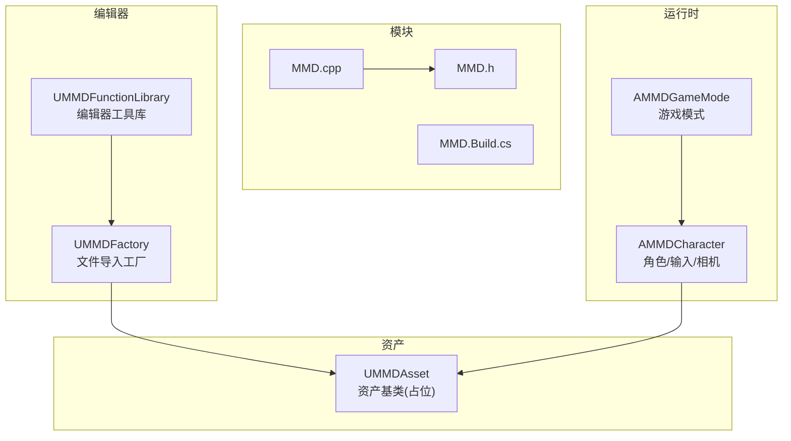
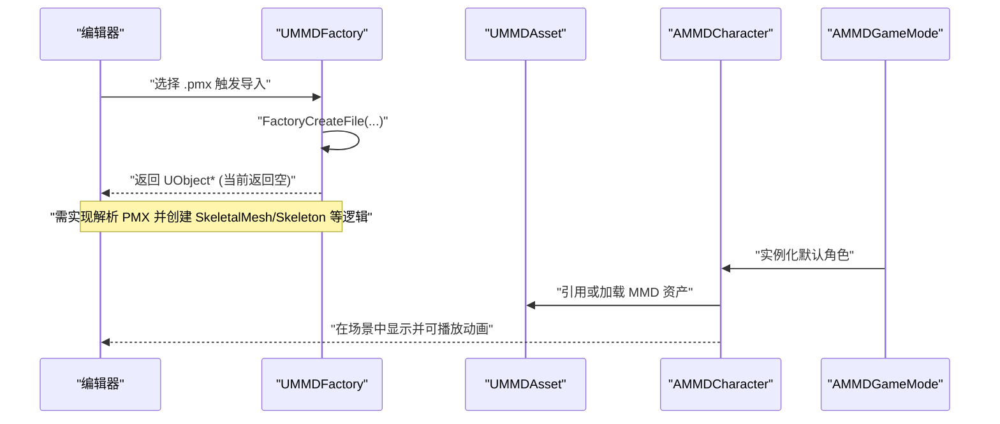
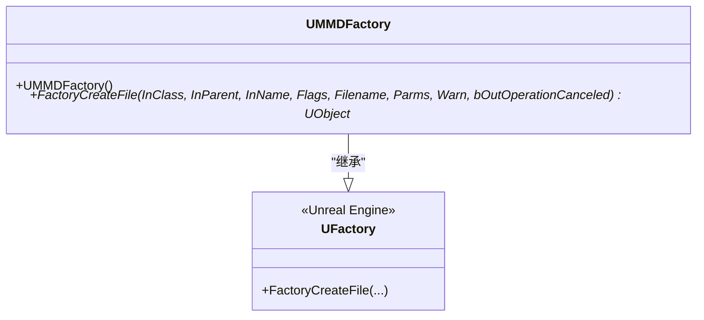
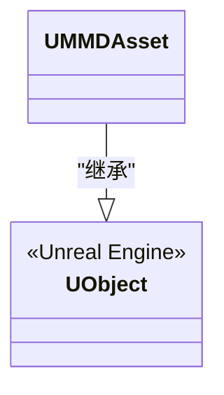
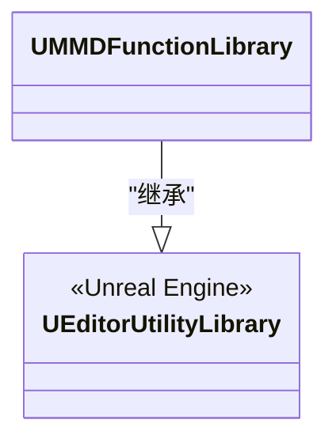
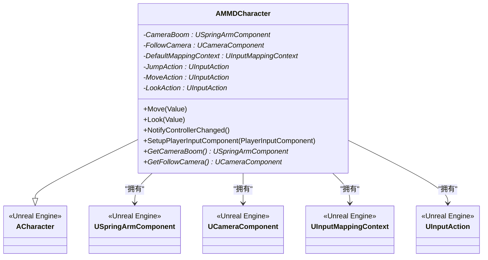
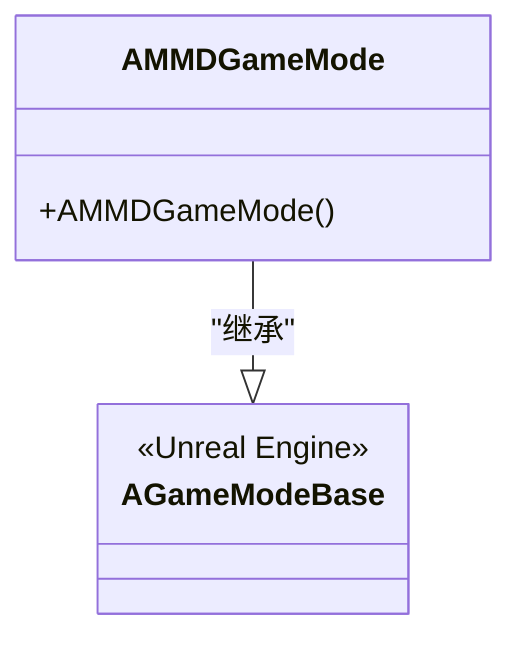
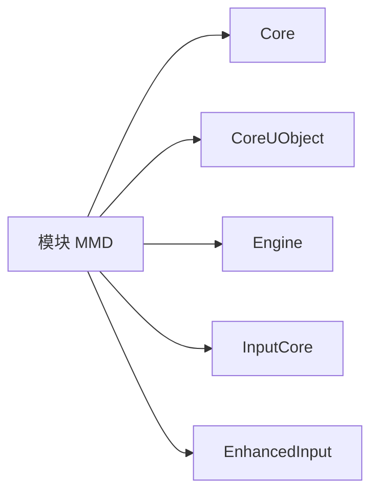

# API 参考文档

<cite>
**本文引用的文件**
- [MMD.h](file://MMD/Source/MMD/MMD.h)
- [MMD.cpp](file://MMD/Source/MMD/MMD.cpp)
- [MMD.Build.cs](file://MMD/Source/MMD/MMD.Build.cs)
- [MMDFactory.h](file://MMD/Source/MMD/MMDFactory.h)
- [MMDFactory.cpp](file://MMD/Source/MMD/MMDFactory.cpp)
- [MMDAsset.h](file://MMD/Source/MMD/MMDAsset.h)
- [MMDAsset.cpp](file://MMD/Source/MMD/MMDAsset.cpp)
- [MMDFunctionLibrary.h](file://MMD/Source/MMD/MMDFunctionLibrary.h)
- [MMDFunctionLibrary.cpp](file://MMD/Source/MMD/MMDFunctionLibrary.cpp)
- [MMDCharacter.h](file://MMD/Source/MMD/MMDCharacter.h)
- [MMDGameMode.h](file://MMD/Source/MMD/MMDGameMode.h)
- [README.md](file://README.md)
</cite>

## 目录
1. [简介](#简介)
2. [项目结构](#项目结构)
3. [核心组件](#核心组件)
4. [架构总览](#架构总览)
5. [详细组件分析](#详细组件分析)
6. [依赖关系分析](#依赖关系分析)
7. [性能与扩展性](#性能与扩展性)
8. [故障排查指南](#故障排查指南)
9. [结论](#结论)
10. [附录：蓝图集成与示例](#附录：蓝图集成与示例)

## 简介
本 API 参考文档面向 C++ 开发者与蓝图用户，系统化梳理 MMDUETools 插件的公共接口与类定义，重点覆盖以下方面：
- 工厂模式：UMMDFactory 的导入流程与扩展点
- 资产模型：UMMDAsset 的数据结构与序列化支持（当前为占位）
- 编辑器工具：UMMDFunctionLibrary 的蓝图可调用函数扩展点
- 运行时角色：AMMDCharacter 的输入与相机组件
- 游戏模式：AMMDGameMode 的基础配置

同时结合 README 说明插件的整体能力边界与典型工作流，帮助读者快速理解并正确集成。

## 项目结构
该插件采用“模块 + 编辑器工具 + 运行时”分层组织方式：
- 模块入口与构建：MMD.cpp、MMD.h、MMD.Build.cs
- 编辑器侧：UMMDFactory（文件工厂）、UMMDFunctionLibrary（编辑器工具库）
- 资产层：UMMDAsset（资产基类，当前为空）
- 运行时代码：AMMDCharacter（角色）、AMMDGameMode（游戏模式）

图表来源
- [MMD.cpp:1-7](file://MMD/Source/MMD/MMD.cpp#L1-L7)
- [MMD.h:1-6](file://MMD/Source/MMD/MMD.h#L1-L6)
- [MMD.Build.cs:1-15](file://MMD/Source/MMD/MMD.Build.cs#L1-L15)
- [MMDFactory.h:1-23](file://MMD/Source/MMD/MMDFactory.h#L1-L23)
- [MMDFunctionLibrary.h:1-19](file://MMD/Source/MMD/MMDFunctionLibrary.h#L1-L19)
- [MMDAsset.h:1-18](file://MMD/Source/MMD/MMDAsset.h#L1-L18)
- [MMDCharacter.h:1-73](file://MMD/Source/MMD/MMDCharacter.h#L1-L73)
- [MMDGameMode.h:1-20](file://MMD/Source/MMD/MMDGameMode.h#L1-L20)

章节来源
- [MMD.cpp:1-7](file://MMD/Source/MMD/MMD.cpp#L1-L7)
- [MMD.h:1-6](file://MMD/Source/MMD/MMD.h#L1-L6)
- [MMD.Build.cs:1-15](file://MMD/Source/MMD/MMD.Build.cs#L1-L15)

## 核心组件
本节概述各核心类的职责与对外暴露的接口范围，后续章节将给出更详细的成员说明与使用建议。

- UMMDFactory：实现 UFactory 的文件导入流程，注册 PMX 格式，提供 FactoryCreateFile 钩子以创建目标资产。
- UMMDAsset：UObject 派生的资产基类，用于承载 MMD 相关数据；当前为占位，未定义字段与方法。
- UMMDFunctionLibrary：继承自 UEditorUtilityLibrary，作为蓝图可访问的编辑器工具函数容器；当前未定义具体方法。
- AMMDCharacter：基于 ACharacter 的角色类，包含相机与增强输入绑定，提供获取相机子对象的便捷方法。
- AMMDGameMode：基于 AGameModeBase 的最小化游戏模式类，用于配置默认角色等。

章节来源
- [MMDFactory.h:12-22](file://MMD/Source/MMD/MMDFactory.h#L12-L22)
- [MMDFactory.cpp:6-14](file://MMD/Source/MMD/MMDFactory.cpp#L6-L14)
- [MMDAsset.h:12-17](file://MMD/Source/MMD/MMDAsset.h#L12-L17)
- [MMDFunctionLibrary.h:12-18](file://MMD/Source/MMD/MMDFunctionLibrary.h#L12-L18)
- [MMDCharacter.h:18-71](file://MMD/Source/MMD/MMDCharacter.h#L18-L71)
- [MMDGameMode.h:9-16](file://MMD/Source/MMD/MMDGameMode.h#L9-L16)

## 架构总览
下图展示编辑器导入与运行时播放的关键交互路径：用户在编辑器中通过工厂导入 PMX，生成资产；在运行时由角色加载并使用动画与表情。

图表来源
- [MMDFactory.cpp:11-14](file://MMD/Source/MMD/MMDFactory.cpp#L11-L14)
- [MMDCharacter.h:47-71](file://MMD/Source/MMD/MMDCharacter.h#L47-L71)
- [MMDGameMode.h:14-16](file://MMD/Source/MMD/MMDGameMode.h#L14-L16)

## 详细组件分析

### UMMDFactory（PMX 导入工厂）
- 继承关系：UFactory
- 主要职责：
  - 构造函数中注册文件格式后缀与描述
  - 重写 FactoryCreateFile 以完成从磁盘文件到 UE 资产的转换
- 关键成员
  - 构造函数：添加 PMX 格式映射
  - FactoryCreateFile：接收 InClass、InParent、InName、Flags、Filename、Parms、Warn、bOutOperationCanceled 等参数，返回创建的 UObject*
- 异常处理与取消
  - 通过 Warn 反馈上下文进行警告输出
  - bOutOperationCanceled 允许外部取消操作
- 代码示例路径
  - 工厂注册与创建流程：[MMDFactory.cpp:6-14](file://MMD/Source/MMD/MMDFactory.cpp#L6-L14)
  - 类声明与虚函数签名：[MMDFactory.h:12-22](file://MMD/Source/MMD/MMDFactory.h#L12-L22)

图表来源
- [MMDFactory.h:12-22](file://MMD/Source/MMD/MMDFactory.h#L12-L22)
- [MMDFactory.cpp:6-14](file://MMD/Source/MMD/MMDFactory.cpp#L6-L14)

章节来源
- [MMDFactory.h:12-22](file://MMD/Source/MMD/MMDFactory.h#L12-L22)
- [MMDFactory.cpp:6-14](file://MMD/Source/MMD/MMDFactory.cpp#L6-L14)

### UMMDAsset（MMD 资产基类）
- 继承关系：UObject
- 当前状态：占位类，未定义任何属性或方法
- 设计意图：作为未来承载 MMD 模型/动作/材质等数据的统一资产类型
- 序列化支持：由于无 UPROPERTY 字段，当前不参与序列化
- 代码示例路径
  - 类声明：[MMDAsset.h:12-17](file://MMD/Source/MMD/MMDAsset.h#L12-L17)

图表来源
- [MMDAsset.h:12-17](file://MMD/Source/MMD/MMDAsset.h#L12-L17)

章节来源
- [MMDAsset.h:12-17](file://MMD/Source/MMD/MMDAsset.h#L12-L17)

### UMMDFunctionLibrary（编辑器工具库）
- 继承关系：UEditorUtilityLibrary
- 主要职责：提供蓝图可访问的编辑器工具函数，便于批量处理与自定义工具开发
- 当前状态：未定义具体方法，可作为扩展点新增静态函数
- 蓝图集成：在蓝图中可直接调用其静态函数
- 代码示例路径
  - 类声明：[MMDFunctionLibrary.h:12-18](file://MMD/Source/MMD/MMDFunctionLibrary.h#L12-L18)

图表来源
- [MMDFunctionLibrary.h:12-18](file://MMD/Source/MMD/MMDFunctionLibrary.h#L12-L18)

章节来源
- [MMDFunctionLibrary.h:12-18](file://MMD/Source/MMD/MMDFunctionLibrary.h#L12-L18)

### AMMDCharacter（MMD 角色）
- 继承关系：ACharacter
- 关键属性
  - CameraBoom：弹簧臂组件，定位相机位置
  - FollowCamera：跟随相机组件
  - DefaultMappingContext：增强输入映射上下文
  - JumpAction / MoveAction / LookAction：增强输入动作
- 关键方法
  - Move(const FInputActionValue& Value)：移动输入回调
  - Look(const FInputActionValue& Value)：视角输入回调
  - NotifyControllerChanged()：控制器变更通知
  - SetupPlayerInputComponent(UInputComponent*)：绑定输入
  - GetCameraBoom()/GetFollowCamera()：获取相机子对象
- 代码示例路径
  - 属性与方法声明：[MMDCharacter.h:23-71](file://MMD/Source/MMD/MMDCharacter.h#L23-L71)

图表来源
- [MMDCharacter.h:23-71](file://MMD/Source/MMD/MMDCharacter.h#L23-L71)

章节来源
- [MMDCharacter.h:23-71](file://MMD/Source/MMD/MMDCharacter.h#L23-L71)

### AMMDGameMode（游戏模式）
- 继承关系：AGameModeBase
- 用途：最小化游戏模式，可用于设置默认玩家类、地图规则等
- 代码示例路径
  - 类声明：[MMDGameMode.h:9-16](file://MMD/Source/MMD/MMDGameMode.h#L9-L16)

图表来源
- [MMDGameMode.h:9-16](file://MMD/Source/MMD/MMDGameMode.h#L9-L16)

章节来源
- [MMDGameMode.h:9-16](file://MMD/Source/MMD/MMDGameMode.h#L9-L16)

## 依赖关系分析
- 模块依赖
  - 模块名：MMD
  - 公开依赖：Core、CoreUObject、Engine、InputCore、EnhancedInput
- 模块入口
  - 主模块实现：IMPLEMENT_PRIMARY_GAME_MODULE(FDefaultGameModuleImpl, MMD, "MMD")
- 构建配置
  - PCH 使用策略：UseExplicitOrSharedPCHs

图表来源
- [MMD.Build.cs:11-12](file://MMD/Source/MMD/MMD.Build.cs#L11-L12)
- [MMD.cpp:6-6](file://MMD/Source/MMD/MMD.cpp#L6-L6)

章节来源
- [MMD.Build.cs:1-15](file://MMD/Source/MMD/MMD.Build.cs#L1-15)
- [MMD.cpp:1-7](file://MMD/Source/MMD/MMD.cpp#L1-L7)

## 性能与扩展性
- 导入性能
  - 建议在 FactoryCreateFile 中采用增量解析与分块写入，避免一次性加载大模型导致卡顿
- 资源管理
  - 对生成的 SkeletalMesh、Skeleton、AnimSequence 等资源进行命名规范与版本控制，减少重复生成
- 线程与异步
  - 若引入复杂解析逻辑，考虑后台线程执行并通过回调更新 UI 与资产
- 扩展点
  - 在 UMMDFunctionLibrary 中新增静态函数，封装批量导入、重命名、路径校验等工具
  - 在 UMMDAsset 中逐步增加 UPROPERTY 字段，完善数据模型与序列化

## 故障排查指南
- 导入失败
  - 检查 FactoryCreateFile 返回值是否为空；确认传入文件名与路径有效
  - 使用 Warn 参数输出诊断信息，定位解析阶段错误
- 蓝图不可用
  - 确保 UMMDFunctionLibrary 中的函数标记为 BlueprintCallable
  - 重新编译插件并在编辑器中刷新蓝图节点
- 输入不响应
  - 检查 AMMDCharacter 的 SetupPlayerInputComponent 是否被调用
  - 确认 DefaultMappingContext 与对应 UInputAction 已正确分配
- 相机异常
  - 验证 CameraBoom 与 FollowCamera 初始化顺序与父子关系
  - 检查场景内是否存在遮挡或层级问题

章节来源
- [MMDFactory.cpp:11-14](file://MMD/Source/MMD/MMDFactory.cpp#L11-L14)
- [MMDCharacter.h:62-71](file://MMD/Source/MMD/MMDCharacter.h#L62-L71)

## 结论
当前插件提供了清晰的扩展骨架：UMMDFactory 负责导入、UMMDFunctionLibrary 提供编辑器工具、UMMDAsset 作为数据载体、AMMDCharacter 与 AMMDGameMode 支撑运行时。下一步应聚焦于：
- 完善 PMX/VMD 解析与资产生成
- 在 UMMDAsset 中定义完整的数据模型与序列化
- 在 UMMDFunctionLibrary 中实现批量处理与常用工具函数
- 强化错误处理与日志输出，提升用户体验

## 附录：蓝图集成与示例
- 蓝图调用编辑器工具
  - 在蓝图中直接调用 UMMDFunctionLibrary 的静态函数（待实现）
  - 示例路径：[MMDFunctionLibrary.h:12-18](file://MMD/Source/MMD/MMDFunctionLibrary.h#L12-L18)
- 蓝图访问角色相机
  - 通过 AMMDCharacter 的 GetCameraBoom/GetFollowCamera 获取相机组件
  - 示例路径：[MMDCharacter.h:67-71](file://MMD/Source/MMD/MMDCharacter.h#L67-L71)
- 工厂导入流程（蓝图视角）
  - 在内容浏览器右键 -> 高级 -> 导入，选择 PMX 文件，触发 UMMDFactory
  - 示例路径：[MMDFactory.cpp:6-14](file://MMD/Source/MMD/MMDFactory.cpp#L6-L14)

章节来源
- [MMDFunctionLibrary.h:12-18](file://MMD/Source/MMD/MMDFunctionLibrary.h#L12-L18)
- [MMDCharacter.h:67-71](file://MMD/Source/MMD/MMDCharacter.h#L67-L71)
- [MMDFactory.cpp:6-14](file://MMD/Source/MMD/MMDFactory.cpp#L6-L14)