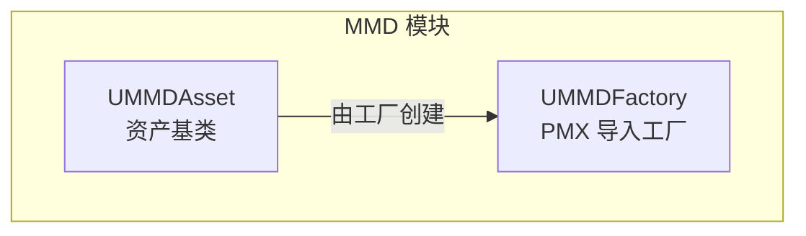
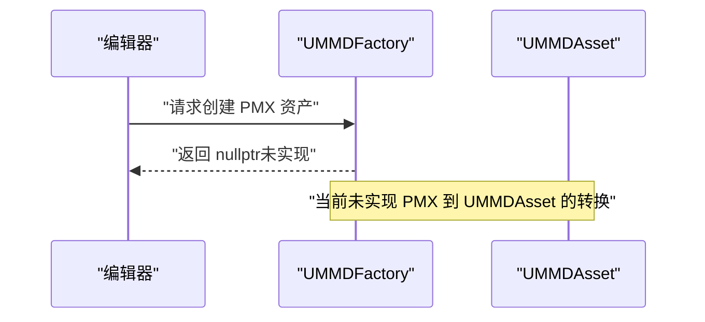
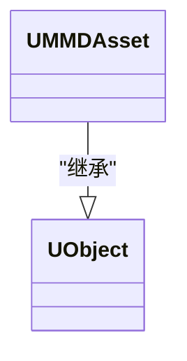
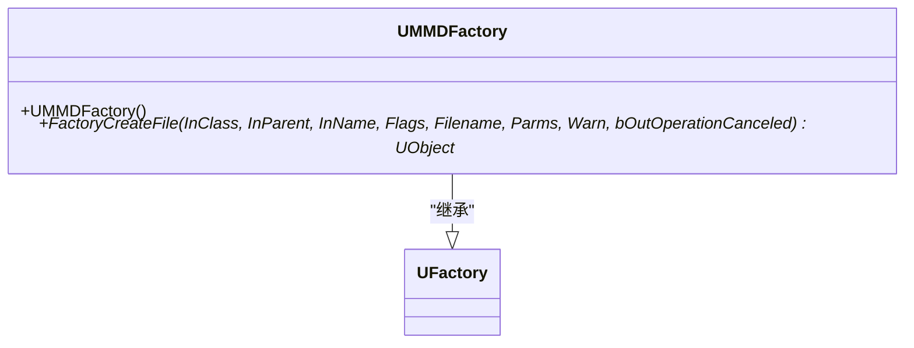
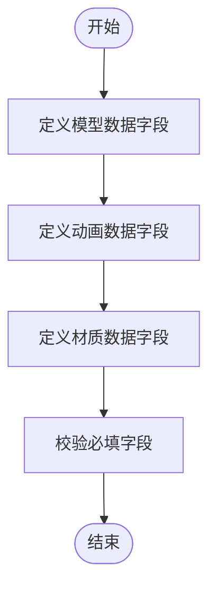
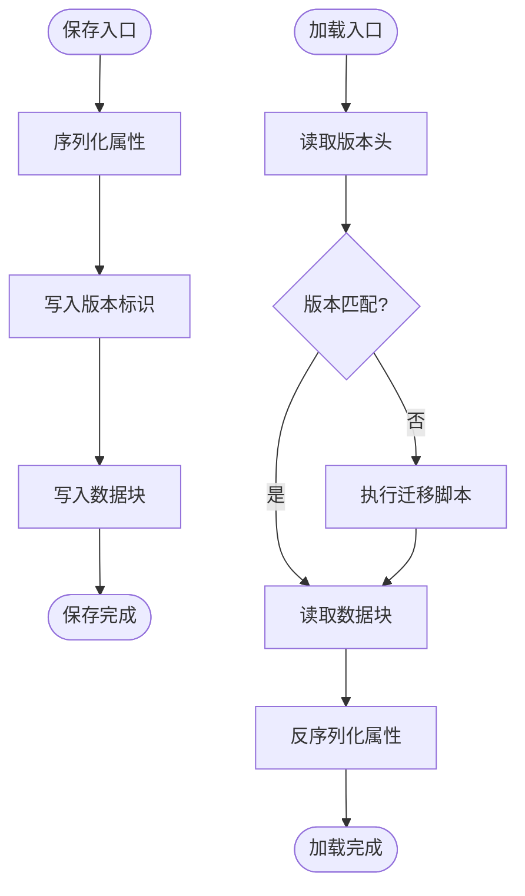
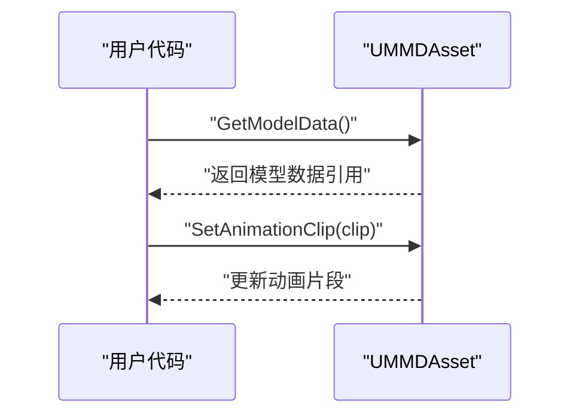
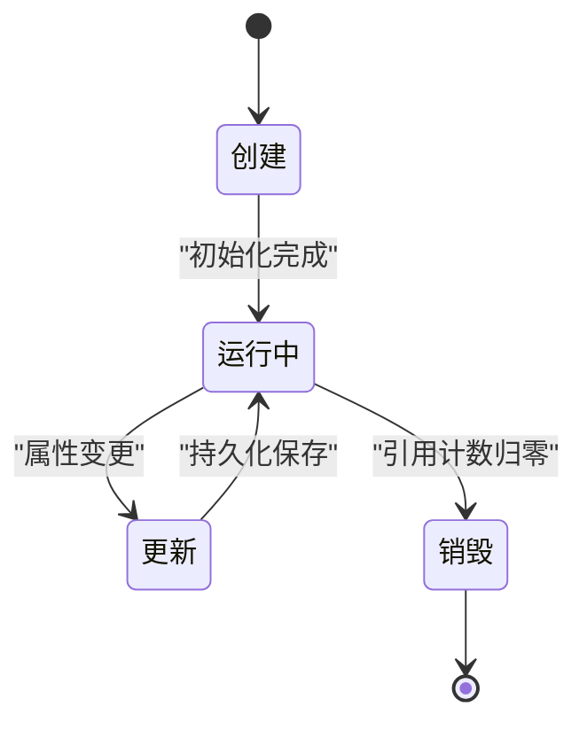
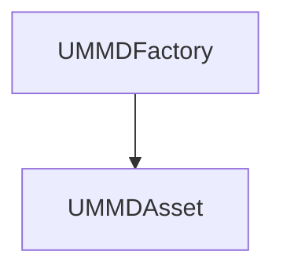

# UMMDAsset 资产类 API

<cite>
**本文引用的文件**   
- [MMDAsset.h](file://MMD/Source/MMD/MMDAsset.h)
- [MMDAsset.cpp](file://MMD/Source/MMD/MMDAsset.cpp)
- [MMDFactory.h](file://MMD/Source/MMD/MMDFactory.h)
- [MMDFactory.cpp](file://MMD/Source/MMD/MMDFactory.cpp)
</cite>

## 目录
1. [简介](#简介)
2. [项目结构](#项目结构)
3. [核心组件](#核心组件)
4. [架构总览](#架构总览)
5. [详细组件分析](#详细组件分析)
6. [依赖关系分析](#依赖关系分析)
7. [性能考虑](#性能考虑)
8. [故障排查指南](#故障排查指南)
9. [结论](#结论)
10. [附录](#附录)

## 简介
本文件为 UMMDAsset 类的完整 API 参考文档，聚焦于该资产类在 MikuMikuDance（MMD）模型导入与运行时访问中的角色。当前仓库中 UMMDAsset 作为 UObject 的派生类存在，但尚未包含任何成员变量或方法实现；与之配套的工厂类 UMMDFactory 已声明用于从 PMX 文件创建资产，但其具体实现返回空指针，表明导入流程尚未完成。

基于现有源码，本节提供：
- 资产数据结构的现状说明与扩展建议（模型、动画、材质等）
- 序列化机制的设计建议（保存、加载、版本兼容）
- 属性访问器的使用示例（蓝图/C++ 访问模式）
- 生命周期管理（创建、更新、销毁）
- 性能优化与内存管理最佳实践

## 项目结构
UMMDAsset 位于插件模块 MMD 的 Source/MMD 目录下，与工厂类 UMMDFactory 同属一个模块。UMMDAsset 目前为空骨架类，UMMDFactory 仅注册了 PMX 文件格式并返回空对象，表示导入管线未实现。

图示来源
- [MMDAsset.h:12-17](file://MMD/Source/MMD/MMDAsset.h#L12-L17)
- [MMDFactory.h:12-22](file://MMD/Source/MMD/MMDFactory.h#L12-L22)
- [MMDFactory.cpp:6-14](file://MMD/Source/MMD/MMDFactory.cpp#L6-L14)

章节来源
- [MMDAsset.h:1-17](file://MMD/Source/MMD/MMDAsset.h#L1-L17)
- [MMDAsset.cpp:1-6](file://MMD/Source/MMD/MMDAsset.cpp#L1-L6)
- [MMDFactory.h:1-22](file://MMD/Source/MMD/MMDFactory.h#L1-L22)
- [MMDFactory.cpp:1-14](file://MMD/Source/MMD/MMDFactory.cpp#L1-L14)

## 核心组件
- UMMDAsset：继承自 UObject，作为 MMD 资产的容器基类。当前无成员变量与方法，属于预留占位。
- UMMDFactory：继承自 UFactory，负责从 PMX 文件创建资产实例。当前构造函数注册了“pmx;MikuMikuDance Model”格式，但 FactoryCreateFile 返回 nullptr，导入逻辑未实现。

章节来源
- [MMDAsset.h:12-17](file://MMD/Source/MMD/MMDAsset.h#L12-L17)
- [MMDFactory.h:12-22](file://MMD/Source/MMD/MMDFactory.h#L12-L22)
- [MMDFactory.cpp:6-14](file://MMD/Source/MMD/MMDFactory.cpp#L6-L14)

## 架构总览
UMMDAsset 与 UMMDFactory 的关系如下：编辑器通过工厂将外部 PMX 文件转换为 UE 资产对象（UMMDAsset），随后在运行时通过资产访问器读取模型、动画、材质等信息。当前阶段，工厂未实现实际转换，因此无法生成有效资产。

图示来源
- [MMDFactory.h:19-21](file://MMD/Source/MMD/MMDFactory.h#L19-L21)
- [MMDFactory.cpp:11-14](file://MMD/Source/MMD/MMDFactory.cpp#L11-L14)

## 详细组件分析

### UMMDAsset 类分析
- 继承关系：UMMDAsset : UObject
- 当前状态：空骨架类，无成员变量、无方法、无元数据
- 设计意图：作为 MMD 资产的数据容器，未来可扩展以承载模型网格、骨骼、动画片段、材质引用等

图示来源
- [MMDAsset.h:12-17](file://MMD/Source/MMD/MMDAsset.h#L12-L17)

章节来源
- [MMDAsset.h:1-17](file://MMD/Source/MMD/MMDAsset.h#L1-L17)
- [MMDAsset.cpp:1-6](file://MMD/Source/MMD/MMDAsset.cpp#L1-L6)

### UMMDFactory 类分析
- 继承关系：UMMDFactory : UFactory
- 功能：注册 PMX 文件格式，提供 FactoryCreateFile 钩子以创建资产
- 当前实现：构造函数添加格式字符串；FactoryCreateFile 直接返回 nullptr，未进行解析与构建

图示来源
- [MMDFactory.h:12-22](file://MMD/Source/MMD/MMDFactory.h#L12-L22)
- [MMDFactory.cpp:6-14](file://MMD/Source/MMD/MMDFactory.cpp#L6-L14)

章节来源
- [MMDFactory.h:1-22](file://MMD/Source/MMD/MMDFactory.h#L1-L22)
- [MMDFactory.cpp:1-14](file://MMD/Source/MMD/MMDFactory.cpp#L1-L14)

### 资产数据结构建议（模型、动画、材质）
由于 UMMDAsset 当前为空，以下为面向未来的数据结构建议（概念性，非现有代码）：
- 模型数据：顶点缓冲、索引缓冲、UV、法线、切线、骨骼权重、蒙皮信息
- 动画数据：关键帧轨迹、时间采样、插值方式、混合策略
- 材质信息：材质引用、纹理资源、着色器参数、渲染状态

[此图为概念流程图，不映射具体源码，故无图示来源]

### 序列化机制建议（保存、加载、版本兼容）
- 保存：将 UMMDAsset 的属性序列化为二进制或文本格式，记录版本号与平台差异
- 加载：读取版本头，按版本分支解析字段，缺失字段采用默认值
- 兼容性：维护迁移脚本，处理字段重命名、类型变更、弃用字段清理

[此图为概念流程图，不映射具体源码，故无图示来源]

### 属性访问器使用示例（蓝图/C++）
- C++：通过 Get 方法访问资产字段，设置时调用 Set 方法
- 蓝图：暴露 UPROPERTY 宏修饰的字段，可在蓝图中直接读写

[此图为概念流程图，不映射具体源码，故无图示来源]

### 生命周期管理（创建、更新、销毁）
- 创建：通过 UMMDFactory::FactoryCreateFile 创建 UMMDAsset 实例（当前返回 nullptr）
- 更新：在运行时修改资产属性，触发标记为脏并保存到磁盘
- 销毁：当引用计数归零时，UObject 自动释放资源

[此图为概念流程图，不映射具体源码，故无图示来源]

## 依赖关系分析
UMMDAsset 与 UMMDFactory 的依赖关系简单清晰：工厂负责创建资产，资产本身不反向依赖工厂。

图示来源
- [MMDFactory.h:12-22](file://MMD/Source/MMD/MMDFactory.h#L12-L22)
- [MMDAsset.h:12-17](file://MMD/Source/MMD/MMDAsset.h#L12-L17)

章节来源
- [MMDFactory.h:1-22](file://MMD/Source/MMD/MMDFactory.h#L1-L22)
- [MMDAsset.h:1-17](file://MMD/Source/MMD/MMDAsset.h#L1-L17)

## 性能考虑
- 延迟加载：仅在首次访问时解析大型 PMX 文件，避免启动开销
- 资源池：复用共享纹理与材质实例，减少重复分配
- 批处理：批量更新动画关键帧，降低每帧计算量
- 内存对齐：确保顶点与索引缓冲对齐，提升 GPU 传输效率
- 异步 IO：在后台线程加载资产，主线程仅做轻量调度

[本节为通用指导，不直接分析具体源码文件]

## 故障排查指南
- 工厂返回空指针：检查 UMMDFactory::FactoryCreateFile 是否实现 PMX 解析逻辑
- 资产未显示：确认资产路径与引用是否正确，检查编辑器缓存
- 序列化失败：验证版本头与字段完整性，回滚至上一稳定版本

章节来源
- [MMDFactory.cpp:11-14](file://MMD/Source/MMD/MMDFactory.cpp#L11-L14)

## 结论
UMMDAsset 当前为空骨架类，UMMDFactory 仅注册 PMX 格式但未实现导入逻辑。为实现完整的 MMD 资产支持，需：
- 在 UMMDAsset 中定义模型、动画、材质相关字段
- 实现 UMMDFactory::FactoryCreateFile 以解析 PMX 并填充 UMMDAsset
- 完善序列化与版本迁移机制
- 提供属性访问器与生命周期管理接口

[本节为总结性内容，不直接分析具体源码文件]

## 附录
- 术语表：PMX（MMD 模型格式）、UObject（UE 对象基类）、UFactory（编辑器工厂基类）
- 相关文件：MMDAsset.h、MMDAsset.cpp、MMDFactory.h、MMDFactory.cpp

[本节为补充信息，不直接分析具体源码文件]