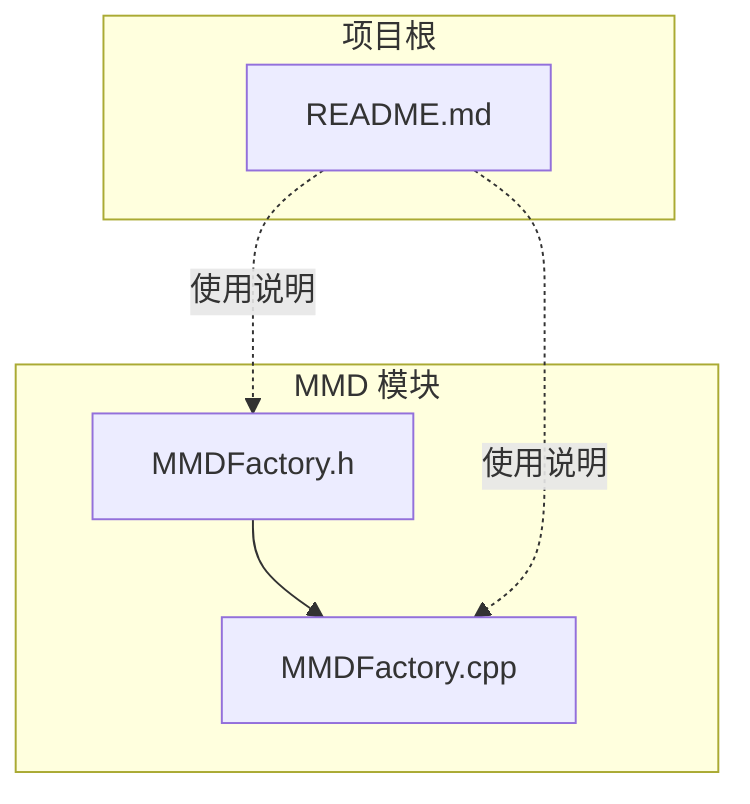
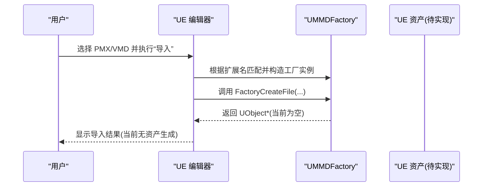
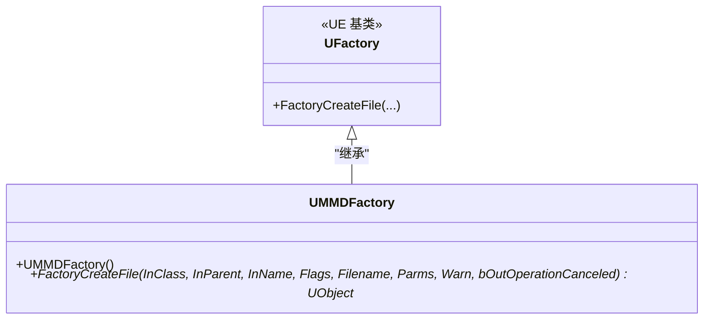
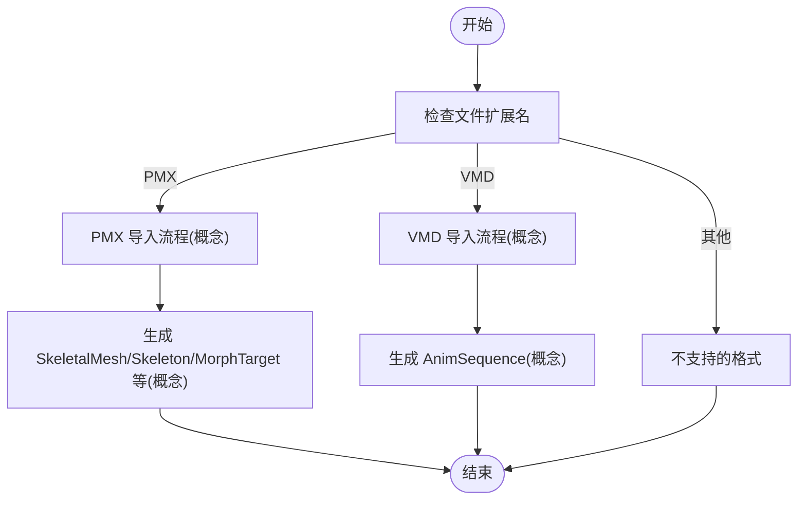
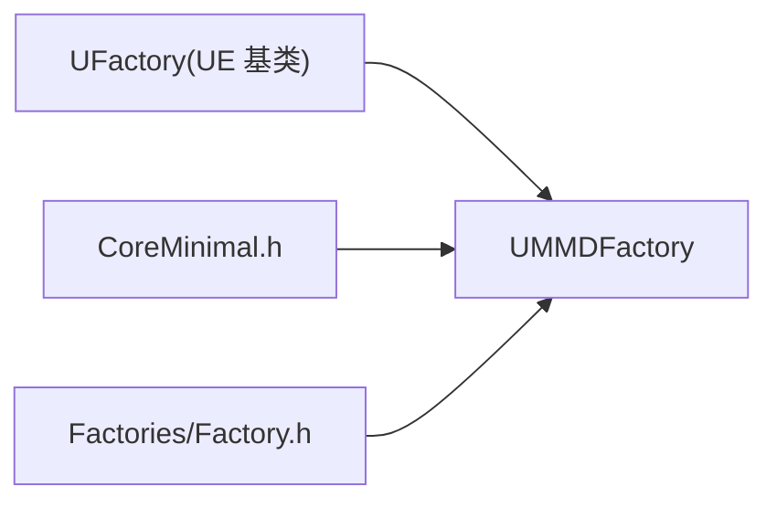

# UMMDFactory 工厂类 API

<cite>
**本文引用的文件**   
- [MMDFactory.h](file://MMD/Source/MMD/MMDFactory.h)
- [MMDFactory.cpp](file://MMD/Source/MMD/MMDFactory.cpp)
- [README.md](file://README.md)
</cite>

## 目录
1. [简介](#简介)
2. [项目结构](#项目结构)
3. [核心组件](#核心组件)
4. [架构总览](#架构总览)
5. [详细组件分析](#详细组件分析)
6. [依赖分析](#依赖分析)
7. [性能考虑](#性能考虑)
8. [故障排查指南](#故障排查指南)
9. [结论](#结论)
10. [附录](#附录)

## 简介
本文件为 UMMDFactory 工厂类的完整 API 文档。UMMDFactory 继承自 UE 的 UFactory，用于在编辑器中通过“导入”流程将 MikuMikuDance（MMD）资产（如 PMX、VMD）转换为 Unreal Engine 原生资产（SkeletalMesh、Skeleton、AnimSequence 等）。当前仓库中的 UMMDFactory 已声明了工厂接口与支持的格式，但具体解析与创建逻辑尚未实现。

## 项目结构
与 UMMDFactory 直接相关的源文件位于 MMD 模块下：
- 头文件：MMD/Source/MMD/MMDFactory.h
- 实现文件：MMD/Source/MMD/MMDFactory.cpp
- 插件说明与使用流程参考：README.md

图示来源
- [MMDFactory.h:1-22](file://MMD/Source/MMD/MMDFactory.h#L1-L22)
- [MMDFactory.cpp:1-14](file://MMD/Source/MMD/MMDFactory.cpp#L1-L14)
- [README.md:1-130](file://README.md#L1-L130)

章节来源
- [MMDFactory.h:1-22](file://MMD/Source/MMD/MMDFactory.h#L1-L22)
- [MMDFactory.cpp:1-14](file://MMD/Source/MMD/MMDFactory.cpp#L1-L14)
- [README.md:1-130](file://README.md#L1-L130)

## 核心组件
- UMMDFactory：继承自 UFactory，提供编辑器“导入”能力。
  - 构造函数：注册支持的文件扩展名与描述。
  - FactoryCreateFile：重写以完成从外部文件到 UE 资产的创建流程。

关键要点
- 当前仅注册了 pmx 格式；vmd 未注册。
- FactoryCreateFile 返回空指针，表示尚未实现实际导入逻辑。

章节来源
- [MMDFactory.cpp:6-9](file://MMD/Source/MMD/MMDFactory.cpp#L6-L9)
- [MMDFactory.cpp:11-14](file://MMD/Source/MMD/MMDFactory.cpp#L11-L14)
- [MMDFactory.h:12-22](file://MMD/Source/MMD/MMDFactory.h#L12-L22)

## 架构总览
UMMDFactory 作为 UE 工厂体系的一部分，参与编辑器的“导入”管线。当用户在 Content Browser 或右键菜单中选择“导入”，UE 会根据文件扩展名匹配到对应工厂实例并调用其 FactoryCreateFile。

图示来源
- [MMDFactory.cpp:6-9](file://MMD/Source/MMD/MMDFactory.cpp#L6-L9)
- [MMDFactory.cpp:11-14](file://MMD/Source/MMD/MMDFactory.cpp#L11-L14)

## 详细组件分析

### 类关系与继承
UMMDFactory 继承自 UFactory，遵循 UE 工厂模式约定。

图示来源
- [MMDFactory.h:12-22](file://MMD/Source/MMD/MMDFactory.h#L12-L22)

章节来源
- [MMDFactory.h:12-22](file://MMD/Source/MMD/MMDFactory.h#L12-L22)

### 构造函数
- 作用：在工厂初始化时注册支持的导入格式。
- 行为：添加 pmx 扩展名及描述文本。
- 影响：编辑器识别“.pmx”文件并尝试使用该工厂进行导入。

章节来源
- [MMDFactory.cpp:6-9](file://MMD/Source/MMD/MMDFactory.cpp#L6-L9)

### FactoryCreateFile 方法
- 职责：根据传入参数创建目标 UE 资产对象。
- 参数说明（基于 UE UFactory 约定）：
  - InClass：要创建的资产类型 UClass*。
  - InParent：新对象的父对象。
  - InName：新对象的名称。
  - Flags：对象标志位。
  - Filename：被导入的外部文件路径。
  - Parms：导入参数字符串。
  - Warn：反馈上下文，用于输出警告信息。
  - bOutOperationCanceled：操作是否被取消的输出标志。
- 返回值：成功时返回创建的 UObject*，失败或未实现时返回 nullptr。
- 当前实现：返回 nullptr，表示尚未实现 PMX/VMD 的具体导入逻辑。

章节来源
- [MMDFactory.h:19-21](file://MMD/Source/MMD/MMDFactory.h#L19-L21)
- [MMDFactory.cpp:11-14](file://MMD/Source/MMD/MMDFactory.cpp#L11-L14)

### PMX 与 VMD 导入流程（概念性说明）
- PMX 模型导入（概念）：
  - 读取 PMX 顶点、索引、法线、UV、材质与骨骼数据。
  - 生成 SkeletalMesh、Skeleton、MorphTarget 等资产。
  - 可选：生成 Actor、AnimBlueprint、IK Rig 等辅助资源。
- VMD 动作导入（概念）：
  - 解析骨骼关键帧与 Morph 关键帧。
  - 生成 AnimSequence，包含骨骼轨道与表情曲线。
  - 若场景中存在对应角色，可尝试自动播放。

注意：以上为基于 README 的功能说明，属于概念性流程，不代表当前代码已实现。

[此图为概念流程图，不映射到具体源码，故无图示来源]

章节来源
- [README.md:13-19](file://README.md#L13-L19)
- [README.md:91-118](file://README.md#L91-L118)

### 工厂模式在 MMD 资产创建中的应用
- 统一入口：通过 UFactory 子类集中处理不同格式的导入。
- 可扩展性：新增格式只需注册扩展名并在 FactoryCreateFile 中分支处理。
- 与编辑器集成：编辑器自动发现并调用工厂，无需额外绑定。

章节来源
- [MMDFactory.cpp:6-9](file://MMD/Source/MMD/MMDFactory.cpp#L6-L9)
- [MMDFactory.h:12-22](file://MMD/Source/MMD/MMDFactory.h#L12-L22)

### C++ 调用示例（占位说明）
- 目标：展示如何调用工厂方法创建 SkeletalMesh、Skeleton、AnimSequence 等 UE 原生资产。
- 现状：当前 UMMDFactory::FactoryCreateFile 未实现，无法演示真实调用链。
- 建议：在实现阶段，依据 InClass 判断目标类型，分别构建相应资产对象并返回。

章节来源
- [MMDFactory.cpp:11-14](file://MMD/Source/MMD/MMDFactory.cpp#L11-L14)

### 错误处理机制、参数验证与异常处理
- 当前状态：未实现任何参数校验与错误处理逻辑。
- 建议实践：
  - 校验 InClass 是否为预期类型。
  - 校验 Filename 是否存在且可读。
  - 使用 FFeedbackContext 输出警告/错误信息。
  - 对异常情况设置 bOutOperationCanceled 或返回 nullptr。

章节来源
- [MMDFactory.cpp:11-14](file://MMD/Source/MMD/MMDFactory.cpp#L11-L14)

### 与 UE 编辑器集成方式
- 右键菜单集成：
  - 由于已注册 pmx 扩展名，Content Browser 中可对 .pmx 文件触发“导入”。
  - vmd 未注册，需另行扩展 Formats 列表以支持右键导入。
- 命令行导入支持：
  - 可通过 UE 命令行工具调用工厂进行批量导入（需在实现后配合命令行脚本）。
  - 当前未实现导入逻辑，命令行导入亦不可用。

章节来源
- [MMDFactory.cpp:6-9](file://MMD/Source/MMD/MMDFactory.cpp#L6-L9)
- [README.md:21-77](file://README.md#L21-L77)

## 依赖分析
UMMDFactory 依赖 UE 的工厂框架与基础类型，当前实现非常轻量，耦合度低，便于后续扩展。

图示来源
- [MMDFactory.h:5-7](file://MMD/Source/MMD/MMDFactory.h#L5-L7)

章节来源
- [MMDFactory.h:5-7](file://MMD/Source/MMD/MMDFactory.h#L5-L7)

## 性能考虑
- 当前未实现导入逻辑，无运行时开销。
- 未来实现时应注意：
  - 大文件 I/O 与内存占用控制。
  - 增量进度反馈（通过 FFeedbackContext）。
  - 多线程解析与主线程更新分离。

[本节为通用指导，不涉及具体源码]

## 故障排查指南
- 现象：导入 PMX/VMD 无效果或返回空。
  - 原因：FactoryCreateFile 未实现，始终返回空指针。
  - 解决：实现具体导入逻辑并返回有效 UObject*。
- 现象：右键菜单未出现“导入”选项。
  - 原因：文件格式未在工厂中注册。
  - 解决：在构造函数中添加对应扩展名到 Formats。

章节来源
- [MMDFactory.cpp:11-14](file://MMD/Source/MMD/MMDFactory.cpp#L11-L14)
- [MMDFactory.cpp:6-9](file://MMD/Source/MMD/MMDFactory.cpp#L6-L9)

## 结论
UMMDFactory 已具备工厂骨架与 pmx 格式注册，但尚未实现实际的 PMX/VMD 导入逻辑。建议在现有基础上完善 FactoryCreateFile 的实现，补充参数校验、错误处理与进度反馈，并扩展对 VMD 的支持，以实现完整的编辑器右键导入与命令行导入能力。

[本节为总结性内容，不涉及具体源码]

## 附录
- 相关功能背景与使用流程请参考 README.md 中的“使用教程”与“插件功能说明”。

章节来源
- [README.md:13-19](file://README.md#L13-L19)
- [README.md:91-118](file://README.md#L91-L118)