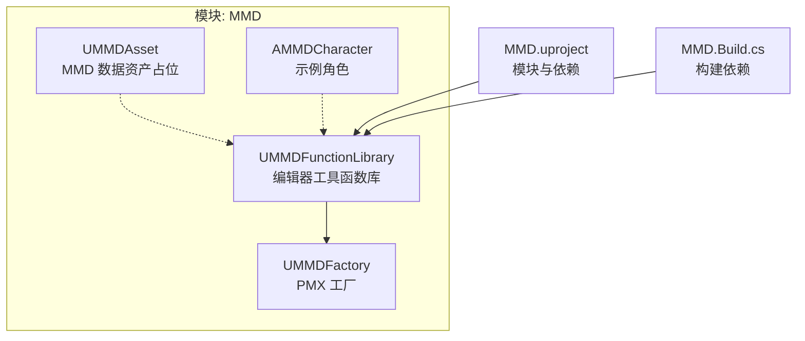
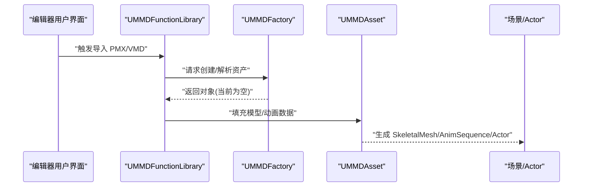
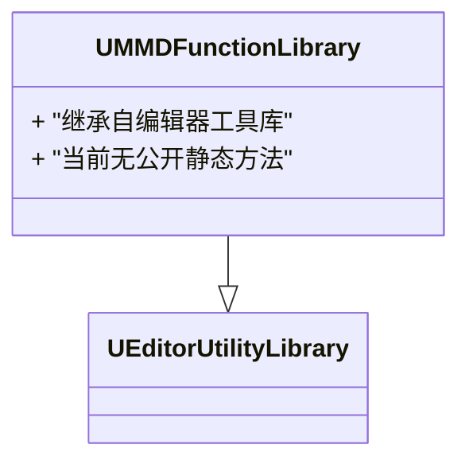
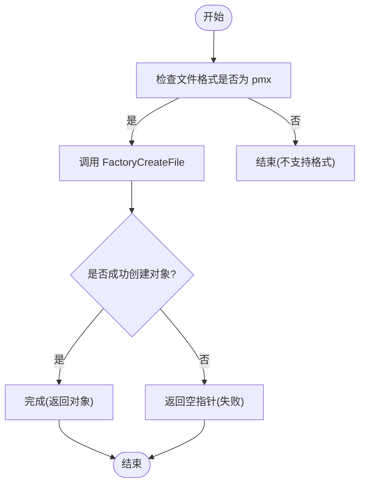
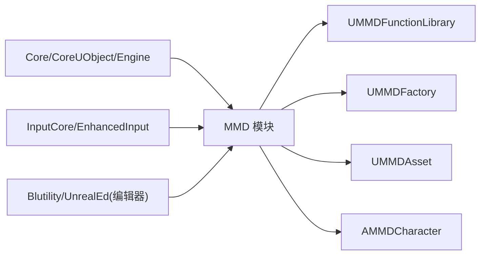

# UMMDFunctionLibrary 函数库 API

<cite>
**本文引用的文件**   
- [MMDFunctionLibrary.h](file://MMD/Source/MMD/MMDFunctionLibrary.h)
- [MMDFunctionLibrary.cpp](file://MMD/Source/MMD/MMDFunctionLibrary.cpp)
- [MMDFactory.h](file://MMD/Source/MMD/MMDFactory.h)
- [MMDFactory.cpp](file://MMD/Source/MMD/MMDFactory.cpp)
- [MMDAsset.h](file://MMD/Source/MMD/MMDAsset.h)
- [MMDAsset.cpp](file://MMD/Source/MMD/MMDAsset.cpp)
- [MMDCharacter.h](file://MMD/Source/MMD/MMDCharacter.h)
- [README.md](file://README.md)
- [MMD.uproject](file://MMD/MMD.uproject)
- [MMD.Build.cs](file://MMD/Source/MMD/MMD.Build.cs)
</cite>

## 目录
1. [简介](#简介)
2. [项目结构](#项目结构)
3. [核心组件](#核心组件)
4. [架构总览](#架构总览)
5. [详细组件分析](#详细组件分析)
6. [依赖分析](#依赖分析)
7. [性能考虑](#性能考虑)
8. [故障排查指南](#故障排查指南)
9. [结论](#结论)
10. [附录](#附录)

## 简介
本文件为 UMMDFunctionLibrary 类的全面 API 文档。UMMDFunctionLibrary 继承自编辑器工具库，用于在编辑器环境下提供 MMD（PMX/VMD）相关的导入与辅助能力。当前仓库中该函数库的声明与实现均为空壳，尚未暴露任何静态工具方法；实际的 PMX/VMD 导入流程由工厂类与插件面板驱动。本文基于源码现状进行说明，并给出蓝图调用、线程安全、错误处理与最佳实践的指导性建议。

## 项目结构
- 模块：MMD（运行时模块），依赖 Core、CoreUObject、Engine、InputCore、EnhancedInput，并在编辑器目标下启用 Blutility 与 UnrealEd。
- 关键源文件：
  - UMMDFunctionLibrary：编辑器工具函数库（当前为空）。
  - UMMDFactory：PMX 资产工厂（注册 pmx 格式，但创建逻辑未实现）。
  - UMMDAsset：MMD 相关数据资产占位类（当前为空）。
  - AMMDCharacter：示例角色基类，包含相机与输入绑定。
- 工程配置：
  - uproject 指定引擎版本与模块依赖。
  - Build.cs 声明公共依赖模块。

图示来源
- [MMDFunctionLibrary.h:12-18](file://MMD/Source/MMD/MMDFunctionLibrary.h#L12-L18)
- [MMDFactory.h:12-22](file://MMD/Source/MMD/MMDFactory.h#L12-L22)
- [MMDAsset.h:12-17](file://MMD/Source/MMD/MMDAsset.h#L12-L17)
- [MMDCharacter.h:18-71](file://MMD/Source/MMD/MMDCharacter.h#L18-L71)
- [MMD.uproject:6-16](file://MMD/MMD.uproject#L6-L16)
- [MMD.Build.cs:11-13](file://MMD/Source/MMD/MMD.Build.cs#L11-L13)

章节来源
- [MMDFunctionLibrary.h:1-18](file://MMD/Source/MMD/MMDFunctionLibrary.h#L1-L18)
- [MMDFunctionLibrary.cpp:1-6](file://MMD/Source/MMD/MMDFunctionLibrary.cpp#L1-L6)
- [MMDFactory.h:1-22](file://MMD/Source/MMD/MMDFactory.h#L1-L22)
- [MMDFactory.cpp:1-15](file://MMD/Source/MMD/MMDFactory.cpp#L1-L15)
- [MMDAsset.h:1-18](file://MMD/Source/MMD/MMDAsset.h#L1-L18)
- [MMDAsset.cpp:1-5](file://MMD/Source/MMD/MMDAsset.cpp#L1-L5)
- [MMDCharacter.h:1-73](file://MMD/Source/MMD/MMDCharacter.h#L1-L73)
- [MMD.uproject:1-27](file://MMD/MMD.uproject#L1-L27)
- [MMD.Build.cs:1-15](file://MMD/Source/MMD/MMD.Build.cs#L1-L15)

## 核心组件
- UMMDFunctionLibrary
  - 类型：编辑器工具函数库（继承自 UEditorUtilityLibrary）。
  - 状态：当前无公开静态方法，仅作为扩展点预留。
  - 用途：未来可在此集中放置批量导入、格式转换、资产检查等编辑器工具函数，供蓝图的“调用函数”节点使用。
- UMMDFactory
  - 类型：资产工厂（继承自 UFactory）。
  - 状态：已注册 pmx 文件格式，但 FactoryCreateFile 返回空指针，实际导入逻辑未实现。
  - 用途：配合编辑器“导入”流程，将外部 PMX 文件转换为 UE 资产。
- UMMDAsset
  - 类型：数据资产占位类（继承自 UObject）。
  - 状态：无成员与方法。
  - 用途：可作为后续保存 MMD ModelData 或中间数据的容器。
- AMMDCharacter
  - 类型：示例角色（继承自 ACharacter）。
  - 状态：包含相机与输入映射属性及基础输入回调接口。
  - 用途：演示如何在场景中承载 MMD 角色并进行交互。

章节来源
- [MMDFunctionLibrary.h:12-18](file://MMD/Source/MMD/MMDFunctionLibrary.h#L12-L18)
- [MMDFactory.h:12-22](file://MMD/Source/MMD/MMDFactory.h#L12-L22)
- [MMDFactory.cpp:6-14](file://MMD/Source/MMD/MMDFactory.cpp#L6-L14)
- [MMDAsset.h:12-17](file://MMD/Source/MMD/MMDAsset.h#L12-L17)
- [MMDCharacter.h:18-71](file://MMD/Source/MMD/MMDCharacter.h#L18-L71)

## 架构总览
下图展示编辑器侧通过工厂与函数库协作的潜在工作流（概念图，非当前代码实现）：

图示来源
- [MMDFunctionLibrary.h:12-18](file://MMD/Source/MMD/MMDFunctionLibrary.h#L12-L18)
- [MMDFactory.h:12-22](file://MMD/Source/MMD/MMDFactory.h#L12-L22)
- [MMDFactory.cpp:11-14](file://MMD/Source/MMD/MMDFactory.cpp#L11-L14)
- [MMDAsset.h:12-17](file://MMD/Source/MMD/MMDAsset.h#L12-L17)

## 详细组件分析

### UMMDFunctionLibrary 类
- 继承关系：继承自编辑器工具库，便于在编辑器上下文内访问编辑管线能力。
- 当前接口：无公开静态方法。
- 蓝图集成：由于继承自编辑器工具库，未来添加的静态方法可直接在蓝图中以“调用函数”节点出现。
- 线程安全：编辑器工具通常运行在主线程，应避免阻塞 UI；若引入耗时操作，需采用异步任务或在后台线程执行后回主线程更新。
- 错误处理：建议在编辑器工具中统一收集错误信息并通过反馈上下文输出，避免静默失败。

图示来源
- [MMDFunctionLibrary.h:12-18](file://MMD/Source/MMD/MMDFunctionLibrary.h#L12-L18)

章节来源
- [MMDFunctionLibrary.h:1-18](file://MMD/Source/MMD/MMDFunctionLibrary.h#L1-L18)
- [MMDFunctionLibrary.cpp:1-6](file://MMD/Source/MMD/MMDFunctionLibrary.cpp#L1-L6)

### UMMDFactory 工厂
- 作用：注册 PMX 文件格式，使编辑器可通过“导入”流程识别并尝试创建对应资产。
- 当前实现：构造函数中添加 pmx 格式；FactoryCreateFile 返回空指针，表示导入逻辑尚未落地。
- 蓝图集成：工厂本身不直接暴露给蓝图，但通过编辑器“导入”菜单间接使用。
- 错误处理：当创建失败时返回空指针，调用方应检测返回值并提示用户。

图示来源
- [MMDFactory.cpp:6-14](file://MMD/Source/MMD/MMDFactory.cpp#L6-L14)
- [MMDFactory.h:19-21](file://MMD/Source/MMD/MMDFactory.h#L19-L21)

章节来源
- [MMDFactory.h:1-22](file://MMD/Source/MMD/MMDFactory.h#L1-L22)
- [MMDFactory.cpp:1-15](file://MMD/Source/MMD/MMDFactory.cpp#L1-L15)

### UMMDAsset 数据资产
- 作用：作为 MMD 相关数据的容器占位类，可用于保存模型元数据、IK 重定向信息等。
- 当前实现：无成员与方法。
- 蓝图集成：可作为变量或参数在蓝图中传递。

章节来源
- [MMDAsset.h:1-18](file://MMD/Source/MMD/MMDAsset.h#L1-L18)
- [MMDAsset.cpp:1-5](file://MMD/Source/MMD/MMDAsset.cpp#L1-L5)

### AMMDCharacter 示例角色
- 作用：提供相机与输入映射的基础骨架，便于在场景中承载 MMD 角色并进行交互。
- 关键属性：相机臂、跟随相机、输入映射上下文、移动/注视/跳跃动作。
- 蓝图集成：可在蓝图中设置这些属性，或通过事件图表调用其输入回调。

章节来源
- [MMDCharacter.h:18-71](file://MMD/Source/MMD/MMDCharacter.h#L18-L71)

## 依赖分析
- 模块依赖：
  - 运行时依赖：Core、CoreUObject、Engine、InputCore、EnhancedInput。
  - 编辑器依赖：Blutility、UnrealEd（在编辑器目标下启用）。
- 内部依赖：
  - UMMDFunctionLibrary 依赖编辑器工具库与工厂头文件。
  - 工厂负责 PMX 格式识别。
  - 资产与角色类为占位/示例，便于后续扩展。

图示来源
- [MMD.uproject:6-16](file://MMD/MMD.uproject#L6-L16)
- [MMD.Build.cs:11-13](file://MMD/Source/MMD/MMD.Build.cs#L11-L13)
- [MMDFunctionLibrary.h:5-8](file://MMD/Source/MMD/MMDFunctionLibrary.h#L5-L8)

章节来源
- [MMD.uproject:1-27](file://MMD/MMD.uproject#L1-L27)
- [MMD.Build.cs:1-15](file://MMD/Source/MMD/MMD.Build.cs#L1-L15)
- [MMDFunctionLibrary.h:5-8](file://MMD/Source/MMD/MMDFunctionLibrary.h#L5-L8)

## 性能考虑
- 编辑器工具函数应在主线程快速响应，避免长时间阻塞 UI。
- 对于大文件解析（如 PMX/VMD），建议：
  - 分块读取与增量处理。
  - 使用异步任务在后台线程解析，完成后回主线程更新资产与视图。
- 资源生成阶段尽量批量化写入，减少频繁磁盘 I/O。
- 对重复计算结果进行缓存，避免重复解析相同数据。

## 故障排查指南
- 导入 PMX 无效：
  - 现象：工厂创建返回空指针。
  - 排查：确认工厂实现是否已完善；检查文件格式与路径；查看编辑器日志中的反馈信息。
- 蓝图无法找到函数：
  - 现象：在蓝图中找不到 UMMDFunctionLibrary 的静态方法。
  - 排查：确认函数库是否已添加静态方法并重新编译；确保模块在编辑器目标下可用。
- 动画播放异常：
  - 现象：骨骼动作、表情或嘴型未正确播放。
  - 排查：根据 README 的流程核对 PMX 与 VMD 的导入顺序；检查生成的 AnimSequence 与 MorphTarget 是否存在。

章节来源
- [MMDFactory.cpp:11-14](file://MMD/Source/MMD/MMDFactory.cpp#L11-L14)
- [README.md:43-87](file://README.md#L43-L87)

## 结论
当前 UMMDFunctionLibrary 作为编辑器工具函数库的扩展点，尚未暴露具体静态方法；PMX 导入的核心入口位于工厂类，但创建逻辑尚未实现。建议在 UMMDFunctionLibrary 中逐步补充批量导入、格式转换、资产检查等工具函数，并结合工厂与资产类完善端到端的导入流程。同时遵循编辑器工具的性能与错误处理最佳实践，确保用户体验稳定可靠。

## 附录
- 蓝图调用示例（概念）：
  - 在蓝图中搜索“UMMDFunctionLibrary”，选择需要调用的静态方法（待实现后出现）。
  - 将方法拖入事件图表，连接参数与返回值，按提示完成调用。
- 常见使用模式（概念）：
  - 批量导入：遍历文件夹，逐个调用导入函数，记录成功/失败列表。
  - 格式转换：先解析源文件到中间结构，再写入 UE 原生资产。
  - 资产检查：校验 SkeletalMesh、Skeleton、AnimSequence 的完整性与一致性。
- 线程安全与错误处理（概念）：
  - 所有编辑器工具函数默认在主线程执行；耗时操作请走异步任务。
  - 统一错误码与消息，结合反馈上下文输出，便于定位问题。