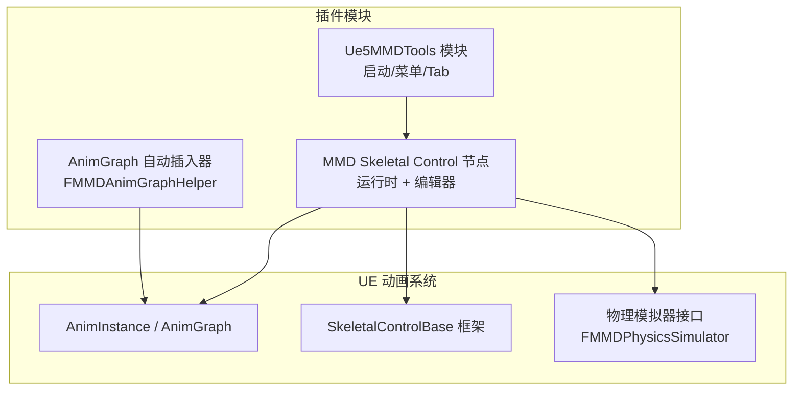
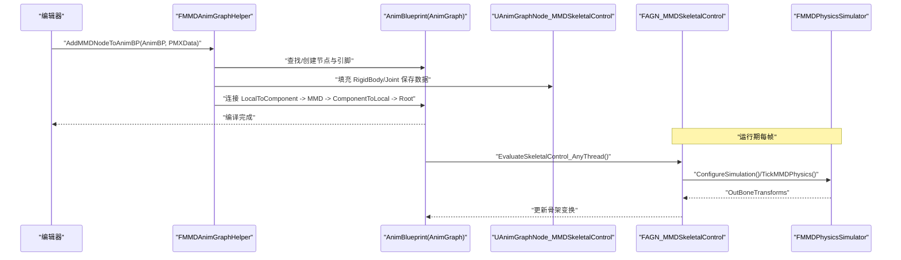
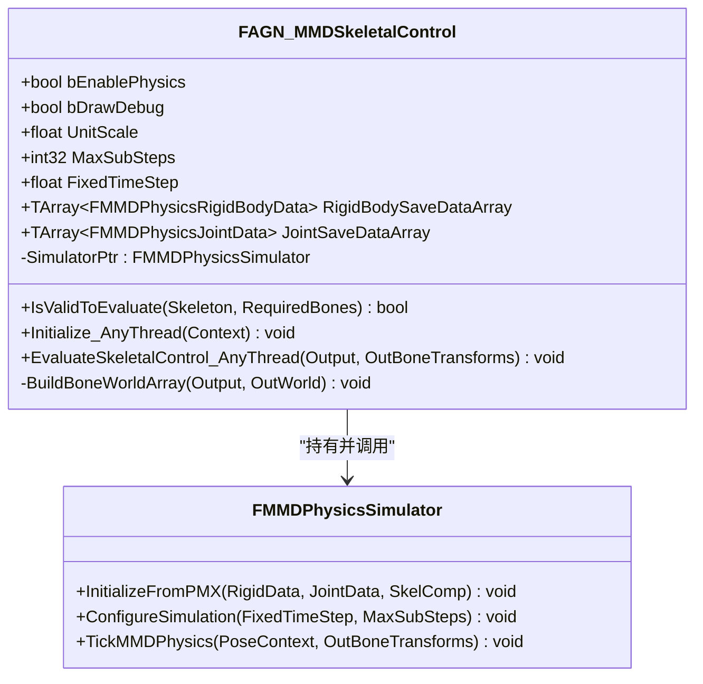
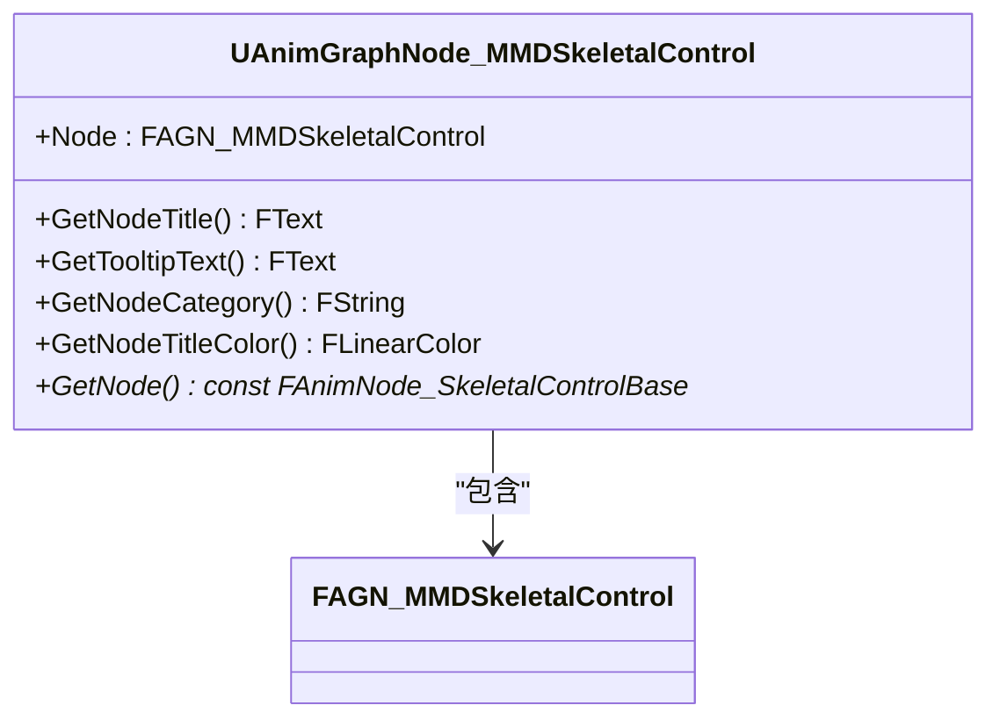
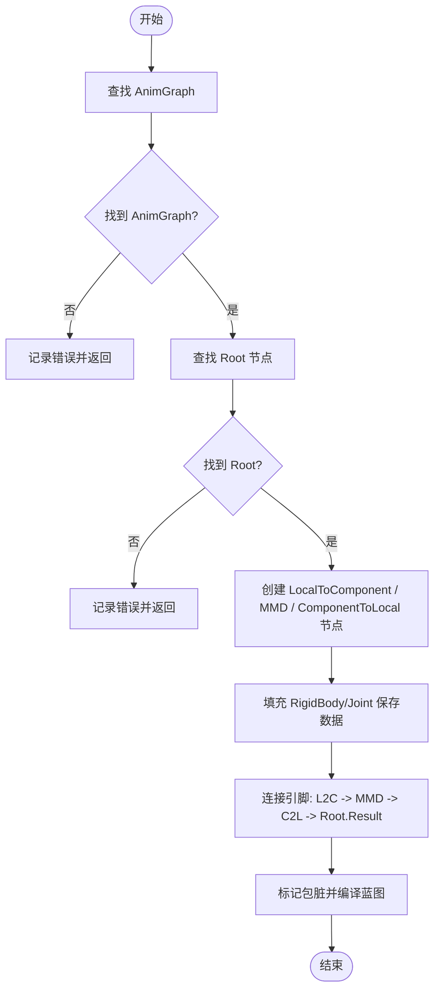
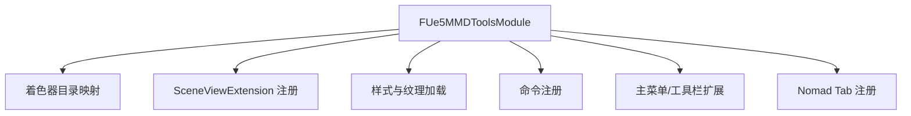
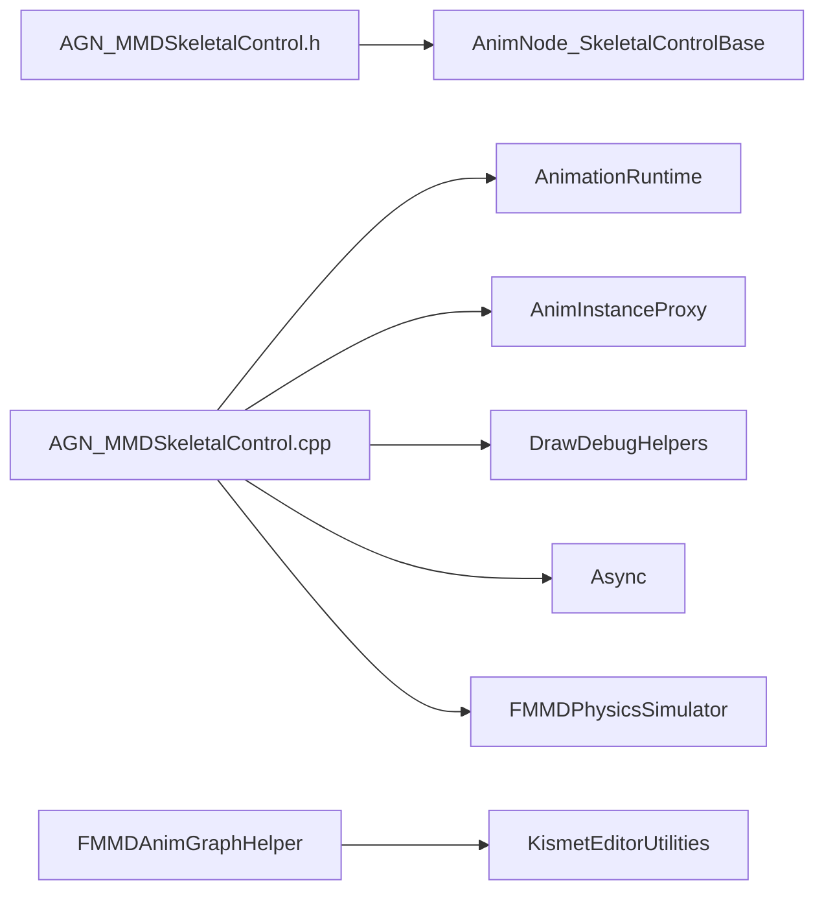

# AnimBlueprint 自动生成

<cite>
**本文引用的文件**
- [README.md](file://README.md)
- [AGN_MMDSkeletalControl.h](file://MMD/Plugins/Ue5MMDTools/Source/Ue5MMDTools/Public/Animation/AGN_MMDSkeletalControl.h)
- [AGN_MMDSkeletalControl.cpp](file://MMD/Plugins/Ue5MMDTools/Source/Ue5MMDTools/Private/Animation/AGN_MMDSkeletalControl.cpp)
- [Ue5MMDTools.h](file://MMD/Plugins/Ue5MMDTools/Source/Ue5MMDTools/Public/Ue5MMDTools.h)
- [Ue5MMDTools.cpp](file://MMD/Plugins/Ue5MMDTools/Source/Ue5MMDTools/Private/Ue5MMDTools.cpp)
</cite>

## 目录
1. [简介](#简介)
2. [项目结构](#项目结构)
3. [核心组件](#核心组件)
4. [架构总览](#架构总览)
5. [详细组件分析](#详细组件分析)
6. [依赖关系分析](#依赖关系分析)
7. [性能考虑](#性能考虑)
8. [故障排查指南](#故障排查指南)
9. [结论](#结论)
10. [附录](#附录)

## 简介
本文件面向 MMDUETools 的 AnimBlueprint 自动生成系统，系统性阐述动画蓝图自动生成的实现机制与使用方式。重点覆盖：
- 骨骼节点结构与数据流
- 动画状态机（AnimGraph）配置与生成流程
- 自定义动画逻辑（MMD Skeletal Control 节点）的创建、输入参数设置、输出绑定与事件处理
- 与 UE 动画系统的集成方式及性能优化建议
- 调试技巧与常见问题定位方法

## 项目结构
本项目在插件模块中实现了 MMD 风格的骨骼控制节点与 AnimBlueprint 自动化插入工具。关键路径如下：
- 运行时骨骼控制节点与数据结构定义：Public/Animation/AGN_MMDSkeletalControl.h
- 运行时评估与编辑器侧蓝图节点生成逻辑：Private/Animation/AGN_MMDSkeletalControl.cpp
- 插件模块入口与 UI 注册：Public/Ue5MMDTools.h、Private/Ue5MMDTools.cpp
- 功能说明与导入流程概述：README.md

图表来源
- [Ue5MMDTools.cpp:21-55](file://MMD/Plugins/Ue5MMDTools/Source/Ue5MMDTools/Private/Ue5MMDTools.cpp#L21-L55)
- [AGN_MMDSkeletalControl.h:58-100](file://MMD/Plugins/Ue5MMDTools/Source/Ue5MMDTools/Public/Animation/AGN_MMDSkeletalControl.h#L58-L100)
- [AGN_MMDSkeletalControl.cpp:147-374](file://MMD/Plugins/Ue5MMDTools/Source/Ue5MMDTools/Private/Animation/AGN_MMDSkeletalControl.cpp#L147-L374)

章节来源
- [README.md:1-130](file://README.md#L1-L130)
- [Ue5MMDTools.h:1-31](file://MMD/Plugins/Ue5MMDTools/Source/Ue5MMDTools/Public/Ue5MMDTools.h#L1-L31)
- [Ue5MMDTools.cpp:21-109](file://MMD/Plugins/Ue5MMDTools/Source/Ue5MMDTools/Private/Ue5MMDTools.cpp#L21-L109)
- [AGN_MMDSkeletalControl.h:1-140](file://MMD/Plugins/Ue5MMDTools/Source/Ue5MMDTools/Public/Animation/AGN_MMDSkeletalControl.h#L1-L140)
- [AGN_MMDSkeletalControl.cpp:1-387](file://MMD/Plugins/Ue5MMDTools/Source/Ue5MMDTools/Private/Animation/AGN_MMDSkeletalControl.cpp#L1-L387)

## 核心组件
- 运行时骨骼控制节点 FAGN_MMDSkeletalControl
  - 继承自 UE 的骨骼控制基类，提供每帧评估、初始化、线程安全访问等能力
  - 内置物理开关、调试绘制、时间步长与子步数等可调参数
  - 通过 FMMDPhysicsSimulator 驱动刚体/关节数据，将结果写回骨架变换
- 编辑器节点 UAnimGraphNode_MMDSkeletalControl
  - 负责在蓝图编辑器中显示、命名、分类与提示
  - 暴露运行时节点的数据属性供编辑期配置
- 自动插入器 FMMDAnimGraphHelper
  - 在指定 AnimBlueprint 的 AnimGraph 中插入 LocalToComponent -> MMD Skeletal Control -> ComponentToLocal 链
  - 自动连接引脚并编译蓝图
  - 从 PMX 数据填充刚体与关节保存数组到节点实例

章节来源
- [AGN_MMDSkeletalControl.h:58-140](file://MMD/Plugins/Ue5MMDTools/Source/Ue5MMDTools/Public/Animation/AGN_MMDSkeletalControl.h#L58-L140)
- [AGN_MMDSkeletalControl.cpp:108-387](file://MMD/Plugins/Ue5MMDTools/Source/Ue5MMDTools/Private/Animation/AGN_MMDSkeletalControl.cpp#L108-L387)

## 架构总览
下图展示了 AnimBlueprint 自动生成与运行时评估的整体流程：编辑器侧根据 PMX 数据构造节点与连线；运行期由骨骼控制节点读取当前骨架姿态，调用物理模拟器计算，并将结果写回骨架。

图表来源
- [AGN_MMDSkeletalControl.cpp:147-374](file://MMD/Plugins/Ue5MMDTools/Source/Ue5MMDTools/Private/Animation/AGN_MMDSkeletalControl.cpp#L147-L374)
- [AGN_MMDSkeletalControl.cpp:23-57](file://MMD/Plugins/Ue5MMDTools/Source/Ue5MMDTools/Private/Animation/AGN_MMDSkeletalControl.cpp#L23-L57)

## 详细组件分析

### 运行时骨骼控制节点 FAGN_MMDSkeletalControl
- 职责
  - 每帧评估：根据是否启用物理、模拟器是否初始化，决定是否调用 TickMMDPhysics 并排序输出
  - 初始化：从保存的刚体/关节数据初始化模拟器，配置固定时间步与子步数
  - 世界矩阵构建：为物理模拟准备各骨骼的世界变换数组
- 关键属性
  - bEnablePhysics：是否启用物理
  - bDrawDebug：是否开启调试绘制
  - UnitScale、MaxSubSteps、FixedTimeStep：物理仿真参数
  - RigidBodySaveDataArray、JointSaveDataArray：PMX 解析后的刚体/关节数据
- 关键方法
  - IsValidToEvaluate：有效性检查
  - Initialize_AnyThread：初始化模拟器与配置
  - EvaluateSkeletalControl_AnyThread：每帧评估与输出
  - BuildBoneWorldArray：构建世界变换数组供物理使用

图表来源
- [AGN_MMDSkeletalControl.h:58-100](file://MMD/Plugins/Ue5MMDTools/Source/Ue5MMDTools/Public/Animation/AGN_MMDSkeletalControl.h#L58-L100)
- [AGN_MMDSkeletalControl.cpp:23-57](file://MMD/Plugins/Ue5MMDTools/Source/Ue5MMDTools/Private/Animation/AGN_MMDSkeletalControl.cpp#L23-L57)

章节来源
- [AGN_MMDSkeletalControl.h:58-100](file://MMD/Plugins/Ue5MMDTools/Source/Ue5MMDTools/Public/Animation/AGN_MMDSkeletalControl.h#L58-L100)
- [AGN_MMDSkeletalControl.cpp:12-107](file://MMD/Plugins/Ue5MMDTools/Source/Ue5MMDTools/Private/Animation/AGN_MMDSkeletalControl.cpp#L12-L107)

### 编辑器节点 UAnimGraphNode_MMDSkeletalControl
- 职责
  - 提供节点标题、提示文本、分类与颜色
  - 暴露运行时节点实例以供编辑期修改
- 与运行时的关系
  - 编辑器节点仅作为包装，实际逻辑在 FAGN_MMDSkeletalControl 中执行

图表来源
- [AGN_MMDSkeletalControl.h:103-122](file://MMD/Plugins/Ue5MMDTools/Source/Ue5MMDTools/Public/Animation/AGN_MMDSkeletalControl.h#L103-L122)
- [AGN_MMDSkeletalControl.cpp:118-143](file://MMD/Plugins/Ue5MMDTools/Source/Ue5MMDTools/Private/Animation/AGN_MMDSkeletalControl.cpp#L118-L143)

章节来源
- [AGN_MMDSkeletalControl.h:103-122](file://MMD/Plugins/Ue5MMDTools/Source/Ue5MMDTools/Public/Animation/AGN_MMDSkeletalControl.h#L103-L122)
- [AGN_MMDSkeletalControl.cpp:118-143](file://MMD/Plugins/Ue5MMDTools/Source/Ue5MMDTools/Private/Animation/AGN_MMDSkeletalControl.cpp#L118-L143)

### 自动插入器 FMMDAnimGraphHelper
- AddMMDNodeToAnimBP
  - 在目标 AnimBlueprint 的 AnimGraph 中插入 LocalToComponent -> MMD Skeletal Control -> ComponentToLocal 三段节点
  - 自动连接 struct 类型引脚，并将最终结果连入 Root 节点的 Result 输入
  - 从 PMX 数据填充刚体与关节保存数组到节点实例
  - 完成后触发蓝图编译
- InsertMMDNodeBetween
  - 预留用于在两个已有节点之间插入 MMD 节点的辅助函数（当前未实现）

图表来源
- [AGN_MMDSkeletalControl.cpp:147-374](file://MMD/Plugins/Ue5MMDTools/Source/Ue5MMDTools/Private/Animation/AGN_MMDSkeletalControl.cpp#L147-L374)

章节来源
- [AGN_MMDSkeletalControl.cpp:147-387](file://MMD/Plugins/Ue5MMDTools/Source/Ue5MMDTools/Private/Animation/AGN_MMDSkeletalControl.cpp#L147-L387)

### 插件模块与 UI 集成
- 模块启动时注册着色器目录映射、视图扩展、样式与命令
- 注册窗口菜单项与工具栏按钮，打开插件 Tab
- 插件 Tab 承载导入设置界面

图表来源
- [Ue5MMDTools.cpp:21-109](file://MMD/Plugins/Ue5MMDTools/Source/Ue5MMDTools/Private/Ue5MMDTools.cpp#L21-L109)

章节来源
- [Ue5MMDTools.h:1-31](file://MMD/Plugins/Ue5MMDTools/Source/Ue5MMDTools/Public/Ue5MMDTools.h#L1-L31)
- [Ue5MMDTools.cpp:21-109](file://MMD/Plugins/Ue5MMDTools/Source/Ue5MMDTools/Private/Ue5MMDTools.cpp#L21-L109)

## 依赖关系分析
- 编辑器依赖
  - 蓝图编辑器相关头文件（AnimGraph、Root、LocalToComponentSpace、ComponentToLocalSpace、SequencePlayer 等）
  - Kismet 编辑器工具用于编译蓝图
- 运行时依赖
  - UE 动画运行时（AnimInstanceProxy、AnimationRuntime、AnimTypes）
  - 骨骼控制基类（AnimNode_SkeletalControlBase）
  - 物理模拟器（FMMDPhysicsSimulator）
  - 调试绘制（DrawDebugHelpers）
  - 异步任务（Async）

图表来源
- [AGN_MMDSkeletalControl.h:1-140](file://MMD/Plugins/Ue5MMDTools/Source/Ue5MMDTools/Public/Animation/AGN_MMDSkeletalControl.h#L1-L140)
- [AGN_MMDSkeletalControl.cpp:1-107](file://MMD/Plugins/Ue5MMDTools/Source/Ue5MMDTools/Private/Animation/AGN_MMDSkeletalControl.cpp#L1-L107)
- [AGN_MMDSkeletalControl.cpp:108-387](file://MMD/Plugins/Ue5MMDTools/Source/Ue5MMDTools/Private/Animation/AGN_MMDSkeletalControl.cpp#L108-L387)

章节来源
- [AGN_MMDSkeletalControl.h:1-140](file://MMD/Plugins/Ue5MMDTools/Source/Ue5MMDTools/Public/Animation/AGN_MMDSkeletalControl.h#L1-L140)
- [AGN_MMDSkeletalControl.cpp:1-387](file://MMD/Plugins/Ue5MMDTools/Source/Ue5MMDTools/Private/Animation/AGN_MMDSkeletalControl.cpp#L1-L387)

## 性能考虑
- 物理仿真参数
  - FixedTimeStep 与 MaxSubSteps 直接影响每帧物理计算量，建议根据场景复杂度调优
  - UnitScale 需与模型单位一致，避免数值过大或过小导致不稳定
- 线程安全
  - 评估与初始化均在 AnyThread 上下文执行，注意共享资源访问的同步策略
- 调试开销
  - bDrawDebug 仅在调试阶段开启，发布版本应关闭以减少绘制开销
- 数据规模
  - RigidBodySaveDataArray 与 JointSaveDataArray 的大小与约束数量会显著影响初始化与求解成本

[本节为通用指导，不直接分析具体文件]

## 故障排查指南
- 常见错误日志
  - “MMDPhysicsSimulator is not initialized!”：通常表示初始化未完成或数据为空
  - “AnimBP is null”、“AnimGraph not found”、“Root node not found”：自动插入失败的原因
- 快速定位步骤
  - 确认 RigidBodySaveDataArray 与 JointSaveDataArray 非空
  - 检查是否在正确的 AnimGraph 中插入了节点
  - 验证引脚类型是否为 struct，且方向正确（Input/Output）
  - 查看日志输出以确认连接顺序是否正确
- 调试技巧
  - 开启 bDrawDebug 观察刚体/关节可视化
  - 逐步调整 FixedTimeStep 与 MaxSubSteps 观察稳定性变化
  - 在编辑器中手动重连引脚后重新编译蓝图

章节来源
- [AGN_MMDSkeletalControl.cpp:23-57](file://MMD/Plugins/Ue5MMDTools/Source/Ue5MMDTools/Private/Animation/AGN_MMDSkeletalControl.cpp#L23-L57)
- [AGN_MMDSkeletalControl.cpp:147-188](file://MMD/Plugins/Ue5MMDTools/Source/Ue5MMDTools/Private/Animation/AGN_MMDSkeletalControl.cpp#L147-L188)

## 结论
MMDUETools 的 AnimBlueprint 自动生成系统通过编辑器侧的自动插入器与运行时骨骼控制节点协同工作，实现了从 PMX 数据到 UE 动画蓝图的无缝衔接。其核心在于：
- 标准化的骨骼控制节点封装
- 基于 PMX 数据的刚体/关节配置注入
- 自动化的节点创建与引脚连接
- 与 UE 动画系统的良好集成

通过合理配置物理参数与调试手段，可在保证稳定性的前提下获得高质量的 MMD 风格动画表现。

[本节为总结性内容，不直接分析具体文件]

## 附录

### 使用示例与最佳实践
- 自动生成流程
  - 在导入 PMX 后，调用自动插入器将 MMD Skeletal Control 节点链插入到目标 AnimBlueprint 的 AnimGraph
  - 确保 Root 节点的 Result 输入被正确接管
- 节点输入参数
  - 在编辑器中展开 MMD Skeletal Control 节点，配置物理参数与调试选项
- 输出绑定
  - 默认输出已连接到 ComponentToLocal 节点，再连回 Root，无需额外操作
- 事件处理
  - 如需在特定时刻触发物理重置或切换模式，可在 AnimGraph 中通过条件分支或外部变量控制 bEnablePhysics 等属性

[本节为概念性说明，不直接分析具体文件]