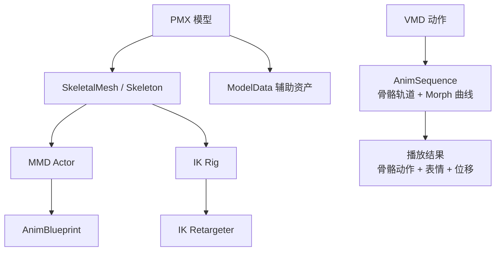
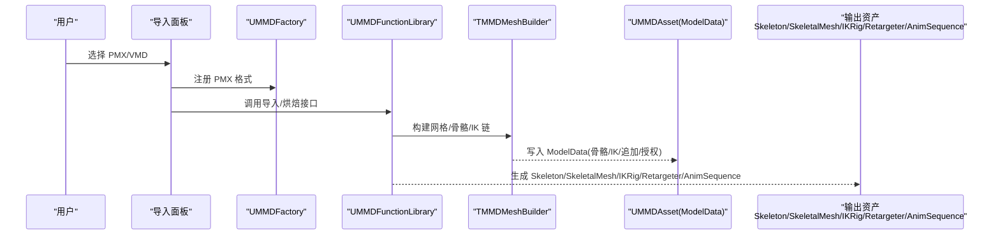
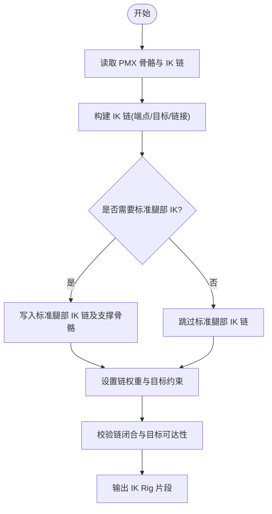
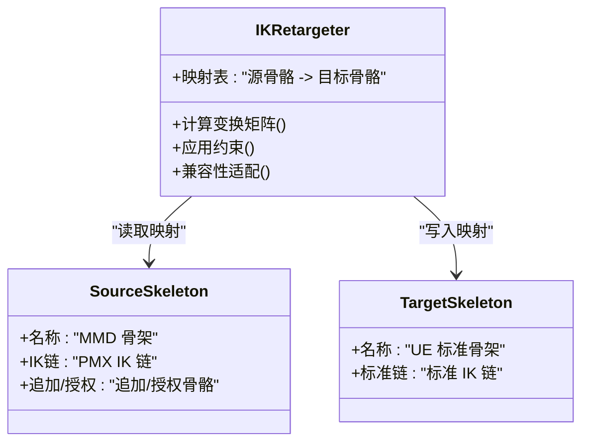
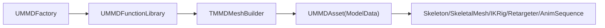

# IK Rig 和 Retargeter 配置

<cite>
**本文引用的文件**   
- [README.md](file://README.md)
- [index.html](file://docs/index.html)
- [MMDFactory.h](file://MMD/Source/MMD/MMDFactory.h)
- [MMDFactory.cpp](file://MMD/Source/MMD/MMDFactory.cpp)
- [MMDFunctionLibrary.h](file://MMD/Source/MMD/MMDFunctionLibrary.h)
- [MMDFunctionLibrary.cpp](file://MMD/Source/MMD/MMDFunctionLibrary.cpp)
- [MMDAsset.h](file://MMD/Source/MMD/MMDAsset.h)
- [MMDAsset.cpp](file://MMD/Source/MMD/MMDAsset.cpp)
- [MMDCharacter.h](file://MMD/Source/MMD/MMDCharacter.h)
- [MMDCharacter.cpp](file://MMD/Source/MMD/MMDCharacter.cpp)
- [VMD_PMX_Animation_Bake.md](file://MMD/Plugins/Ue5MMDTools/Docs/VMD_PMX_Animation_Bake.md)
- [TMMDMeshBuilder.cpp](file://MMD/Plugins/Ue5MMDTools/Source/Ue5MMDTools/Private/Import/TMMDMeshBuilder.cpp)
</cite>

## 目录
1. [简介](#简介)
2. [项目结构](#项目结构)
3. [核心组件](#核心组件)
4. [架构总览](#架构总览)
5. [详细组件分析](#详细组件分析)
6. [依赖关系分析](#依赖关系分析)
7. [性能考量](#性能考量)
8. [故障排查指南](#故障排查指南)
9. [结论](#结论)
10. [附录](#附录)

## 简介
本文件面向动画师与程序员，系统化说明 MMDUETools 的 IK Rig 与 IK Retargeter 配置体系。内容覆盖：
- 反向动力学骨架的自动生成流程（IK 链、目标约束、权重）
- 骨骼重定向器的创建与配置（源到目标的映射、变换矩阵计算、兼容性处理）
- MMD 特有骨骼结构（如追加/授权骨骼、IK 追加骨骼）在 UE 中的处理方式
- IK 解算器选择与参数调优方法
- 具体配置示例与常见问题解决方案
- 动画师与程序员的协作工作流指导

## 项目结构
本项目为 UE5 插件形态，提供 PMX/VMD 导入、角色 Actor 生成、AnimBlueprint 与 IK 资产自动生成的能力。与 IK 相关的关键产出包括：
- SkeletalMesh / Skeleton
- AnimBlueprint
- IK Rig / IK Retargeter
- ModelData 辅助数据（用于记录骨骼、IK、追加/授权等元信息）

图示来源
- [README.md:53-67](file://README.md#L53-L67)
- [index.html:282-293](file://docs/index.html#L282-L293)

章节来源
- [README.md:1-130](file://README.md#L1-L130)
- [index.html:271-398](file://docs/index.html#L271-L398)

## 核心组件
- 工厂与工具类
  - 工厂类负责注册 PMX 格式并参与导入管线（当前实现未返回对象，实际导入逻辑由编辑器面板驱动）。
  - 函数库继承自编辑器工具库，作为扩展点承载导入/烘焙/生成等编辑期功能。
- 资源与角色
  - 基础资源占位类用于保存与 MMD 相关的辅助数据。
  - 角色基类用于演示场景与输入/相机控制，非 IK 核心逻辑所在。

章节来源
- [MMDFactory.h:12-22](file://MMD/Source/MMD/MMDFactory.h#L12-L22)
- [MMDFactory.cpp:6-14](file://MMD/Source/MMD/MMDFactory.cpp#L6-L14)
- [MMDFunctionLibrary.h:12-18](file://MMD/Source/MMD/MMDFunctionLibrary.h#L12-L18)
- [MMDFunctionLibrary.cpp:1-5](file://MMD/Source/MMD/MMDFunctionLibrary.cpp#L1-L5)
- [MMDAsset.h:12-17](file://MMD/Source/MMD/MMDAsset.h#L12-L17)
- [MMDAsset.cpp:1-5](file://MMD/Source/MMD/MMDAsset.cpp#L1-L5)
- [MMDCharacter.h:18-71](file://MMD/Source/MMD/MMDCharacter.h#L18-L71)
- [MMDCharacter.cpp:19-55](file://MMD/Source/MMD/MMDCharacter.cpp#L19-L55)

## 架构总览
从 PMX/VMD 到最终播放的整体路径如下：
- PMX 解析生成骨架与网格，同时导出 ModelData（包含骨骼、IK、追加/授权等元信息）
- VMD 解析生成 AnimSequence（骨骼轨道 + Morph 曲线），并在需要时进行坐标系转换与 IK/追加骨骼烘焙
- 自动生成 MMD Actor 与 AnimBlueprint，并提供 MMD Skeletal Control 节点
- 自动生成 IK Rig 与 IK Retargeter，完成从 MMD 骨架到 UE 标准骨架的重定向

图示来源
- [MMDFactory.h:12-22](file://MMD/Source/MMD/MMDFactory.h#L12-L22)
- [MMDFactory.cpp:6-14](file://MMD/Source/MMD/MMDFactory.cpp#L6-L14)
- [MMDFunctionLibrary.h:12-18](file://MMD/Source/MMD/MMDFunctionLibrary.h#L12-L18)
- [TMMDMeshBuilder.cpp:1180-1285](file://MMD/Plugins/Ue5MMDTools/Source/Ue5MMDTools/Private/Import/TMMDMeshBuilder.cpp#L1180-L1285)
- [README.md:53-67](file://README.md#L53-L67)

## 详细组件分析

### IK 链自动生成与配置
- 数据来源
  - PMX 中的 IK 链信息被提取并记录到 ModelData，供后续生成 IK Rig 使用。
- 生成过程
  - 导入阶段识别 PMX IK 链，构建对应端点、目标与链接骨骼。
  - 根据模型需求决定是否写入“标准腿部 IK”及其支撑骨骼，避免无关骨骼被污染。
- 关键约束与权重
  - 端点约束：将 IK 末端绑定到目标位置。
  - 链接约束：按顺序影响中间关节。
  - 权重分配：依据模型差异与效果需求调整各链权重，确保脚部贴合地面或手部抓取稳定。

图示来源
- [VMD_PMX_Animation_Bake.md:23-55](file://MMD/Plugins/Ue5MMDTools/Docs/VMD_PMX_Animation_Bake.md#L23-L55)
- [VMD_PMX_Animation_Bake.md:69-85](file://MMD/Plugins/Ue5MMDTools/Docs/VMD_PMX_Animation_Bake.md#L69-L85)
- [TMMDMeshBuilder.cpp:1180-1285](file://MMD/Plugins/Ue5MMDTools/Source/Ue5MMDTools/Private/Import/TMMDMeshBuilder.cpp#L1180-L1285)

章节来源
- [VMD_PMX_Animation_Bake.md:23-85](file://MMD/Plugins/Ue5MMDTools/Docs/VMD_PMX_Animation_Bake.md#L23-L85)
- [TMMDMeshBuilder.cpp:1180-1285](file://MMD/Plugins/Ue5MMDTools/Source/Ue5MMDTools/Private/Import/TMMDMeshBuilder.cpp#L1180-L1285)

### 目标约束与权重分配策略
- 目标约束
  - 针对手/脚等末端设定目标位置，必要时加入旋转约束以匹配姿态。
- 权重分配
  - 多链并存时，优先保证主要运动链（如腿部）的稳定性，次要链（如手臂）适当降低权重以避免冲突。
  - 对特殊模型（含变形/附加骨骼）需局部提高权重或增加辅助链。

章节来源
- [VMD_PMX_Animation_Bake.md:46-55](file://MMD/Plugins/Ue5MMDTools/Docs/VMD_PMX_Animation_Bake.md#L46-L55)
- [VMD_PMX_Animation_Bake.md:69-85](file://MMD/Plugins/Ue5MMDTools/Docs/VMD_PMX_Animation_Bake.md#L69-L85)

### 骨骼重定向器（Retargeter）的创建与配置
- 映射关系
  - 建立源（MMD 骨架）到目标（UE 标准骨架）的骨骼映射表，确保同名/语义一致的骨骼正确对应。
- 变换矩阵计算
  - 在重定向过程中，对源骨骼的变换进行坐标系转换与对齐，保证姿势一致。
- 兼容性处理
  - 针对不同模型的命名差异、IK 结构与特殊 Morph 组合，提供适配策略与回退方案。

图示来源
- [README.md:112-117](file://README.md#L112-L117)
- [index.html:341-349](file://docs/index.html#L341-L349)

章节来源
- [README.md:112-117](file://README.md#L112-L117)
- [index.html:341-349](file://docs/index.html#L341-L349)

### MMD 特有骨骼结构在 UE 中的处理
- 追加/授权骨骼
  - 导入阶段会记录追加/授权信息，并在需要时仅评估受影响的骨骼，避免污染无关部位（如头发、手腕、手指）。
- IK 追加骨骼
  - 某些模型依赖 PMX 腿部的辅助/变形骨骼，需在 TracksToWrite 中显式包含这些支撑骨骼以保证正确性。

章节来源
- [VMD_PMX_Animation_Bake.md:46-55](file://MMD/Plugins/Ue5MMDTools/Docs/VMD_PMX_Animation_Bake.md#L46-L55)
- [VMD_PMX_Animation_Bake.md:69-85](file://MMD/Plugins/Ue5MMDTools/Docs/VMD_PMX_Animation_Bake.md#L69-L85)

### IK 解算器选择与参数调优
- 解算器选择
  - 根据模型复杂度与实时要求选择合适的解算器（例如 CCDAK、FABRIK 等），平衡精度与性能。
- 参数调优
  - 迭代次数、收敛阈值、阻尼系数等参数需结合具体模型与动画风格微调。
  - 对于复杂 IK 链（多段、多目标），建议分步调试，先固定部分链再逐步放开。

[本节为通用指导，不直接分析具体文件]

### 具体配置示例与最佳实践
- 示例一：标准双腿 IK
  - 启用标准腿部 IK 链，包含必要支撑骨骼；设置脚部目标约束与适度权重，确保贴地稳定。
- 示例二：双手抓取
  - 为左右手分别建立 IK 链与目标约束，若存在多目标冲突，采用优先级与权重混合策略。
- 示例三：头部/颈部
  - 限制旋转范围，避免过度扭转；必要时添加极向量约束保持自然朝向。

章节来源
- [VMD_PMX_Animation_Bake.md:55-85](file://MMD/Plugins/Ue5MMDTools/Docs/VMD_PMX_Animation_Bake.md#L55-L85)
- [README.md:112-117](file://README.md#L112-L117)

## 依赖关系分析
- 模块耦合
  - 工厂类与函数库承担导入入口职责；网格构建器负责底层 IK 链与骨骼数据处理；ModelData 作为持久化载体贯穿流程。
- 外部依赖
  - 依赖 UE 的 IKRig 与 Retargeter 子系统（通过构建产物可见引用）。
- 潜在循环
  - 当前代码未见明显循环依赖；导入流程为单向流水线。

图示来源
- [MMDFactory.h:12-22](file://MMD/Source/MMD/MMDFactory.h#L12-L22)
- [MMDFunctionLibrary.h:12-18](file://MMD/Source/MMD/MMDFunctionLibrary.h#L12-L18)
- [TMMDMeshBuilder.cpp:1180-1285](file://MMD/Plugins/Ue5MMDTools/Source/Ue5MMDTools/Private/Import/TMMDMeshBuilder.cpp#L1180-L1285)
- [MMDAsset.h:12-17](file://MMD/Source/MMD/MMDAsset.h#L12-L17)

章节来源
- [MMDFactory.h:12-22](file://MMD/Source/MMD/MMDFactory.h#L12-L22)
- [MMDFunctionLibrary.h:12-18](file://MMD/Source/MMD/MMDFunctionLibrary.h#L12-L18)
- [TMMDMeshBuilder.cpp:1180-1285](file://MMD/Plugins/Ue5MMDTools/Source/Ue5MMDTools/Private/Import/TMMDMeshBuilder.cpp#L1180-L1285)
- [MMDAsset.h:12-17](file://MMD/Source/MMD/MMDAsset.h#L12-L17)

## 性能考量
- 减少不必要的骨骼评估
  - 仅评估与 IK 链直接相关的骨骼与支撑骨骼，避免全局评估导致性能下降。
- 合理设置 IK 迭代次数与收敛阈值
  - 在保证质量的前提下尽量降低迭代次数，提升运行时效率。
- 批量操作与缓存
  - 对大量模型或动画进行批量导入/烘焙时，利用缓存与批处理减少重复计算。

[本节为通用指导，不直接分析具体文件]

## 故障排查指南
- 现象：腿部 IK 断裂或不稳定
  - 检查是否启用了标准腿部 IK 链以及必要的支撑骨骼；确认 TracksToWrite 中包含所需骨骼。
- 现象：手/腕/手指被意外修改
  - 确认追加/授权骨骼的评估范围是否正确，避免全局污染。
- 现象：IK 链无法闭合或目标不可达
  - 调整链权重与目标约束，必要时增加辅助链或放宽约束。
- 现象：不同模型表现不一致
  - 核对骨骼命名与 IK 结构差异，完善映射与兼容性处理。

章节来源
- [VMD_PMX_Animation_Bake.md:46-55](file://MMD/Plugins/Ue5MMDTools/Docs/VMD_PMX_Animation_Bake.md#L46-L55)
- [VMD_PMX_Animation_Bake.md:69-85](file://MMD/Plugins/Ue5MMDTools/Docs/VMD_PMX_Animation_Bake.md#L69-L85)
- [VMD_PMX_Animation_Bake.md:155-175](file://MMD/Plugins/Ue5MMDTools/Docs/VMD_PMX_Animation_Bake.md#L155-L175)
- [TMMDMeshBuilder.cpp:1180-1285](file://MMD/Plugins/Ue5MMDTools/Source/Ue5MMDTools/Private/Import/TMMDMeshBuilder.cpp#L1180-L1285)

## 结论
MMDUETools 通过自动化导入与生成流程，将 MMD 的 PMX/VMD 资源高效转换为 UE 原生资产，并配套生成 IK Rig 与 IK Retargeter，显著降低了跨引擎动画迁移成本。配合合理的 IK 链配置、目标约束与权重分配，以及针对性的兼容性处理，可在多种模型上获得稳定且高质量的动画表现。

[本节为总结性内容，不直接分析具体文件]

## 附录
- 动画师与程序员的协作工作流建议
  - 动画师：关注 IK 链与目标约束的效果，反馈模型差异导致的异常。
  - 程序员：维护导入/烘焙管线，优化追加/授权骨骼评估范围，完善映射与兼容性策略。
  - 共同：基于 ModelData 与日志定位问题，迭代调优参数与配置。

[本节为通用指导，不直接分析具体文件]