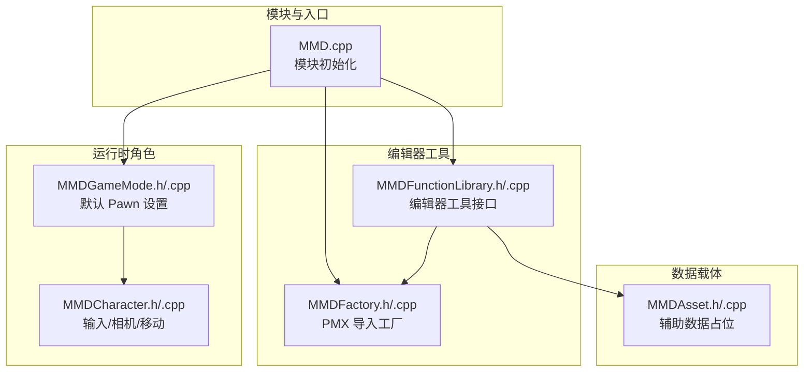
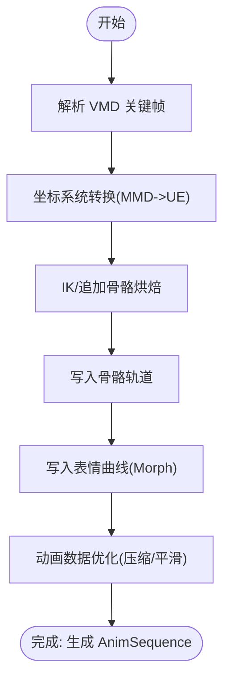
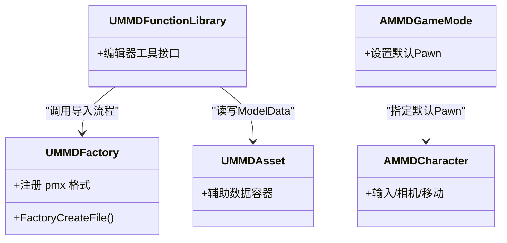

# 动画和 IK 系统

<cite>
**本文引用的文件**   
- [README.md](file://README.md)
- [MMD.cpp](file://MMD/Source/MMD/MMD.cpp)
- [MMDFactory.h](file://MMD/Source/MMD/MMDFactory.h)
- [MMDFactory.cpp](file://MMD/Source/MMD/MMDFactory.cpp)
- [MMDFunctionLibrary.h](file://MMD/Source/MMD/MMDFunctionLibrary.h)
- [MMDFunctionLibrary.cpp](file://MMD/Source/MMD/MMDFunctionLibrary.cpp)
- [MMDAsset.h](file://MMD/Source/MMD/MMDAsset.h)
- [MMDAsset.cpp](file://MMD/Source/MMD/MMDAsset.cpp)
- [MMDCharacter.h](file://MMD/Source/MMD/MMDCharacter.h)
- [MMDCharacter.cpp](file://MMD/Source/MMD/MMDCharacter.cpp)
- [MMDGameMode.h](file://MMD/Source/MMD/MMDGameMode.h)
- [MMDGameMode.cpp](file://MMD/Source/MMD/MMDGameMode.cpp)
</cite>

## 目录
1. [简介](#简介)
2. [项目结构](#项目结构)
3. [核心组件](#核心组件)
4. [架构总览](#架构总览)
5. [详细组件分析](#详细组件分析)
6. [依赖关系分析](#依赖关系分析)
7. [性能考量](#性能考量)
8. [故障排查指南](#故障排查指南)
9. [结论](#结论)
10. [附录](#附录)

## 简介
本文件面向动画师与程序员，系统化梳理 MMDUETools 的动画与 IK 体系：从 PMX/VMD 导入到 UE 原生资产（SkeletalMesh、Skeleton、MorphTarget、AnimSequence），再到运行时播放链路；并说明 AnimBlueprint 自动生成机制、IK Rig / IK Retargeter 生成流程、MMD Skeletal Control 节点的使用方式、骨骼轨道处理（坐标转换、追加骨骼烘焙）、表情系统与 MorphTarget 集成等。文档同时提供蓝图工作流建议与常见问题定位方法。

## 项目结构
插件在编辑器侧暴露导入能力，运行时通过 Character/GameMode 组织场景对象，并通过函数库与工厂类对接引擎工具链。核心路径如下：
- 模块入口与基础类型定义位于 Source/MMD 下
- 功能对外以 Editor Utility Library 形式暴露
- 资源导入由 Factory 扩展点注册



图示来源
- [MMD.cpp:1-7](file://MMD/Source/MMD/MMD.cpp#L1-L7)
- [MMDFunctionLibrary.h:1-18](file://MMD/Source/MMD/MMDFunctionLibrary.h#L1-L18)
- [MMDFactory.h:1-22](file://MMD/Source/MMD/MMDFactory.h#L1-L22)
- [MMDGameMode.h:1-20](file://MMD/Source/MMD/MMDGameMode.h#L1-L20)
- [MMDCharacter.h:1-73](file://MMD/Source/MMD/MMDCharacter.h#L1-L73)
- [MMDAsset.h:1-17](file://MMD/Source/MMD/MMDAsset.h#L1-L17)

章节来源
- [README.md:1-130](file://README.md#L1-L130)
- [MMD.cpp:1-7](file://MMD/Source/MMD/MMD.cpp#L1-L7)

## 核心组件
- 编辑器工具库：继承自 UEditorUtilityLibrary，用于承载导入面板与批量操作逻辑（如 PMX/VMD 导入、资产生成）。
- 工厂类：UMMDFactory 注册 pmx 格式，作为外部资源导入的扩展点。
- 运行时角色：AMMDCharacter 负责输入、相机与移动；AMMDGameMode 设置默认 Pawn。
- 数据载体：UMMDAsset 作为辅助数据的容器（例如 ModelData）。

章节来源
- [MMDFunctionLibrary.h:1-18](file://MMD/Source/MMD/MMDFunctionLibrary.h#L1-L18)
- [MMDFactory.h:1-22](file://MMD/Source/MMD/MMDFactory.h#L1-L22)
- [MMDCharacter.h:1-73](file://MMD/Source/MMD/MMDCharacter.h#L1-L73)
- [MMDGameMode.h:1-20](file://MMD/Source/MMD/MMDGameMode.h#L1-L20)
- [MMDAsset.h:1-17](file://MMD/Source/MMD/MMDAsset.h#L1-L17)

## 架构总览
下图展示从 PMX/VMD 到 UE 资产的端到端流程，以及运行时播放链路。

```mermaid
sequenceDiagram
participant User as "用户"
participant Panel as "编辑器面板(UMMDFunctionLibrary)"
participant Factory as "PMX 工厂(UMMDFactory)"
participant Assets as "生成的资产<br/>SkeletalMesh/Skeleton/MorphTarget/Actor/AnimBlueprint/IKRig/Retargeter"
participant Seq as "VMD 导入 -> AnimSequence"
participant Actor as "MMD Actor(含 AnimBP)"
participant Runtime as "运行时播放"
User->>Panel : "选择 PMX 并导入"
Panel->>Factory : "调用工厂创建流程"
Factory-->>Assets : "生成模型相关资产"
User->>Panel : "选择 VMD 并导入"
Panel->>Seq : "解析关键帧并写入序列"
Seq-->>Assets : "生成 AnimSequence(骨骼轨道+表情曲线)"
User->>Actor : "将 AnimSequence 分配给角色"
Actor->>Runtime : "播放 AnimSequence"
Runtime-->>User : "看到骨骼动作/表情/位移"
```

图示来源
- [README.md:1-130](file://README.md#L1-L130)
- [MMDFunctionLibrary.h:1-18](file://MMD/Source/MMD/MMDFunctionLibrary.h#L1-L18)
- [MMDFactory.h:1-22](file://MMD/Source/MMD/MMDFactory.h#L1-L22)

## 详细组件分析

### AnimBlueprint 自动生成机制
- 目标：为每个导入的 MMD 角色自动创建 AnimBlueprint，使其可直接驱动骨骼与表情。
- 产出：包含基础骨架图、MMD Skeletal Control 节点接入点、MorphTarget 曲线映射入口。
- 配置要点：
  - 骨架源：使用生成的 Skeleton 作为根骨架。
  - 自定义节点：引入 MMD Skeletal Control 节点以桥接 MMD 控制语义。
  - 表情通道：将 MorphTarget 映射到 AnimGraph 中的对应曲线或属性。
- 兼容性：不同模型的骨骼命名差异可通过 IK Retargeter 进行统一映射。

章节来源
- [README.md:53-67](file://README.md#L53-L67)
- [README.md:112-118](file://README.md#L112-L118)

### IK Rig 与 IK Retargeter 生成流程
- 目标：基于 PMX 骨骼拓扑构建 IK Rig，并生成 IK Retargeter 以适配不同模型。
- 反向动力学设置：
  - 末端效应器：根据脚部、手部等末端骨骼建立目标。
  - 约束链：按肢体层级建立 Chain 与 Aim 约束。
  - 地面接触：对足部添加 Foot IK 与地面对齐。
- 骨骼重定向：
  - 源骨架：PMX 导出骨架。
  - 目标骨架：UE 标准骨架或项目骨架。
  - 映射规则：按名称/层级匹配，必要时手动修正。
- 兼容性处理：
  - 特殊骨骼名与额外 IK 链需逐一核对。
  - 针对缺失或多余骨骼，可在 Retargeter 中增删映射条目。

章节来源
- [README.md:53-67](file://README.md#L53-L67)
- [README.md:112-118](file://README.md#L112-L118)

### MMD Skeletal Control 动画节点
- 作用：在 AnimGraph 中以节点形式表达 MMD 特有的控制语义（如头部跟随、手臂摆动幅度、附加 IK 等）。
- 使用方法：
  - 在 AnimBlueprint 中添加该节点，并绑定目标骨骼与参数。
  - 将节点输出合并到最终 Pose，确保不覆盖必要的基础动画。
  - 与 IK Retargeter 配合，使不同模型的肢体行为一致。
- 注意事项：
  - 避免与基础动画产生冲突，合理设置权重与优先级。
  - 对复杂模型，逐步调试各关节范围与限制。

章节来源
- [README.md:112-118](file://README.md#L112-L118)

### 骨骼动画轨道处理流程
- 输入：VMD 骨骼关键帧与 Morph 关键帧。
- 处理步骤：
  - 坐标系转换：将 MMD 坐标转换为 UE 渲染坐标。
  - 轨道写入：为每根骨骼创建位置/旋转/缩放轨道。
  - 追加骨骼烘焙：对 MMD 追加骨骼（如 IK 链）进行预计算，确保结果稳定可播。
  - 表达式优化：压缩关键帧、平滑过渡、剔除冗余帧。
- 输出：AnimSequence，包含骨骼轨道与表情曲线。



图示来源
- [README.md:105-110](file://README.md#L105-L110)

### 表情系统与 MorphTarget 集成
- 模型侧：PMX vertex morph 导入为 UE MorphTarget，修正顶点映射以避免扭曲。
- 动画侧：VMD 表情写入 AnimSequence 的 float curves，支持 Group/Flip Morph 展开。
- 播放侧：AnimGraph 读取曲线并驱动 MorphTarget，实现眨眼、嘴型、眉毛等表情变化。

章节来源
- [README.md:98-104](file://README.md#L98-L104)
- [README.md:105-110](file://README.md#L105-L110)

### 蓝图节点使用示例与工作流指导
- 导入 PMX：
  - 打开插件面板，点击“导入模型”，选择 .pmx 文件。
  - 检查生成的 SkeletalMesh、Skeleton、MorphTarget、Actor、AnimBlueprint、IK Rig/Retargeter。
- 导入 VMD：
  - 选中已导入的角色或 SkeletalMesh，点击“导入 VMD 动画”，选择 .vmd 文件。
  - 若场景中存在对应角色，插件会尝试直接播放。
- 播放与验证：
  - 确认身体骨骼动作、root/center 位移、眨眼、嘴型、眉毛与表情变化正常。
- 自定义动画逻辑：
  - 在 AnimBlueprint 中插入 MMD Skeletal Control 节点，调整参数与权重。
  - 结合 IK Retargeter 保证多模型一致性。

章节来源
- [README.md:43-88](file://README.md#L43-L88)
- [README.md:112-118](file://README.md#L112-L118)

## 依赖关系分析
- 模块层：MMD.cpp 初始化游戏模块，加载插件所需子系统。
- 编辑器层：UMMDFunctionLibrary 提供编辑器工具接口；UMMDFactory 注册 pmx 导入。
- 运行层：AMMDGameMode 设置默认 Pawn；AMMDCharacter 处理输入与相机。
- 数据层：UMMDAsset 承载辅助数据（如 ModelData）。



图示来源
- [MMDFunctionLibrary.h:1-18](file://MMD/Source/MMD/MMDFunctionLibrary.h#L1-L18)
- [MMDFactory.h:1-22](file://MMD/Source/MMD/MMDFactory.h#L1-L22)
- [MMDGameMode.h:1-20](file://MMD/Source/MMD/MMDGameMode.h#L1-L20)
- [MMDCharacter.h:1-73](file://MMD/Source/MMD/MMDCharacter.h#L1-L73)
- [MMDAsset.h:1-17](file://MMD/Source/MMD/MMDAsset.h#L1-L17)

章节来源
- [MMD.cpp:1-7](file://MMD/Source/MMD/MMD.cpp#L1-L7)
- [MMDFunctionLibrary.h:1-18](file://MMD/Source/MMD/MMDFunctionLibrary.h#L1-L18)
- [MMDFactory.h:1-22](file://MMD/Source/MMD/MMDFactory.h#L1-L22)
- [MMDGameMode.h:1-20](file://MMD/Source/MMD/MMDGameMode.h#L1-L20)
- [MMDCharacter.h:1-73](file://MMD/Source/MMD/MMDCharacter.h#L1-L73)
- [MMDAsset.h:1-17](file://MMD/Source/MMD/MMDAsset.h#L1-L17)

## 性能考量
- 动画数据优化：压缩关键帧、减少冗余帧、平滑过渡以降低内存与带宽占用。
- IK 烘焙：对追加骨骼进行离线烘焙，避免运行时重复计算。
- 表情曲线：合并相近曲线、降低采样率以提升播放效率。
- 资源管理：按需加载 AnimSequence 与 MorphTarget，避免一次性载入过多资源。

[本节为通用指导，无需源码引用]

## 故障排查指南
- 导入后无角色或资产缺失：
  - 确认插件已启用且面板可用。
  - 检查生成的 SkeletalMesh/Skeleton/Actor/AnimBlueprint 是否存在。
- 表情异常或扭曲：
  - 检查 MorphTarget 映射是否正确，Group/Flip Morph 是否展开。
- 动画播放不完整或缺失部位：
  - 核对 IK Retargeter 映射，确认所有关键骨骼均已映射。
  - 检查追加骨骼烘焙是否成功。
- 坐标方向错误：
  - 确认 MMD 到 UE 的坐标转换是否生效。

章节来源
- [README.md:98-110](file://README.md#L98-L110)
- [README.md:112-130](file://README.md#L112-L130)

## 结论
MMDUETools 将 MMD 生态的 PMX/VMD 完整迁移至 UE 原生管线，提供一键式资产生成与播放体验。通过 AnimBlueprint 自动生成、IK Rig/Retargeter 重定向、MMD Skeletal Control 节点与 MorphTarget 集成，动画师与程序员可在统一工作流中高效协作。后续可继续完善 Material Morph 驱动、Bone/UV Morph 通道与更多模型的兼容适配。

[本节为总结性内容，无需源码引用]

## 附录
- 快速参考
  - PMX 导入产物：SkeletalMesh、Skeleton、MorphTarget、材质、Actor、AnimBlueprint、IK Rig/Retargeter、ModelData。
  - VMD 导入产物：AnimSequence（骨骼轨道 + 表情曲线）。
  - 运行时效果：骨骼动作、root/center 位移、眨眼、嘴型、表情变化。

章节来源
- [README.md:53-88](file://README.md#L53-L88)
- [README.md:105-110](file://README.md#L105-L110)