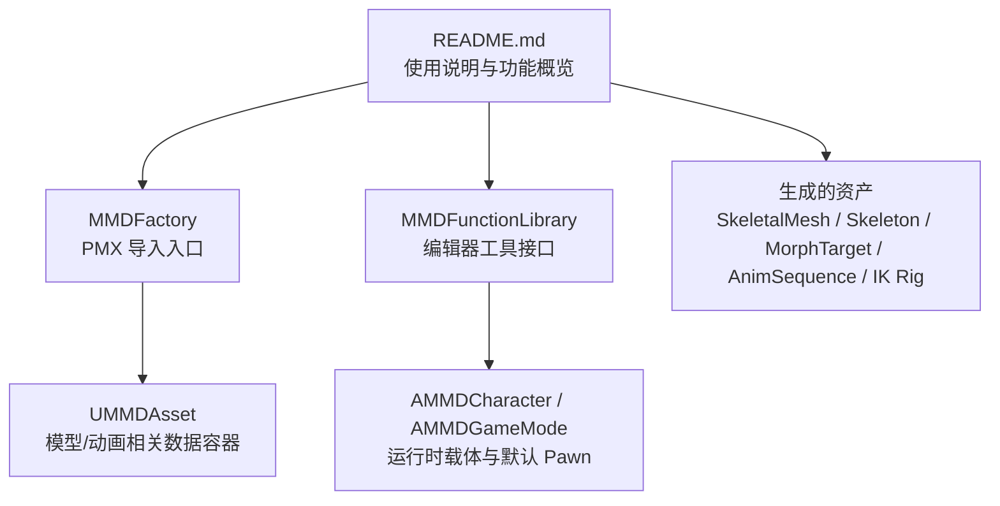
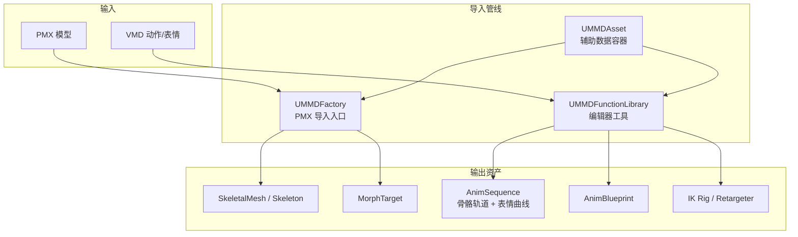
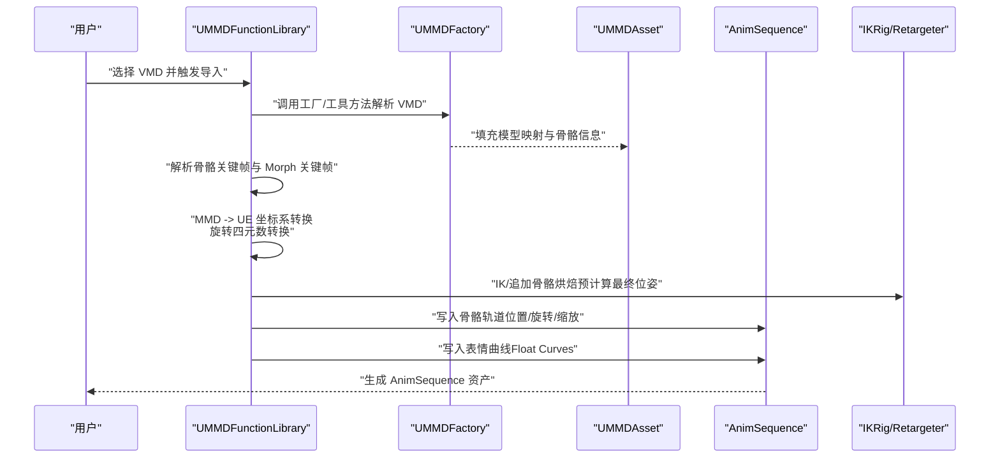
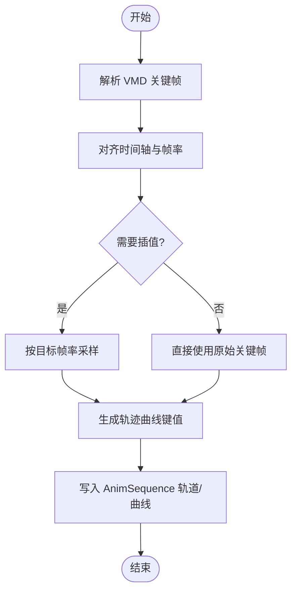
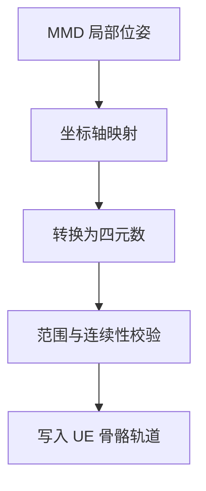
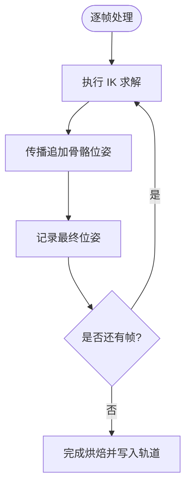
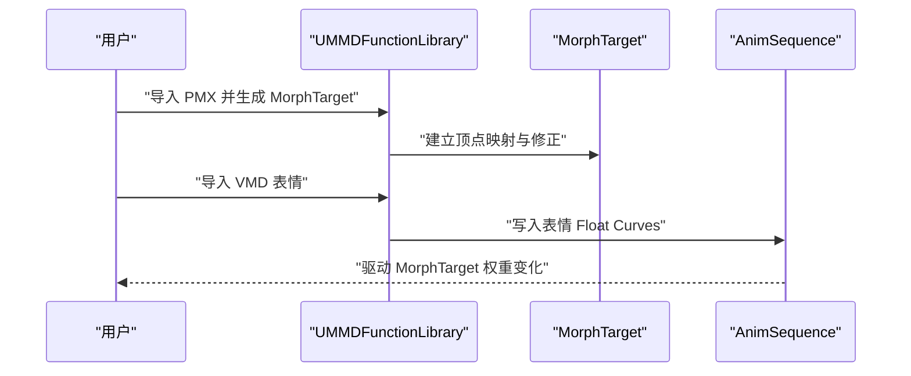
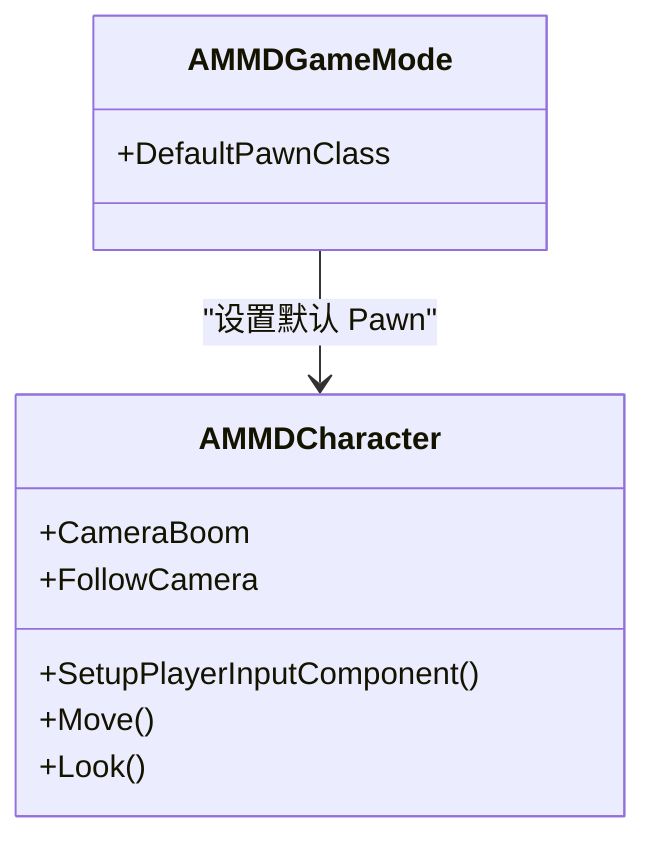
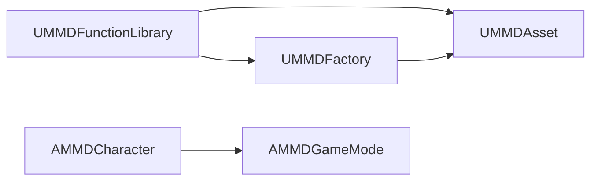

# 骨骼动画处理

<cite>
**本文引用的文件**   
- [README.md](file://README.md)
- [MMDAsset.h](file://MMD/Source/MMD/MMDAsset.h)
- [MMDAsset.cpp](file://MMD/Source/MMD/MMDAsset.cpp)
- [MMDFactory.h](file://MMD/Source/MMD/MMDFactory.h)
- [MMDFactory.cpp](file://MMD/Source/MMD/MMDFactory.cpp)
- [MMDFunctionLibrary.h](file://MMD/Source/MMD/MMDFunctionLibrary.h)
- [MMDFunctionLibrary.cpp](file://MMD/Source/MMD/MMDFunctionLibrary.cpp)
- [MMDCharacter.h](file://MMD/Source/MMD/MMDCharacter.h)
- [MMDCharacter.cpp](file://MMD/Source/MMD/MMDCharacter.cpp)
- [MMDGameMode.h](file://MMD/Source/MMD/MMDGameMode.h)
- [MMDGameMode.cpp](file://MMD/Source/MMD/MMDGameMode.cpp)
</cite>

## 目录
1. [简介](#简介)
2. [项目结构](#项目结构)
3. [核心组件](#核心组件)
4. [架构总览](#架构总览)
5. [详细组件分析](#详细组件分析)
6. [依赖关系分析](#依赖关系分析)
7. [性能与内存优化](#性能与内存优化)
8. [故障排查指南](#故障排查指南)
9. [结论](#结论)
10. [附录](#附录)

## 简介
本文件面向 MMDUETools 的“骨骼动画处理系统”，聚焦于将 VMD 动画数据转换为 UE AnimSequence 的完整流程，包括关键帧插值、轨迹曲线生成、时间轴处理、坐标系统与旋转四元数转换、IK 追加骨骼烘焙、表情 MorphTarget 集成、压缩与优化策略、以及验证与调试方法。文档同时给出代码级架构图与时序图，帮助读者快速理解从 PMX/VMD 到 UE 原生资产的端到端路径。

## 项目结构
仓库采用插件化组织方式，核心 C++ 模块位于 MMD/Source/MMD，包含工厂类、函数库、角色与游戏模式等基础骨架；README 提供了导入 PMX 与 VMD 的高层流程说明，并指出会生成 SkeletalMesh/Skeleton、MorphTarget、AnimBlueprint、IK Rig/Retargeter 等资产。

图示来源
- [README.md:1-130](file://README.md#L1-L130)
- [MMDFactory.h:12-22](file://MMD/Source/MMD/MMDFactory.h#L12-L22)
- [MMDFunctionLibrary.h:12-18](file://MMD/Source/MMD/MMDFunctionLibrary.h#L12-L18)
- [MMDAsset.h:12-17](file://MMD/Source/MMD/MMDAsset.h#L12-L17)
- [MMDCharacter.h:18-21](file://MMD/Source/MMD/MMDCharacter.h#L18-L21)
- [MMDGameMode.h:9-16](file://MMD/Source/MMD/MMDGameMode.h#L9-L16)

章节来源
- [README.md:1-130](file://README.md#L1-L130)

## 核心组件
- 工厂类（PMX 导入）：负责注册文件格式与创建对象，作为 PMX 导入的入口点。
- 函数库（编辑器工具）：提供编辑器侧可调用的工具方法，用于驱动导入流程与后续操作。
- 资源容器（UMMDAsset）：承载与 MMD 相关的辅助数据，便于在导入管线中传递。
- 运行时载体（AMMDCharacter / AMMDGameMode）：提供角色与游戏模式的基类，便于挂载 SkeletalMesh 与 AnimBlueprint 进行播放。

章节来源
- [MMDFactory.h:12-22](file://MMD/Source/MMD/MMDFactory.h#L12-L22)
- [MMDFactory.cpp:6-14](file://MMD/Source/MMD/MMDFactory.cpp#L6-L14)
- [MMDFunctionLibrary.h:12-18](file://MMD/Source/MMD/MMDFunctionLibrary.h#L12-L18)
- [MMDAsset.h:12-17](file://MMD/Source/MMD/MMDAsset.h#L12-L17)
- [MMDCharacter.h:18-21](file://MMD/Source/MMD/MMDCharacter.h#L18-L21)
- [MMDGameMode.h:9-16](file://MMD/Source/MMD/MMDGameMode.h#L9-L16)

## 架构总览
下图展示了从 PMX/VMD 到 UE 资产的总体流程，涵盖模型与动画两条主线，以及 IK 重定向与表情驱动的集成点。

图示来源
- [README.md:91-110](file://README.md#L91-L110)
- [MMDFactory.h:12-22](file://MMD/Source/MMD/MMDFactory.h#L12-L22)
- [MMDFunctionLibrary.h:12-18](file://MMD/Source/MMD/MMDFunctionLibrary.h#L12-L18)
- [MMDAsset.h:12-17](file://MMD/Source/MMD/MMDAsset.h#L12-L17)

## 详细组件分析

### VMD 到 AnimSequence 的转换流程
该流程解析 VMD 中的骨骼关键帧与 Morph 关键帧，完成坐标系转换与 IK/追加骨骼烘焙后，写入 UE AnimSequence 的骨骼轨道与表情曲线。

图示来源
- [README.md:105-110](file://README.md#L105-L110)
- [MMDFunctionLibrary.h:12-18](file://MMD/Source/MMD/MMDFunctionLibrary.h#L12-L18)
- [MMDFactory.h:12-22](file://MMD/Source/MMD/MMDFactory.h#L12-L22)
- [MMDAsset.h:12-17](file://MMD/Source/MMD/MMDAsset.h#L12-L17)

章节来源
- [README.md:105-110](file://README.md#L105-L110)

### 关键帧插值与轨迹曲线生成
- 关键帧插值：对骨骼位移、旋转、缩放分别进行采样与插值，确保在目标帧率下平滑过渡。
- 轨迹曲线生成：为每个骨骼通道生成对应的曲线键值，表情则通过 Float Curves 表达。
- 时间轴处理：统一时间单位与帧率，对齐 VMD 时间戳与 UE 时间线，必要时进行重采样。

图示来源
- [README.md:105-110](file://README.md#L105-L110)

章节来源
- [README.md:105-110](file://README.md#L105-L110)

### 坐标系统与旋转四元数转换
- 差异处理：MMD 与 UE 的轴向约定不同，需在导入阶段进行坐标轴映射与方向修正。
- 旋转表示：将 MMD 的旋转表示转换为 UE 的四元数，避免万向节锁与插值异常。
- 一致性校验：在写入骨骼轨道前进行数值范围与连续性检查，防止跳变。

图示来源
- [README.md:105-110](file://README.md#L105-L110)

章节来源
- [README.md:105-110](file://README.md#L105-L110)

### IK 追加骨骼的烘焙过程
- 目的：将 IK 解算结果与追加骨骼的最终位姿烘焙为静态关键帧，简化运行时计算。
- 步骤：遍历每帧，执行 IK 求解与追加骨骼传播，记录最终世界/局部位姿，写入 AnimSequence。
- 影响：提升播放性能，减少运行时 IK 开销，但会增加关键帧数量与内存占用。

图示来源
- [README.md:105-110](file://README.md#L105-L110)

章节来源
- [README.md:105-110](file://README.md#L105-L110)

### 表情动画与 MorphTarget 集成
- 顶点变形：PMX vertex morph 导入为 UE MorphTarget，修正顶点映射以避免表情扭曲。
- 动画驱动：VMD 表情关键帧写入 AnimSequence 的 Float Curves，驱动 MorphTarget 权重。
- Group/Flip 展开：支持组合与翻转 Morph 的展开，使嘴型与眨眼等细节正常播放。

图示来源
- [README.md:98-104](file://README.md#L98-L104)
- [README.md:105-110](file://README.md#L105-L110)

章节来源
- [README.md:98-104](file://README.md#L98-L104)
- [README.md:105-110](file://README.md#L105-L110)

### 运行时播放与绑定
- 角色载体：AMMDCharacter 提供相机与输入框架，可作为挂载 SkeletalMesh 与 AnimBlueprint 的载体。
- 游戏模式：AMMDGameMode 设置默认 Pawn，便于场景启动时自动加载角色。
- 播放链路：AnimSequence 播放驱动骨骼动作与表情曲线，结合 IK 重定向实现预期效果。

图示来源
- [MMDCharacter.h:18-21](file://MMD/Source/MMD/MMDCharacter.h#L18-L21)
- [MMDGameMode.h:9-16](file://MMD/Source/MMD/MMDGameMode.h#L9-L16)

章节来源
- [MMDCharacter.h:18-21](file://MMD/Source/MMD/MMDCharacter.h#L18-L21)
- [MMDGameMode.h:9-16](file://MMD/Source/MMD/MMDGameMode.h#L9-L16)

## 依赖关系分析
- 工厂与函数库：UMMDFactory 负责 PMX 导入入口，UMMDFunctionLibrary 提供编辑器工具方法，二者共同驱动导入与生成流程。
- 资源容器：UMMDAsset 作为数据载体，贯穿导入管线，便于在不同阶段共享模型与动画信息。
- 运行时：AMMDCharacter 与 AMMDGameMode 提供运行时的角色与游戏模式基础，配合生成的 AnimSequence 与 IK 资产进行播放。

图示来源
- [MMDFactory.h:12-22](file://MMD/Source/MMD/MMDFactory.h#L12-L22)
- [MMDFunctionLibrary.h:12-18](file://MMD/Source/MMD/MMDFunctionLibrary.h#L12-L18)
- [MMDAsset.h:12-17](file://MMD/Source/MMD/MMDAsset.h#L12-L17)
- [MMDCharacter.h:18-21](file://MMD/Source/MMD/MMDCharacter.h#L18-L21)
- [MMDGameMode.h:9-16](file://MMD/Source/MMD/MMDGameMode.h#L9-L16)

章节来源
- [MMDFactory.h:12-22](file://MMD/Source/MMD/MMDFactory.h#L12-L22)
- [MMDFunctionLibrary.h:12-18](file://MMD/Source/MMD/MMDFunctionLibrary.h#L12-L18)
- [MMDAsset.h:12-17](file://MMD/Source/MMD/MMDAsset.h#L12-L17)
- [MMDCharacter.h:18-21](file://MMD/Source/MMD/MMDCharacter.h#L18-L21)
- [MMDGameMode.h:9-16](file://MMD/Source/MMD/MMDGameMode.h#L9-L16)

## 性能与内存优化
- 动画压缩：启用 UE 的动画压缩选项（如量化、删除冗余关键帧、曲线合并），降低内存占用与带宽。
- 关键帧精简：对低变化区域进行阈值过滤，减少不必要的键值。
- 曲线优化：合并相近曲线、限制精度，平衡质量与性能。
- 烘焙策略：仅在必要时开启 IK/追加骨骼烘焙，控制关键帧数量。
- 内存管理：按需加载 AnimSequence，避免一次性载入大量动画；使用对象池复用临时数据结构。

[本节为通用指导，不直接分析具体文件]

## 故障排查指南
- 导入失败：检查 PMX/VMD 文件路径与权限，确认工厂与函数库已正确注册。
- 坐标异常：核对坐标轴映射与四元数转换逻辑，确保 MMD 与 UE 轴向一致。
- 表情失真：验证 MorphTarget 顶点映射是否正确，Group/Flip Morph 是否展开。
- 播放卡顿：评估 IK 烘焙规模与动画压缩设置，调整关键帧密度与曲线精度。
- 日志定位：利用引擎日志与编辑器输出，定位导入与播放阶段的错误信息。

章节来源
- [README.md:125-130](file://README.md#L125-L130)

## 结论
MMDUETools 通过工厂与函数库协同工作，将 PMX 与 VMD 数据高效转换为 UE 原生资产，实现了骨骼动画与表情驱动的完整链路。通过合理的坐标转换、IK 烘焙与动画优化策略，可在保证视觉效果的同时兼顾性能与内存占用。建议在实际项目中结合具体模型与需求，持续完善导入适配与调试工具。

[本节为总结性内容，不直接分析具体文件]

## 附录
- 术语表
  - VMD：MikuMikuDance 动画格式，包含骨骼与表情关键帧。
  - PMX：MMD 模型格式，包含网格、材质、骨骼与形态等信息。
  - AnimSequence：UE 的骨骼动画资产，包含轨道与曲线。
  - MorphTarget：UE 的顶点形变资产，常用于表情驱动。
  - IK：反向动力学，用于约束末端骨骼达到目标位置。

[本节为概念性内容，不直接分析具体文件]