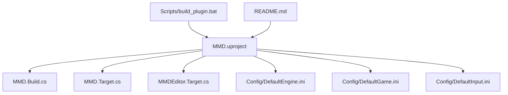
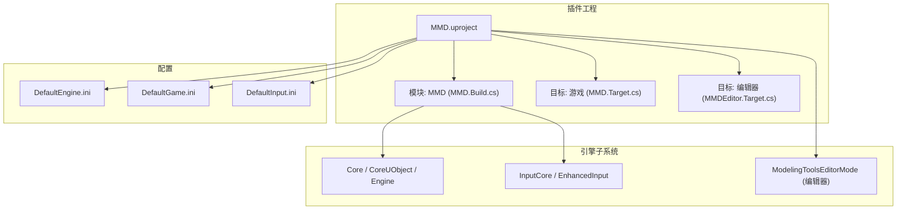
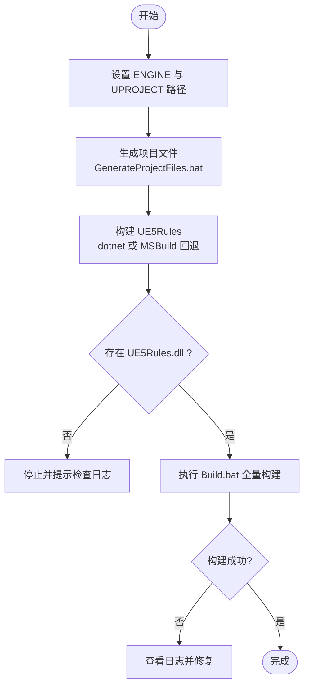
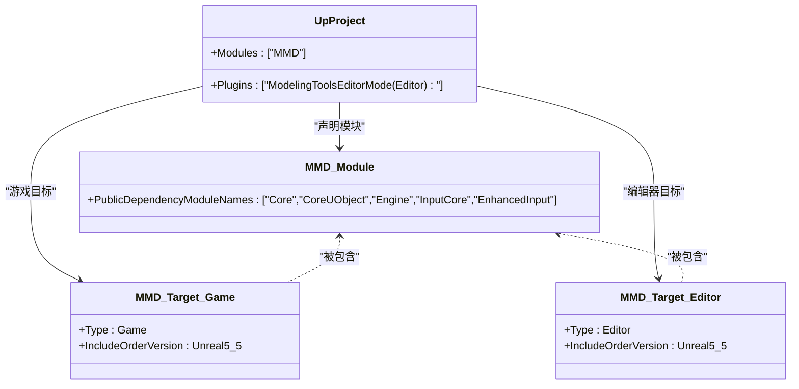

# 安装和配置

<cite>
**本文引用的文件列表**
- [README.md](file://README.md)
- [MMD.uproject](file://MMD/MMD.uproject)
- [DefaultEngine.ini](file://MMD/Config/DefaultEngine.ini)
- [DefaultGame.ini](file://MMD/Config/DefaultGame.ini)
- [DefaultInput.ini](file://MMD/Config/DefaultInput.ini)
- [build_plugin.bat](file://MMD/Scripts/build_plugin.bat)
- [MMD.Build.cs](file://MMD/Source/MMD/MMD.Build.cs)
- [MMD.Target.cs](file://MMD/Source/MMD.Target.cs)
- [MMDEditor.Target.cs](file://MMD/Source/MMDEditor.Target.cs)
</cite>

## 目录
1. [简介](#简介)
2. [项目结构](#项目结构)
3. [核心组件](#核心组件)
4. [架构总览](#架构总览)
5. [详细组件分析](#详细组件分析)
6. [依赖关系分析](#依赖关系分析)
7. [性能与渲染注意事项](#性能与渲染注意事项)
8. [故障排查指南](#故障排查指南)
9. [结论](#结论)
10. [附录：构建脚本使用与自定义](#附录构建脚本使用与自定义)

## 简介
本指南面向不同经验水平的用户，提供 MMDUETools 插件在 Unreal Engine 5.5 环境下的完整安装、启用与配置说明。内容涵盖：
- 插件下载与放置位置
- 在编辑器中启用插件的步骤
- 环境要求与依赖项（含 UE 版本兼容性）
- 配置文件作用与可定制选项（引擎渲染、游戏设置、输入映射）
- 构建脚本使用方法与自定义流程
- 常见问题诊断与解决方案（如插件加载失败、版本不兼容等）

## 项目结构
仓库包含一个可直接作为插件使用的工程示例，以及配套的构建脚本与配置文件。关键路径如下：
- 插件工程入口：MMD.uproject
- 运行时模块定义：MMD.Build.cs
- 目标规则（游戏/编辑器）：MMD.Target.cs、MMDEditor.Target.cs
- 默认配置：Config/DefaultEngine.ini、DefaultGame.ini、DefaultInput.ini
- 自动化构建脚本：Scripts/build_plugin.bat
- 使用说明与演示：README.md

图示来源
- [MMD.uproject:1-27](file://MMD/MMD.uproject#L1-L27)
- [MMD.Build.cs:1-15](file://MMD/Source/MMD/MMD.Build.cs#L1-L15)
- [MMD.Target.cs:1-16](file://MMD/Source/MMD.Target.cs#L1-L16)
- [MMDEditor.Target.cs:1-16](file://MMD/Source/MMDEditor.Target.cs#L1-L16)
- [DefaultEngine.ini:1-84](file://MMD/Config/DefaultEngine.ini#L1-L84)
- [DefaultGame.ini:1-11](file://MMD/Config/DefaultGame.ini#L1-L11)
- [DefaultInput.ini:1-87](file://MMD/Config/DefaultInput.ini#L1-L87)
- [build_plugin.bat:1-56](file://MMD/Scripts/build_plugin.bat#L1-L56)
- [README.md:1-130](file://README.md#L1-L130)

章节来源
- [README.md:23-41](file://README.md#L23-L41)
- [MMD.uproject:1-27](file://MMD/MMD.uproject#L1-L27)

## 核心组件
- 插件工程与模块
  - uproject 声明了模块名、类型、加载阶段及额外依赖；同时启用了建模工具编辑器模式插件（仅编辑器）。
  - 模块构建规则定义了公共依赖模块（Core、CoreUObject、Engine、InputCore、EnhancedInput）。
- 目标规则
  - 游戏与编辑器目标均指定 IncludeOrderVersion 为 Unreal5_5，确保与 UE 5.5 的包含顺序一致。
- 配置文件
  - DefaultEngine.ini：默认地图、全局 GameMode、渲染开关、平台 RHI 设置、类重定向等。
  - DefaultGame.ini：项目基础信息与启动动作（例如自动添加 StarterContent）。
  - DefaultInput.ini：轴映射与增强输入相关设置。

章节来源
- [MMD.uproject:1-27](file://MMD/MMD.uproject#L1-L27)
- [MMD.Build.cs:1-15](file://MMD/Source/MMD/MMD.Build.cs#L1-L15)
- [MMD.Target.cs:1-16](file://MMD/Source/MMD.Target.cs#L1-L16)
- [MMDEditor.Target.cs:1-16](file://MMD/Source/MMDEditor.Target.cs#L1-L16)
- [DefaultEngine.ini:1-84](file://MMD/Config/DefaultEngine.ini#L1-L84)
- [DefaultGame.ini:1-11](file://MMD/Config/DefaultGame.ini#L1-L11)
- [DefaultInput.ini:1-87](file://MMD/Config/DefaultInput.ini#L1-L87)

## 架构总览
下图展示了插件在 UE 中的基本构成与依赖关系：uproject 驱动模块加载，模块通过构建规则引入引擎子系统，配置文件影响运行期行为与编辑器体验。

图示来源
- [MMD.uproject:1-27](file://MMD/MMD.uproject#L1-L27)
- [MMD.Build.cs:1-15](file://MMD/Source/MMD/MMD.Build.cs#L1-L15)
- [MMD.Target.cs:1-16](file://MMD/Source/MMD.Target.cs#L1-L16)
- [MMDEditor.Target.cs:1-16](file://MMD/Source/MMDEditor.Target.cs#L1-L16)
- [DefaultEngine.ini:1-84](file://MMD/Config/DefaultEngine.ini#L1-L84)
- [DefaultGame.ini:1-11](file://MMD/Config/DefaultGame.ini#L1-L11)
- [DefaultInput.ini:1-87](file://MMD/Config/DefaultInput.ini#L1-L87)

## 详细组件分析

### 插件安装与启用步骤
- 下载插件
  - 从仓库获取插件源码或发行包。
- 放置到项目 Plugins 目录
  - 将插件目录放入你的 UE 项目的 Plugins 文件夹下，保持层级清晰。
- 在编辑器中启用插件
  - 打开 UE5，进入“插件”面板，找到并启用该插件。
- 验证导入功能
  - 打开插件面板，执行 PMX/VMD 导入流程，确认资产生成与播放正常。

章节来源
- [README.md:23-41](file://README.md#L23-L41)
- [README.md:37-51](file://README.md#L37-L51)

### 环境要求与依赖项
- 引擎版本
  - 插件工程关联的引擎版本为 5.5，目标规则也指定了 Unreal5_5 的包含顺序。
- 模块依赖
  - 运行时模块依赖 Core、CoreUObject、Engine、InputCore、EnhancedInput。
- 编辑器依赖
  - 启用 ModelingToolsEditorMode（仅编辑器），用于建模工具编辑模式。
- 平台与图形 API
  - Windows 默认使用 DX12；Linux 目标包含 Vulkan SM6 支持。

章节来源
- [MMD.uproject:1-27](file://MMD/MMD.uproject#L1-L27)
- [MMD.Build.cs:1-15](file://MMD/Source/MMD/MMD.Build.cs#L1-L15)
- [MMD.Target.cs:1-16](file://MMD/Source/MMD.Target.cs#L1-L16)
- [MMDEditor.Target.cs:1-16](file://MMD/Source/MMDEditor.Target.cs#L1-L16)
- [DefaultEngine.ini:24-31](file://MMD/Config/DefaultEngine.ini#L24-L31)
- [DefaultEngine.ini:54-57](file://MMD/Config/DefaultEngine.ini#L54-L57)

### 配置文件说明与自定义选项

#### DefaultEngine.ini（引擎渲染与运行配置）
- 默认地图与 GameMode
  - 设置默认关卡与全局 GameMode，便于快速启动。
- 渲染特性开关
  - 反射方法、距离场生成、动态全局光照、阴影虚拟化、光线追踪等开关。
- 平台 RHI 与编译器
  - Windows 默认 DX12，着色器格式与编译器选择。
- 类重定向
  - 将旧模板类重定向至当前插件提供的类，保证升级与迁移兼容。

章节来源
- [DefaultEngine.ini:1-14](file://MMD/Config/DefaultEngine.ini#L1-L14)
- [DefaultEngine.ini:24-31](file://MMD/Config/DefaultEngine.ini#L24-L31)
- [DefaultEngine.ini:64-68](file://MMD/Config/DefaultEngine.ini#L64-L68)

#### DefaultGame.ini（游戏特定设置）
- 项目标识与名称
  - 定义项目 ID 与项目名称。
- 启动动作
  - 自动添加 StarterContent 包，便于快速预览。

章节来源
- [DefaultGame.ini:1-11](file://MMD/Config/DefaultGame.ini#L1-L11)

#### DefaultInput.ini（输入映射）
- 轴映射
  - 鼠标、手柄、VR 控制器等设备的轴映射与灵敏度、死区等参数。
- 增强输入
  - 默认 PlayerInput 与 InputComponent 类指向增强输入系统。
- 控制台键
  - 控制台快捷键配置。

章节来源
- [DefaultInput.ini:1-87](file://MMD/Config/DefaultInput.ini#L1-L87)

### 构建脚本使用方法与自定义流程
- 脚本用途
  - 自动化生成项目文件、构建 UE5Rules、然后执行完整构建。
- 前置准备
  - 修改脚本顶部的 ENGINE 与 UPROJECT 变量以匹配本机路径。
  - 确保已安装 VS 2022 开发工具链（dotnet 与 MSBuild）。
- 执行步骤
  - 双击运行 build_plugin.bat，观察控制台输出与日志文件。
  - 若 RULES 缺失，脚本会尝试 dotnet 与 MSBuild 回退方案。
  - 最终调用 Build.bat 进行全量构建。
- 日志定位
  - 构建日志写入同目录下的 build_plugin.log，便于问题回溯。

图示来源
- [build_plugin.bat:1-56](file://MMD/Scripts/build_plugin.bat#L1-L56)

章节来源
- [build_plugin.bat:1-56](file://MMD/Scripts/build_plugin.bat#L1-L56)

## 依赖关系分析
- 模块依赖
  - 模块公开依赖包括 Core、CoreUObject、Engine、InputCore、EnhancedInput。
- 目标规则
  - 游戏与编辑器目标均使用 V5 构建设置与 Unreal5_5 包含顺序。
- 插件依赖
  - 编辑器模式下启用 ModelingToolsEditorMode。

图示来源
- [MMD.Build.cs:1-15](file://MMD/Source/MMD/MMD.Build.cs#L1-L15)
- [MMD.Target.cs:1-16](file://MMD/Source/MMD.Target.cs#L1-L16)
- [MMDEditor.Target.cs:1-16](file://MMD/Source/MMDEditor.Target.cs#L1-L16)
- [MMD.uproject:1-27](file://MMD/MMD.uproject#L1-L27)

章节来源
- [MMD.Build.cs:1-15](file://MMD/Source/MMD/MMD.Build.cs#L1-L15)
- [MMD.Target.cs:1-16](file://MMD/Source/MMD.Target.cs#L1-L16)
- [MMDEditor.Target.cs:1-16](file://MMD/Source/MMDEditor.Target.cs#L1-L16)
- [MMD.uproject:1-27](file://MMD/MMD.uproject#L1-L27)

## 性能与渲染注意事项
- 渲染特性
  - 默认开启距离场生成、动态全局光照、虚拟阴影与光线追踪等，可根据硬件能力调整。
- 平台差异
  - Windows 默认 DX12；Linux 目标包含 Vulkan SM6，需确保驱动与 SDK 满足要求。
- 建议
  - 在低配设备上可关闭部分高级特性以提升稳定性与帧率。
  - 针对 VR/移动端场景，按需裁剪输入与渲染设置。

章节来源
- [DefaultEngine.ini:6-23](file://MMD/Config/DefaultEngine.ini#L6-L23)
- [DefaultEngine.ini:24-31](file://MMD/Config/DefaultEngine.ini#L24-L31)
- [DefaultEngine.ini:54-57](file://MMD/Config/DefaultEngine.ini#L54-L57)

## 故障排查指南
- 插件未显示或未启用
  - 确认插件目录位于项目 Plugins 目录下且层级正确。
  - 在编辑器“插件”面板中手动启用。
- 版本不兼容
  - 检查 uproject 的引擎关联是否与你安装的 UE 5.5 一致。
  - 目标规则中的 IncludeOrderVersion 应与引擎版本匹配。
- 构建失败（RULES 缺失）
  - 检查脚本中的 ENGINE 与 UPROJECT 路径是否正确。
  - 确认已安装 VS 2022 开发工具链，dotnet 与 MSBuild 可用。
  - 查看 build_plugin.log 定位具体错误。
- 运行时异常或崩溃
  - 检查 DefaultEngine.ini 的渲染开关是否与硬件能力匹配。
  - 确认类重定向与默认 GameMode 设置是否符合预期。
- 输入无响应
  - 核对 DefaultInput.ini 的轴映射与增强输入设置。
  - 确认设备连接与驱动状态。

章节来源
- [README.md:23-41](file://README.md#L23-L41)
- [MMD.uproject:1-27](file://MMD/MMD.uproject#L1-L27)
- [MMD.Target.cs:1-16](file://MMD/Source/MMD.Target.cs#L1-L16)
- [MMDEditor.Target.cs:1-16](file://MMD/Source/MMDEditor.Target.cs#L1-L16)
- [build_plugin.bat:1-56](file://MMD/Scripts/build_plugin.bat#L1-L56)
- [DefaultEngine.ini:1-84](file://MMD/Config/DefaultEngine.ini#L1-L84)
- [DefaultInput.ini:1-87](file://MMD/Config/DefaultInput.ini#L1-L87)

## 结论
通过以上步骤，你可以在 UE 5.5 环境中顺利安装、启用并配置 MMDUETools 插件。结合配置文件与构建脚本，你可以灵活调整渲染与输入行为，并在本地实现稳定的构建流程。遇到问题时，优先检查版本匹配、路径配置与日志信息，通常可以快速定位并解决。

## 附录：构建脚本使用与自定义
- 自定义路径
  - 修改脚本顶部的 ENGINE 与 UPROJECT 变量，使其指向本机引擎与项目路径。
- 并行与回退
  - 脚本优先使用 dotnet 构建 UE5Rules，失败后回退到 MSBuild。
- 日志与调试
  - 所有构建输出均记录到 build_plugin.log，便于逐行排查。
- 扩展点
  - 可在脚本中添加额外的预处理步骤（如清理中间产物、预编译头处理等）。

章节来源
- [build_plugin.bat:1-56](file://MMD/Scripts/build_plugin.bat#L1-L56)