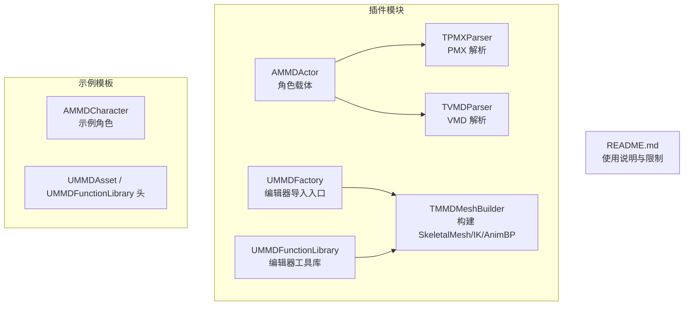
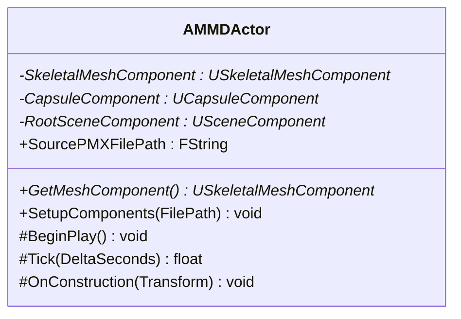
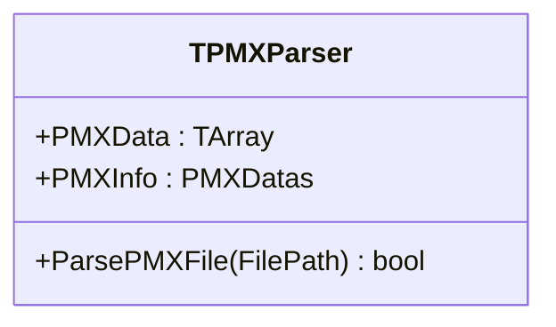
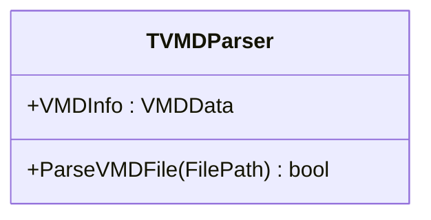
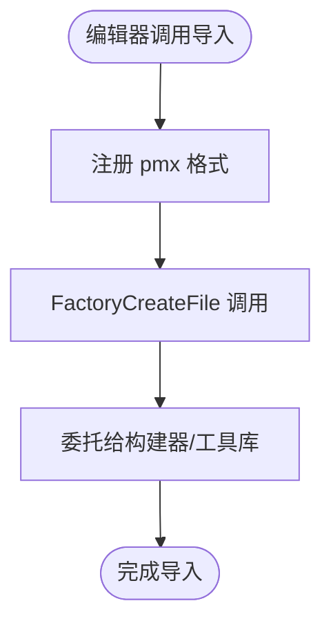
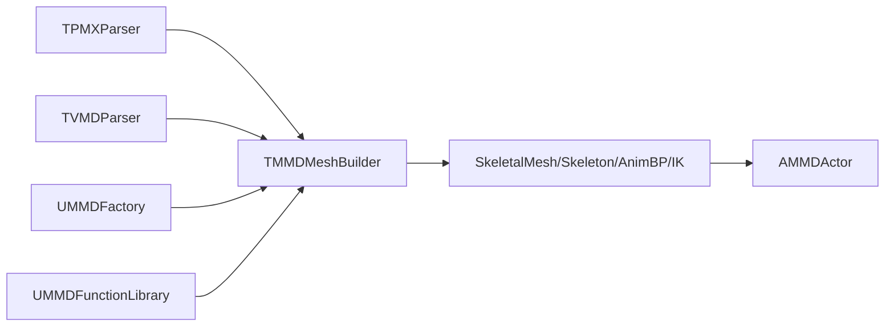
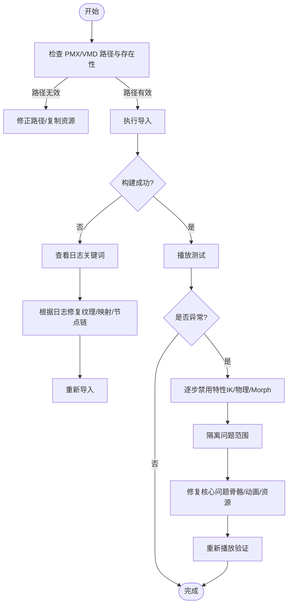

# 故障排除和常见问题

<cite>
**本文引用的文件**   
- [README.md](file://README.md)
- [MMD.cpp](file://MMD/Source/MMD/MMD.cpp)
- [MMD.h](file://MMD/Source/MMD/MMD.h)
- [MMDFactory.cpp](file://MMD/Source/MMD/MMDFactory.cpp)
- [MMDAsset.cpp](file://MMD/Source/MMD/MMDAsset.cpp)
- [MMDAsset.h](file://MMD/Source/MMD/MMDAsset.h)
- [MMDCharacter.cpp](file://MMD/Source/MMD/MMDCharacter.cpp)
- [MMDCharacter.h](file://MMD/Source/MMD/MMDCharacter.h)
- [MMDFunctionLibrary.cpp](file://MMD/Source/MMD/MMDFunctionLibrary.cpp)
- [MMDFunctionLibrary.h](file://MMD/Source/MMD/MMDFunctionLibrary.h)
- [AMMDActor.h](file://MMD/Plugins/Ue5MMDTools/Source/Ue5MMDTools/Public/Actors/AMMDActor.h)
- [TPMXParser.h](file://MMD/Plugins/Ue5MMDTools/Source/Ue5MMDTools/Public/Import/TPMXParser.h)
- [TVMDParser.h](file://MMD/Plugins/Ue5MMDTools/Source/Ue5MMDTools/Public/Import/TVMDParser.h)
</cite>

## 目录
1. [简介](#简介)
2. [项目结构](#项目结构)
3. [核心组件](#核心组件)
4. [架构总览](#架构总览)
5. [详细组件分析](#详细组件分析)
6. [依赖关系分析](#依赖关系分析)
7. [性能注意事项](#性能注意事项)
8. [故障排除指南](#故障排除指南)
9. [结论](#结论)
10. [附录](#附录)

## 简介
本文件面向使用 MMDUETools（Ue5MMDTools）的开发者与用户，聚焦于导入、运行时与性能问题的系统化排查方法。内容覆盖 PMX/VMD 导入兼容性、资源缺失、动画播放异常、物理模拟问题、日志分析与调试技巧、插件限制与已知问题，以及性能优化建议与最佳实践。文档同时提供可操作的自助排障流程与参考链接，帮助快速定位并解决问题。

## 项目结构
该仓库包含一个 UE5 插件工程与示例角色骨架。核心功能位于 Plugins/Ue5MMDTools 下的 C++ 模块，负责解析 PMX/VMD、构建骨骼网格、生成 AnimBlueprint 与 IK 资产等；MMD/Source 下为示例模板类与工厂入口。



图示来源
- [AMMDActor.h:1-47](file://MMD/Plugins/Ue5MMDTools/Source/Ue5MMDTools/Public/Actors/AMMDActor.h#L1-L47)
- [TPMXParser.h:499-508](file://MMD/Plugins/Ue5MMDTools/Source/Ue5MMDTools/Public/Import/TPMXParser.h#L499-L508)
- [TVMDParser.h:128-133](file://MMD/Plugins/Ue5MMDTools/Source/Ue5MMDTools/Public/Import/TVMDParser.h#L128-L133)
- [MMDFactory.cpp:1-15](file://MMD/Source/MMD/MMDFactory.cpp#L1-L15)
- [MMDFunctionLibrary.h:1-19](file://MMD/Source/MMD/MMDFunctionLibrary.h#L1-L19)
- [README.md:1-130](file://README.md#L1-L130)

章节来源
- [README.md:1-130](file://README.md#L1-L130)
- [MMDFactory.cpp:1-15](file://MMD/Source/MMD/MMDFactory.cpp#L1-L15)
- [MMDFunctionLibrary.h:1-19](file://MMD/Source/MMD/MMDFunctionLibrary.h#L1-L19)
- [AMMDActor.h:1-47](file://MMD/Plugins/Ue5MMDTools/Source/Ue5MMDTools/Public/Actors/AMMDActor.h#L1-L47)
- [TPMXParser.h:499-508](file://MMD/Plugins/Ue5MMDTools/Source/Ue5MMDTools/Public/Import/TPMXParser.h#L499-L508)
- [TVMDParser.h:128-133](file://MMD/Plugins/Ue5MMDTools/Source/Ue5MMDTools/Public/Import/TVMDParser.h#L128-L133)

## 核心组件
- AMMDActor：场景中的 MMD 角色载体，持有 SkeletalMeshComponent，并在编辑器构造时尝试初始化相关系统。
- TPMXParser：解析 PMX 模型数据（顶点、材质、骨骼、Morph、刚体/关节等）。
- TVMDParser：解析 VMD 动作数据（骨骼关键帧、表情关键帧等）。
- UMMDFactory：编辑器侧导入入口，注册 pmx 格式。
- UMMDFunctionLibrary：编辑器工具库，用于扩展导入与辅助操作。
- 示例模板：AMMDCharacter、UMMDAsset 等，用于演示与集成。

章节来源
- [AMMDActor.h:1-47](file://MMD/Plugins/Ue5MMDTools/Source/Ue5MMDTools/Public/Actors/AMMDActor.h#L1-L47)
- [TPMXParser.h:499-508](file://MMD/Plugins/Ue5MMDTools/Source/Ue5MMDTools/Public/Import/TPMXParser.h#L499-L508)
- [TVMDParser.h:128-133](file://MMD/Plugins/Ue5MMDTools/Source/Ue5MMDTools/Public/Import/TVMDParser.h#L128-L133)
- [MMDFactory.cpp:1-15](file://MMD/Source/MMD/MMDFactory.cpp#L1-L15)
- [MMDFunctionLibrary.h:1-19](file://MMD/Source/MMD/MMDFunctionLibrary.h#L1-L19)
- [MMDCharacter.h:1-73](file://MMD/Source/MMD/MMDCharacter.h#L1-L73)
- [MMDAsset.h:1-18](file://MMD/Source/MMD/MMDAsset.h#L1-L18)

## 架构总览
下图展示从“选择 PMX/VMD”到“生成资产与播放”的关键路径，以及运行时角色与解析器的交互。

```mermaid
sequenceDiagram
participant U as "用户"
participant UI as "编辑器面板/蓝图"
participant Factory as "UMMDFactory"
participant Builder as "TMMDMeshBuilder"
participant PMX as "TPMXParser"
participant VMD as "TVMDParser"
participant Actor as "AMMDActor"
participant Mesh as "SkeletalMeshComponent"
U->>UI : 选择 PMX/VMD 并点击导入
UI->>Factory : 触发导入流程
Factory->>Builder : 调用构建接口
Builder->>PMX : 解析 PMX 数据
PMX-->>Builder : 返回 PMXDatas
Builder->>VMD : 解析 VMD 数据
VMD-->>Builder : 返回 VMDData
Builder-->>UI : 生成 SkeletalMesh/Skeleton/AnimBP/IK 资产
UI->>Actor : 实例化 MMD 角色
Actor->>Mesh : 绑定生成的网格与动画
Actor-->>U : 在场景中预览/播放
```

图示来源
- [MMDFactory.cpp:1-15](file://MMD/Source/MMD/MMDFactory.cpp#L1-L15)
- [AMMDActor.h:1-47](file://MMD/Plugins/Ue5MMDTools/Source/Ue5MMDTools/Public/Actors/AMMDActor.h#L1-L47)
- [TPMXParser.h:499-508](file://MMD/Plugins/Ue5MMDTools/Source/Ue5MMDTools/Public/Import/TPMXParser.h#L499-L508)
- [TVMDParser.h:128-133](file://MMD/Plugins/Ue5MMDTools/Source/Ue5MMDTools/Public/Import/TVMDParser.h#L128-L133)

## 详细组件分析

### 组件：AMMDActor（MMD 角色载体）
- 职责：承载 SkeletalMeshComponent，提供获取网格组件的蓝图接口；在编辑器构造阶段进行必要的初始化（如 IK/物理预览）。
- 关键点：
  - 暴露 GetMeshComponent() 供蓝图访问。
  - 保存 SourcePMXFilePath，便于后续重建或调试。
  - BeginPlay/Tick 生命周期钩子可用于扩展运行时逻辑。



图示来源
- [AMMDActor.h:1-47](file://MMD/Plugins/Ue5MMDTools/Source/Ue5MMDTools/Public/Actors/AMMDActor.h#L1-L47)

章节来源
- [AMMDActor.h:1-47](file://MMD/Plugins/Ue5MMDTools/Source/Ue5MMDTools/Public/Actors/AMMDActor.h#L1-L47)

### 组件：TPMXParser（PMX 解析器）
- 职责：读取 PMX 二进制，填充 PMXDatas（顶点、索引、材质、骨骼、Morph、刚体/关节等）。
- 关键点：
  - ParsePMXFile 对外暴露解析入口。
  - PMXInfo 作为解析结果被上层构建器消费。



图示来源
- [TPMXParser.h:499-508](file://MMD/Plugins/Ue5MMDTools/Source/Ue5MMDTools/Public/Import/TPMXParser.h#L499-L508)

章节来源
- [TPMXParser.h:499-508](file://MMD/Plugins/Ue5MMDTools/Source/Ue5MMDTools/Public/Import/TPMXParser.h#L499-L508)

### 组件：TVMDParser（VMD 解析器）
- 职责：读取 VMD 二进制，填充 VMDData（骨骼关键帧、表情关键帧、相机/灯光/阴影/Ik 关键帧等）。
- 关键点：
  - ParseVMDFile 对外暴露解析入口。
  - VMDInfo 作为解析结果被上层构建器消费。



图示来源
- [TVMDParser.h:128-133](file://MMD/Plugins/Ue5MMDTools/Source/Ue5MMDTools/Public/Import/TVMDParser.h#L128-L133)

章节来源
- [TVMDParser.h:128-133](file://MMD/Plugins/Ue5MMDTools/Source/Ue5MMDTools/Public/Import/TVMDParser.h#L128-L133)

### 组件：UMMDFactory（编辑器导入入口）
- 职责：注册 pmx 文件格式，提供编辑器侧创建对象的入口点。
- 关键点：
  - 构造函数中注册 pmx 类型。
  - FactoryCreateFile 为默认空实现，实际导入逻辑由 TMMDMeshBuilder 等承担。



图示来源
- [MMDFactory.cpp:1-15](file://MMD/Source/MMD/MMDFactory.cpp#L1-L15)

章节来源
- [MMDFactory.cpp:1-15](file://MMD/Source/MMD/MMDFactory.cpp#L1-L15)

### 组件：UMMDFunctionLibrary（编辑器工具库）
- 职责：继承自编辑器工具库，用于扩展导入与辅助操作。
- 关键点：
  - 当前为空壳，可作为未来 API 扩展点。

章节来源
- [MMDFunctionLibrary.h:1-19](file://MMD/Source/MMD/MMDFunctionLibrary.h#L1-L19)

## 依赖关系分析
- 插件模块依赖 PMX/VMD 解析器，并通过构建器生成 UE 原生资产。
- AMMDActor 依赖 SkeletalMeshComponent 与可能的 IK/物理子系统。
- 示例模板（AMMDCharacter、UMMDAsset）与插件模块解耦，便于替换与测试。



图示来源
- [TPMXParser.h:499-508](file://MMD/Plugins/Ue5MMDTools/Source/Ue5MMDTools/Public/Import/TPMXParser.h#L499-L508)
- [TVMDParser.h:128-133](file://MMD/Plugins/Ue5MMDTools/Source/Ue5MMDTools/Public/Import/TVMDParser.h#L128-L133)
- [MMDFactory.cpp:1-15](file://MMD/Source/MMD/MMDFactory.cpp#L1-L15)
- [AMMDActor.h:1-47](file://MMD/Plugins/Ue5MMDTools/Source/Ue5MMDTools/Public/Actors/AMMDActor.h#L1-L47)

章节来源
- [TPMXParser.h:499-508](file://MMD/Plugins/Ue5MMDTools/Source/Ue5MMDTools/Public/Import/TPMXParser.h#L499-L508)
- [TVMDParser.h:128-133](file://MMD/Plugins/Ue5MMDTools/Source/Ue5MMDTools/Public/Import/TVMDParser.h#L128-L133)
- [MMDFactory.cpp:1-15](file://MMD/Source/MMD/MMDFactory.cpp#L1-L15)
- [AMMDActor.h:1-47](file://MMD/Plugins/Ue5MMDTools/Source/Ue5MMDTools/Public/Actors/AMMDActor.h#L1-L47)

## 性能注意事项
- 导入阶段：
  - 大型 PMX 模型可能产生大量顶点/材质/骨骼，建议在导入前对源模型进行面数与材质合并优化。
  - 纹理路径需正确，避免重复加载导致的内存峰值。
- 运行阶段：
  - 骨骼数量与 Morph 曲线较多会提升 CPU 开销，建议按需启用 IK 与物理。
  - 物理模拟处于实验阶段，复杂刚体/关节组合可能导致不稳定或卡顿，建议逐步增加复杂度并监控帧率。
- 资源管理：
  - 确保纹理与材质实例路径有效，减少运行时资源查找与回退成本。

[本节为通用指导，不直接分析具体文件]

## 故障排除指南

### 一、导入问题诊断（PMX/VMD）
- PMX 文件格式兼容性
  - 现象：导入失败或模型显示异常。
  - 排查步骤：
    - 确认 PMX 版本与编码符合解析器预期。
    - 检查顶点权重、骨骼链与 Morph 定义是否完整。
    - 若出现 Morph 变形异常，关注渲染顶点与 PMX 顶点的映射关系。
  - 参考实现位置：
    - [TPMXParser.h:499-508](file://MMD/Plugins/Ue5MMDTools/Source/Ue5MMDTools/Public/Import/TPMXParser.h#L499-L508)
- 资源缺失
  - 现象：材质贴图丢失、材质实例无效。
  - 排查步骤：
    - 核对 PMX 中纹理路径与实际文件路径一致。
    - 检查导入过程中是否有“纹理不存在”的警告信息。
  - 参考实现位置：
    - [TPMXParser.h:499-508](file://MMD/Plugins/Ue5MMDTools/Source/Ue5MMDTools/Public/Import/TPMXParser.h#L499-L508)
- 性能问题（导入慢/卡顿）
  - 现象：导入耗时过长或编辑器卡顿。
  - 排查步骤：
    - 降低模型面数与材质数量。
    - 分步导入（先基础网格，再添加 Morph/IK）。
  - 参考实现位置：
    - [TPMXParser.h:499-508](file://MMD/Plugins/Ue5MMDTools/Source/Ue5MMDTools/Public/Import/TPMXParser.h#L499-L508)

章节来源
- [TPMXParser.h:499-508](file://MMD/Plugins/Ue5MMDTools/Source/Ue5MMDTools/Public/Import/TPMXParser.h#L499-L508)

### 二、运行时问题排查（动画/物理/内存）
- 动画播放异常
  - 现象：无骨骼动画、表情未驱动、嘴型/眨眼缺失。
  - 排查步骤：
    - 确认已生成并绑定了 AnimSequence。
    - 检查 AnimBlueprint 节点链是否正确连接（LocalToComponent -> MMD -> ComponentToLocal -> Root）。
    - 查看编辑器日志中是否存在“AnimBP 为空”、“未找到根节点”等错误提示。
  - 参考实现位置：
    - [AMMDActor.h:1-47](file://MMD/Plugins/Ue5MMDTools/Source/Ue5MMDTools/Public/Actors/AMMDActor.h#L1-L47)
- 物理模拟问题
  - 现象：头发/衣物抖动异常、碰撞穿透、崩溃。
  - 排查步骤：
    - 确认刚体与关节参数合理（质量、阻尼、摩擦、碰撞掩码）。
    - 逐步开启物理，观察稳定性。
    - 注意插件说明：物理功能仍在实验阶段。
  - 参考实现位置：
    - [AMMDActor.h:1-47](file://MMD/Plugins/Ue5MMDTools/Source/Ue5MMDTools/Public/Actors/AMMDActor.h#L1-L47)
- 内存泄漏检测
  - 现象：长时间运行后内存持续增长。
  - 排查步骤：
    - 使用 UE 内存分析工具（如 Memory Profiler）定位未释放对象。
    - 检查自定义资源加载/卸载逻辑，确保路径与引用正确。
  - 参考实现位置：
    - [AMMDActor.h:1-47](file://MMD/Plugins/Ue5MMDTools/Source/Ue5MMDTools/Public/Actors/AMMDActor.h#L1-L47)

章节来源
- [AMMDActor.h:1-47](file://MMD/Plugins/Ue5MMDTools/Source/Ue5MMDTools/Public/Actors/AMMDActor.h#L1-L47)

### 三、日志分析与调试技巧
- 关键日志类别
  - LogTemp：插件内部调试与错误输出。
  - 自定义日志：示例模板中使用 LogTemplateCharacter。
- 常用排查要点
  - 搜索关键词：“Failed to create asset”、“SavePackage failed”、“Texture file does not exist”、“AnimBP is null”、“Root node not found”。
  - 结合时间戳与调用栈，定位导入/播放阶段的异常分支。
- 参考实现位置
  - [MMDCharacter.cpp:1-130](file://MMD/Source/MMD/MMDCharacter.cpp#L1-L130)

章节来源
- [MMDCharacter.cpp:1-130](file://MMD/Source/MMD/MMDCharacter.cpp#L1-L130)

### 四、插件限制与已知问题
- Material Morph 尚未完全驱动 UE 材质参数。
- Bone Morph / UV Morph 未作为完整动画通道实现。
- 不同模型的骨骼命名、IK 结构与特殊 Morph 组合可能需要额外适配。
- 物理模拟仍处于实验阶段，适合继续调试与扩展。

章节来源
- [README.md:125-130](file://README.md#L125-L130)

### 五、性能优化建议与最佳实践
- 模型与材质
  - 控制面数与材质数量，合并相近材质，减少 DrawCall。
  - 预烘焙光照或使用静态批处理（视场景需求）。
- 动画与 IK
  - 仅启用必要骨骼与 IK 链，关闭不必要的 Morph 曲线。
  - 将高频更新的逻辑移至较低优先级线程（如适用）。
- 物理
  - 调整刚体质量与阻尼，避免极端值导致数值不稳定。
  - 分阶段启用物理，逐步验证稳定性。
- 资源管理
  - 确保纹理路径正确，避免运行时动态加载带来的延迟与峰值。
  - 使用资源池与异步加载策略，降低主线程压力。

[本节为通用指导，不直接分析具体文件]

### 六、自助排障流程图


[此图为概念流程，不直接映射具体源码文件]

## 结论
通过系统化地检查导入路径与资源完整性、分析日志关键字、逐步隔离问题范围，并结合插件的限制与已知问题，大多数 PMX/VMD 导入与运行时问题均可被快速定位与解决。建议在复杂模型与高复杂度动画场景下，遵循性能优化建议与最佳实践，以获得更稳定的体验。

[本节为总结，不直接分析具体文件]

## 附录
- 官方展示页与演示视频（含安装与使用教程）
  - 展示页：https://treasureGrove.github.io/MMDUETools/
  - B站演示：https://www.bilibili.com/video/BV1M2RXBPExk/
- 相关说明与限制
  - 参见 README 中的“插件功能说明”与“当前限制”部分。

章节来源
- [README.md:1-130](file://README.md#L1-L130)