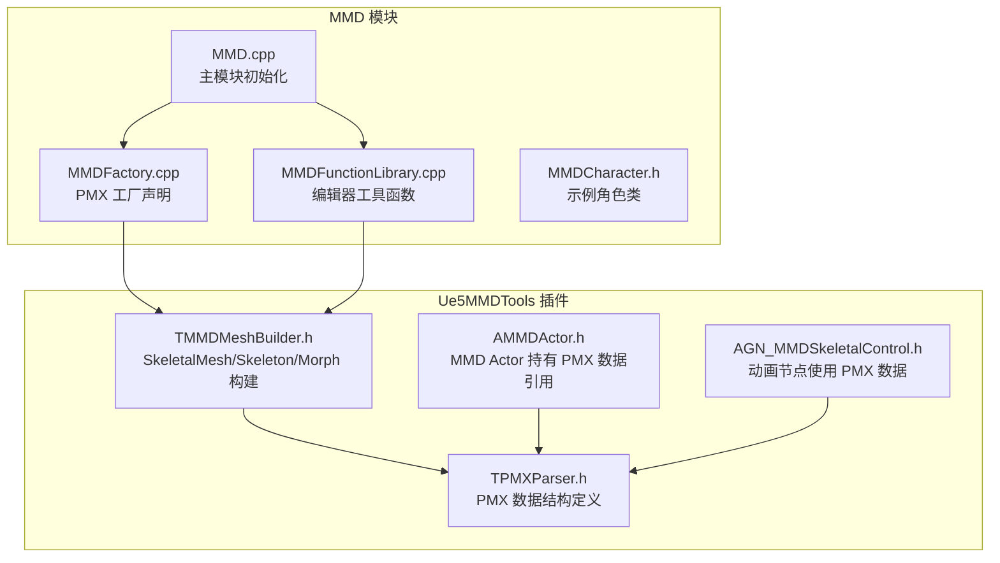
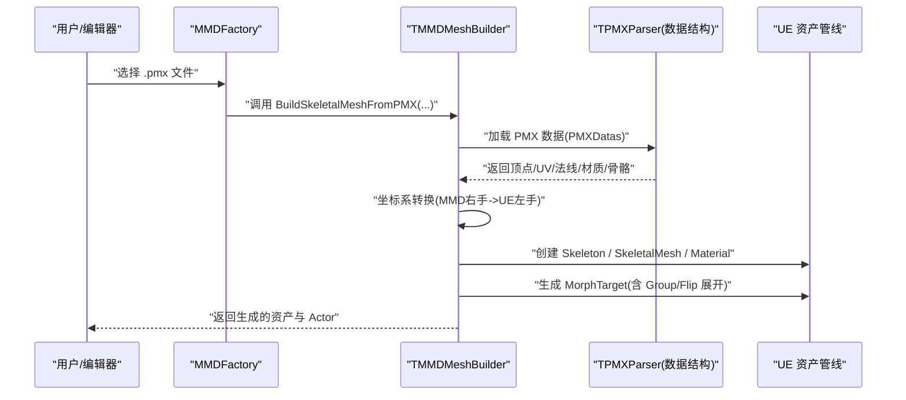
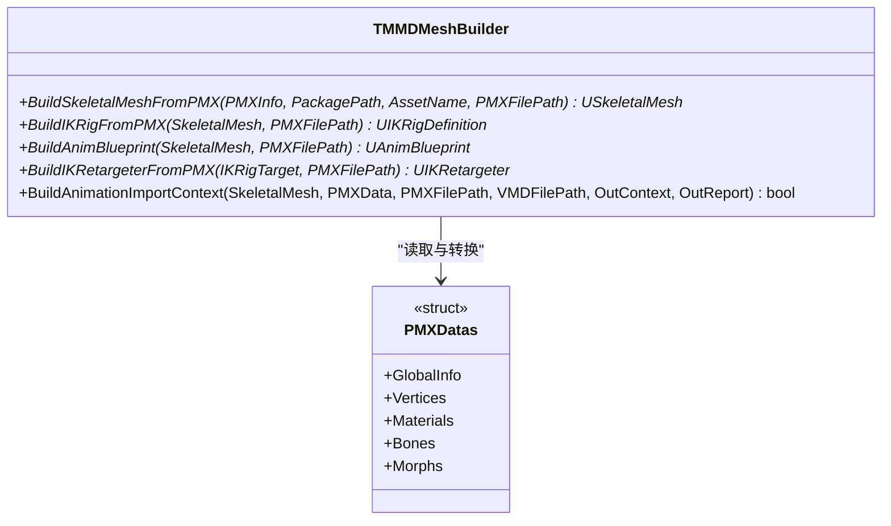
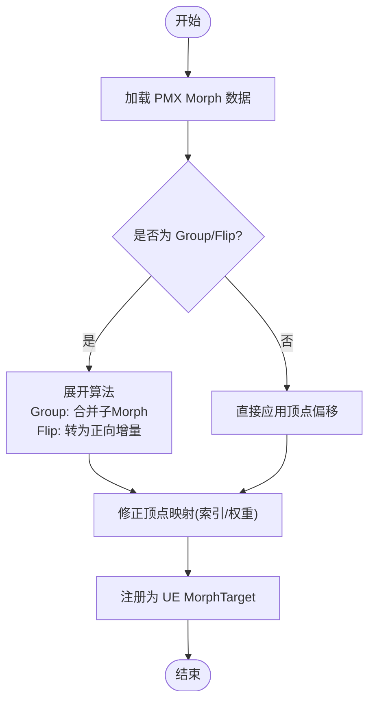
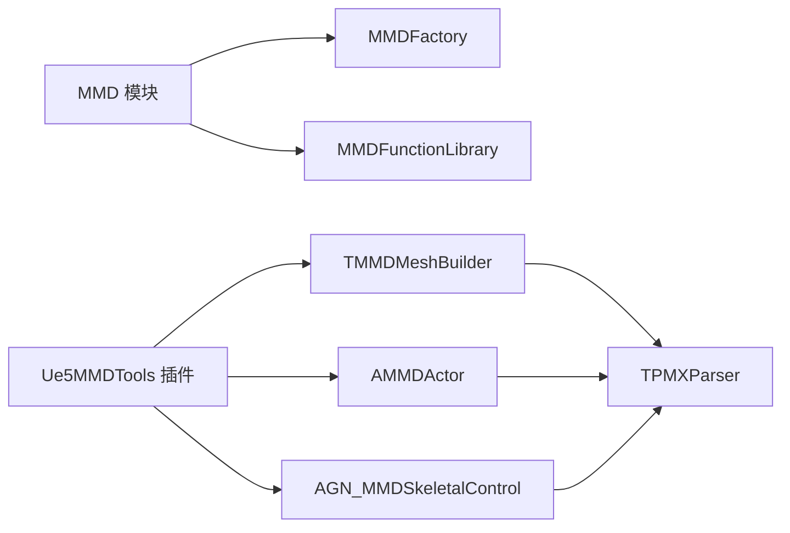

# PMX 模型导入系统

<cite>
**本文引用的文件**   
- [README.md](file://README.md)
- [MMD.h](file://MMD/Source/MMD/MMD.h)
- [MMD.cpp](file://MMD/Source/MMD/MMD.cpp)
- [MMDAsset.h](file://MMD/Source/MMD/MMDAsset.h)
- [MMDAsset.cpp](file://MMD/Source/MMD/MMDAsset.cpp)
- [MMDFactory.h](file://MMD/Source/MMD/MMDFactory.h)
- [MMDFactory.cpp](file://MMD/Source/MMD/MMDFactory.cpp)
- [MMDFunctionLibrary.h](file://MMD/Source/MMD/MMDFunctionLibrary.h)
- [MMDFunctionLibrary.cpp](file://MMD/Source/MMD/MMDFunctionLibrary.cpp)
- [MMDCharacter.h](file://MMD/Source/MMD/MMDCharacter.h)
- [TPMXParser.h](file://MMD/Plugins/Ue5MMDTools/Source/Ue5MMDTools/Public/Import/TPMXParser.h)
- [TMMDMeshBuilder.h](file://MMD/Plugins/Ue5MMDTools/Source/Ue5MMDTools/Public/Import/TMMDMeshBuilder.h)
- [AMMDActor.h](file://MMD/Plugins/Ue5MMDTools/Source/Ue5MMDTools/Public/Actors/AMMDActor.h)
- [AGN_MMDSkeletalControl.h](file://MMD/Plugins/Ue5MMDTools/Source/Ue5MMDTools/Public/Animation/AGN_MMDSkeletalControl.h)
</cite>

## 目录
1. [简介](#简介)
2. [项目结构](#项目结构)
3. [核心组件](#核心组件)
4. [架构总览](#架构总览)
5. [详细组件分析](#详细组件分析)
6. [依赖关系分析](#依赖关系分析)
7. [性能考量](#性能考量)
8. [故障排查指南](#故障排查指南)
9. [结论](#结论)
10. [附录](#附录)

## 简介
本技术文档围绕 MMD UE 插件中的 PMX 模型导入系统，系统性阐述从 PMX 解析到 Unreal Engine SkeletalMesh、Skeleton、Material 与 MorphTarget 的完整转换流程。重点覆盖：
- PMX 顶点、UV、法线、材质、骨骼等数据的读取与处理
- MMD 右手系到 UE 左手系的坐标系转换
- MorphTarget（含 Group Morph 与 Flip Morph）展开机制
- VMD 动画到 AnimSequence 的映射与曲线写入
- 错误处理与性能优化最佳实践

## 项目结构
该仓库包含一个 UE5 游戏模块与一个编辑器扩展插件。核心入口位于 MMD 模块，PMX/VMD 导入逻辑集中在 Ue5MMDTools 插件中。

图表来源
- [MMD.cpp:1-7](file://MMD/Source/MMD/MMD.cpp#L1-L7)
- [MMDFactory.cpp:1-15](file://MMD/Source/MMD/MMDFactory.cpp#L1-L15)
- [MMDFunctionLibrary.cpp:1-6](file://MMD/Source/MMD/MMDFunctionLibrary.cpp#L1-L6)
- [MMDCharacter.h:1-73](file://MMD/Source/MMD/MMDCharacter.h#L1-L73)
- [TPMXParser.h](file://MMD/Plugins/Ue5MMDTools/Source/Ue5MMDTools/Public/Import/TPMXParser.h)
- [TMMDMeshBuilder.h](file://MMD/Plugins/Ue5MMDTools/Source/Ue5MMDTools/Public/Import/TMMDMeshBuilder.h)
- [AMMDActor.h](file://MMD/Plugins/Ue5MMDTools/Source/Ue5MMDTools/Public/Actors/AMMDActor.h)
- [AGN_MMDSkeletalControl.h](file://MMD/Plugins/Ue5MMDTools/Source/Ue5MMDTools/Public/Animation/AGN_MMDSkeletalControl.h)

章节来源
- [README.md:1-130](file://README.md#L1-L130)
- [MMD.cpp:1-7](file://MMD/Source/MMD/MMD.cpp#L1-L7)
- [MMDFactory.cpp:1-15](file://MMD/Source/MMD/MMDFactory.cpp#L1-L15)
- [MMDFunctionLibrary.cpp:1-6](file://MMD/Source/MMD/MMDFunctionLibrary.cpp#L1-L6)
- [MMDCharacter.h:1-73](file://MMD/Source/MMD/MMDCharacter.h#L1-L73)
- [TPMXParser.h](file://MMD/Plugins/Ue5MMDTools/Source/Ue5MMDTools/Public/Import/TPMXParser.h)
- [TMMDMeshBuilder.h](file://MMD/Plugins/Ue5MMDTools/Source/Ue5MMDTools/Public/Import/TMMDMeshBuilder.h)
- [AMMDActor.h](file://MMD/Plugins/Ue5MMDTools/Source/Ue5MMDTools/Public/Actors/AMMDActor.h)
- [AGN_MMDSkeletalControl.h](file://MMD/Plugins/Ue5MMDTools/Source/Ue5MMDTools/Public/Animation/AGN_MMDSkeletalControl.h)

## 核心组件
- PMX 数据结构与全局信息
  - 通过 PMXGlobals、FPMXVertex、FPMXMaterial 等结构体描述 PMX 文件的顶点、UV、权重、材质等字段，为后续解析提供统一的数据模型。
- Mesh 与 Skeleton 构建器
  - TMMDMeshBuilder 提供将 PMX 数据转换为 UE SkeletalMesh、Skeleton、IKRig、AnimBlueprint 的静态接口，并支持构建动画导入上下文。
- 工厂与工具库
  - MMDFactory 注册 pmx 格式；MMDFunctionLibrary 作为编辑器工具库承载导入相关功能。
- 运行时 Actor 与动画节点
  - AMMDActor 持有源 PMX 路径与 PMX 数据引用；AGN_MMDSkeletalControl 在动画图中消费 PMX 数据以驱动骨骼控制。

章节来源
- [TPMXParser.h](file://MMD/Plugins/Ue5MMDTools/Source/Ue5MMDTools/Public/Import/TPMXParser.h)
- [TMMDMeshBuilder.h](file://MMD/Plugins/Ue5MMDTools/Source/Ue5MMDTools/Public/Import/TMMDMeshBuilder.h)
- [MMDFactory.h:1-23](file://MMD/Source/MMD/MMDFactory.h#L1-L23)
- [MMDFactory.cpp:1-15](file://MMD/Source/MMD/MMDFactory.cpp#L1-L15)
- [MMDFunctionLibrary.h:1-19](file://MMD/Source/MMD/MMDFunctionLibrary.h#L1-L19)
- [AMMDActor.h](file://MMD/Plugins/Ue5MMDTools/Source/Ue5MMDTools/Public/Actors/AMMDActor.h)
- [AGN_MMDSkeletalControl.h](file://MMD/Plugins/Ue5MMDTools/Source/Ue5MMDTools/Public/Animation/AGN_MMDSkeletalControl.h)

## 架构总览
下图展示了从 PMX 文件到 UE 资产的端到端流程，包括解析、坐标转换、网格/骨骼/材质构建、MorphTarget 生成以及动画导入上下文准备。

图表来源
- [MMDFactory.cpp:1-15](file://MMD/Source/MMD/MMDFactory.cpp#L1-L15)
- [TMMDMeshBuilder.h](file://MMD/Plugins/Ue5MMDTools/Source/Ue5MMDTools/Public/Import/TMMDMeshBuilder.h)
- [TPMXParser.h](file://MMD/Plugins/Ue5MMDTools/Source/Ue5MMDTools/Public/Import/TPMXParser.h)

## 详细组件分析

### PMX 数据结构与解析要点
- 全局信息与版本
  - PMXGlobals 记录 ExtraUV 数量等全局元信息，用于决定每个顶点附加 UV 的数量。
- 顶点与权重
  - FPMXVertexWeight 表示顶点权重类型（BDEF1/BDEF2/BDEF4/SDEF 等），影响渲染时的多骨骼混合。
  - FPMXVertex 包含位置、UV、额外 UV、法线与权重，是构建渲染顶点的核心。
- 材质
  - FPMXMaterial 包含材质名称、备注、面片索引计数等，用于划分子网格与材质分配。
- 骨骼
  - 结构中包含 boneCount 及后续骨骼列表，用于构建 Skeleton 层级与父子关系。

章节来源
- [TPMXParser.h](file://MMD/Plugins/Ue5MMDTools/Source/Ue5MMDTools/Public/Import/TPMXParser.h)

### 网格与骨骼构建（SkeletalMesh / Skeleton）
- 关键接口
  - BuildSkeletalMeshFromPMX：根据 PMXDatas 构建 SkeletalMesh，内部完成顶点重组、索引组织、材质分配与 IK 重定向所需信息的保存。
  - BuildIKRigFromPMX / BuildIKRetargeterFromPMX：基于 PMX 骨骼与 IK 链生成 IK Rig 与 Retargeter，便于动作迁移。
  - BuildAnimBlueprint：为角色自动生成基础 AnimBlueprint，便于后续挂载动画与表情控制。
  - BuildAnimationImportContext：为 VMD 动画导入准备上下文，建立骨骼名到骨架索引的映射、Morph 名到曲线的映射等。

图表来源
- [TMMDMeshBuilder.h](file://MMD/Plugins/Ue5MMDTools/Source/Ue5MMDTools/Public/Import/TMMDMeshBuilder.h)
- [TPMXParser.h](file://MMD/Plugins/Ue5MMDTools/Source/Ue5MMDTools/Public/Import/TPMXParser.h)

章节来源
- [TMMDMeshBuilder.h](file://MMD/Plugins/Ue5MMDTools/Source/Ue5MMDTools/Public/Import/TMMDMeshBuilder.h)

### 材质与纹理资源
- 材质信息来源于 PMX 材质块，包含颜色、自发光、反射、阴影等参数。
- 导入时通常创建基础 MMD 材质与材质实例，并将纹理路径关联到对应贴图资源。
- 当前限制：Material Morph 尚未完整驱动 UE 材质参数。

章节来源
- [README.md:91-103](file://README.md#L91-L103)
- [README.md:125-130](file://README.md#L125-L130)

### 骨骼结构与 IK 重定向
- 骨骼层级由 PMX 的父子关系构建，根骨骼通常为“中心”或“Root”。
- IK 链与追加骨骼在导入阶段被识别并生成 IK Rig，以便后续动作重定向与回放。
- 动画播放时需考虑 root/center 位移与 IK 烘焙结果的一致性。

章节来源
- [README.md:105-118](file://README.md#L105-L118)
- [AMMDActor.h](file://MMD/Plugins/Ue5MMDTools/Source/Ue5MMDTools/Public/Actors/AMMDActor.h)

### MorphTarget 与表情展开（Group Morph / Flip Morph）
- Vertex Morph 直接导入为 UE MorphTarget，并在 SkeletalMesh 中注册。
- 为确保嘴型与眨眼正确播放，需对 Group Morph 与 Flip Morph 进行展开：
  - Group Morph：将多个子 morph 按权重组合为一个等效变形。
  - Flip Morph：将“翻转”目标转换为正向增量，避免符号反转导致的表情扭曲。
- 修正 PMX 顶点到 UE 渲染顶点的映射，确保索引一致性与权重计算正确。

图表来源
- [TPMXParser.h](file://MMD/Plugins/Ue5MMDTools/Source/Ue5MMDTools/Public/Import/TPMXParser.h)
- [TMMDMeshBuilder.h](file://MMD/Plugins/Ue5MMDTools/Source/Ue5MMDTools/Public/Import/TMMDMeshBuilder.h)

章节来源
- [README.md:98-103](file://README.md#L98-L103)
- [TPMXParser.h](file://MMD/Plugins/Ue5MMDTools/Source/Ue5MMDTools/Public/Import/TPMXParser.h)
- [TMMDMeshBuilder.h](file://MMD/Plugins/Ue5MMDTools/Source/Ue5MMDTools/Public/Import/TMMDMeshBuilder.h)

### 坐标系转换（MMD 右手系 -> UE 左手系）
- MMD 使用右手坐标系，UE 使用左手坐标系。导入时需对位置、旋转与法线进行变换：
  - 位置：沿某一轴取反（常见为 X 或 Z，取决于实现约定）。
  - 旋转：应用对应的轴翻转矩阵，保证骨骼朝向正确。
  - 法线：与位置一致的轴向翻转，确保光照方向正确。
- 建议在构建顶点与骨骼之前统一执行一次坐标转换，避免后续重复计算。

章节来源
- [README.md:105-110](file://README.md#L105-L110)
- [TPMXParser.h](file://MMD/Plugins/Ue5MMDTools/Source/Ue5MMDTools/Public/Import/TPMXParser.h)
- [TMMDMeshBuilder.h](file://MMD/Plugins/Ue5MMDTools/Source/Ue5MMDTools/Public/Import/TMMDMeshBuilder.h)

### 工厂与编辑器集成
- MMDFactory 注册 pmx 格式，供编辑器导入流程识别。
- MMDFunctionLibrary 继承编辑器工具库，可暴露批量导入、预览与调试接口。
- 当前工厂方法未实现具体逻辑，实际导入可能通过编辑器面板或自定义工具触发。

章节来源
- [MMDFactory.h:1-23](file://MMD/Source/MMD/MMDFactory.h#L1-L23)
- [MMDFactory.cpp:1-15](file://MMD/Source/MMD/MMDFactory.cpp#L1-L15)
- [MMDFunctionLibrary.h:1-19](file://MMD/Source/MMD/MMDFunctionLibrary.h#L1-L19)
- [MMDFunctionLibrary.cpp:1-6](file://MMD/Source/MMD/MMDFunctionLibrary.cpp#L1-L6)

### 运行时 Actor 与动画节点
- AMMDActor 持有 SourcePMXFilePath 与 PMX 数据引用，用于运行时访问模型信息。
- AGN_MMDSkeletalControl 在动画蓝图中消费 PMX 数据，驱动骨骼控制与表情联动。

章节来源
- [AMMDActor.h](file://MMD/Plugins/Ue5MMDTools/Source/Ue5MMDTools/Public/Actors/AMMDActor.h)
- [AGN_MMDSkeletalControl.h](file://MMD/Plugins/Ue5MMDTools/Source/Ue5MMDTools/Public/Animation/AGN_MMDSkeletalControl.h)

## 依赖关系分析
- 模块级依赖
  - MMD 模块负责插件生命周期与工厂注册。
  - Ue5MMDTools 插件承载 PMX/VMD 导入与运行时支撑。
- 组件耦合
  - TMMDMeshBuilder 强依赖 TPMXParser 的数据结构。
  - AMMDActor 与 AGN_MMDSkeletalControl 间接依赖 PMX 数据，用于运行时行为。

图表来源
- [MMD.cpp:1-7](file://MMD/Source/MMD/MMD.cpp#L1-L7)
- [MMDFactory.cpp:1-15](file://MMD/Source/MMD/MMDFactory.cpp#L1-L15)
- [MMDFunctionLibrary.cpp:1-6](file://MMD/Source/MMD/MMDFunctionLibrary.cpp#L1-L6)
- [TPMXParser.h](file://MMD/Plugins/Ue5MMDTools/Source/Ue5MMDTools/Public/Import/TPMXParser.h)
- [TMMDMeshBuilder.h](file://MMD/Plugins/Ue5MMDTools/Source/Ue5MMDTools/Public/Import/TMMDMeshBuilder.h)
- [AMMDActor.h](file://MMD/Plugins/Ue5MMDTools/Source/Ue5MMDTools/Public/Actors/AMMDActor.h)
- [AGN_MMDSkeletalControl.h](file://MMD/Plugins/Ue5MMDTools/Source/Ue5MMDTools/Public/Animation/AGN_MMDSkeletalControl.h)

章节来源
- [MMD.cpp:1-7](file://MMD/Source/MMD/MMD.cpp#L1-L7)
- [MMDFactory.cpp:1-15](file://MMD/Source/MMD/MMDFactory.cpp#L1-L15)
- [MMDFunctionLibrary.cpp:1-6](file://MMD/Source/MMD/MMDFunctionLibrary.cpp#L1-L6)
- [TPMXParser.h](file://MMD/Plugins/Ue5MMDTools/Source/Ue5MMDTools/Public/Import/TPMXParser.h)
- [TMMDMeshBuilder.h](file://MMD/Plugins/Ue5MMDTools/Source/Ue5MMDTools/Public/Import/TMMDMeshBuilder.h)
- [AMMDActor.h](file://MMD/Plugins/Ue5MMDTools/Source/Ue5MMDTools/Public/Actors/AMMDActor.h)
- [AGN_MMDSkeletalControl.h](file://MMD/Plugins/Ue5MMDTools/Source/Ue5MMDTools/Public/Animation/AGN_MMDSkeletalControl.h)

## 性能考量
- 批量处理与内存复用
  - 在构建 SkeletalMesh 前预分配顶点与索引缓冲区，减少动态扩容开销。
- 并行化
  - 对大型模型的顶点/法线/UV 转换可考虑多线程并行，注意线程安全与锁粒度。
- 材质与纹理
  - 延迟加载纹理资源，按需异步载入，避免导入阻塞。
- MorphTarget 展开
  - Group/Flip 展开应缓存中间结果，避免重复计算；对频繁切换的表情做增量更新。
- 坐标转换
  - 统一在数据加载阶段进行一次坐标转换，避免在渲染路径重复变换。

[本节为通用指导，不直接分析具体文件]

## 故障排查指南
- 导入失败或无输出
  - 检查 MMDFactory 是否成功注册 pmx 格式；确认编辑器面板是否正确调用导入流程。
- 表情扭曲或嘴型异常
  - 核查 Group/Flip Morph 展开逻辑与顶点映射修正；确认权重类型与索引一致性。
- 坐标系问题（镜像/反向）
  - 验证位置/旋转/法线的轴向翻转矩阵是否正确；对比 MMD 与 UE 的轴定义。
- 动画不生效
  - 检查 BuildAnimationImportContext 是否正确建立骨骼与 Morph 映射；确认 AnimSequence 轨道与曲线写入。

章节来源
- [MMDFactory.cpp:1-15](file://MMD/Source/MMD/MMDFactory.cpp#L1-L15)
- [README.md:98-110](file://README.md#L98-L110)
- [TPMXParser.h](file://MMD/Plugins/Ue5MMDTools/Source/Ue5MMDTools/Public/Import/TPMXParser.h)
- [TMMDMeshBuilder.h](file://MMD/Plugins/Ue5MMDTools/Source/Ue5MMDTools/Public/Import/TMMDMeshBuilder.h)

## 结论
本系统通过统一的 PMX 数据结构与模块化构建器，实现了从 MMD 到 UE 的完整导入链路。核心难点在于坐标转换、MorphTarget 展开与骨骼/IK 重定向。建议持续完善 Material Morph 驱动与 Bone/UV Morph 动画通道，以提升不同模型的兼容性与表现力。

[本节为总结性内容，不直接分析具体文件]

## 附录
- 工作流参考
  - PMX -> SkeletalMesh / Skeleton / MorphTarget / Materials / Actor
  - VMD -> AnimSequence（骨骼轨道 + 表情曲线）
  - 播放结果包含身体动作、root/center 位移、眨眼、嘴型与表情变化

章节来源
- [README.md:13-19](file://README.md#L13-L19)
- [README.md:371-391](file://docs/index.html#L371-L391)