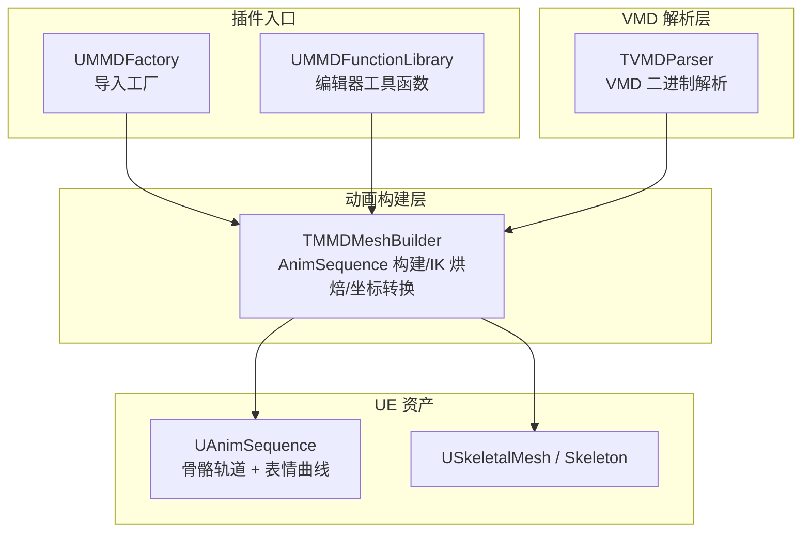
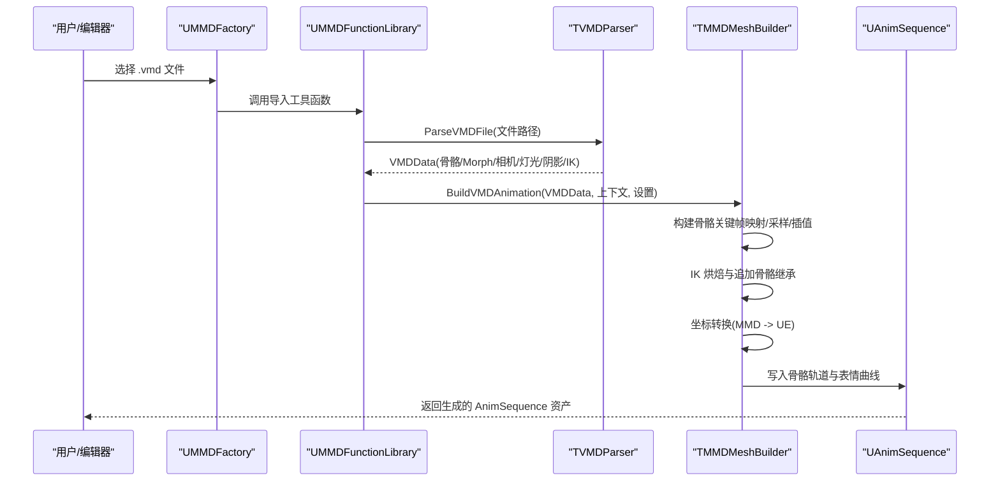
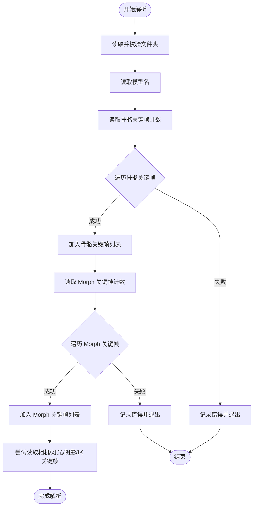
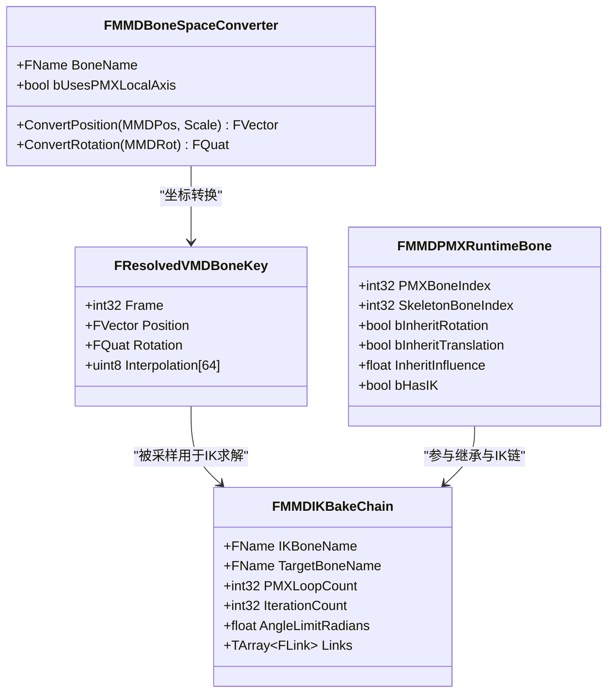
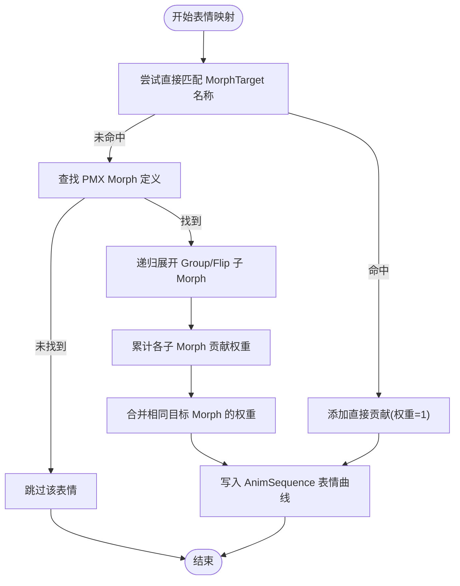
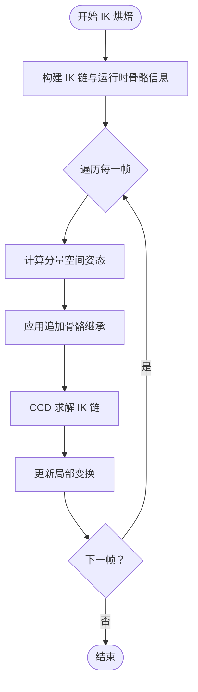
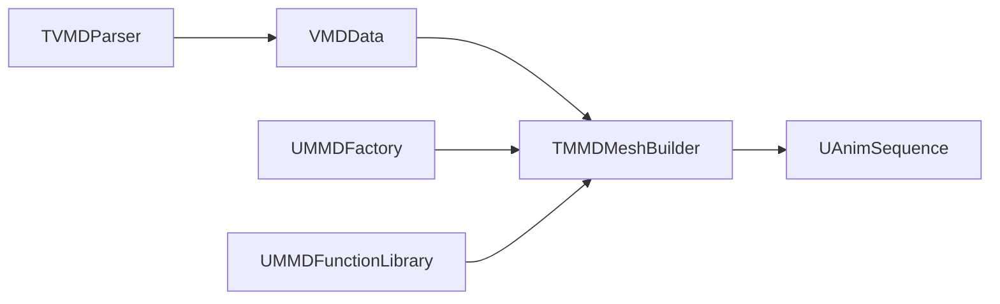

# VMD 动画处理系统

<cite>
**本文引用的文件**   
- [README.md](file://README.md)
- [TVMDParser.cpp](file://MMD/Plugins/Ue5MMDTools/Source/Ue5MMDTools/Private/Import/TVMDParser.cpp)
- [TMMDMeshBuilder.cpp](file://MMD/Plugins/Ue5MMDTools/Source/Ue5MMDTools/Private/Import/TMMDMeshBuilder.cpp)
- [MMDFactory.h](file://MMD/Source/MMD/MMDFactory.h)
- [MMDFactory.cpp](file://MMD/Source/MMD/MMDFactory.cpp)
- [MMDFunctionLibrary.h](file://MMD/Source/MMD/MMDFunctionLibrary.h)
- [MMDFunctionLibrary.cpp](file://MMD/Source/MMD/MMDFunctionLibrary.cpp)
</cite>

## 目录
1. [简介](#简介)
2. [项目结构](#项目结构)
3. [核心组件](#核心组件)
4. [架构总览](#架构总览)
5. [详细组件分析](#详细组件分析)
6. [依赖关系分析](#依赖关系分析)
7. [性能考量](#性能考量)
8. [故障排查指南](#故障排查指南)
9. [结论](#结论)
10. [附录](#附录)

## 简介
本技术文档面向 VMD 动画处理系统，系统性阐述以下内容：
- VMD 文件格式解析机制（骨骼关键帧、表情 Morph、相机/灯光/阴影/IK 等可选数据）
- MMD 动画到 Unreal Engine AnimSequence 的转换流程（时间轴映射、插值计算、曲线生成）
- 表情系统的处理逻辑（Face 参数映射与混合权重计算）
- 坐标系转换对动画数据的影响与处理方法
- 批量处理 VMD 文件的实践路径与自定义扩展点
- 性能优化建议与常见问题解决方案

## 项目结构
本项目为 UE5 插件形态，核心代码位于 Plugins/Ue5MMDTools 下，包含 VMD 解析器与动画构建器；同时提供 MMD 工厂与函数库作为编辑器集成入口。

图表来源
- [MMDFactory.h:1-22](file://MMD/Source/MMD/MMDFactory.h#L1-L22)
- [MMDFactory.cpp:1-14](file://MMD/Source/MMD/MMDFactory.cpp#L1-L14)
- [MMDFunctionLibrary.h:1-18](file://MMD/Source/MMD/MMDFunctionLibrary.h#L1-L18)
- [MMDFunctionLibrary.cpp:1-5](file://MMD/Source/MMD/MMDFunctionLibrary.cpp#L1-L5)
- [TVMDParser.cpp:191-388](file://MMD/Plugins/Ue5MMDTools/Source/Ue5MMDTools/Private/Import/TVMDParser.cpp#L191-L388)
- [TMMDMeshBuilder.cpp:3989-4396](file://MMD/Plugins/Ue5MMDTools/Source/Ue5MMDTools/Private/Import/TMMDMeshBuilder.cpp#L3989-L4396)

章节来源
- [README.md:1-130](file://README.md#L1-L130)

## 核心组件
- TVMDParser：负责读取 VMD 二进制文件，解析头部、模型名、骨骼关键帧、Morph 关键帧以及可选的相机、灯光、阴影、IK 关键帧，并输出结构化数据。
- TMMDMeshBuilder：将解析后的 VMD 数据转换为 UE AnimSequence，包括骨骼轨道写入、表情曲线写入、IK 烘焙、追加骨骼继承、坐标空间转换等。
- UMMDFactory / UMMDFunctionLibrary：编辑器侧的导入工厂与工具函数入口，用于触发 PMX/VMD 导入流程。

章节来源
- [TVMDParser.cpp:191-388](file://MMD/Plugins/Ue5MMDTools/Source/Ue5MMDTools/Private/Import/TVMDParser.cpp#L191-L388)
- [TMMDMeshBuilder.cpp:3989-4396](file://MMD/Plugins/Ue5MMDTools/Source/Ue5MMDTools/Private/Import/TMMDMeshBuilder.cpp#L3989-L4396)
- [MMDFactory.h:1-22](file://MMD/Source/MMD/MMDFactory.h#L1-L22)
- [MMDFunctionLibrary.h:1-18](file://MMD/Source/MMD/MMDFunctionLibrary.h#L1-L18)

## 架构总览
VMD 动画处理系统的数据流从“文件解析”到“UE 动画资产构建”，中间经过“骨骼/表情映射”、“坐标转换”、“IK 烘焙”等步骤。

图表来源
- [MMDFactory.cpp:11-14](file://MMD/Source/MMD/MMDFactory.cpp#L11-L14)
- [MMDFunctionLibrary.h:1-18](file://MMD/Source/MMD/MMDFunctionLibrary.h#L1-L18)
- [TVMDParser.cpp:191-388](file://MMD/Plugins/Ue5MMDTools/Source/Ue5MMDTools/Private/Import/TVMDParser.cpp#L191-L388)
- [TMMDMeshBuilder.cpp:3989-4396](file://MMD/Plugins/Ue5MMDTools/Source/Ue5MMDTools/Private/Import/TMMDMeshBuilder.cpp#L3989-L4396)

## 详细组件分析

### VMD 解析器（TVMDParser）
- 功能要点
  - 校验文件头与模型名字段长度（支持新旧格式）
  - 读取骨骼关键帧（名称、帧号、位置、四元数旋转、64 字节插值控制）
  - 读取 Morph 关键帧（名称、帧号、权重）
  - 可选读取相机、灯光、阴影、IK 关键帧（带计数保护与剩余字节检查）
  - 使用 Shift-JIS 解码固定长度字符串，并提供回退策略
- 数据结构
  - VMDInfo：包含 Header、ModelName、BoneKeyframes、MorphKeyframes、Camera/Light/Shadow/IK Keyframes
- 错误处理
  - 非法字节数、超出合理键数量、字段读取失败均记录日志并中止解析

图表来源
- [TVMDParser.cpp:191-388](file://MMD/Plugins/Ue5MMDTools/Source/Ue5MMDTools/Private/Import/TVMDParser.cpp#L191-L388)

章节来源
- [TVMDParser.cpp:191-388](file://MMD/Plugins/Ue5MMDTools/Source/Ue5MMDTools/Private/Import/TVMDParser.cpp#L191-L388)

### 动画构建器（TMMDMeshBuilder）
- 功能要点
  - 构建骨骼关键帧映射（按目标骨骼名称聚合并按帧排序）
  - 在指定帧率下采样关键帧，应用 VMD Bezier 插值（每通道独立控制）
  - 执行 IK 烘焙（CCD 风格迭代求解），支持角度限制与链式约束
  - 处理追加骨骼继承（旋转/位移继承影响）
  - 坐标空间转换（MMD 局部/全局到 UE 空间）
  - 创建 UAnimSequence，写入骨骼轨道与表情曲线（Morph curves）
- 关键算法
  - EvaluateVMDBezierAlpha：基于 64 字节插值表进行三次贝塞尔插值，分别作用于 X/Y/Z 位置与旋转
  - SampleResolvedVMDTrackAtFrame：在相邻关键帧间按线性时间比例计算插值结果
  - SolveMMDIKChainForFrame / ApplyMMDAppendAndIKByTransformOrder：逐帧求解 IK 链并更新局部变换
  - ConvertMMDPositionToUnreal / ConvertMMDQuatToUnreal：统一坐标轴与方向转换
- 表达式与曲线
  - 通过 IAnimationDataController 写入骨骼轨道与浮点曲线（表情）
  - 支持 Group/Flip Morph 展开，将组合权重合并到最终曲线

图表来源
- [TMMDMeshBuilder.cpp:442-504](file://MMD/Plugins/Ue5MMDTools/Source/Ue5MMDTools/Private/Import/TMMDMeshBuilder.cpp#L442-L504)
- [TMMDMeshBuilder.cpp:506-585](file://MMD/Plugins/Ue5MMDTools/Source/Ue5MMDTools/Private/Import/TMMDMeshBuilder.cpp#L506-L585)
- [TMMDMeshBuilder.cpp:594-689](file://MMD/Plugins/Ue5MMDTools/Source/Ue5MMDTools/Private/Import/TMMDMeshBuilder.cpp#L594-L689)
- [TMMDMeshBuilder.cpp:1095-1198](file://MMD/Plugins/Ue5MMDTools/Source/Ue5MMDTools/Private/Import/TMMDMeshBuilder.cpp#L1095-L1198)
- [TMMDMeshBuilder.cpp:1349-1393](file://MMD/Plugins/Ue5MMDTools/Source/Ue5MMDTools/Private/Import/TMMDMeshBuilder.cpp#L1349-L1393)

章节来源
- [TMMDMeshBuilder.cpp:1684-1771](file://MMD/Plugins/Ue5MMDTools/Source/Ue5MMDTools/Private/Import/TMMDMeshBuilder.cpp#L1684-L1771)
- [TMMDMeshBuilder.cpp:594-689](file://MMD/Plugins/Ue5MMDTools/Source/Ue5MMDTools/Private/Import/TMMDMeshBuilder.cpp#L594-L689)
- [TMMDMeshBuilder.cpp:1095-1198](file://MMD/Plugins/Ue5MMDTools/Source/Ue5MMDTools/Private/Import/TMMDMeshBuilder.cpp#L1095-L1198)
- [TMMDMeshBuilder.cpp:1349-1393](file://MMD/Plugins/Ue5MMDTools/Source/Ue5MMDTools/Private/Import/TMMDMeshBuilder.cpp#L1349-L1393)
- [TMMDMeshBuilder.cpp:3989-4396](file://MMD/Plugins/Ue5MMDTools/Source/Ue5MMDTools/Private/Import/TMMDMeshBuilder.cpp#L3989-L4396)

### 表情系统与 Morph 映射
- 映射策略
  - 优先匹配 SkeletalMesh 中已存在的 MorphTarget 名称（含规范化名称）
  - 若未直接匹配，则查找 PMX 中的 Morph 定义，递归展开 Group/Flip 类型，累计贡献权重
- 权重合并
  - 将多个子 Morph 的贡献累加到同一目标 MorphTarget，避免重复写入
- 曲线写入
  - 将 VMD 表情关键帧写入 AnimSequence 的 float curves，支持多目标混合

图表来源
- [TMMDMeshBuilder.cpp:287-434](file://MMD/Plugins/Ue5MMDTools/Source/Ue5MMDTools/Private/Import/TMMDMeshBuilder.cpp#L287-L434)
- [TMMDMeshBuilder.cpp:4407-4549](file://MMD/Plugins/Ue5MMDTools/Source/Ue5MMDTools/Private/Import/TMMDMeshBuilder.cpp#L4407-L4549)

章节来源
- [TMMDMeshBuilder.cpp:287-434](file://MMD/Plugins/Ue5MMDTools/Source/Ue5MMDTools/Private/Import/TMMDMeshBuilder.cpp#L287-L434)
- [TMMDMeshBuilder.cpp:4407-4549](file://MMD/Plugins/Ue5MMDTools/Source/Ue5MMDTools/Private/Import/TMMDMeshBuilder.cpp#L4407-L4549)

### 坐标系转换与 IK 烘焙
- 坐标转换
  - 位置：MMD (X,Y,Z) -> UE (Y,-X,Z)，并应用缩放
  - 旋转：轴交换与符号调整，确保方向一致
- IK 烘焙
  - 构建 IK 链（目标骨、链接骨、迭代次数、角度限制）
  - 逐帧 CCD 求解，更新局部旋转，必要时重新计算分量空间姿态
  - 支持追加骨骼继承（旋转/位移继承影响）
- 调试与诊断
  - 统计轨迹键数量、最大间隔、IK 距离探针等，辅助定位问题

图表来源
- [TMMDMeshBuilder.cpp:1095-1198](file://MMD/Plugins/Ue5MMDTools/Source/Ue5MMDTools/Private/Import/TMMDMeshBuilder.cpp#L1095-L1198)
- [TMMDMeshBuilder.cpp:1349-1393](file://MMD/Plugins/Ue5MMDTools/Source/Ue5MMDTools/Private/Import/TMMDMeshBuilder.cpp#L1349-L1393)
- [TMMDMeshBuilder.cpp:1395-1432](file://MMD/Plugins/Ue5MMDTools/Source/Ue5MMDTools/Private/Import/TMMDMeshBuilder.cpp#L1395-L1432)

章节来源
- [TMMDMeshBuilder.cpp:1095-1198](file://MMD/Plugins/Ue5MMDTools/Source/Ue5MMDTools/Private/Import/TMMDMeshBuilder.cpp#L1095-L1198)
- [TMMDMeshBuilder.cpp:1349-1393](file://MMD/Plugins/Ue5MMDTools/Source/Ue5MMDTools/Private/Import/TMMDMeshBuilder.cpp#L1349-L1393)
- [TMMDMeshBuilder.cpp:1395-1432](file://MMD/Plugins/Ue5MMDTools/Source/Ue5MMDTools/Private/Import/TMMDMeshBuilder.cpp#L1395-L1432)

### 编辑器集成与批量处理
- 工厂与工具函数
  - UMMDFactory：注册 PMX 导入格式（当前示例实现返回空对象，实际导入由其他模块驱动）
  - UMMDFunctionLibrary：继承自编辑器工具库，可作为批量导入或自定义流程的入口
- 批量处理建议
  - 遍历目录下的 .vmd 文件，逐个调用解析与构建流程
  - 复用已导入的 SkeletalMesh/Skeleton 与 ModelData 资产，减少重复工作
  - 使用报告对象收集错误与统计信息，便于后续审计

章节来源
- [MMDFactory.h:1-22](file://MMD/Source/MMD/MMDFactory.h#L1-L22)
- [MMDFactory.cpp:1-14](file://MMD/Source/MMD/MMDFactory.cpp#L1-L14)
- [MMDFunctionLibrary.h:1-18](file://MMD/Source/MMD/MMDFunctionLibrary.h#L1-L18)
- [MMDFunctionLibrary.cpp:1-5](file://MMD/Source/MMD/MMDFunctionLibrary.cpp#L1-L5)

## 依赖关系分析
- 组件耦合
  - TVMDParser 仅依赖基础 IO 与序列化，输出纯数据，低耦合
  - TMMDMeshBuilder 依赖解析结果、SkeletalMesh/Skeleton、UE 动画 API，承担主要业务逻辑
  - UMMDFactory/UMMDFunctionLibrary 作为编辑器入口，间接依赖构建器
- 外部依赖
  - UE Animation 子系统（IAnimationDataController、UAnimSequence）
  - UE 资源管理（Package、AssetRegistry）
  - Windows 平台编码转换（Shift-JIS）

图表来源
- [TVMDParser.cpp:191-388](file://MMD/Plugins/Ue5MMDTools/Source/Ue5MMDTools/Private/Import/TVMDParser.cpp#L191-L388)
- [TMMDMeshBuilder.cpp:3989-4396](file://MMD/Plugins/Ue5MMDTools/Source/Ue5MMDTools/Private/Import/TMMDMeshBuilder.cpp#L3989-L4396)
- [MMDFactory.cpp:11-14](file://MMD/Source/MMD/MMDFactory.cpp#L11-L14)
- [MMDFunctionLibrary.h:1-18](file://MMD/Source/MMD/MMDFunctionLibrary.h#L1-L18)

章节来源
- [TMMDMeshBuilder.cpp:3989-4396](file://MMD/Plugins/Ue5MMDTools/Source/Ue5MMDTools/Private/Import/TMMDMeshBuilder.cpp#L3989-L4396)
- [TVMDParser.cpp:191-388](file://MMD/Plugins/Ue5MMDTools/Source/Ue5MMDTools/Private/Import/TVMDParser.cpp#L191-L388)

## 性能考量
- 插值计算
  - VMD Bezier 插值每通道独立，注意控制迭代次数与数值稳定性
- IK 求解
  - 迭代次数与角度限制直接影响耗时，建议在保证质量的前提下降低迭代上限
- 内存与缓存
  - 预分配关键帧数组、避免频繁重分配
  - 复用 ModelData 与骨骼映射，减少重复计算
- 批量处理
  - 并行化不同 VMD 文件的解析与构建（注意线程安全与资源访问）
  - 分块写入 AnimSequence，避免一次性加载超大动画

## 故障排查指南
- 常见错误
  - 文件头不合法或模型名字段长度异常
  - 骨骼/Morph 关键帧计数过大或剩余字节不足
  - 骨骼名称无法匹配到目标骨架
  - IK 链无效（父链断裂、索引越界）
- 诊断手段
  - 查看日志输出（解析阶段与构建阶段的警告/错误）
  - 使用 IK 探针与轨迹统计，定位关键帧缺失或间距过大问题
  - 检查坐标转换后根/中心骨的位移是否符合预期

章节来源
- [TVMDParser.cpp:251-368](file://MMD/Plugins/Ue5MMDTools/Source/Ue5MMDTools/Private/Import/TVMDParser.cpp#L251-L368)
- [TMMDMeshBuilder.cpp:1395-1432](file://MMD/Plugins/Ue5MMDTools/Source/Ue5MMDTools/Private/Import/TMMDMeshBuilder.cpp#L1395-L1432)
- [TMMDMeshBuilder.cpp:1497-1565](file://MMD/Plugins/Ue5MMDTools/Source/Ue5MMDTools/Private/Import/TMMDMeshBuilder.cpp#L1497-L1565)

## 结论
本系统实现了从 VMD 到 UE AnimSequence 的完整链路，涵盖骨骼动画、表情曲线、IK 烘焙与坐标转换。通过模块化设计与完善的错误诊断，能够稳定地将 MMD 动画引入 UE 管线，并为批量处理与二次开发提供良好扩展点。

## 附录
- 使用参考
  - 插件使用说明与流程图参见 README 与 docs/index.html
- 代码片段路径
  - VMD 解析主流程：[ParseVMDFile:191-388](file://MMD/Plugins/Ue5MMDTools/Source/Ue5MMDTools/Private/Import/TVMDParser.cpp#L191-L388)
  - 骨骼关键帧映射与采样：[BuildResolvedBoneKeyMap:1684-1722](file://MMD/Plugins/Ue5MMDTools/Source/Ue5MMDTools/Private/Import/TMMDMeshBuilder.cpp#L1684-L1722)、[SampleResolvedVMDTrackAtFrame:636-689](file://MMD/Plugins/Ue5MMDTools/Source/Ue5MMDTools/Private/Import/TMMDMeshBuilder.cpp#L636-L689)
  - IK 烘焙与继承应用：[ApplyMMDAppendAndIKByTransformOrder:1349-1393](file://MMD/Plugins/Ue5MMDTools/Source/Ue5MMDTools/Private/Import/TMMDMeshBuilder.cpp#L1349-L1393)
  - 表情曲线写入：[AppendVMDMorphCurvesToAnimSequence:4407-4549](file://MMD/Plugins/Ue5MMDTools/Source/Ue5MMDTools/Private/Import/TMMDMeshBuilder.cpp#L4407-L4549)
  - 工厂与工具函数入口：[UMMDFactory:1-22](file://MMD/Source/MMD/MMDFactory.h#L1-L22)、[UMMDFunctionLibrary:1-18](file://MMD/Source/MMD/MMDFunctionLibrary.h#L1-L18)