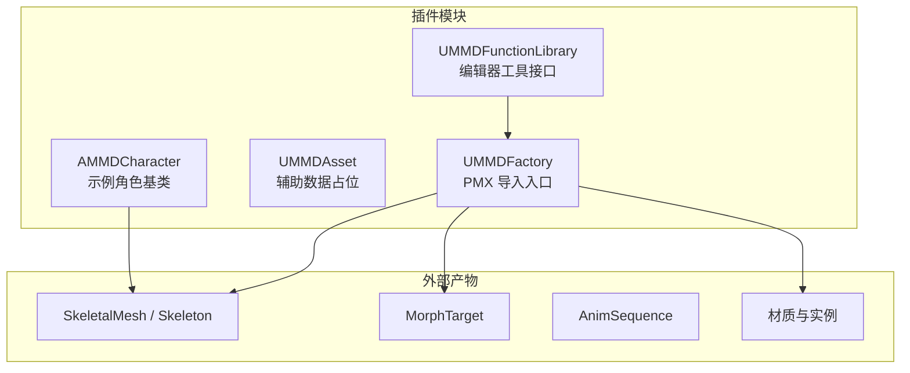
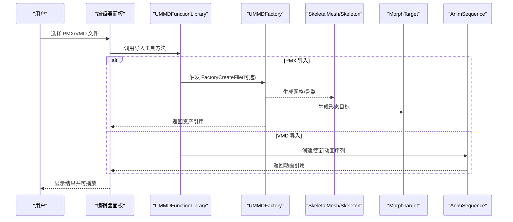
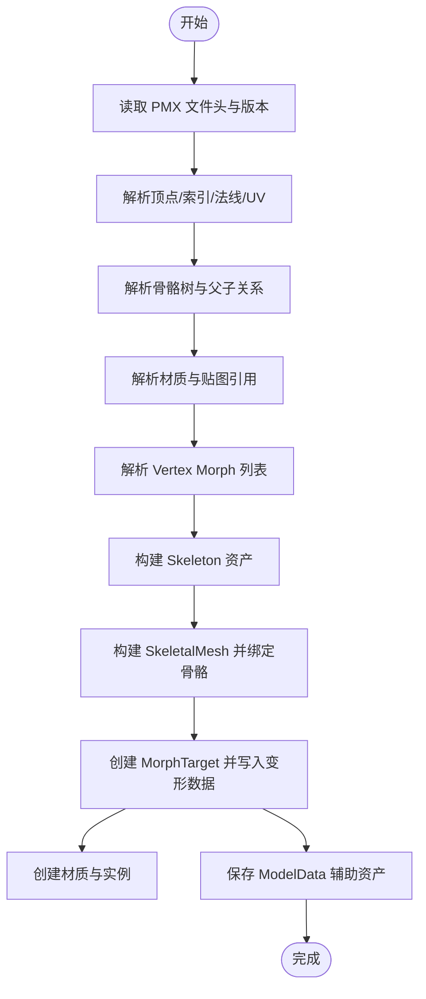
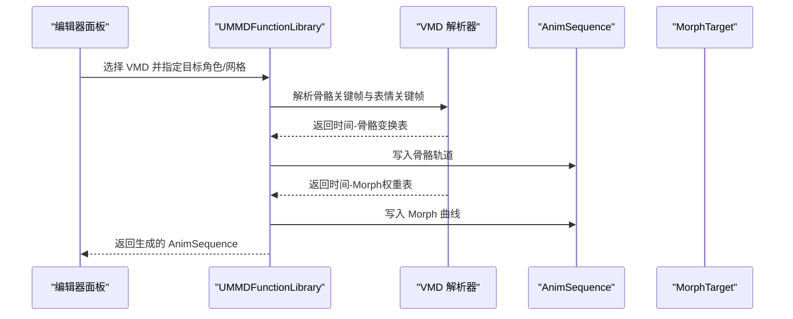
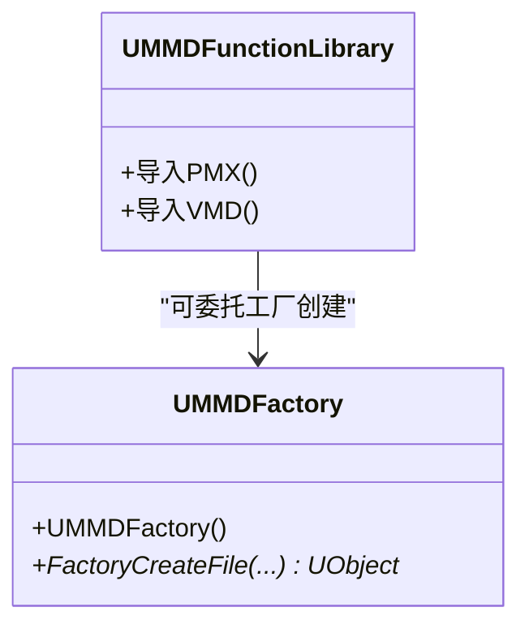
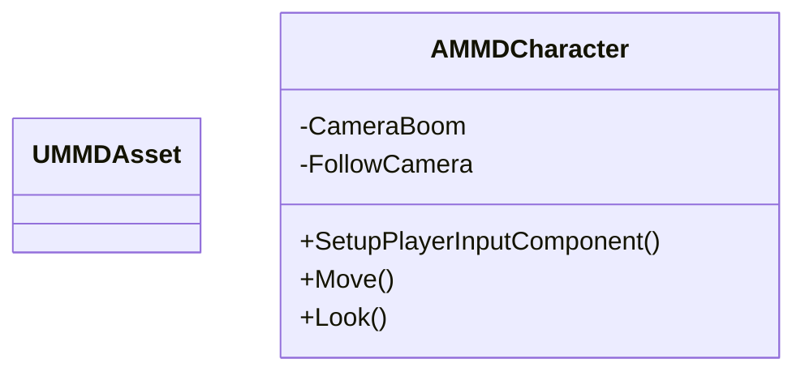
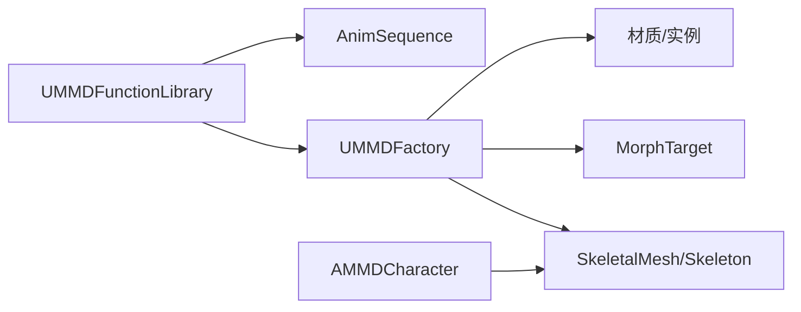

# 核心功能

<cite>
**本文引用的文件**   
- [README.md](file://README.md)
- [MMDFactory.h](file://MMD/Source/MMD/MMDFactory.h)
- [MMDFactory.cpp](file://MMD/Source/MMD/MMDFactory.cpp)
- [MMDFunctionLibrary.h](file://MMD/Source/MMD/MMDFunctionLibrary.h)
- [MMDFunctionLibrary.cpp](file://MMD/Source/MMD/MMDFunctionLibrary.cpp)
- [MMDAsset.h](file://MMD/Source/MMD/MMDAsset.h)
- [MMDAsset.cpp](file://MMD/Source/MMD/MMDAsset.cpp)
- [MMDCharacter.h](file://MMD/Source/MMD/MMDCharacter.h)
- [MMDCharacter.cpp](file://MMD/Source/MMD/MMDCharacter.cpp)
</cite>

## 目录
1. [简介](#简介)
2. [项目结构](#项目结构)
3. [核心组件](#核心组件)
4. [架构总览](#架构总览)
5. [详细组件分析](#详细组件分析)
6. [依赖关系分析](#依赖关系分析)
7. [性能考量](#性能考量)
8. [故障排查指南](#故障排查指南)
9. [结论](#结论)
10. [附录](#附录)

## 简介
本文件聚焦于 MMDUETools 的核心功能，围绕 PMX 模型导入、VMD 动画处理与资产工厂模式展开，系统阐述从 MMD 数据到 UE 原生资产的转换流程。文档面向不同技术背景的读者，既提供高层概览，也给出代码级结构与关键实现路径的指引，帮助开发者理解并扩展插件能力。

## 项目结构
仓库采用典型的 UE 插件组织方式：
- Source/MMD：C++ 模块源码，包含工厂、函数库、角色等基础骨架
- Content：示例资源与内容（非本次重点）
- docs：在线文档入口
- README：使用说明与功能说明

图表来源
- [MMDFactory.h:12-22](file://MMD/Source/MMD/MMDFactory.h#L12-L22)
- [MMDFunctionLibrary.h:12-18](file://MMD/Source/MMD/MMDFunctionLibrary.h#L12-L18)
- [MMDAsset.h:12-17](file://MMD/Source/MMD/MMDAsset.h#L12-L17)
- [MMDCharacter.h:18-21](file://MMD/Source/MMD/MMDCharacter.h#L18-L21)

章节来源
- [README.md:1-130](file://README.md#L1-L130)

## 核心组件
- UMMDFactory：负责将 PMX 文件导入为 UE 资产，当前已注册 pmx 格式，但 FactoryCreateFile 尚未实现具体逻辑。
- UMMDFunctionLibrary：继承自编辑器工具库，用于暴露编辑器侧的导入/处理工具方法（当前为空壳）。
- UMMDAsset：作为辅助数据占位对象，可用于保存模型元信息或中间态数据。
- AMMDCharacter：示例角色基类，展示输入、相机与移动配置，便于后续挂载 SkeletalMesh 与 AnimBlueprint。

章节来源
- [MMDFactory.h:12-22](file://MMD/Source/MMD/MMDFactory.h#L12-L22)
- [MMDFactory.cpp:6-14](file://MMD/Source/MMD/MMDFactory.cpp#L6-L14)
- [MMDFunctionLibrary.h:12-18](file://MMD/Source/MMD/MMDFunctionLibrary.h#L12-L18)
- [MMDFunctionLibrary.cpp:1-5](file://MMD/Source/MMD/MMDFunctionLibrary.cpp#L1-L5)
- [MMDAsset.h:12-17](file://MMD/Source/MMD/MMDAsset.h#L12-L17)
- [MMDAsset.cpp:1-5](file://MMD/Source/MMD/MMDAsset.cpp#L1-L5)
- [MMDCharacter.h:18-73](file://MMD/Source/MMD/MMDCharacter.h#L18-L73)
- [MMDCharacter.cpp:19-55](file://MMD/Source/MMD/MMDCharacter.cpp#L19-L55)

## 架构总览
整体工作流遵循“PMX -> 静态资产 + 动画”的双通道：
- PMX 导入：解析顶点、索引、法线、UV、材质、骨骼，生成 SkeletalMesh/Skeleton/MorphTarget/材质，并输出 ModelData 辅助资产。
- VMD 导入：解析骨骼与 Morph 关键帧，写入 AnimSequence 的骨骼轨道与表情曲线，支持坐标系转换与 IK/追加骨骼烘焙。

图表来源
- [MMDFactory.cpp:6-14](file://MMD/Source/MMD/MMDFactory.cpp#L6-L14)
- [MMDFunctionLibrary.h:12-18](file://MMD/Source/MMD/MMDFunctionLibrary.h#L12-L18)
- [README.md:91-110](file://README.md#L91-L110)

## 详细组件分析

### PMX 模型导入系统
- 顶点与索引：读取 PMX 顶点、面片索引，构建渲染所需的基础几何数据。
- 法线与 UV：按渲染管线要求重建/补全法线与 UV 通道。
- 材质系统：根据 PMX 材质定义生成 UE 材质与材质实例，建立贴图与参数映射。
- 骨骼结构：解析 PMX 骨骼树，生成 Skeleton，并将 Mesh 绑定至 Skeleton。
- MorphTarget：将 PMX vertex morph 转换为 UE MorphTarget，修正顶点映射避免表情扭曲；支持 Group/Flip Morph 展开。
- 辅助数据：保存 ModelData，记录命名、索引映射、IK/追加骨骼信息等，便于后续动画驱动。

图表来源
- [README.md:91-103](file://README.md#L91-L103)

章节来源
- [README.md:91-103](file://README.md#L91-L103)

### VMD 动画处理机制
- 骨骼动画轨道：解析 VMD 骨骼关键帧，按时间轴采样，写入 AnimSequence 的骨骼变换轨道。
- 表情曲线映射：解析 VMD 表情关键帧，映射到对应 MorphTarget，写入 AnimSequence 的 float curves。
- 坐标系转换：在导入阶段进行 MMD 到 UE 坐标系的统一转换，确保位移/旋转一致。
- IK/追加骨骼烘焙：对 IK 链与追加骨骼进行预计算或烘焙，保证动画回放稳定。

图表来源
- [README.md:105-110](file://README.md#L105-L110)

章节来源
- [README.md:105-110](file://README.md#L105-L110)

### 资产工厂模式与 UMMDFactory
- 工厂职责：注册 pmx 文件格式，并在编辑器导入流程中接管 PMX 文件的资产创建。
- 当前状态：构造函数中已添加 pmx 格式；FactoryCreateFile 未实现具体逻辑，需在此处协调各子系统完成 PMX 到 UE 资产的生成。
- 扩展建议：在 FactoryCreateFile 中调用解析器与构建器，依次生成 Skeleton、SkeletalMesh、MorphTarget、材质与 ModelData，并返回创建的根资产。

图表来源
- [MMDFactory.h:12-22](file://MMD/Source/MMD/MMDFactory.h#L12-L22)
- [MMDFactory.cpp:6-14](file://MMD/Source/MMD/MMDFactory.cpp#L6-L14)
- [MMDFunctionLibrary.h:12-18](file://MMD/Source/MMD/MMDFunctionLibrary.h#L12-L18)

章节来源
- [MMDFactory.h:12-22](file://MMD/Source/MMD/MMDFactory.h#L12-L22)
- [MMDFactory.cpp:6-14](file://MMD/Source/MMD/MMDFactory.cpp#L6-L14)
- [MMDFunctionLibrary.h:12-18](file://MMD/Source/MMD/MMDFunctionLibrary.h#L12-L18)

### 辅助数据与角色基类
- UMMDAsset：作为空壳对象，可用于承载模型元数据、骨骼/材质映射、IK 配置等辅助信息。
- AMMDCharacter：示例角色基类，演示了输入绑定、相机与移动组件的配置，可作为 MMD 角色的宿主载体。

图表来源
- [MMDAsset.h:12-17](file://MMD/Source/MMD/MMDAsset.h#L12-L17)
- [MMDCharacter.h:18-73](file://MMD/Source/MMD/MMDCharacter.h#L18-L73)
- [MMDCharacter.cpp:74-129](file://MMD/Source/MMD/MMDCharacter.cpp#L74-L129)

章节来源
- [MMDAsset.h:12-17](file://MMD/Source/MMD/MMDAsset.h#L12-L17)
- [MMDCharacter.h:18-73](file://MMD/Source/MMD/MMDCharacter.h#L18-L73)
- [MMDCharacter.cpp:74-129](file://MMD/Source/MMD/MMDCharacter.cpp#L74-L129)

## 依赖关系分析
- 模块内依赖：
  - UMMDFunctionLibrary 依赖编辑器工具框架，可调用工厂与解析器。
  - UMMDFactory 依赖 UE 资产创建 API，负责生成 SkeletalMesh/Skeleton/MorphTarget/材质。
  - AMMDCharacter 依赖引擎输入与相机子系统，作为运行时载体。
- 外部依赖：
  - PMX/VMD 解析器（未在源码中直接出现，需在工厂或工具库中集成）。
  - Bullet 物理（实验性，用于刚体/Joint 模拟）。

图表来源
- [MMDFunctionLibrary.h:12-18](file://MMD/Source/MMD/MMDFunctionLibrary.h#L12-L18)
- [MMDFactory.h:12-22](file://MMD/Source/MMD/MMDFactory.h#L12-L22)
- [MMDCharacter.h:18-21](file://MMD/Source/MMD/MMDCharacter.h#L18-L21)

章节来源
- [MMDFunctionLibrary.h:12-18](file://MMD/Source/MMD/MMDFunctionLibrary.h#L12-L18)
- [MMDFactory.h:12-22](file://MMD/Source/MMD/MMDFactory.h#L12-L22)
- [MMDCharacter.h:18-21](file://MMD/Source/MMD/MMDCharacter.h#L18-L21)

## 性能考量
- 批量 I/O：PMX/VMD 解析应使用缓冲与流式读取，减少内存峰值。
- 并行化：顶点/索引/UV/法线/材质/骨骼/形变可并行处理，最后合并。
- 去重与缓存：材质与贴图引用去重，避免重复创建；常用矩阵/变换缓存复用。
- 动画压缩：对关键帧进行稀疏化与插值优化，降低 AnimSequence 体积。
- 资源管理：按需加载 MorphTarget 与材质实例，避免一次性全部驻留内存。

[本节为通用指导，不直接分析具体文件]

## 故障排查指南
- 导入无响应或返回空：检查 UMMDFactory::FactoryCreateFile 是否已实现并正确返回资产；确认 PMX 文件路径与权限。
- 表情扭曲或缺失：核对 MorphTarget 映射与 Group/Flip Morph 展开逻辑；验证顶点索引一致性。
- 动画错位或不生效：确认坐标系转换是否正确；检查骨骼命名与 IK/追加骨骼烘焙结果。
- 材质异常：检查材质参数映射与贴图路径；必要时回退到默认材质以定位问题。

章节来源
- [MMDFactory.cpp:11-14](file://MMD/Source/MMD/MMDFactory.cpp#L11-L14)
- [README.md:91-110](file://README.md#L91-L110)

## 结论
当前仓库提供了清晰的插件骨架与编辑器入口，具备扩展为完整 PMX/VMD 导入系统的条件。建议在 UMMDFactory 与 UMMDFunctionLibrary 中补齐解析与构建逻辑，完善 PMX 到 SkeletalMesh/Skeleton/MorphTarget/材质的流水线，以及 VMD 到 AnimSequence 的骨骼与表情曲线写入流程。配合性能优化与错误处理，即可形成稳定可用的 MMD 资产生产管线。

[本节为总结性内容，不直接分析具体文件]

## 附录
- 使用参考：参见 README 中的安装、导入与播放步骤，了解端到端工作流与产出资产类型。
- 扩展建议：
  - 在 UMMDFunctionLibrary 中新增导入 PMX/VMD 的蓝图/编辑器工具方法。
  - 在 UMMDFactory::FactoryCreateFile 中实现 PMX 解析与资产生成。
  - 引入独立的 PMX/VMD 解析库，封装数据结构与算法，保持工厂与工具库的职责清晰。

章节来源
- [README.md:21-88](file://README.md#L21-L88)