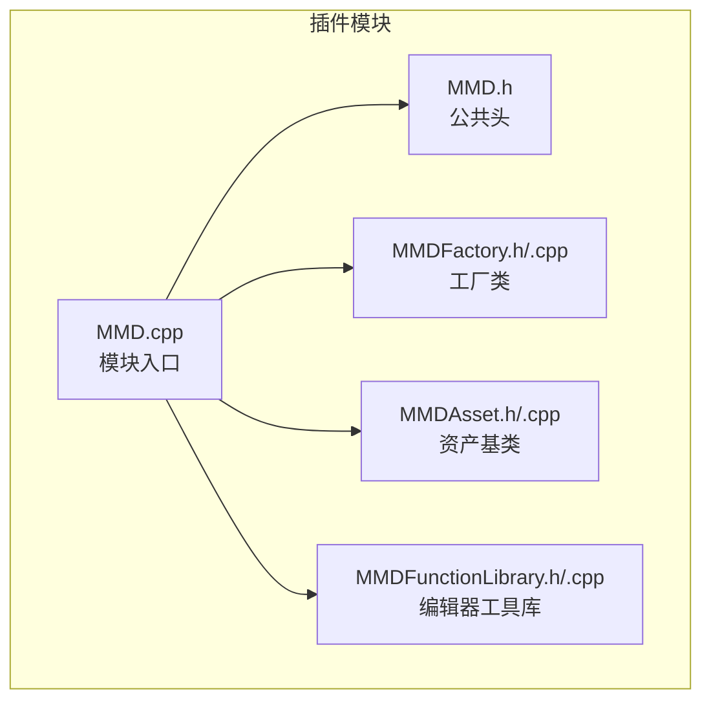
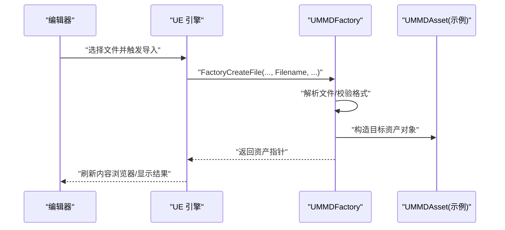
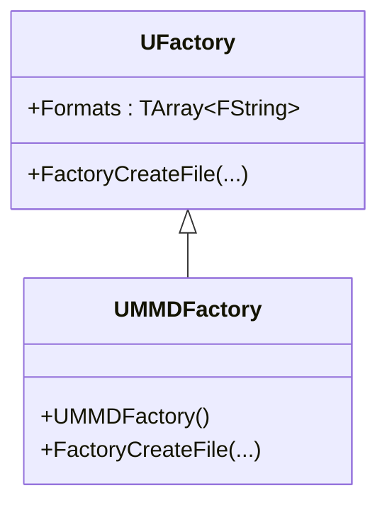
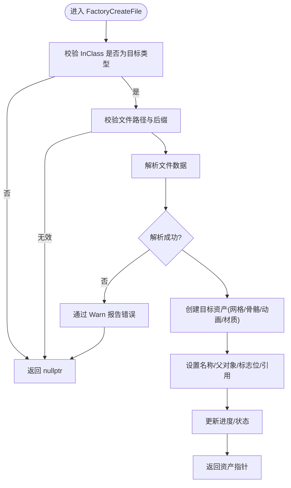
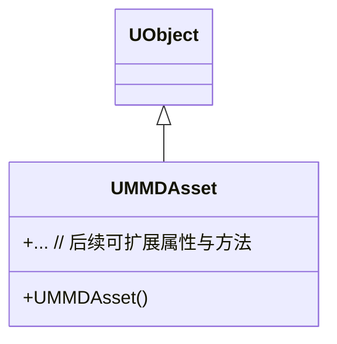
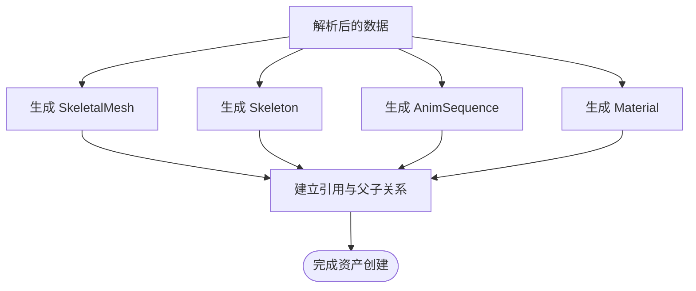
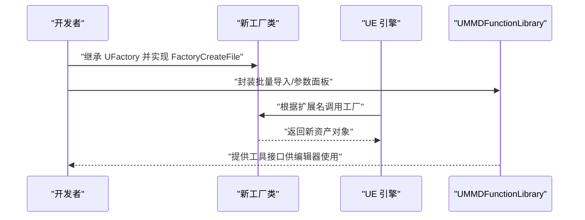
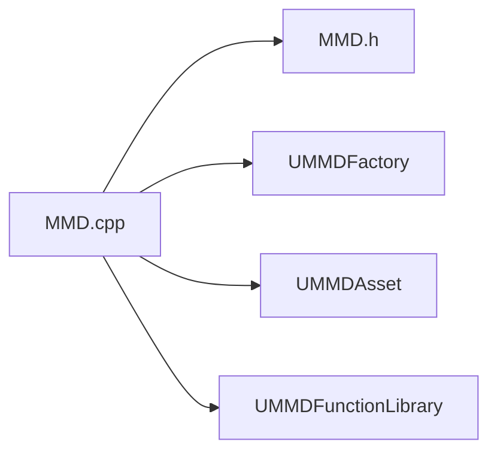

# 资产工厂系统

<cite>
**本文引用的文件**   
- [MMDFactory.h](file://MMD/Source/MMD/MMDFactory.h)
- [MMDFactory.cpp](file://MMD/Source/MMD/MMDFactory.cpp)
- [MMDAsset.h](file://MMD/Source/MMD/MMDAsset.h)
- [MMDAsset.cpp](file://MMD/Source/MMD/MMDAsset.cpp)
- [MMDFunctionLibrary.h](file://MMD/Source/MMD/MMDFunctionLibrary.h)
- [MMDFunctionLibrary.cpp](file://MMD/Source/MMD/MMDFunctionLibrary.cpp)
- [MMD.h](file://MMD/Source/MMD/MMD.h)
- [MMD.cpp](file://MMD/Source/MMD/MMD.cpp)
</cite>

## 目录
1. [简介](#简介)
2. [项目结构](#项目结构)
3. [核心组件](#核心组件)
4. [架构总览](#架构总览)
5. [详细组件分析](#详细组件分析)
6. [依赖关系分析](#依赖关系分析)
7. [性能考虑](#性能考虑)
8. [故障排查指南](#故障排查指南)
9. [结论](#结论)
10. [附录](#附录)

## 简介
本文件面向“资产工厂系统”，聚焦于在 UE 插件中通过工厂模式将外部文件格式（如 PMX）导入为引擎资产。文档围绕以下目标展开：
- 深入解释 UMMDFactory 类的设计模式与实现原理，说明工厂模式在 UE 插件中的使用方式。
- 详细说明 FactoryCreateFile 方法的执行流程，从文件识别到资产创建的完整过程。
- 描述 UMMDAsset 数据结构的设计，包括属性定义、序列化支持与版本兼容性管理。
- 解释不同类型资产的创建策略，涵盖 SkeletalMesh、Skeleton、AnimSequence 与 Material 的生成逻辑。
- 提供扩展指南，展示如何添加新的文件格式支持或自定义资产类型。
- 包含错误处理机制、进度反馈和用户交互的最佳实践。

## 项目结构
当前仓库中与资产工厂系统直接相关的源码位于 MMD/Source/MMD 目录下，核心文件如下：
- 工厂入口：UMMDFactory（继承自 UFactory），负责声明支持的格式并实现 FactoryCreateFile。
- 资产基类：UMMDAsset（继承自 UObject），作为未来资产数据结构的承载基类。
- 编辑器工具库：UMMDFunctionLibrary（继承自 UEditorUtilityLibrary），可用于封装批量导入、UI 交互等能力。
- 模块入口：MMD.h / MMD.cpp，用于注册游戏模块。

图表来源
- [MMD.cpp:1-7](file://MMD/Source/MMD/MMD.cpp#L1-L7)
- [MMD.h:1-6](file://MMD/Source/MMD/MMD.h#L1-L6)
- [MMDFactory.h:1-23](file://MMD/Source/MMD/MMDFactory.h#L1-L23)
- [MMDFactory.cpp:1-15](file://MMD/Source/MMD/MMDFactory.cpp#L1-L15)
- [MMDAsset.h:1-18](file://MMD/Source/MMD/MMDAsset.h#L1-L18)
- [MMDAsset.cpp:1-6](file://MMD/Source/MMD/MMDAsset.cpp#L1-L6)
- [MMDFunctionLibrary.h:1-19](file://MMD/Source/MMD/MMDFunctionLibrary.h#L1-L19)
- [MMDFunctionLibrary.cpp:1-6](file://MMD/Source/MMD/MMDFunctionLibrary.cpp#L1-L6)

章节来源
- [MMD.cpp:1-7](file://MMD/Source/MMD/MMD.cpp#L1-L7)
- [MMD.h:1-6](file://MMD/Source/MMD/MMD.h#L1-L6)
- [MMDFactory.h:1-23](file://MMD/Source/MMD/MMDFactory.h#L1-L23)
- [MMDFactory.cpp:1-15](file://MMD/Source/MMD/MMDFactory.cpp#L1-L15)
- [MMDAsset.h:1-18](file://MMD/Source/MMD/MMDAsset.h#L1-L18)
- [MMDAsset.cpp:1-6](file://MMD/Source/MMD/MMDAsset.cpp#L1-L6)
- [MMDFunctionLibrary.h:1-19](file://MMD/Source/MMD/MMDFunctionLibrary.h#L1-L19)
- [MMDFunctionLibrary.cpp:1-6](file://MMD/Source/MMD/MMDFunctionLibrary.cpp#L1-L6)

## 核心组件
- UMMDFactory：继承自 UFactory，用于声明支持的导入格式，并在编辑器触发导入时由引擎调用 FactoryCreateFile 完成具体资产创建。
- UMMDAsset：继承自 UObject，作为未来资产数据结构的基类，可承载解析后的模型、骨骼、动画、材质等元信息。
- UMMDFunctionLibrary：继承自 UEditorUtilityLibrary，可作为编辑器侧的工具函数集合，提供批量导入、参数配置、进度反馈等能力。

章节来源
- [MMDFactory.h:12-22](file://MMD/Source/MMD/MMDFactory.h#L12-L22)
- [MMDFactory.cpp:6-14](file://MMD/Source/MMD/MMDFactory.cpp#L6-L14)
- [MMDAsset.h:12-17](file://MMD/Source/MMD/MMDAsset.h#L12-L17)
- [MMDFunctionLibrary.h:12-18](file://MMD/Source/MMD/MMDFunctionLibrary.h#L12-L18)

## 架构总览
下图展示了编辑器发起导入请求后，UE 引擎如何通过工厂机制调度 UMMDFactory，并最终返回目标资产对象的高层流程。

图表来源
- [MMDFactory.h:19-21](file://MMD/Source/MMD/MMDFactory.h#L19-L21)
- [MMDFactory.cpp:11-14](file://MMD/Source/MMD/MMDFactory.cpp#L11-L14)

## 详细组件分析

### UMMDFactory 设计与实现
- 设计模式：工厂模式。通过继承 UFactory 并覆盖 FactoryCreateFile，将“文件格式→资产对象”的映射集中管理。
- 格式声明：在构造函数中将支持的扩展名与描述添加到 Formats，使编辑器能识别该工厂。
- 工厂方法：FactoryCreateFile 是引擎回调入口，接收目标 UClass、父对象、名称、标志位、文件路径、参数、反馈上下文与取消标志，应在此处完成解析与资产构建。

图表来源
- [MMDFactory.h:12-22](file://MMD/Source/MMD/MMDFactory.h#L12-L22)
- [MMDFactory.cpp:6-14](file://MMD/Source/MMD/MMDFactory.cpp#L6-L14)

章节来源
- [MMDFactory.h:12-22](file://MMD/Source/MMD/MMDFactory.h#L12-L22)
- [MMDFactory.cpp:6-14](file://MMD/Source/MMD/MMDFactory.cpp#L6-L14)

### FactoryCreateFile 执行流程
当前实现返回空指针，表示尚未实现具体导入逻辑。建议流程如下：
- 输入校验：检查 InClass 是否为期望的资产类型；校验 Filename 是否存在且后缀匹配。
- 文件解析：读取二进制/文本数据，解析 PMX 或其他格式的头部与资源段。
- 资源创建：根据解析结果创建 SkeletalMesh、Skeleton、AnimSequence、Material 等目标资产。
- 关联与命名：设置资产名称、父对象、对象标志位，建立引用关系。
- 反馈与取消：通过 FFeedbackContext 报告进度与错误，响应 bOutOperationCanceled。
- 返回值：返回成功创建的 UObject 指针；失败则返回 nullptr 并通过 Warn 提示。

图表来源
- [MMDFactory.h:19-21](file://MMD/Source/MMD/MMDFactory.h#L19-L21)
- [MMDFactory.cpp:11-14](file://MMD/Source/MMD/MMDFactory.cpp#L11-L14)

章节来源
- [MMDFactory.h:19-21](file://MMD/Source/MMD/MMDFactory.h#L19-L21)
- [MMDFactory.cpp:11-14](file://MMD/Source/MMD/MMDFactory.cpp#L11-L14)

### UMMDAsset 数据结构设计
- 基类定位：UMMDAsset 继承自 UObject，便于纳入 UE 的对象系统与垃圾回收。
- 属性定义：可在子类中定义 UPROPERTY 字段以承载模型、骨骼、动画、材质等资源句柄或路径。
- 序列化支持：如需持久化，可使用 UStruct/UObject 的序列化机制，或在导入过程中直接创建引擎原生资产。
- 版本兼容：通过版本号字段与迁移逻辑，确保旧版 PMX 数据在新引擎版本下仍可正确加载。

图表来源
- [MMDAsset.h:12-17](file://MMD/Source/MMD/MMDAsset.h#L12-L17)

章节来源
- [MMDAsset.h:12-17](file://MMD/Source/MMD/MMDAsset.h#L12-L17)
- [MMDAsset.cpp:1-6](file://MMD/Source/MMD/MMDAsset.cpp#L1-L6)

### 不同类型资产的创建策略
- SkeletalMesh：从解析出的顶点、UV、法线、权重与蒙皮数据构建网格，分配 LOD，设置碰撞体。
- Skeleton：依据层级关系与关节名称构建骨架树，绑定骨骼索引与变换。
- AnimSequence：解析关键帧轨迹与时间轴，生成动画片段，设置采样率与循环模式。
- Material：根据纹理路径与着色器参数创建材质实例，设置贴图通道与混合模式。

[本节为概念性说明，不直接分析具体源文件]

### 扩展指南：新增文件格式或自定义资产类型
- 新增工厂：
  - 新建继承自 UFactory 的类，在构造函数中添加新扩展名到 Formats。
  - 实现 FactoryCreateFile，按上述流程完成解析与资产创建。
- 新增资产类型：
  - 基于 UObject 或现有资产基类（如 UStaticMesh、USkeletalMesh）派生新类。
  - 在 UMMDAsset 或其子类中增加属性与序列化逻辑，必要时实现迁移。
- 集成编辑器：
  - 在 UMMDFunctionLibrary 中暴露批量导入、预览、参数面板等方法。
  - 使用 FFeedbackContext 提供进度条与错误提示，提升用户体验。

[本节为概念性说明，不直接分析具体源文件]

## 依赖关系分析
- 模块级依赖：MMD.cpp 注册主模块，MMD.h 提供公共头，其他组件均依赖此模块。
- 组件耦合：
  - UMMDFactory 依赖 UFactory 提供的框架能力（Formats、回调）。
  - UMMDAsset 依赖 UObject 的基础能力（对象生命周期、反射）。
  - UMMDFunctionLibrary 依赖 UEditorUtilityLibrary，用于编辑器侧工具方法。

图表来源
- [MMD.cpp:1-7](file://MMD/Source/MMD/MMD.cpp#L1-L7)
- [MMD.h:1-6](file://MMD/Source/MMD/MMD.h#L1-L6)
- [MMDFactory.h:12-22](file://MMD/Source/MMD/MMDFactory.h#L12-L22)
- [MMDAsset.h:12-17](file://MMD/Source/MMD/MMDAsset.h#L12-L17)
- [MMDFunctionLibrary.h:12-18](file://MMD/Source/MMD/MMDFunctionLibrary.h#L12-L18)

章节来源
- [MMD.cpp:1-7](file://MMD/Source/MMD/MMD.cpp#L1-L7)
- [MMD.h:1-6](file://MMD/Source/MMD/MMD.h#L1-L6)
- [MMDFactory.h:12-22](file://MMD/Source/MMD/MMDFactory.h#L12-L22)
- [MMDAsset.h:12-17](file://MMD/Source/MMD/MMDAsset.h#L12-L17)
- [MMDFunctionLibrary.h:12-18](file://MMD/Source/MMD/MMDFunctionLibrary.h#L12-L18)

## 性能考虑
- 大文件解析：采用流式读取与分块处理，避免一次性载入全部数据导致内存峰值过高。
- 多线程：将 CPU 密集的数据解析与资源构建放入后台线程，主线程仅负责 UI 反馈与对象创建。
- 增量更新：对重复导入进行缓存与差异计算，减少不必要的重建。
- 资源复用：共享材质、纹理与骨骼数据，降低磁盘与内存占用。
- 日志与监控：记录关键耗时点，便于定位瓶颈。

[本节提供通用指导，不直接分析具体源文件]

## 故障排查指南
- 常见问题：
  - 工厂未生效：确认构造函数已正确添加扩展名到 Formats。
  - 导入无响应：检查 FactoryCreateFile 是否正确返回非空指针，或通过 Warn 输出错误信息。
  - 资源缺失：验证生成的资产引用路径是否正确，确保依赖资源存在。
- 调试建议：
  - 使用 FFeedbackContext 输出详细日志与进度。
  - 在编辑器中启用详细日志级别，捕获导入过程中的异常。
  - 针对特定文件格式编写单元测试，覆盖边界条件与非法输入。

章节来源
- [MMDFactory.cpp:6-14](file://MMD/Source/MMD/MMDFactory.cpp#L6-L14)
- [MMDFactory.h:19-21](file://MMD/Source/MMD/MMDFactory.h#L19-L21)

## 结论
本资产工厂系统以 UMMDFactory 为核心，利用 UE 的工厂模式将外部文件格式无缝接入编辑器工作流。当前代码提供了工厂框架与基础结构，后续可在 FactoryCreateFile 中完善解析与资产创建逻辑，结合 UMMDAsset 与 UMMDFunctionLibrary 形成完整的导入管线。遵循本文档的流程与最佳实践，可高效扩展新的文件格式与资产类型，同时保障稳定性与用户体验。

[本节为总结性内容，不直接分析具体源文件]

## 附录
- 术语表：
  - 工厂模式：通过统一接口创建不同对象的编程模式。
  - 工厂方法：在工厂类中实现的创建对象的具体方法。
  - 反馈上下文：用于向用户报告进度与错误的接口。
- 参考路径：
  - 工厂入口与回调：[MMDFactory.h:19-21](file://MMD/Source/MMD/MMDFactory.h#L19-L21)、[MMDFactory.cpp:11-14](file://MMD/Source/MMD/MMDFactory.cpp#L11-L14)
  - 资产基类：[MMDAsset.h:12-17](file://MMD/Source/MMD/MMDAsset.h#L12-L17)
  - 编辑器工具库：[MMDFunctionLibrary.h:12-18](file://MMD/Source/MMD/MMDFunctionLibrary.h#L12-L18)