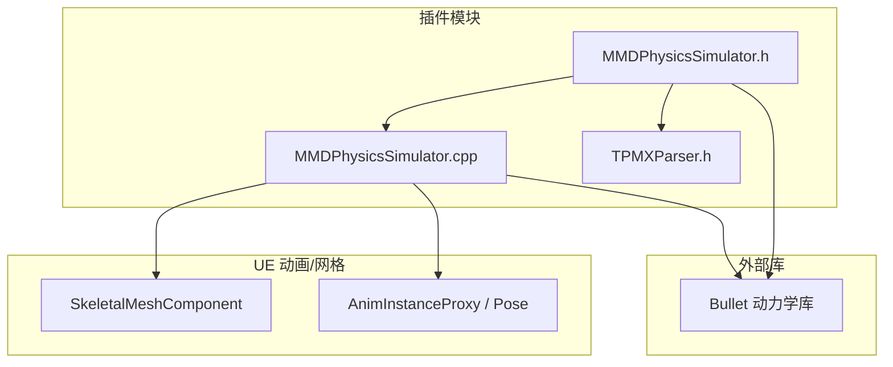
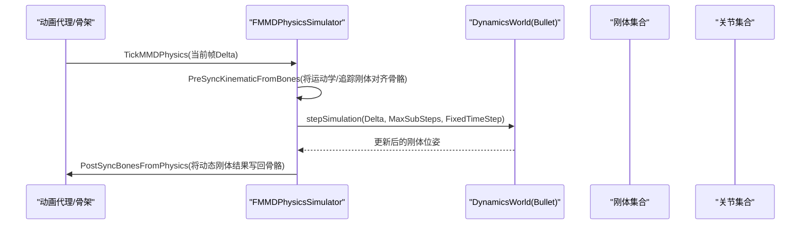
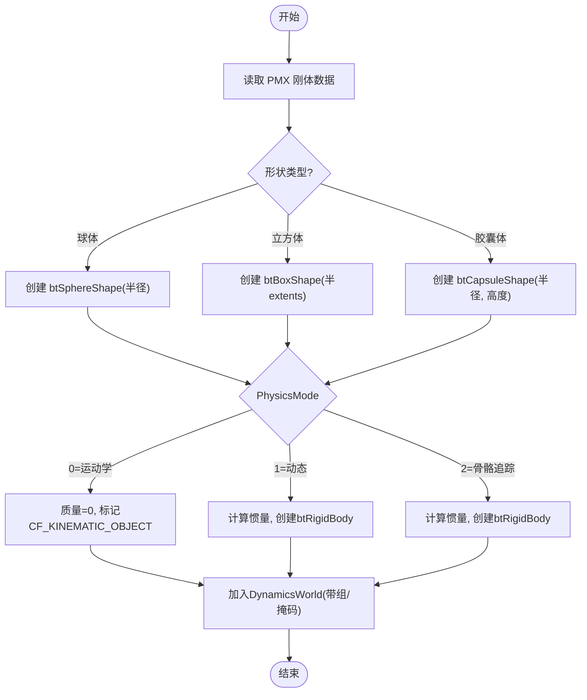
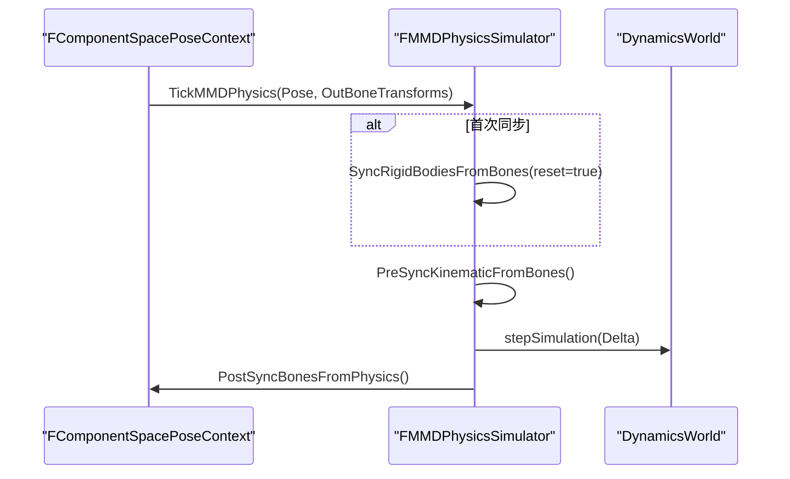
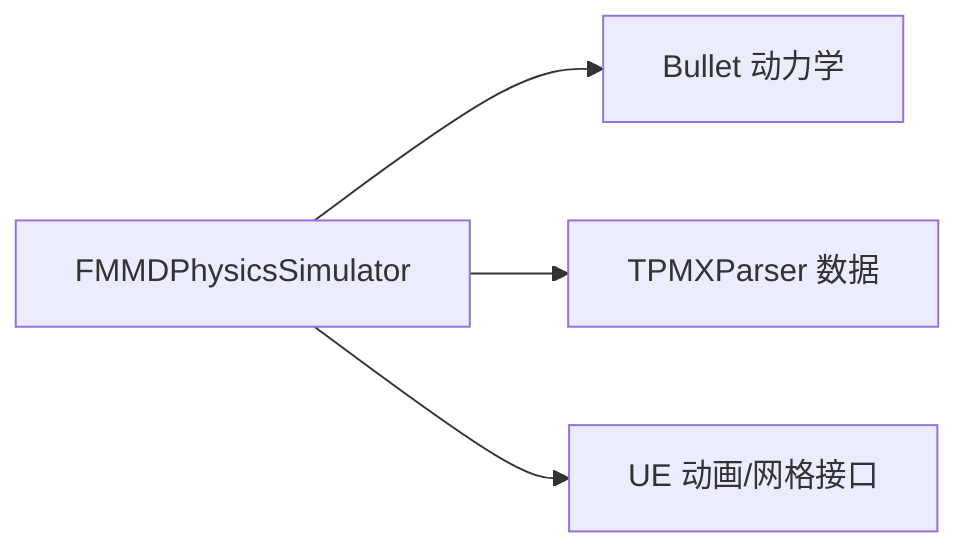

# 物理模拟系统

<cite>
**本文引用的文件**   
- [README.md](file://README.md)
- [MMDPhysicsSimulator.h](file://MMD/Plugins/Ue5MMDTools/Source/Ue5MMDTools/Public/Physics/MMDPhysicsSimulator.h)
- [MMDPhysicsSimulator.cpp](file://MMD/Plugins/Ue5MMDTools/Source/Ue5MMDTools/Private/Physics/MMDPhysicsSimulator.cpp)
- [TPMXParser.h](file://MMD/Plugins/Ue5MMDTools/Source/Ue5MMDTools/Public/Import/TPMXParser.h)
</cite>

## 目录
1. [简介](#简介)
2. [项目结构](#项目结构)
3. [核心组件](#核心组件)
4. [架构总览](#架构总览)
5. [详细组件分析](#详细组件分析)
6. [依赖关系分析](#依赖关系分析)
7. [性能考虑](#性能考虑)
8. [故障排除指南](#故障排除指南)
9. [结论](#结论)
10. [附录](#附录)

## 简介
本文件面向 MMDUETools 的物理模拟子系统，聚焦于基于 Bullet 的 MMD 风格物理集成。内容涵盖：
- 刚体数据处理、Joint 连接管理与物理参数配置
- PMX 物理数据解析与映射（刚体定义、关节约束、物理属性）
- 实验性功能的实现现状、已知限制与调试方法
- 性能优化策略与配置选项
- 与角色/骨骼系统的集成与数据同步机制
- 扩展与排错指导，以及未来发展方向

该功能目前处于实验阶段，适合继续调试与扩展。

章节来源
- [README.md:119-124](file://README.md#L119-L124)

## 项目结构
物理模拟相关代码位于插件模块中，主要包含：
- 头文件：定义模拟器类、运行时刚体数据结构、运动状态桥接等
- 源文件：实现 Bullet 世界初始化、刚体/关节创建、步进仿真、与 UE 骨骼/组件变换的双向同步
- PMX 解析接口：提供刚体与关节数据的结构定义与布局说明



图表来源
- [MMDPhysicsSimulator.h:1-119](file://MMD/Plugins/Ue5MMDTools/Source/Ue5MMDTools/Public/Physics/MMDPhysicsSimulator.h#L1-L119)
- [MMDPhysicsSimulator.cpp:1-704](file://MMD/Plugins/Ue5MMDTools/Source/Ue5MMDTools/Private/Physics/MMDPhysicsSimulator.cpp#L1-L704)
- [TPMXParser.h:336-341](file://MMD/Plugins/Ue5MMDTools/Source/Ue5MMDTools/Public/Import/TPMXParser.h#L336-L341)

章节来源
- [MMDPhysicsSimulator.h:1-119](file://MMD/Plugins/Ue5MMDTools/Source/Ue5MMDTools/Public/Physics/MMDPhysicsSimulator.h#L1-L119)
- [MMDPhysicsSimulator.cpp:1-704](file://MMD/Plugins/Ue5MMDTools/Source/Ue5MMDTools/Private/Physics/MMDPhysicsSimulator.cpp#L1-L704)
- [TPMXParser.h:336-341](file://MMD/Plugins/Ue5MMDTools/Source/Ue5MMDTools/Public/Import/TPMXParser.h#L336-L341)

## 核心组件
- 运动状态桥接 FMMDMotionState：在 UE FTransform 与 Bullet btTransform 之间进行坐标轴与单位换算
- 运行时刚体 BulletMMDRigidRuntime：封装碰撞形状、刚体指针、运动状态、关联骨骼索引、偏移、模式与碰撞组/掩码
- 物理模拟器 FMMDPhysicsSimulator：负责 Bullet 世界生命周期管理、刚体/关节初始化、步进仿真、与骨骼/组件变换同步

关键职责
- 初始化：从 PMX 数据构建刚体与关节，注册到 DynamicsWorld
- 同步：将骨骼或组件变换写入刚体（前同步），或将刚体结果写回骨骼（后同步）
- 步进：按固定时间步长推进 Bullet 仿真
- 清理：释放所有 Bullet 资源并重置状态

章节来源
- [MMDPhysicsSimulator.h:7-53](file://MMD/Plugins/Ue5MMDTools/Source/Ue5MMDTools/Public/Physics/MMDPhysicsSimulator.h#L7-L53)
- [MMDPhysicsSimulator.h:55-118](file://MMD/Plugins/Ue5MMDTools/Source/Ue5MMDTools/Public/Physics/MMDPhysicsSimulator.h#L55-L118)
- [MMDPhysicsSimulator.cpp:123-158](file://MMD/Plugins/Ue5MMDTools/Source/Ue5MMDTools/Private/Physics/MMDPhysicsSimulator.cpp#L123-L158)

## 架构总览
下图展示了物理系统与 UE 骨骼/组件及 Bullet 世界的交互流程。



图表来源
- [MMDPhysicsSimulator.cpp:504-520](file://MMD/Plugins/Ue5MMDTools/Source/Ue5MMDTools/Private/Physics/MMDPhysicsSimulator.cpp#L504-L520)
- [MMDPhysicsSimulator.cpp:627-633](file://MMD/Plugins/Ue5MMDTools/Source/Ue5MMDTools/Private/Physics/MMDPhysicsSimulator.cpp#L627-L633)

## 详细组件分析

### 坐标系与单位换算
- 坐标轴映射：Bullet(x,y,z) ↔ UE(X,Y,Z) 采用 X→X, Y→Z, Z→-Y 的映射；四元数分量对应重排
- 单位换算：PMX 单位 → 米（MMD_SCALE），再转换为 UE 厘米（UE_CM_PER_M）；内部常量 UNIT_SCALE 用于统一缩放
- 工具函数：BulletToUE、UEToBullet、PMXDataToUETransform、PMXToUETransform 等完成双向转换

章节来源
- [MMDPhysicsSimulator.cpp:9-11](file://MMD/Plugins/Ue5MMDTools/Source/Ue5MMDTools/Private/Physics/MMDPhysicsSimulator.cpp#L9-L11)
- [MMDPhysicsSimulator.cpp:12-39](file://MMD/Plugins/Ue5MMDTools/Source/Ue5MMDTools/Private/Physics/MMDPhysicsSimulator.cpp#L12-L39)
- [MMDPhysicsSimulator.cpp:40-80](file://MMD/Plugins/Ue5MMDTools/Source/Ue5MMDTools/Private/Physics/MMDPhysicsSimulator.cpp#L40-L80)

### 刚体创建与参数映射
- 碰撞形状：支持球体、立方体、胶囊体；尺寸按 PMX Size 与 MMD_SCALE 换算为 Bullet 半 extents 或半径/高度
- 质量与惯量：根据 PhysicsMode 设置质量与惯性；运动学刚体质量为 0 并标记 CF_KINEMATIC_OBJECT
- 阻尼与摩擦：线性/角阻尼、摩擦系数、恢复系数从 PMX 数据映射
- 碰撞组/掩码：CollisionGroup 以位域表示，CollisionMask 直接传入
- 初始位置与偏移：计算“刚体世界”和“骨骼世界”，得到 ShapeOffset（Bone→Rigid 局部偏移）



图表来源
- [MMDPhysicsSimulator.cpp:81-120](file://MMD/Plugins/Ue5MMDTools/Source/Ue5MMDTools/Private/Physics/MMDPhysicsSimulator.cpp#L81-L120)
- [MMDPhysicsSimulator.cpp:235-300](file://MMD/Plugins/Ue5MMDTools/Source/Ue5MMDTools/Private/Physics/MMDPhysicsSimulator.cpp#L235-L300)

章节来源
- [MMDPhysicsSimulator.cpp:81-120](file://MMD/Plugins/Ue5MMDTools/Source/Ue5MMDTools/Private/Physics/MMDPhysicsSimulator.cpp#L81-L120)
- [MMDPhysicsSimulator.cpp:235-300](file://MMD/Plugins/Ue5MMDTools/Source/Ue5MMDTools/Private/Physics/MMDPhysicsSimulator.cpp#L235-L300)

### 关节约束（Spring6DOF）
- 约束类型：使用 btGeneric6DofSpringConstraint
- 位置/旋转限制：线性上下限与角上下限由 PMX 数据映射
- 弹簧刚度：对每个轴向可独立启用并设置刚度
- 参考系：在世界空间计算关节锚点，分别表达为 BodyA/B 的局部帧

```mermaid
classDiagram
class FMMDPhysicsSimulator {
+InitializeJoints(SaveJoint)
-BulletJoints : Array<btGeneric6DofSpringConstraint*>
-DynamicsWorld : btDiscreteDynamicsWorld*
}
class BulletMMDRigidRuntime {
+Body : btRigidBody*
+RelatedBoneIndex : int
+ShapeOffset : btTransform
+PhysicsMode : int
+CollisionGroup : int
+CollisionMask : int
}
FMMDPhysicsSimulator --> BulletMMDRigidRuntime : "创建并管理"
FMMDPhysicsSimulator --> "btGeneric6DofSpringConstraint" : "添加至DynamicsWorld"
```

图表来源
- [MMDPhysicsSimulator.cpp:303-362](file://MMD/Plugins/Ue5MMDTools/Source/Ue5MMDTools/Private/Physics/MMDPhysicsSimulator.cpp#L303-L362)
- [MMDPhysicsSimulator.h:103-118](file://MMD/Plugins/Ue5MMDTools/Source/Ue5MMDTools/Public/Physics/MMDPhysicsSimulator.h#L103-L118)

章节来源
- [MMDPhysicsSimulator.cpp:303-362](file://MMD/Plugins/Ue5MMDTools/Source/Ue5MMDTools/Private/Physics/MMDPhysicsSimulator.cpp#L303-L362)

### 与骨骼/组件的同步
- 前同步（PreSync）：将运动学（0）或骨骼追踪（2）模式的刚体对齐到当前骨骼位姿；追踪模式仅锁定平移，保留旋转
- 全同步（Sync）：将所有刚体对齐到当前骨骼位姿，并在首次同步时复位速度与激活状态
- 后同步（PostSync）：将动态刚体的结果反算为骨骼目标变换，输出到 OutBoneTransforms
- 组件变换路径：TickMMDPhysicsOnComponentTransforms 支持直接从组件级 Transform 数组驱动/反馈



图表来源
- [MMDPhysicsSimulator.cpp:364-401](file://MMD/Plugins/Ue5MMDTools/Source/Ue5MMDTools/Private/Physics/MMDPhysicsSimulator.cpp#L364-L401)
- [MMDPhysicsSimulator.cpp:403-435](file://MMD/Plugins/Ue5MMDTools/Source/Ue5MMDTools/Private/Physics/MMDPhysicsSimulator.cpp#L403-L435)
- [MMDPhysicsSimulator.cpp:466-502](file://MMD/Plugins/Ue5MMDTools/Source/Ue5MMDTools/Private/Physics/MMDPhysicsSimulator.cpp#L466-L502)
- [MMDPhysicsSimulator.cpp:504-520](file://MMD/Plugins/Ue5MMDTools/Source/Ue5MMDTools/Private/Physics/MMDPhysicsSimulator.cpp#L504-L520)

### PMX 物理数据解析与映射
- 刚体字段：名称、关联骨骼索引、形状类型、尺寸、位置/旋转、质量、摩擦、恢复、阻尼、碰撞组/掩码等
- 关节字段：类型（如 Spring6DOF）、两刚体索引、位置/旋转、线性/角限位、各轴弹簧刚度等
- 解析入口：通过 InitializeFromPMX 接收已解析的刚体与关节数组，并绑定 SkeletalMeshComponent

章节来源
- [TPMXParser.h:336-341](file://MMD/Plugins/Ue5MMDTools/Source/Ue5MMDTools/Public/Import/TPMXParser.h#L336-L341)
- [MMDPhysicsSimulator.cpp:123-134](file://MMD/Plugins/Ue5MMDTools/Source/Ue5MMDTools/Private/Physics/MMDPhysicsSimulator.cpp#L123-L134)

### 配置与自定义
- 仿真步长：ConfigureSimulation 允许设置 FixedTimeStep 与 MaxSubSteps，并自动计算 MaxDeltaSeconds
- 重力：默认向下重力（单位 m/s²）
- 碰撞过滤：通过 CollisionGroup 与 CollisionMask 控制刚体间接触
- 调试开关：SetDebugEnabled 预留接口（具体绘制逻辑可按需实现）

章节来源
- [MMDPhysicsSimulator.cpp:136-141](file://MMD/Plugins/Ue5MMDTools/Source/Ue5MMDTools/Private/Physics/MMDPhysicsSimulator.cpp#L136-L141)
- [MMDPhysicsSimulator.cpp:157-158](file://MMD/Plugins/Ue5MMDTools/Source/Ue5MMDTools/Private/Physics/MMDPhysicsSimulator.cpp#L157-L158)
- [MMDPhysicsSimulator.h:88-89](file://MMD/Plugins/Ue5MMDTools/Source/Ue5MMDTools/Public/Physics/MMDPhysicsSimulator.h#L88-L89)

## 依赖关系分析
- 外部依赖：Bullet 动力学库（btBulletDynamicsCommon.h）
- 内部依赖：TPMXParser.h（PMX 物理数据定义）、UE 动画/网格接口（AnimInstanceProxy、SkeletalMeshComponent）
- 耦合关系：
  - 模拟器与骨骼/组件强耦合（需要获取当前帧位姿与组件变换）
  - 与 Bullet 世界弱耦合（通过标准 API 交互）
  - 与 PMX 解析层解耦（通过结构化数组传递）



图表来源
- [MMDPhysicsSimulator.h:3-5](file://MMD/Plugins/Ue5MMDTools/Source/Ue5MMDTools/Public/Physics/MMDPhysicsSimulator.h#L3-L5)
- [MMDPhysicsSimulator.cpp:1-4](file://MMD/Plugins/Ue5MMDTools/Source/Ue5MMDTools/Private/Physics/MMDPhysicsSimulator.cpp#L1-L4)

章节来源
- [MMDPhysicsSimulator.h:1-119](file://MMD/Plugins/Ue5MMDTools/Source/Ue5MMDTools/Public/Physics/MMDPhysicsSimulator.h#L1-L119)
- [MMDPhysicsSimulator.cpp:1-704](file://MMD/Plugins/Ue5MMDTools/Source/Ue5MMDTools/Private/Physics/MMDPhysicsSimulator.cpp#L1-L704)

## 性能考虑
- 固定时间步与子步：合理设置 FixedTimeStep 与 MaxSubSteps，避免过大 Delta 导致不稳定
- 最大增量限制：MaxDeltaSeconds 上限防止卡顿导致的数值爆炸
- 刚体数量与形状复杂度：减少不必要的复杂形状与过多刚体
- 碰撞过滤：利用 CollisionGroup/CollisionMask 降低不必要检测
- 同步频率：仅在必要时执行全同步，优先使用前同步/后同步最小化开销
- 休眠与激活：禁用休眠（DISABLE_DEACTIVATION）保证稳定性，但会增加 CPU 消耗

章节来源
- [MMDPhysicsSimulator.cpp:136-141](file://MMD/Plugins/Ue5MMDTools/Source/Ue5MMDTools/Private/Physics/MMDPhysicsSimulator.cpp#L136-L141)
- [MMDPhysicsSimulator.cpp:252-254](file://MMD/Plugins/Ue5MMDTools/Source/Ue5MMDTools/Private/Physics/MMDPhysicsSimulator.cpp#L252-L254)
- [MMDPhysicsSimulator.cpp:267-268](file://MMD/Plugins/Ue5MMDTools/Source/Ue5MMDTools/Private/Physics/MMDPhysicsSimulator.cpp#L267-L268)
- [MMDPhysicsSimulator.cpp:281-282](file://MMD/Plugins/Ue5MMDTools/Source/Ue5MMDTools/Private/Physics/MMDPhysicsSimulator.cpp#L281-L282)

## 故障排除指南
常见问题与建议
- 无刚体数据：当 PMX 未包含刚体时，初始化会跳过并记录警告；请检查 PMX 是否包含物理数据
- 重复初始化：若刚体已初始化，再次初始化会被跳过；请先调用 Shutdown 清理
- 无效刚体索引：关节引用了不存在的刚体索引将被跳过；请核对 PMX 中的刚体编号
- 空骨骼/组件：缺少 SkeletalMeshComponent 会导致初始化失败；确保传入有效组件
- 坐标/单位异常：确认 PMX 单位与 MMD_SCALE、UNIT_SCALE 一致；检查坐标轴映射是否正确
- 抖动/穿透：调整 FixedTimeStep、MaxSubSteps、阻尼与质量；检查碰撞组/掩码与形状尺寸

定位手段
- 日志输出：关键路径包含错误/警告日志，便于快速定位问题
- 断言检查：多处 checkf 用于捕获非法状态，便于开发期发现错误
- 调试可视化：预留 SetDebugEnabled 接口，可按需实现 DebugDraw 辅助排查

章节来源
- [MMDPhysicsSimulator.cpp:125-134](file://MMD/Plugins/Ue5MMDTools/Source/Ue5MMDTools/Private/Physics/MMDPhysicsSimulator.cpp#L125-L134)
- [MMDPhysicsSimulator.cpp:162-173](file://MMD/Plugins/Ue5MMDTools/Source/Ue5MMDTools/Private/Physics/MMDPhysicsSimulator.cpp#L162-L173)
- [MMDPhysicsSimulator.cpp:305-318](file://MMD/Plugins/Ue5MMDTools/Source/Ue5MMDTools/Private/Physics/MMDPhysicsSimulator.cpp#L305-L318)
- [MMDPhysicsSimulator.cpp:117-118](file://MMD/Plugins/Ue5MMDTools/Source/Ue5MMDTools/Private/Physics/MMDPhysicsSimulator.cpp#L117-L118)

## 结论
MMDUETools 的物理模拟子系统以 Bullet 为核心，实现了 MMD 风格的刚体与关节约束，并与 UE 骨骼/组件系统进行了双向同步。当前版本为实验性质，具备基础能力与可扩展接口，适合进一步调优与功能增强。建议在生产环境中谨慎评估性能与稳定性，结合场景需求调整仿真参数与同步策略。

## 附录

### 配置选项速览
- 固定时间步：FixedTimeStep（秒）
- 最大子步：MaxSubSteps（整数）
- 最大增量：MaxDeltaSeconds（秒）
- 重力：全局重力向量（m/s²）
- 碰撞过滤：CollisionGroup、CollisionMask
- 调试开关：SetDebugEnabled

章节来源
- [MMDPhysicsSimulator.cpp:136-141](file://MMD/Plugins/Ue5MMDTools/Source/Ue5MMDTools/Private/Physics/MMDPhysicsSimulator.cpp#L136-L141)
- [MMDPhysicsSimulator.cpp:157-158](file://MMD/Plugins/Ue5MMDTools/Source/Ue5MMDTools/Private/Physics/MMDPhysicsSimulator.cpp#L157-L158)
- [MMDPhysicsSimulator.h:88-89](file://MMD/Plugins/Ue5MMDTools/Source/Ue5MMDTools/Public/Physics/MMDPhysicsSimulator.h#L88-L89)

### 扩展与定制建议
- 新增形状类型：在 CreateCollisionShape 分支中添加新形状并完善尺寸映射
- 自定义同步策略：在 PreSync/PostSync 中增加滤波或限幅逻辑，改善抖动
- 多世界/多实例：按需拆分 DynamicsWorld 或复用 Solver/Broadphase 提升吞吐
- 快照/回放：可参考注释掉的 CaptureSnapshot/ApplySnapshot 思路实现状态保存与恢复

章节来源
- [MMDPhysicsSimulator.cpp:81-120](file://MMD/Plugins/Ue5MMDTools/Source/Ue5MMDTools/Private/Physics/MMDPhysicsSimulator.cpp#L81-L120)
- [MMDPhysicsSimulator.cpp:364-401](file://MMD/Plugins/Ue5MMDTools/Source/Ue5MMDTools/Private/Physics/MMDPhysicsSimulator.cpp#L364-L401)
- [MMDPhysicsSimulator.cpp:466-502](file://MMD/Plugins/Ue5MMDTools/Source/Ue5MMDTools/Private/Physics/MMDPhysicsSimulator.cpp#L466-L502)