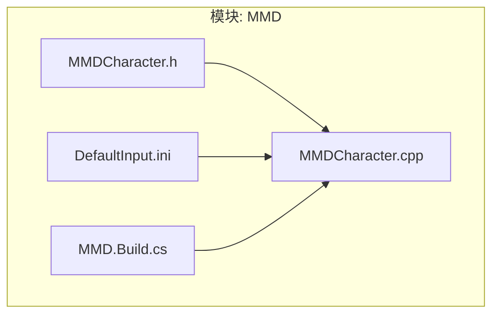
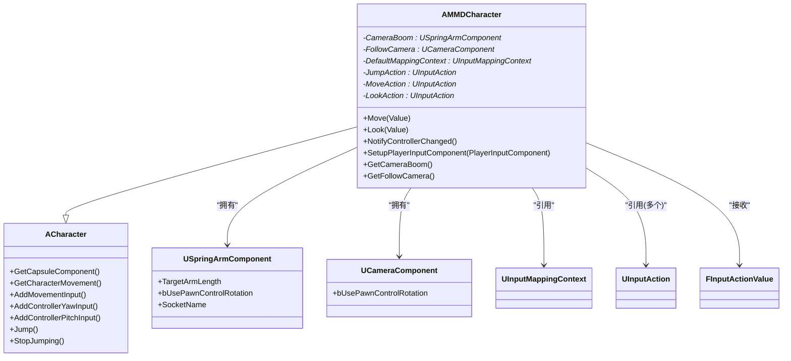
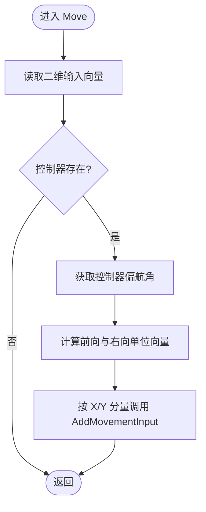
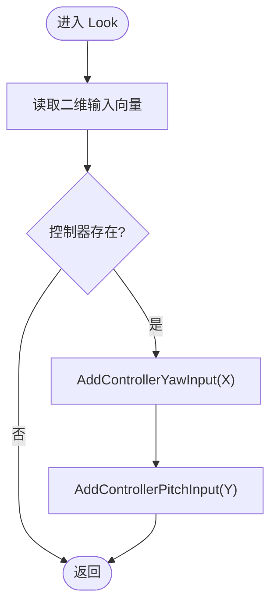
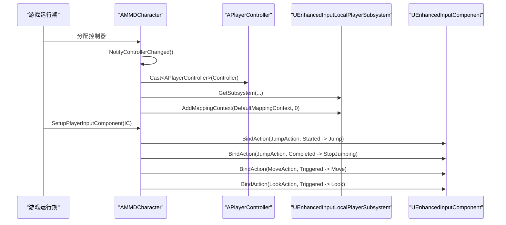
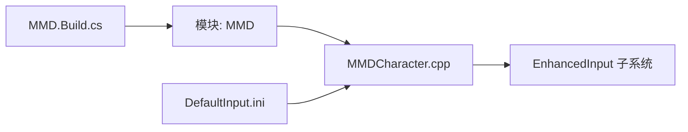

# AMMDCharacter 类设计

<cite>
**本文引用的文件**   
- [MMDCharacter.h](file://MMD/Source/MMD/MMDCharacter.h)
- [MMDCharacter.cpp](file://MMD/Source/MMD/MMDCharacter.cpp)
- [DefaultInput.ini](file://MMD/Config/DefaultInput.ini)
- [MMD.Build.cs](file://MMD/Source/MMD/MMD.Build.cs)
</cite>

## 目录
1. [简介](#简介)
2. [项目结构](#项目结构)
3. [核心组件](#核心组件)
4. [架构总览](#架构总览)
5. [详细组件分析](#详细组件分析)
6. [依赖关系分析](#依赖关系分析)
7. [性能与行为特性](#性能与行为特性)
8. [故障排查指南](#故障排查指南)
9. [结论](#结论)
10. [附录：蓝图使用示例](#附录蓝图使用示例)

## 简介
AMMDCharacter 是 MMD 角色基类，继承自 ACharacter，提供第三人称视角的相机系统、基于增强输入系统的移动与视角控制。该类将相机臂（CameraBoom）与跟随相机（FollowCamera）作为子对象挂载到根组件上，并通过 UInputMappingContext 与 UInputAction 完成输入映射与绑定。Move() 与 Look() 方法分别处理二维输入向量，将其转换为角色的前后左右移动与控制器俯仰/偏航旋转。NotifyControllerChanged() 负责在控制器变化时注册默认映射上下文；SetupPlayerInputComponent() 负责将动作事件绑定到具体回调。

## 项目结构
本类位于插件模块 MMD 中，相关源码与配置如下：
- C++ 实现：MMDCharacter.h / MMDCharacter.cpp
- 输入系统全局配置：DefaultInput.ini
- 模块依赖声明：MMD.Build.cs

图表来源
- [MMDCharacter.h:1-73](file://MMD/Source/MMD/MMDCharacter.h#L1-L73)
- [MMDCharacter.cpp:1-130](file://MMD/Source/MMD/MMDCharacter.cpp#L1-L130)
- [DefaultInput.ini:1-87](file://MMD/Config/DefaultInput.ini#L1-L87)
- [MMD.Build.cs:1-14](file://MMD/Source/MMD/MMD.Build.cs#L1-L14)

章节来源
- [MMDCharacter.h:1-73](file://MMD/Source/MMD/MMDCharacter.h#L1-L73)
- [MMDCharacter.cpp:1-130](file://MMD/Source/MMD/MMDCharacter.cpp#L1-L130)
- [DefaultInput.ini:1-87](file://MMD/Config/DefaultInput.ini#L1-L87)
- [MMD.Build.cs:1-14](file://MMD/Source/MMD/MMD.Build.cs#L1-L14)

## 核心组件
- 相机子系统
  - CameraBoom：弹簧臂组件，用于将相机置于角色后方并支持碰撞回退。
  - FollowCamera：跟随相机，挂载于弹簧臂末端，随控制器旋转调整视角。
- 输入子系统
  - DefaultMappingContext：增强输入映射上下文，运行时由 NotifyControllerChanged() 注册。
  - JumpAction、MoveAction、LookAction：增强输入动作，分别在 SetupPlayerInputComponent() 中绑定到回调或 ACharacter 内置方法。
- 运动与旋转
  - 禁用角色随控制器旋转，启用“朝向移动方向”与合适的旋转速率、跳跃与行走速度等参数。

章节来源
- [MMDCharacter.cpp:19-55](file://MMD/Source/MMD/MMDCharacter.cpp#L19-L55)
- [MMDCharacter.h:23-45](file://MMD/Source/MMD/MMDCharacter.h#L23-L45)

## 架构总览
AMMDCharacter 在构造阶段初始化碰撞体尺寸、禁用角色随控制器旋转、配置 CharacterMovementComponent 的行为，随后创建并挂载 CameraBoom 与 FollowCamera。当控制器分配后，通过 NotifyControllerChanged() 将 DefaultMappingContext 加入本地玩家子系统；在 SetupPlayerInputComponent() 中将增强输入动作绑定至 Move/Look/Jump 回调。

图表来源
- [MMDCharacter.h:18-71](file://MMD/Source/MMD/MMDCharacter.h#L18-L71)
- [MMDCharacter.cpp:19-55](file://MMD/Source/MMD/MMDCharacter.cpp#L19-L55)

## 详细组件分析

### 相机系统：CameraBoom 与 FollowCamera
- 创建与挂载
  - CameraBoom 作为子对象创建并挂载到 RootComponent，设置目标臂长与是否随控制器旋转。
  - FollowCamera 挂载到 CameraBoom 的 SocketName，自身不随 Pawn 控制旋转，从而由弹簧臂驱动视角。
- 关键属性与行为
  - TargetArmLength：相机距离角色的长度。
  - bUsePawnControlRotation：控制臂是否受控制器旋转影响。
  - FollowCamera.bUsePawnControlRotation：相机本身不直接响应 Pawn 控制旋转，避免双重旋转。
- 蓝图访问
  - 通过 GetCameraBoom() 与 GetFollowCamera() 获取组件指针，可在蓝图中修改 TargetArmLength、FOV、碰撞选项等。

章节来源
- [MMDCharacter.cpp:42-52](file://MMD/Source/MMD/MMDCharacter.cpp#L42-L52)
- [MMDCharacter.h:23-29](file://MMD/Source/MMD/MMDCharacter.h#L23-L29)
- [MMDCharacter.h:67-70](file://MMD/Source/MMD/MMDCharacter.h#L67-L70)

### 输入系统集成：UInputMappingContext 与 UInputAction
- 全局输入配置
  - DefaultInput.ini 指定了默认输入组件为增强输入组件，确保 SetupPlayerInputComponent() 能正确获得 UEnhancedInputComponent。
- 映射上下文注册
  - NotifyControllerChanged() 在控制器变化时，从 LocalPlayer 获取 UEnhancedInputLocalPlayerSubsystem，并将 DefaultMappingContext 以优先级 0 添加。
- 动作绑定
  - SetupPlayerInputComponent() 将 JumpAction 的 Started/Completed 事件绑定到 ACharacter::Jump/StopJumping；MoveAction/LookAction 的 Triggered 事件绑定到 AMMDCharacter::Move/Look。
- 蓝图配置要点
  - 在角色蓝图实例中为 DefaultMappingContext、JumpAction、MoveAction、LookAction 赋值。
  - 在项目的 Input Mapping Context 中定义上述动作，并将其与设备输入源（鼠标/手柄/键盘）关联。

章节来源
- [DefaultInput.ini:81-82](file://MMD/Config/DefaultInput.ini#L81-L82)
- [MMDCharacter.cpp:60-93](file://MMD/Source/MMD/MMDCharacter.cpp#L60-L93)
- [MMDCharacter.h:31-45](file://MMD/Source/MMD/MMDCharacter.h#L31-L45)

### 移动逻辑：Move() 方法
- 输入值解析
  - 从 FInputActionValue 中提取 FVector2D 作为移动轴。
- 坐标系转换
  - 基于控制器的 Yaw 计算前向与右向单位向量。
- 应用移动
  - 使用 AddMovementInput 将前后（Y）与左右（X）分量叠加到角色移动系统中。
- 注意事项
  - 若 Controller 为空则跳过处理，避免空指针。

图表来源
- [MMDCharacter.cpp:95-116](file://MMD/Source/MMD/MMDCharacter.cpp#L95-L116)

章节来源
- [MMDCharacter.cpp:95-116](file://MMD/Source/MMD/MMDCharacter.cpp#L95-L116)

### 视角控制：Look() 方法
- 输入值解析
  - 从 FInputActionValue 中提取 FVector2D 作为视角轴。
- 控制器更新
  - 将 X 分量应用于偏航（Yaw），Y 分量应用于俯仰（Pitch）。
- 注意事项
  - 若 Controller 为空则跳过处理。

图表来源
- [MMDCharacter.cpp:118-129](file://MMD/Source/MMD/MMDCharacter.cpp#L118-L129)

章节来源
- [MMDCharacter.cpp:118-129](file://MMD/Source/MMD/MMDCharacter.cpp#L118-L129)

### 生命周期钩子：NotifyControllerChanged() 与 SetupPlayerInputComponent()
- NotifyControllerChanged()
  - 在控制器分配后，从 LocalPlayer 获取增强输入子系统，并注册默认映射上下文。
- SetupPlayerInputComponent()
  - 将 PlayerInputComponent 转为 UEnhancedInputComponent，然后绑定 Jump/Move/Look 动作到对应回调。
  - 若未找到增强输入组件，记录错误日志提示需适配旧版输入系统。

图表来源
- [MMDCharacter.cpp:60-93](file://MMD/Source/MMD/MMDCharacter.cpp#L60-L93)

章节来源
- [MMDCharacter.cpp:60-93](file://MMD/Source/MMD/MMDCharacter.cpp#L60-L93)

## 依赖关系分析
- 模块依赖
  - 构建脚本声明了 Engine、InputCore、EnhancedInput 等公共依赖，确保增强输入相关类型可用。
- 运行时依赖
  - 需要 UEnhancedInputLocalPlayerSubsystem 与 UEnhancedInputComponent，这些由引擎与增强输入插件提供。
- 外部配置
  - DefaultInput.ini 指定了默认输入组件为增强输入组件，保证 SetupPlayerInputComponent() 能成功转型。

图表来源
- [MMD.Build.cs:11](file://MMD/Source/MMD/MMD.Build.cs#L11)
- [DefaultInput.ini:81-82](file://MMD/Config/DefaultInput.ini#L81-L82)
- [MMDCharacter.cpp:74-93](file://MMD/Source/MMD/MMDCharacter.cpp#L74-L93)

章节来源
- [MMD.Build.cs:1-14](file://MMD/Source/MMD/MMD.Build.cs#L1-14)
- [DefaultInput.ini:81-82](file://MMD/Config/DefaultInput.ini#L81-L82)
- [MMDCharacter.cpp:74-93](file://MMD/Source/MMD/MMDCharacter.cpp#L74-L93)

## 性能与行为特性
- 相机与物理
  - 弹簧臂长度与碰撞回退会影响每帧的相机求解开销，建议根据场景尺度合理设置 TargetArmLength。
- 输入处理
  - Move/Look 仅在触发时执行轻量向量运算与控制器更新，复杂度低，适合高频调用。
- 运动学
  - 已启用“朝向移动方向”与合理的旋转速率、最大步行速度与制动减速度，有助于提升操控手感与稳定性。

[本节为通用指导，无需代码来源]

## 故障排查指南
- 无输入响应
  - 检查 DefaultInput.ini 是否已将默认输入组件设置为增强输入组件。
  - 确认角色蓝图实例中已为 DefaultMappingContext、JumpAction、MoveAction、LookAction 赋值。
  - 确认映射上下文中已为各动作绑定设备输入源。
- 报错日志：找不到增强输入组件
  - 说明当前使用的不是增强输入组件，需在项目设置或自定义 PlayerController 中切换为增强输入组件，或修改绑定逻辑以兼容旧版输入系统。
- 相机异常
  - 检查 CameraBoom 与 FollowCamera 的挂载关系与 bUsePawnControlRotation 设置是否正确。
  - 调整 TargetArmLength 与 FOV 以避免穿模或视野过窄。

章节来源
- [DefaultInput.ini:81-82](file://MMD/Config/DefaultInput.ini#L81-L82)
- [MMDCharacter.cpp:89-92](file://MMD/Source/MMD/MMDCharacter.cpp#L89-L92)
- [MMDCharacter.cpp:42-52](file://MMD/Source/MMD/MMDCharacter.cpp#L42-L52)

## 结论
AMMDCharacter 提供了清晰的第三人称角色基础框架：通过弹簧臂与跟随相机实现稳定的视角控制，借助增强输入系统将动作映射到 Move/Look/Jump 回调，并在控制器变化时自动注册映射上下文。其设计简洁、扩展点明确，便于在蓝图中快速配置与定制。

[本节为总结性内容，无需代码来源]

## 附录：蓝图使用示例
- 在角色蓝图实例中
  - 为 DefaultMappingContext 指定一个包含 Jump/Move/Look 动作的映射上下文。
  - 为 JumpAction、MoveAction、LookAction 分别指定对应的 UInputAction 资产。
- 动态调整相机
  - 在蓝图中调用 GetCameraBoom() 获取弹簧臂，修改 TargetArmLength 或碰撞选项。
  - 调用 GetFollowCamera() 获取相机，调整 FOV、近/远裁剪面等。
- 自定义输入处理
  - 在蓝图中重写 Move/Look 事件，或在 C++ 中派生新类并重写这两个方法以实现更复杂的移动/视角逻辑。
  - 如需多套输入方案，可在运行时通过 UEnhancedInputLocalPlayerSubsystem 动态添加/移除不同的 UInputMappingContext。

[本节为概念性指导，无需代码来源]