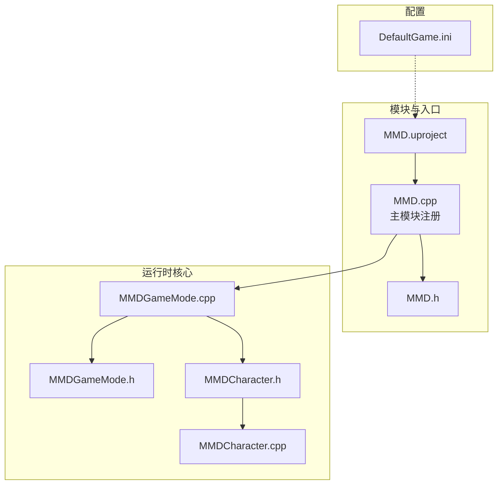
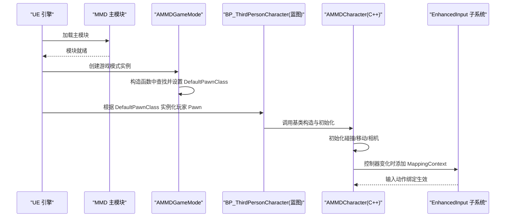
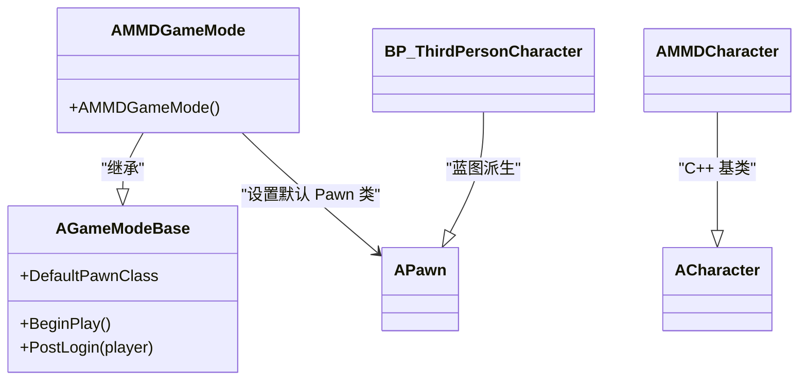
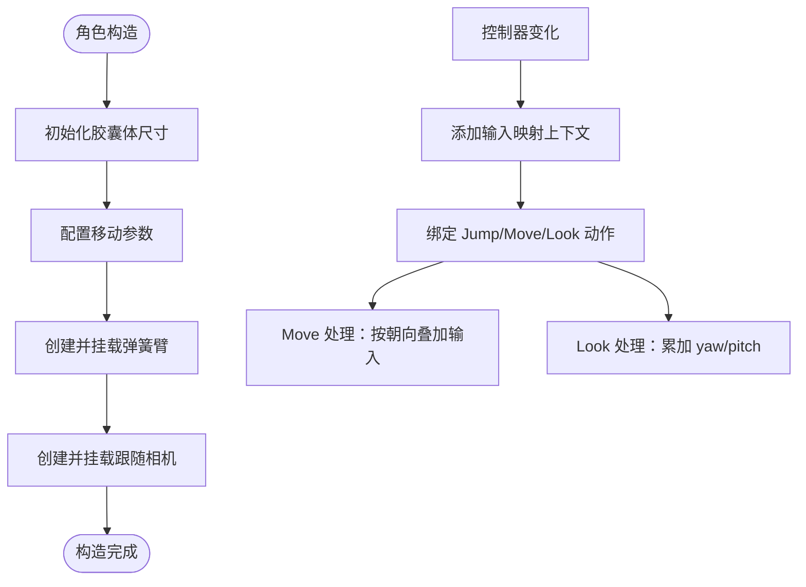
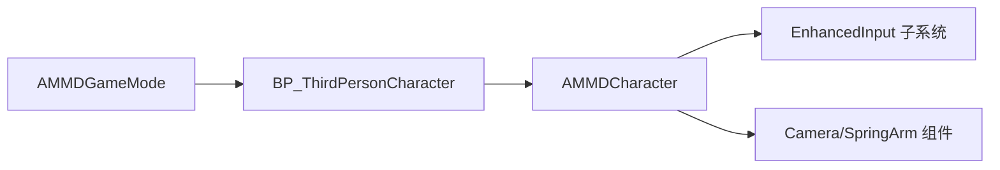

# 游戏模式集成

<cite>
**本文引用的文件**   
- [MMDGameMode.h](file://MMD/Source/MMD/MMDGameMode.h)
- [MMDGameMode.cpp](file://MMD/Source/MMD/MMDGameMode.cpp)
- [MMDCharacter.h](file://MMD/Source/MMD/MMDCharacter.h)
- [MMDCharacter.cpp](file://MMD/Source/MMD/MMDCharacter.cpp)
- [MMD.h](file://MMD/Source/MMD/MMD.h)
- [MMD.cpp](file://MMD/Source/MMD/MMD.cpp)
- [DefaultGame.ini](file://MMD/Config/DefaultGame.ini)
- [MMD.uproject](file://MMD/MMD.uproject)
</cite>

## 目录
1. [简介](#简介)
2. [项目结构](#项目结构)
3. [核心组件](#核心组件)
4. [架构总览](#架构总览)
5. [详细组件分析](#详细组件分析)
6. [依赖关系分析](#依赖关系分析)
7. [性能考虑](#性能考虑)
8. [故障排查指南](#故障排查指南)
9. [结论](#结论)
10. [附录：配置与启用示例](#附录配置与启用示例)

## 简介
本文件面向希望在 UE 项目中集成 MMDGameMode 的开发者，系统性说明 MMDGameMode 的设计与实现、与 UE 标准游戏模式系统的对接方式、角色管理（实例化、生命周期、场景集成）、默认角色配置与属性设置、游戏状态管理与事件处理机制，并提供在项目中启用和配置该模式的步骤与最佳实践。同时给出与其他游戏系统兼容性的注意事项以及为高级用户提供的扩展指导。

## 项目结构
本项目采用插件式模块组织，核心 C++ 代码位于 Source/MMD 下，包含游戏模式、角色、蓝图工厂、函数库等；资源与蓝图位于 Content 目录；工程与模块定义位于根目录与 Config 目录。

图表来源
- [MMD.uproject:1-27](file://MMD/MMD.uproject#L1-L27)
- [MMD.cpp:1-7](file://MMD/Source/MMD/MMD.cpp#L1-L7)
- [MMD.h:1-6](file://MMD/Source/MMD/MMD.h#L1-L6)
- [MMDGameMode.h:1-20](file://MMD/Source/MMD/MMDGameMode.h#L1-L20)
- [MMDGameMode.cpp:1-16](file://MMD/Source/MMD/MMDGameMode.cpp#L1-L16)
- [MMDCharacter.h:1-73](file://MMD/Source/MMD/MMDCharacter.h#L1-L73)
- [MMDCharacter.cpp:1-130](file://MMD/Source/MMD/MMDCharacter.cpp#L1-L130)
- [DefaultGame.ini:1-11](file://MMD/Config/DefaultGame.ini#L1-L11)

章节来源
- [MMD.uproject:1-27](file://MMD/MMD.uproject#L1-L27)
- [MMD.cpp:1-7](file://MMD/Source/MMD/MMD.cpp#L1-L7)
- [MMD.h:1-6](file://MMD/Source/MMD/MMD.h#L1-L6)
- [MMDGameMode.h:1-20](file://MMD/Source/MMD/MMDGameMode.h#L1-L20)
- [MMDGameMode.cpp:1-16](file://MMD/Source/MMD/MMDGameMode.cpp#L1-L16)
- [MMDCharacter.h:1-73](file://MMD/Source/MMD/MMDCharacter.h#L1-L73)
- [MMDCharacter.cpp:1-130](file://MMD/Source/MMD/MMDCharacter.cpp#L1-L130)
- [DefaultGame.ini:1-11](file://MMD/Config/DefaultGame.ini#L1-L11)

## 核心组件
- 游戏模式 AMMDGameMode
  - 继承自 AGameModeBase，作为项目的默认游戏模式，负责将玩家 Pawn 类指向第三方人称角色蓝图。
  - 在构造函数中通过静态资源查找器加载并设置 DefaultPawnClass。
- 角色 AMMDCharacter
  - 继承自 ACharacter，提供第三人称移动、相机跟随、增强输入绑定等基础能力。
  - 初始化碰撞胶囊、移动参数、弹簧臂与跟随相机，并在控制器变化时注册输入映射上下文。
- 模块与工程
  - 使用 IMPLEMENT_PRIMARY_GAME_MODULE 注册主模块。
  - uproject 声明模块名、类型与依赖。

章节来源
- [MMDGameMode.h:1-20](file://MMD/Source/MMD/MMDGameMode.h#L1-L20)
- [MMDGameMode.cpp:1-16](file://MMD/Source/MMD/MMDGameMode.cpp#L1-L16)
- [MMDCharacter.h:1-73](file://MMD/Source/MMD/MMDCharacter.h#L1-L73)
- [MMDCharacter.cpp:1-130](file://MMD/Source/MMD/MMDCharacter.cpp#L1-L130)
- [MMD.cpp:1-7](file://MMD/Source/MMD/MMD.cpp#L1-L7)
- [MMD.uproject:1-27](file://MMD/MMD.uproject#L1-L27)

## 架构总览
下图展示了从模块启动到玩家入场的关键流程，包括游戏模式选择、默认 Pawn 类解析、角色构造与输入子系统注册。

图表来源
- [MMD.cpp:1-7](file://MMD/Source/MMD/MMD.cpp#L1-L7)
- [MMDGameMode.cpp:1-16](file://MMD/Source/MMD/MMDGameMode.cpp#L1-L16)
- [MMDCharacter.cpp:1-130](file://MMD/Source/MMD/MMDCharacter.cpp#L1-L130)

## 详细组件分析

### 游戏模式 AMMDGameMode 设计与实现
- 设计要点
  - 基于 AGameModeBase 的最小 API 暴露，避免不必要的编辑器/网络开销。
  - 在构造函数中通过 FClassFinder 动态加载蓝图角色类，并将其赋给 DefaultPawnClass，从而让引擎在玩家入场时自动实例化该 Pawn。
- 与 UE 标准系统集成
  - 遵循 GameMode 生命周期：构造时完成默认 Pawn 类绑定；随后由引擎在关卡加载后创建玩家 Pawn 并分配控制器。
  - 未覆盖其他 GameMode 钩子（如 BeginPlay、PostLogin），保持最小改动原则，便于后续扩展。
- 角色管理
  - 角色实例化：由引擎依据 DefaultPawnClass 自动创建。
  - 生命周期：遵循 AActor/AGameModeBase 的生命周期；如需自定义可重写相应虚函数。
  - 场景集成：角色蓝图需放置在关卡或随地图加载；若需要程序化生成，可在 GameMode 中自行 Spawn。
- 默认角色配置与属性设置
  - 当前实现仅设置 DefaultPawnClass；其余属性（移动、相机、输入）在角色蓝图中配置。
- 游戏状态管理与事件处理
  - 当前未实现自定义状态机或全局事件总线；可通过扩展 GameMode 增加状态字段与回调。
- 兼容性
  - 与 Enhanced Input 子系统配合良好；角色侧已绑定 Jump/Move/Look 动作。
  - 与蓝图工作流兼容：通过蓝图派生角色类进行可视化配置。

图表来源
- [MMDGameMode.h:1-20](file://MMD/Source/MMD/MMDGameMode.h#L1-L20)
- [MMDGameMode.cpp:1-16](file://MMD/Source/MMD/MMDGameMode.cpp#L1-L16)
- [MMDCharacter.h:1-73](file://MMD/Source/MMD/MMDCharacter.h#L1-L73)
- [MMDCharacter.cpp:1-130](file://MMD/Source/MMD/MMDCharacter.cpp#L1-L130)

章节来源
- [MMDGameMode.h:1-20](file://MMD/Source/MMD/MMDGameMode.h#L1-L20)
- [MMDGameMode.cpp:1-16](file://MMD/Source/MMD/MMDGameMode.cpp#L1-L16)

### 角色 AMMDCharacter 分析与职责
- 职责边界
  - 负责第三人称角色的基础行为：碰撞体、移动、相机跟随、增强输入绑定。
  - 不直接耦合 MMD 资产，以便复用与替换内容。
- 关键流程
  - 构造阶段：初始化胶囊体尺寸、禁用控制器旋转传播、配置 CharacterMovementComponent 参数、创建并挂载 CameraBoom 与 FollowCamera。
  - 控制器变化：NotifyControllerChanged 中向本地玩家的 EnhancedInput 子系统注册输入映射上下文。
  - 输入绑定：SetupPlayerInputComponent 中将 Jump/Move/Look 动作绑定至对应处理函数。
- 数据流与复杂度
  - 输入向量到世界方向转换：O(1) 矩阵运算；每帧触发一次 Move/Look。
  - 相机跟随：SpringArm 与 Camera 组件由引擎更新，无额外复杂计算。
- 错误处理
  - 当未找到 EnhancedInputComponent 时输出错误日志，提示模板依赖增强输入系统。

图表来源
- [MMDCharacter.cpp:1-130](file://MMD/Source/MMD/MMDCharacter.cpp#L1-L130)
- [MMDCharacter.h:1-73](file://MMD/Source/MMD/MMDCharacter.h#L1-L73)

章节来源
- [MMDCharacter.h:1-73](file://MMD/Source/MMD/MMDCharacter.h#L1-L73)
- [MMDCharacter.cpp:1-130](file://MMD/Source/MMD/MMDCharacter.cpp#L1-L130)

### 模块与工程集成
- 主模块
  - 使用 IMPLEMENT_PRIMARY_GAME_MODULE 注册名为 MMD 的主模块，类型为 Runtime，加载阶段为 Default。
- 工程文件
  - 指定引擎版本关联、模块名称、类型与依赖（Blutility、UnrealEd、CoreUObject）。
- 配置文件
  - DefaultGame.ini 包含项目基本信息与启动动作，不包含游戏模式相关条目。

章节来源
- [MMD.cpp:1-7](file://MMD/Source/MMD/MMD.cpp#L1-L7)
- [MMD.h:1-6](file://MMD/Source/MMD/MMD.h#L1-L6)
- [MMD.uproject:1-27](file://MMD/MMD.uproject#L1-L27)
- [DefaultGame.ini:1-11](file://MMD/Config/DefaultGame.ini#L1-L11)

## 依赖关系分析
- 内部依赖
  - MMDGameMode 依赖 MMDCharacter（用于引用其蓝图派生类路径）。
  - MMDCharacter 依赖 UE 内置子系统（EnhancedInput、Camera、Components）。
- 外部依赖
  - 蓝图资源：BP_ThirdPersonCharacter 必须存在于 /Game/ThirdPerson/Blueprints/ 路径下。
- 潜在循环依赖
  - 当前无循环依赖；GameMode 仅持有对 Pawn 类的引用，角色不反向引用 GameMode。
- 接口契约
  - GameMode 通过 DefaultPawnClass 与引擎约定“玩家 Pawn 类型”。
  - 角色通过 EnhancedInput 子系统契约绑定输入动作。

图表来源
- [MMDGameMode.cpp:1-16](file://MMD/Source/MMD/MMDGameMode.cpp#L1-L16)
- [MMDCharacter.cpp:1-130](file://MMD/Source/MMD/MMDCharacter.cpp#L1-L130)

章节来源
- [MMDGameMode.cpp:1-16](file://MMD/Source/MMD/MMDGameMode.cpp#L1-L16)
- [MMDCharacter.cpp:1-130](file://MMD/Source/MMD/MMDCharacter.cpp#L1-L130)

## 性能考虑
- 构造期资源查找
  - 使用 static ConstructorHelpers::FClassFinder 在构造期缓存类引用，避免重复查找，降低运行时开销。
- 输入处理
  - Move/Look 每帧执行 O(1) 操作，建议避免在输入回调中进行昂贵计算。
- 相机与物理
  - SpringArm 与 CharacterMovement 由引擎高效更新；调整步长与精度时需权衡性能与手感。
- 蓝图与 C++ 分工
  - 将可视化的材质、动画、网格体等放在蓝图中配置，减少 C++ 编译与热重载成本。

[本节为通用性能建议，无需源码引用]

## 故障排查指南
- 玩家无法入场或报错找不到 Pawn 类
  - 检查蓝图路径是否正确且资源存在。
  - 确认游戏模式已被正确设置为默认模式。
- 输入无效
  - 确认已启用增强输入子系统，且在角色中绑定了相应的输入映射上下文。
  - 检查是否成功进入 SetupPlayerInputComponent 分支。
- 相机异常
  - 检查弹簧臂长度、目标臂长度与父级挂载是否正确。
- 日志定位
  - 关注 LogTemplateCharacter 的错误日志输出，以快速定位输入组件缺失等问题。

章节来源
- [MMDCharacter.cpp:1-130](file://MMD/Source/MMD/MMDCharacter.cpp#L1-L130)

## 结论
MMDGameMode 以最小改动的方式接入 UE 标准游戏模式体系，通过设置默认 Pawn 类与第三人称角色蓝图协作，实现了开箱即用的玩家入场与输入体验。角色层提供了完整的移动、相机与输入框架，便于在此基础上扩展 MMD 相关内容。对于更复杂的业务逻辑，建议在 GameMode 中扩展状态管理与事件分发，并保持与蓝图资源的解耦。

[本节为总结性内容，无需源码引用]

## 附录：配置与启用示例

- 在项目设置中启用 MMD 游戏模式
  - 打开项目设置，导航到“游戏模式”相关页面，将“默认游戏模式”设置为 MMDGameMode。
  - 确保关卡使用的游戏模式也指向 MMDGameMode，或在启动关卡中指定。
- 验证蓝图资源可用性
  - 确认 /Game/ThirdPerson/Blueprints/BP_ThirdPersonCharacter 蓝图存在并可被加载。
- 输入映射上下文
  - 在角色蓝图中为 DefaultMappingContext 赋值，并确保包含 Jump/Move/Look 动作映射。
- 运行与调试
  - 运行项目后，观察控制台日志，确认无“未找到增强输入组件”的错误。
  - 测试移动、跳跃与视角控制是否正常。

章节来源
- [MMDGameMode.cpp:1-16](file://MMD/Source/MMD/MMDGameMode.cpp#L1-L16)
- [MMDCharacter.cpp:1-130](file://MMD/Source/MMD/MMDCharacter.cpp#L1-L130)