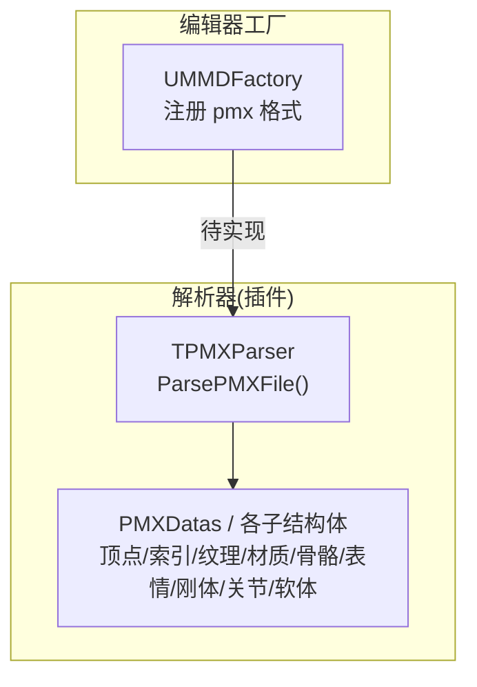
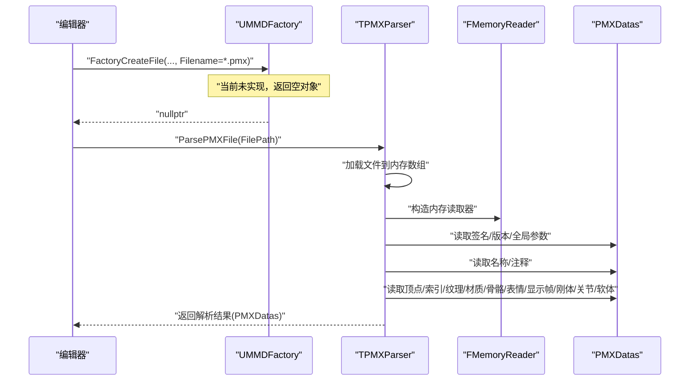
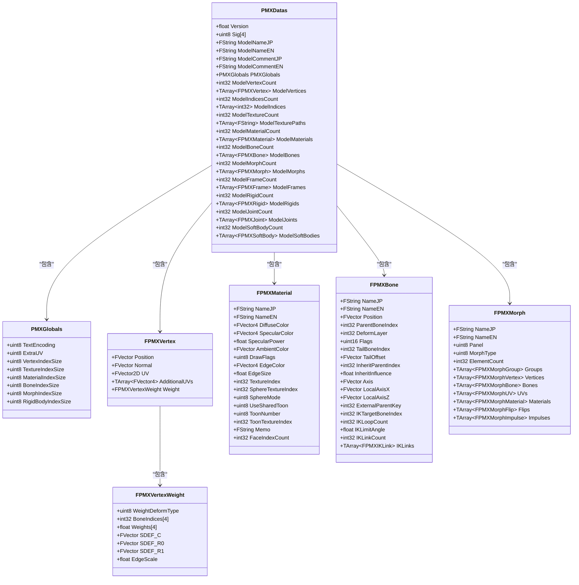
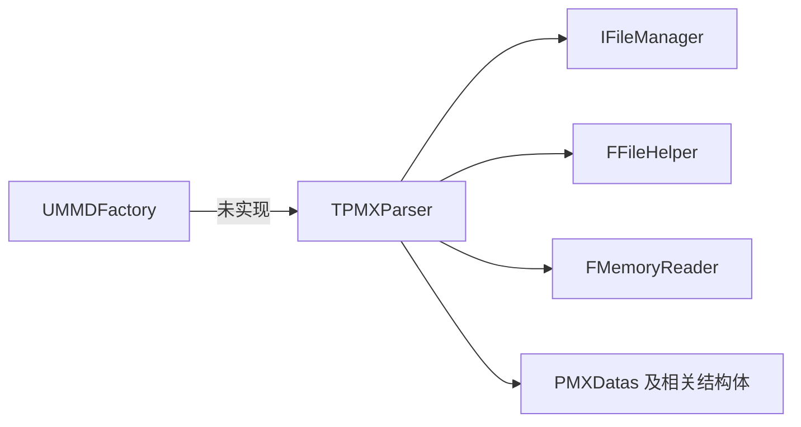

# PMX 文件解析流程

<cite>
**本文引用的文件**   
- [MMDFactory.h](file://MMD/Source/MMD/MMDFactory.h)
- [MMDFactory.cpp](file://MMD/Source/MMD/MMDFactory.cpp)
- [TPMXParser.h](file://MMD/Plugins/Ue5MMDTools/Source/Ue5MMDTools/Public/Import/TPMXParser.h)
- [TPMXParser.cpp](file://MMD/Plugins/Ue5MMDTools/Source/Ue5MMDTools/Private/Import/TPMXParser.cpp)
</cite>

## 目录
1. [简介](#简介)
2. [项目结构](#项目结构)
3. [核心组件](#核心组件)
4. [架构总览](#架构总览)
5. [详细组件分析](#详细组件分析)
6. [依赖关系分析](#依赖关系分析)
7. [性能考量](#性能考量)
8. [故障排查指南](#故障排查指南)
9. [结论](#结论)
10. [附录](#附录)

## 简介
本文件面向开发者，系统化梳理 MMDUETools 中 PMX 模型的导入与解析流程。重点围绕工厂方法 UMMDFactory::FactoryCreateFile 的接入点、PMX 文件格式的读取与校验、以及从 PMX 到 UE 内部数据结构的转换过程展开说明。文档同时覆盖错误处理策略、关键步骤的代码级参考路径，并提供扩展自定义解析逻辑的实践建议。

## 项目结构
本项目包含两个主要部分：
- 插件侧实现：位于 Plugins/Ue5MMDTools 下，提供 PMX 解析器 TPMXParser 及其数据结构定义。
- 编辑器工厂：位于 Source/MMD 下，提供 UMMDFactory 以注册 pmx 格式并作为编辑器导入入口（当前未实现具体逻辑）。

图表来源
- [MMDFactory.h:12-22](file://MMD/Source/MMD/MMDFactory.h#L12-L22)
- [MMDFactory.cpp:6-14](file://MMD/Source/MMD/MMDFactory.cpp#L6-L14)
- [TPMXParser.h:499-508](file://MMD/Plugins/Ue5MMDTools/Source/Ue5MMDTools/Public/Import/TPMXParser.h#L499-L508)
- [TPMXParser.cpp:16-198](file://MMD/Plugins/Ue5MMDTools/Source/Ue5MMDTools/Private/Import/TPMXParser.cpp#L16-L198)

章节来源
- [MMDFactory.h:12-22](file://MMD/Source/MMD/MMDFactory.h#L12-L22)
- [MMDFactory.cpp:6-14](file://MMD/Source/MMD/MMDFactory.cpp#L6-L14)
- [TPMXParser.h:499-508](file://MMD/Plugins/Ue5MMDTools/Source/Ue5MMDTools/Public/Import/TPMXParser.h#L499-L508)
- [TPMXParser.cpp:16-198](file://MMD/Plugins/Ue5MMDTools/Source/Ue5MMDTools/Private/Import/TPMXParser.cpp#L16-L198)

## 核心组件
- 工厂类 UMMDFactory
  - 负责在编辑器中注册“pmx;MikuMikuDance Model”格式，以便用户通过右键导入 PMX 模型。
  - FactoryCreateFile 目前返回空指针，表示尚未实现实际创建逻辑。
- 解析器 TPMXParser
  - 提供 ParsePMXFile 接口，完成 PMX 文件的二进制读取、全局参数解析、分段数据读取与校验，并将结果填充至 PMXDatas 及各类子结构体。
  - 内部使用 FMemoryReader 对内存中的 PMX 数据进行流式读取，配合 ReadCharArray、ReadGlobalIndex 等辅助函数进行安全解析。

章节来源
- [MMDFactory.h:12-22](file://MMD/Source/MMD/MMDFactory.h#L12-L22)
- [MMDFactory.cpp:6-14](file://MMD/Source/MMD/MMDFactory.cpp#L6-L14)
- [TPMXParser.h:499-508](file://MMD/Plugins/Ue5MMDTools/Source/Ue5MMDTools/Public/Import/TPMXParser.h#L499-L508)
- [TPMXParser.cpp:16-198](file://MMD/Plugins/Ue5MMDTools/Source/Ue5MMDTools/Private/Import/TPMXParser.cpp#L16-L198)

## 架构总览
下图展示了从编辑器工厂到 PMX 解析器的调用链路，以及解析过程中涉及的主要数据块。

图表来源
- [MMDFactory.cpp:11-14](file://MMD/Source/MMD/MMDFactory.cpp#L11-L14)
- [TPMXParser.cpp:16-198](file://MMD/Plugins/Ue5MMDTools/Source/Ue5MMDTools/Private/Import/TPMXParser.cpp#L16-L198)

## 详细组件分析

### 工厂方法 UMMDFactory::FactoryCreateFile
- 作用：作为编辑器导入管线入口，接收文件名并尝试创建对应 UObject。
- 现状：构造函数中注册了 pmx 格式；方法体直接返回空指针，未实现具体创建逻辑。
- 影响：若仅依赖该工厂，编辑器无法自动将 PMX 转换为 UE 资产。需要后续实现或改用其他导入路径。

章节来源
- [MMDFactory.h:12-22](file://MMD/Source/MMD/MMDFactory.h#L12-L22)
- [MMDFactory.cpp:6-14](file://MMD/Source/MMD/MMDFactory.cpp#L6-L14)

### PMX 解析器 TPMXParser
- 入口方法：ParsePMXFile(const FString& FilePath)
  - 检查路径有效性、文件存在性、读取文件到内存数组。
  - 初始化 FMemoryReader，顺序读取：
    - 文件签名与版本
    - 全局参数（编码、额外UV数量、各索引尺寸）
    - 模型名/注释（支持 UTF-16LE 与 UTF-8）
    - 顶点、三角面索引、纹理路径、材质、骨骼、表情、显示帧、刚体、关节、软体
  - 每步均有日志输出与失败分支，最终汇总统计信息。

- 字符串读取 ReadCharArray
  - 严格边界检查：长度非负、不超过剩余字节数、上限保护。
  - 根据全局 TextEncoding 选择解码路径：
    - UTF-16LE：逐字符合法性检查与终止符处理
    - UTF-8：复制到 char 数组后使用引擎转换宏
  - 输出调试日志，便于定位错位问题。

- 索引读取 ReadGlobalIndex / ReadGlobalVertexIndex
  - 依据全局 IndexSize（1/2/4）动态读取有符号/无符号整数。
  - 超出范围时返回 -1 以标记无效索引。

- 全局参数 ReadPMXGlobals
  - 校验全局项数量为 8，依次读取编码、ExtraUV、各索引尺寸。

- 顶点读取 ReadPMXVertex
  - 读取位置、法线、UV、可选附加 UV。
  - 按权重类型（BDEF1/2/4、SDEF、QDEF）解析骨骼索引与权重，SDEF 额外读取控制向量。
  - 记录 EdgeScale 用于描边渲染。

- 索引读取 ReadPMXIndices
  - 读取三角面索引列表，按 VertexIndexSize 解析。

- 纹理路径读取 ReadPMXTexturePath
  - 读取纹理数量并进行合理性校验。
  - 循环读取每条纹理路径，统一替换反斜杠为正斜杠。

- 材质读取 ReadPMXMaterial
  - 读取名称、颜色、高光、环境光、绘制标志、描边参数。
  - 读取主纹理、球面纹理、贴图模式、共享 Toon 开关。
  - 当 UseSharedToon==0 时读取 uint8 ToonNumber；否则读取 ToonTextureIndex。
  - 记录 FaceIndexCount 用于分片构建。

- 骨骼读取 ReadPMXBones
  - 读取名称、位置、父骨骼、变形层级、标志位。
  - 根据标志位条件读取尾端连接（索引或偏移）、继承父、固定轴、本地轴、外部父键。
  - 若为 IK 骨骼，读取目标、迭代次数、角度限制、链接链与上下限。

- 表情读取 ReadPMXMorphs
  - 读取名称、面板、类型、元素数量，并对元素数量做边界校验。
  - 按类型分别解析 Group/Vertex/Bone/UV/AdditionalUV*/Material/Flip/Impulse 等元素。

- 显示帧、刚体、关节、软体
  - 分别读取 UI 分组、物理刚体、约束关节、柔性体（含大量仿真参数与锚点/销钉顶点）。

章节来源
- [TPMXParser.cpp:16-198](file://MMD/Plugins/Ue5MMDTools/Source/Ue5MMDTools/Private/Import/TPMXParser.cpp#L16-L198)
- [TPMXParser.cpp:199-310](file://MMD/Plugins/Ue5MMDTools/Source/Ue5MMDTools/Private/Import/TPMXParser.cpp#L199-L310)
- [TPMXParser.cpp:311-387](file://MMD/Plugins/Ue5MMDTools/Source/Ue5MMDTools/Private/Import/TPMXParser.cpp#L311-L387)
- [TPMXParser.cpp:388-527](file://MMD/Plugins/Ue5MMDTools/Source/Ue5MMDTools/Private/Import/TPMXParser.cpp#L388-L527)
- [TPMXParser.cpp:528-646](file://MMD/Plugins/Ue5MMDTools/Source/Ue5MMDTools/Private/Import/TPMXParser.cpp#L528-L646)
- [TPMXParser.cpp:647-729](file://MMD/Plugins/Ue5MMDTools/Source/Ue5MMDTools/Private/Import/TPMXParser.cpp#L647-L729)
- [TPMXParser.cpp:731-800](file://MMD/Plugins/Ue5MMDTools/Source/Ue5MMDTools/Private/Import/TPMXParser.cpp#L731-L800)

### 数据结构与映射关系
PMX 数据集中定义了完整的模型描述结构，涵盖以下部分：
- 全局信息与元数据：版本、签名、模型名/注释、全局参数
- 几何数据：顶点、三角面索引
- 资源引用：纹理路径
- 材质：颜色、高光、环境光、描边、纹理/球面纹理/Toon 配置、面片计数
- 骨骼：父子关系、变换、IK 链、继承、轴约束
- 表情：多类型元素（组、顶点、骨骼、UV、材质、翻转、脉冲）
- 显示帧：UI 面板组织
- 物理：刚体、关节、软体（含大量仿真参数与锚点/销钉）

图表来源
- [TPMXParser.h:10-497](file://MMD/Plugins/Ue5MMDTools/Source/Ue5MMDTools/Public/Import/TPMXParser.h#L10-L497)

## 依赖关系分析
- 编辑器工厂与解析器解耦：工厂仅声明 pmx 格式，未直接调用解析器。
- 解析器依赖 UE 序列化与文件系统：
  - IFileManager：文件存在性检查
  - FFileHelper：将文件读入内存数组
  - FMemoryReader：基于内存的流式读取
- 解析器内部自包含：所有读取逻辑集中在 TPMXParser.cpp，头文件定义数据结构。

图表来源
- [MMDFactory.cpp:6-14](file://MMD/Source/MMD/MMDFactory.cpp#L6-L14)
- [TPMXParser.cpp:16-198](file://MMD/Plugins/Ue5MMDTools/Source/Ue5MMDTools/Private/Import/TPMXParser.cpp#L16-L198)

章节来源
- [MMDFactory.cpp:6-14](file://MMD/Source/MMD/MMDFactory.cpp#L6-L14)
- [TPMXParser.cpp:16-198](file://MMD/Plugins/Ue5MMDTools/Source/Ue5MMDTools/Private/Import/TPMXParser.cpp#L16-L198)

## 性能考量
- 大文件内存占用：ParsePMXFile 先将整个 PMX 文件加载到 TArray<uint8>，对于大型模型会占用较多内存。可考虑流式读取以降低峰值内存。
- 字符串解码开销：UTF-16LE 与 UTF-8 转换均会产生临时缓冲，注意避免重复分配。
- 索引尺寸差异：不同 PMX 文件可能使用 1/2/4 字节索引，需确保读取路径正确，避免误读导致后续错位。
- 日志输出：解析过程包含大量日志，建议在发布版本中降低日志级别以减少 IO 开销。

## 故障排查指南
- 常见错误与定位
  - 文件路径为空或不存在：ParsePMXFile 会立即返回 false 并记录错误日志。
  - 文件读取失败：LoadFileToArray 失败时返回 false。
  - 全局参数异常：ReadPMXGlobals 要求全局项数量为 8，不匹配则报错。
  - 字符串长度越界：ReadCharArray 对长度进行严格校验，负值或超过剩余字节数都会失败。
  - 纹理数量不合理：ReadPMXTexturePath 对 count 进行范围校验，过大直接报错。
  - 表情元素数量异常：ReadPMXMorphs 对 ElementCount 进行边界检查。
- 建议排查步骤
  - 查看 LogTemp 输出，关注“开始解析”、“成功/失败”日志与具体字段值。
  - 确认 PMX 版本与全局参数是否符合预期。
  - 核对索引尺寸是否与文件一致，必要时调整读取路径。
  - 检查纹理路径是否被正确替换分隔符，确保资源可寻址。

章节来源
- [TPMXParser.cpp:16-198](file://MMD/Plugins/Ue5MMDTools/Source/Ue5MMDTools/Private/Import/TPMXParser.cpp#L16-L198)
- [TPMXParser.cpp:199-310](file://MMD/Plugins/Ue5MMDTools/Source/Ue5MMDTools/Private/Import/TPMXParser.cpp#L199-L310)
- [TPMXParser.cpp:365-387](file://MMD/Plugins/Ue5MMDTools/Source/Ue5MMDTools/Private/Import/TPMXParser.cpp#L365-L387)
- [TPMXParser.cpp:528-567](file://MMD/Plugins/Ue5MMDTools/Source/Ue5MMDTools/Private/Import/TPMXParser.cpp#L528-L567)
- [TPMXParser.cpp:731-750](file://MMD/Plugins/Ue5MMDTools/Source/Ue5MMDTools/Private/Import/TPMXParser.cpp#L731-L750)

## 结论
- 工厂方法 UMMDFactory::FactoryCreateFile 已注册 pmx 格式，但尚未实现具体创建逻辑，因此不会自动产出 UE 资产。
- 解析器 TPMXParser 提供了完整且健壮的 PMX 解析能力，覆盖从文件读取、全局参数验证到各数据段解析的全过程，具备完善的错误处理与日志输出。
- 若需将 PMX 导入为 UE 资产，可在工厂方法中调用 TPMXParser::ParsePMXFile，并将 PMXDatas 转换为 SkeletalMesh、AnimSequence、PhysicsAsset 等目标对象。

## 附录

### 关键步骤代码示例路径
- 工厂入口（未实现）
  - [MMDFactory.cpp:11-14](file://MMD/Source/MMD/MMDFactory.cpp#L11-L14)
- 解析入口与总体流程
  - [TPMXParser.cpp:16-198](file://MMD/Plugins/Ue5MMDTools/Source/Ue5MMDTools/Private/Import/TPMXParser.cpp#L16-L198)
- 字符串安全读取（UTF-16LE/UTF-8）
  - [TPMXParser.cpp:199-310](file://MMD/Plugins/Ue5MMDTools/Source/Ue5MMDTools/Private/Import/TPMXParser.cpp#L199-L310)
- 全局参数读取与校验
  - [TPMXParser.cpp:365-387](file://MMD/Plugins/Ue5MMDTools/Source/Ue5MMDTools/Private/Import/TPMXParser.cpp#L365-L387)
- 顶点与权重解析（含 SDEF/QDEF）
  - [TPMXParser.cpp:388-527](file://MMD/Plugins/Ue5MMDTools/Source/Ue5MMDTools/Private/Import/TPMXParser.cpp#L388-L527)
- 索引与纹理路径读取
  - [TPMXParser.cpp:511-567](file://MMD/Plugins/Ue5MMDTools/Source/Ue5MMDTools/Private/Import/TPMXParser.cpp#L511-L567)
- 材质读取（含 Toon 分支）
  - [TPMXParser.cpp:568-646](file://MMD/Plugins/Ue5MMDTools/Source/Ue5MMDTools/Private/Import/TPMXParser.cpp#L568-L646)
- 骨骼与 IK 链读取
  - [TPMXParser.cpp:647-729](file://MMD/Plugins/Ue5MMDTools/Source/Ue5MMDTools/Private/Import/TPMXParser.cpp#L647-L729)
- 表情多类型解析
  - [TPMXParser.cpp:731-800](file://MMD/Plugins/Ue5MMDTools/Source/Ue5MMDTools/Private/Import/TPMXParser.cpp#L731-L800)

### 自定义解析逻辑指导
- 新增数据段
  - 在 TPMXParser.h 中定义新结构体，并在 PMXDatas 中添加容器字段。
  - 在 TPMXParser.cpp 中新增 ReadPMXxxx 函数，遵循现有边界检查与日志规范。
  - 在 ParsePMXFile 末尾追加调用，保持顺序与 PMX 规范一致。
- 扩展索引尺寸支持
  - 复用 ReadGlobalIndex/ReadGlobalVertexIndex，确保与全局 IndexSize 一致。
- 提升健壮性
  - 对所有可变长度字段增加边界检查与上限保护。
  - 对关键路径（纹理、材质、骨骼）添加更详细的日志，便于定位错位。
- 与 UE 资产对接
  - 在工厂方法中调用解析器，将 PMXDatas 转换为 SkeletalMesh、材质实例、动画序列等。
  - 处理坐标系转换、UV 映射、权重归一化、IK 烘焙等细节。