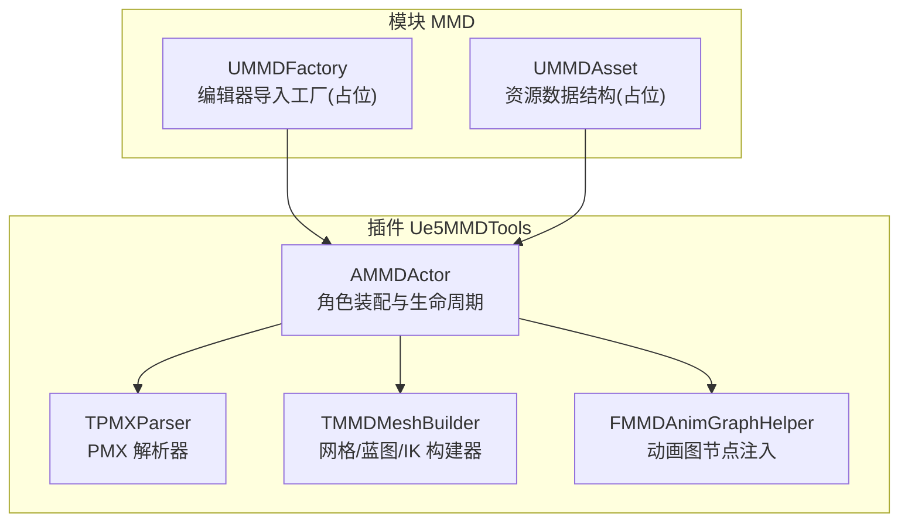
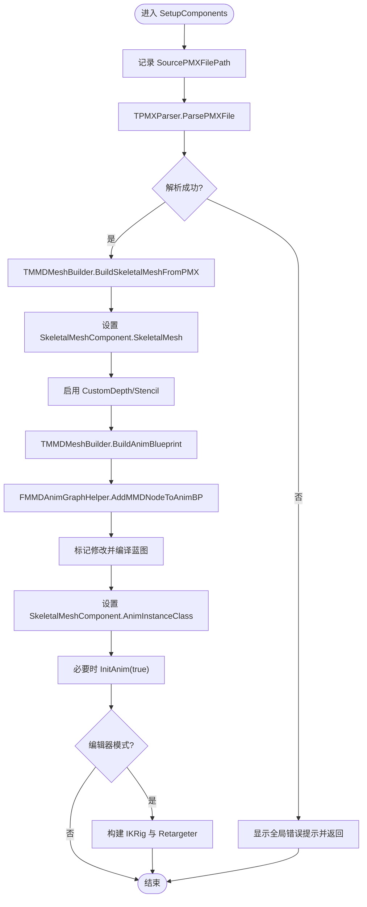
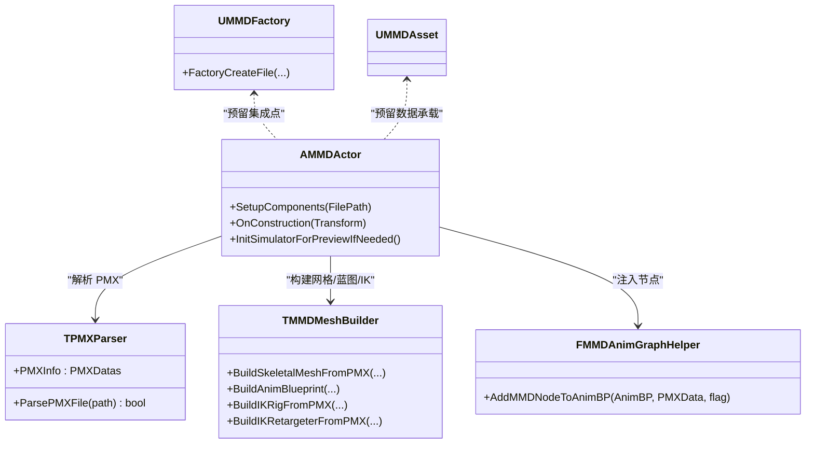

# 自动角色创建系统

<cite>
**本文引用的文件**   
- [MMDFactory.h](file://MMD/Source/MMD/MMDFactory.h)
- [MMDFactory.cpp](file://MMD/Source/MMD/MMDFactory.cpp)
- [MMDAsset.h](file://MMD/Source/MMD/MMDAsset.h)
- [MMDAsset.cpp](file://MMD/Source/MMD/MMDAsset.cpp)
- [AMMDActor.cpp](file://MMD/Plugins/Ue5MMDTools/Source/Ue5MMDTools/Private/Actors/AMMDActor.cpp)
- [TPMXParser.h](file://MMD/Plugins/Ue5MMDTools/Source/Ue5MMDTools/Public/Import/TPMXParser.h)
- [TPMXParser.cpp](file://MMD/Plugins/Ue5MMDTools/Source/Ue5MMDTools/Private/Import/TPMXParser.cpp)
</cite>

## 目录
1. [简介](#简介)
2. [项目结构](#项目结构)
3. [核心组件](#核心组件)
4. [架构总览](#架构总览)
5. [详细组件分析](#详细组件分析)
6. [依赖关系分析](#依赖关系分析)
7. [性能考虑](#性能考虑)
8. [故障排查指南](#故障排查指南)
9. [结论](#结论)
10. [附录：API 使用示例与自定义流程](#附录api-使用示例与自定义流程)

## 简介
本文件面向开发者，系统化阐述从 PMX 模型到完整 MMD Actor 的自动生成流程。内容覆盖解析、骨骼与网格构建、材质分配、动画蓝图生成、以及工厂与资产数据结构的职责边界。文档同时提供错误处理策略、性能优化建议与扩展点说明，帮助读者在现有基础上定制或增强角色创建流水线。

## 项目结构
本项目包含两部分关键代码：
- 插件侧（Ue5MMDTools）：实现 PMX 解析、网格与动画蓝图构建、IK 资产生成等核心逻辑，并通过 AMMDActor 串联整个流程。
- 模块侧（MMD）：提供编辑器工厂接口占位与基础 Actor 模板，用于后续集成与扩展。



图表来源
- [AMMDActor.cpp:1-149](file://MMD/Plugins/Ue5MMDTools/Source/Ue5MMDTools/Private/Actors/AMMDActor.cpp#L1-L149)
- [TPMXParser.h](file://MMD/Plugins/Ue5MMDTools/Source/Ue5MMDTools/Public/Import/TPMXParser.h)
- [TPMXParser.cpp](file://MMD/Plugins/Ue5MMDTools/Source/Ue5MMDTools/Private/Import/TPMXParser.cpp)
- [MMDFactory.h:12-22](file://MMD/Source/MMD/MMDFactory.h#L12-L22)
- [MMDFactory.cpp:6-14](file://MMD/Source/MMD/MMDFactory.cpp#L6-L14)
- [MMDAsset.h:12-17](file://MMD/Source/MMD/MMDAsset.h#L12-L17)
- [MMDAsset.cpp:1-6](file://MMD/Source/MMD/MMDAsset.cpp#L1-L6)

章节来源
- [AMMDActor.cpp:1-149](file://MMD/Plugins/Ue5MMDTools/Source/Ue5MMDTools/Private/Actors/AMMDActor.cpp#L1-L149)
- [MMDFactory.h:12-22](file://MMD/Source/MMD/MMDFactory.h#L12-L22)
- [MMDFactory.cpp:6-14](file://MMD/Source/MMD/MMDFactory.cpp#L6-L14)
- [MMDAsset.h:12-17](file://MMD/Source/MMD/MMDAsset.h#L12-L17)
- [MMDAsset.cpp:1-6](file://MMD/Source/MMD/MMDAsset.cpp#L1-L6)

## 核心组件
- AMMDActor：负责场景中的角色装配与生命周期管理，调用解析器与构建器完成从 PMX 到可渲染 Actor 的端到端流程。
- TPMXParser：读取并解析 PMX 文件，输出结构化数据供后续构建阶段使用。
- TMMDMeshBuilder：根据 PMX 数据构建骨骼网格、动画蓝图与 IK 资产。
- FMMDAnimGraphHelper：向动画蓝图中注入 MMD 专用控制节点。
- UMMDFactory：编辑器导入工厂基类派生，当前为占位实现，预留 pmx 格式支持。
- UMMDAsset：资源数据结构占位，未来可用于承载角色元数据与引用。

章节来源
- [AMMDActor.cpp:41-108](file://MMD/Plugins/Ue5MMDTools/Source/Ue5MMDTools/Private/Actors/AMMDActor.cpp#L41-L108)
- [TPMXParser.h](file://MMD/Plugins/Ue5MMDTools/Source/Ue5MMDTools/Public/Import/TPMXParser.h)
- [TPMXParser.cpp](file://MMD/Plugins/Ue5MMDTools/Source/Ue5MMDTools/Private/Import/TPMXParser.cpp)
- [MMDFactory.h:12-22](file://MMD/Source/MMD/MMDFactory.h#L12-L22)
- [MMDFactory.cpp:6-14](file://MMD/Source/MMD/MMDFactory.cpp#L6-L14)
- [MMDAsset.h:12-17](file://MMD/Source/MMD/MMDAsset.h#L12-L17)
- [MMDAsset.cpp:1-6](file://MMD/Source/MMD/MMDAsset.cpp#L1-L6)

## 架构总览
下图展示了从 PMX 文件到完整 MMD Actor 的关键步骤与组件交互。

```mermaid
sequenceDiagram
participant User as "用户/编辑器"
participant Factory as "UMMDFactory"
participant Actor as "AMMDActor"
participant Parser as "TPMXParser"
participant Builder as "TMMDMeshBuilder"
participant AnimHelper as "FMMDAnimGraphHelper"
User->>Factory : "导入 PMX 文件"
Factory-->>User : "返回结果(当前占位)"
Note over Factory,User : "工厂方法未实现具体逻辑"
User->>Actor : "调用 SetupComponents(FilePath)"
Actor->>Parser : "ParsePMXFile(FilePath)"
Parser-->>Actor : "PMXDatas"
Actor->>Builder : "BuildSkeletalMeshFromPMX(...)"
Builder-->>Actor : "USkeletalMesh*"
Actor->>Builder : "BuildAnimBlueprint(...)"
Builder-->>Actor : "UAnimBlueprint*"
Actor->>AnimHelper : "AddMMDNodeToAnimBP(...)"
AnimHelper-->>Actor : "完成节点注入"
Actor->>Actor : "设置 SkeletalMeshComponent 的 Mesh 与 AnimInstance"
Actor-->>User : "角色就绪"
```

图表来源
- [AMMDActor.cpp:41-108](file://MMD/Plugins/Ue5MMDTools/Source/Ue5MMDTools/Private/Actors/AMMDActor.cpp#L41-L108)
- [MMDFactory.cpp:11-14](file://MMD/Source/MMD/MMDFactory.cpp#L11-L14)

## 详细组件分析

### AMMDActor：角色装配与生命周期
- 作用：组合碰撞体与骨骼网格组件，驱动 PMX 解析、网格与动画蓝图构建，并在编辑器预览时初始化模拟环境。
- 关键流程：
  - 保存 PMX 路径以便蓝图实例化后复用。
  - 调用解析器加载 PMX 数据，失败则通过全局进度提示显示错误。
  - 构建骨骼网格并赋值给组件；确保自定义深度/模板值开启以支持动漫后处理。
  - 构建动画蓝图并向其中注入 MMD 控制节点，编译后设置为实例类。
  - 编辑器模式下可选构建 IKRig 与重定向器资产。



图表来源
- [AMMDActor.cpp:41-108](file://MMD/Plugins/Ue5MMDTools/Source/Ue5MMDTools/Private/Actors/AMMDActor.cpp#L41-L108)

章节来源
- [AMMDActor.cpp:13-39](file://MMD/Plugins/Ue5MMDTools/Source/Ue5MMDTools/Private/Actors/AMMDActor.cpp#L13-L39)
- [AMMDActor.cpp:41-108](file://MMD/Plugins/Ue5MMDTools/Source/Ue5MMDTools/Private/Actors/AMMDActor.cpp#L41-L108)
- [AMMDActor.cpp:110-139](file://MMD/Plugins/Ue5MMDTools/Source/Ue5MMDTools/Private/Actors/AMMDActor.cpp#L110-L139)

### TPMXParser：PMX 解析器
- 作用：读取 PMX 文件并输出结构化数据（PMXDatas），供后续构建阶段使用。
- 关键点：
  - 提供统一的解析入口，内部封装文件格式细节。
  - 解析成功后，外部可通过其公开的数据结构访问模型名称、骨骼、材质等信息。

章节来源
- [TPMXParser.h](file://MMD/Plugins/Ue5MMDTools/Source/Ue5MMDTools/Public/Import/TPMXParser.h)
- [TPMXParser.cpp](file://MMD/Plugins/Ue5MMDTools/Source/Ue5MMDTools/Private/Import/TPMXParser.cpp)

### TMMDMeshBuilder：网格与蓝图构建器
- 作用：基于 PMX 数据构建 USkeletalMesh、UAnimBlueprint，并在编辑器模式下构建 IK 相关资产。
- 关键点：
  - 将 PMX 的几何与材质信息转换为引擎可用的网格资源。
  - 生成动画蓝图并交由 FMMDAnimGraphHelper 注入 MMD 控制节点。
  - 在编辑器环境下，额外生成 IKRig 与 IKRetargeter，便于后续动作重定向。

章节来源
- [AMMDActor.cpp:61-86](file://MMD/Plugins/Ue5MMDTools/Source/Ue5MMDTools/Private/Actors/AMMDActor.cpp#L61-L86)
- [AMMDActor.cpp:99-107](file://MMD/Plugins/Ue5MMDTools/Source/Ue5MMDTools/Private/Actors/AMMDActor.cpp#L99-L107)

### FMMDAnimGraphHelper：动画图节点注入
- 作用：向动画蓝图中添加 MMD 专用控制节点，使运行时能够正确驱动 MMD 骨骼与物理。
- 关键点：
  - 接收 PMX 数据与目标蓝图，按需插入节点并更新结构。
  - 配合蓝图编译流程确保生成的类可用。

章节来源
- [AMMDActor.cpp:82-84](file://MMD/Plugins/Ue5MMDTools/Source/Ue5MMDTools/Private/Actors/AMMDActor.cpp#L82-L84)

### UMMDFactory：编辑器导入工厂（占位）
- 作用：继承自 UFactory，声明支持 pmx 格式，但当前未实现具体导入逻辑。
- 关键点：
  - 构造函数中注册“pmx;MikuMikuDance Model”格式。
  - FactoryCreateFile 返回空指针，表示尚未接入实际创建流程。

章节来源
- [MMDFactory.h:12-22](file://MMD/Source/MMD/MMDFactory.h#L12-L22)
- [MMDFactory.cpp:6-14](file://MMD/Source/MMD/MMDFactory.cpp#L6-L14)

### UMMDAsset：资源数据结构（占位）
- 作用：作为 UObject 派生的资源容器，当前为空实现，可作为未来角色元数据与引用的载体。
- 关键点：
  - 目前无属性与方法，预留扩展空间。

章节来源
- [MMDAsset.h:12-17](file://MMD/Source/MMD/MMDAsset.h#L12-L17)
- [MMDAsset.cpp:1-6](file://MMD/Source/MMD/MMDAsset.cpp#L1-L6)

## 依赖关系分析
- AMMDActor 强依赖 TPMXParser 与 TMMDMeshBuilder，间接依赖 FMMDAnimGraphHelper。
- UMMDFactory 与 UMMDAsset 当前未参与运行时创建流程，属于预留接口与数据结构。
- 编辑器模式下的 IK 资产构建仅在 WITH_EDITOR 条件下执行。



图表来源
- [AMMDActor.cpp:41-108](file://MMD/Plugins/Ue5MMDTools/Source/Ue5MMDTools/Private/Actors/AMMDActor.cpp#L41-L108)
- [MMDFactory.h:12-22](file://MMD/Source/MMD/MMDFactory.h#L12-L22)
- [MMDAsset.h:12-17](file://MMD/Source/MMD/MMDAsset.h#L12-L17)

章节来源
- [AMMDActor.cpp:41-108](file://MMD/Plugins/Ue5MMDTools/Source/Ue5MMDTools/Private/Actors/AMMDActor.cpp#L41-L108)
- [MMDFactory.h:12-22](file://MMD/Source/MMD/MMDFactory.h#L12-L22)
- [MMDAsset.h:12-17](file://MMD/Source/MMD/MMDAsset.h#L12-L17)

## 性能考虑
- 解析与构建耗时：PMX 解析与网格/蓝图构建可能较昂贵，建议在后台线程或异步管线中执行，避免阻塞主线程。
- 资源缓存：对已构建的网格与蓝图进行缓存，避免重复构建。
- 增量更新：当仅变更部分配置时，尽量只重建受影响的部分（如仅更新材质或节点）。
- 编辑器预览：仅在编辑器模式下构建 IK 资产，减少运行时代码体积与开销。

## 故障排查指南
- PMX 解析失败：
  - 现象：解析器返回失败，全局进度提示显示错误。
  - 排查：确认文件路径有效、文件格式正确、权限正常。
  - 参考位置：[AMMDActor.cpp:48-53](file://MMD/Plugins/Ue5MMDTools/Source/Ue5MMDTools/Private/Actors/AMMDActor.cpp#L48-L53)
- 网格或蓝图构建异常：
  - 现象：SkeletalMesh 或 AnimBlueprint 为空，或编译失败。
  - 排查：检查 PMX 数据完整性、路径与命名冲突、蓝图依赖是否齐全。
  - 参考位置：[AMMDActor.cpp:61-86](file://MMD/Plugins/Ue5MMDTools/Source/Ue5MMDTools/Private/Actors/AMMDActor.cpp#L61-L86)
- 动画实例未初始化：
  - 现象：SetAnimInstanceClass 后 GetAnimInstance 为空。
  - 处理：显式调用 InitAnim(true) 强制初始化。
  - 参考位置：[AMMDActor.cpp:86-90](file://MMD/Plugins/Ue5MMDTools/Source/Ue5MMDTools/Private/Actors/AMMDActor.cpp#L86-L90)
- 编辑器预览未生效：
  - 现象：OnConstruction 中未触发初始化。
  - 排查：确认世界类型为编辑器或编辑器预览，且组件已存在。
  - 参考位置：[AMMDActor.cpp:110-139](file://MMD/Plugins/Ue5MMDTools/Source/Ue5MMDTools/Private/Actors/AMMDActor.cpp#L110-L139)

章节来源
- [AMMDActor.cpp:48-53](file://MMD/Plugins/Ue5MMDTools/Source/Ue5MMDTools/Private/Actors/AMMDActor.cpp#L48-L53)
- [AMMDActor.cpp:61-90](file://MMD/Plugins/Ue5MMDTools/Source/Ue5MMDTools/Private/Actors/AMMDActor.cpp#L61-L90)
- [AMMDActor.cpp:110-139](file://MMD/Plugins/Ue5MMDTools/Source/Ue5MMDTools/Private/Actors/AMMDActor.cpp#L110-L139)

## 结论
当前仓库提供了从 PMX 到 MMD Actor 的完整构建链路，核心由 AMMDActor 协调 TPMXParser、TMMDMeshBuilder 与 FMMDAnimGraphHelper 完成。UMMDFactory 与 UMMDAsset 仍为占位实现，适合在未来扩展为完整的编辑器导入与资源管理方案。通过合理的错误处理与性能优化策略，可在保证稳定性的前提下提升批量角色创建的效率。

## 附录：API 使用示例与自定义流程

### 程序化创建 MMD 角色的最小示例
- 步骤概览：
  1) 准备 PMX 文件路径。
  2) 创建或获取 AMMDActor 实例。
  3) 调用 SetupComponents(FilePath) 完成解析、构建与装配。
  4) 在编辑器模式下可选择构建 IK 资产。
- 参考位置：
  - [AMMDActor.cpp:41-108](file://MMD/Plugins/Ue5MMDTools/Source/Ue5MMDTools/Private/Actors/AMMDActor.cpp#L41-L108)

### 通过工厂接口集成（未来方向）
- 现状：UMMDFactory 已声明支持 pmx 格式，但 FactoryCreateFile 未实现。
- 建议：
  - 在 FactoryCreateFile 中解析参数与路径，构造 AMMDActor 并调用 SetupComponents。
  - 返回创建的对象以供编辑器或工具链使用。
- 参考位置：
  - [MMDFactory.h:12-22](file://MMD/Source/MMD/MMDFactory.h#L12-L22)
  - [MMDFactory.cpp:11-14](file://MMD/Source/MMD/MMDFactory.cpp#L11-L14)

### 自定义角色创建流程扩展点
- 替换解析器：实现新的 PMX 解析器并替换 TPMXParser 的使用。
- 自定义网格构建：扩展 TMMDMeshBuilder 以支持更多材质或 LOD 策略。
- 动画图定制：在 FMMDAnimGraphHelper 中添加自定义节点或条件分支。
- 资源承载：在 UMMDAsset 中定义角色元数据与引用集合，贯穿创建与序列化过程。

章节来源
- [AMMDActor.cpp:41-108](file://MMD/Plugins/Ue5MMDTools/Source/Ue5MMDTools/Private/Actors/AMMDActor.cpp#L41-L108)
- [MMDFactory.h:12-22](file://MMD/Source/MMD/MMDFactory.h#L12-L22)
- [MMDFactory.cpp:11-14](file://MMD/Source/MMD/MMDFactory.cpp#L11-L14)
- [MMDAsset.h:12-17](file://MMD/Source/MMD/MMDAsset.h#L12-L17)