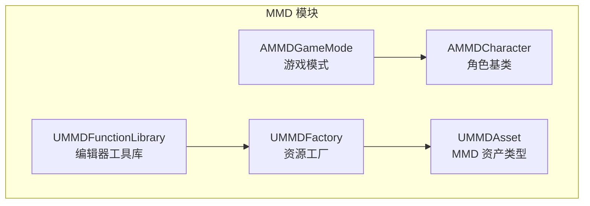
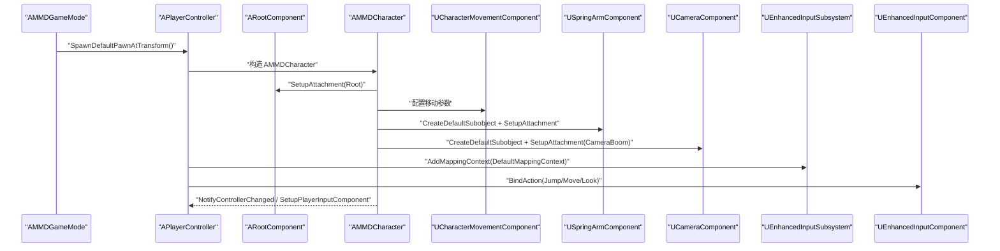
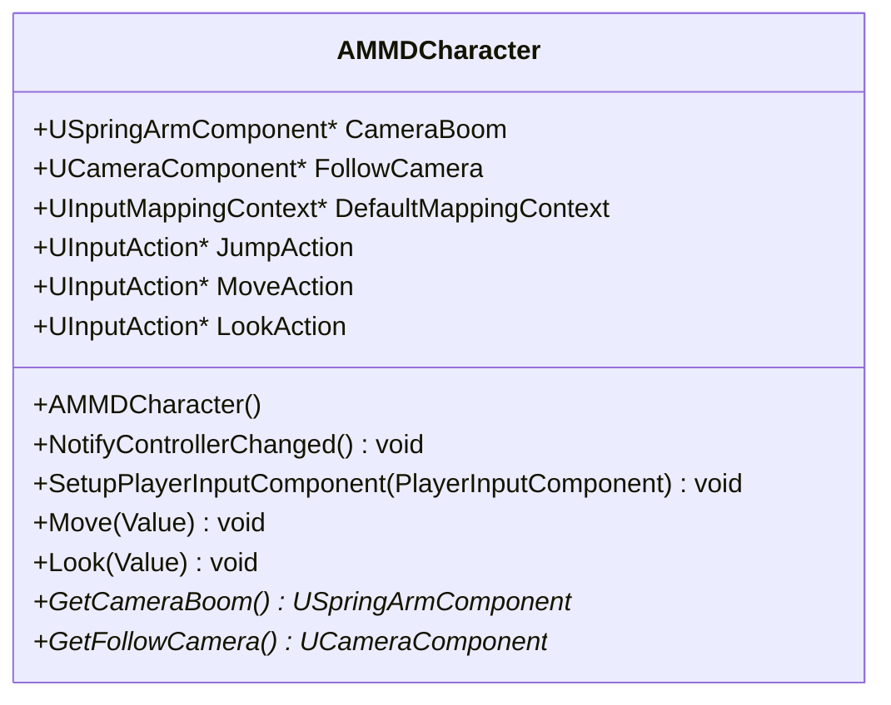
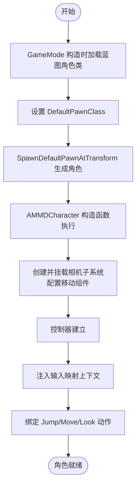
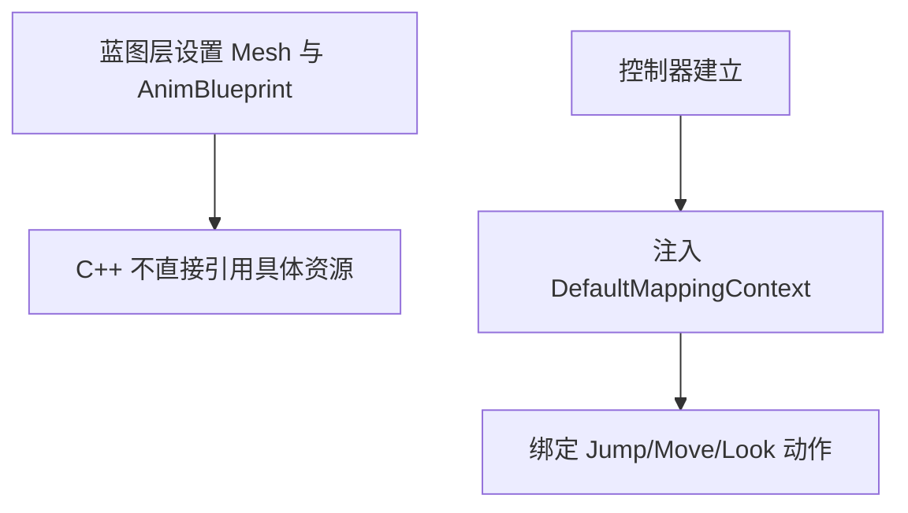
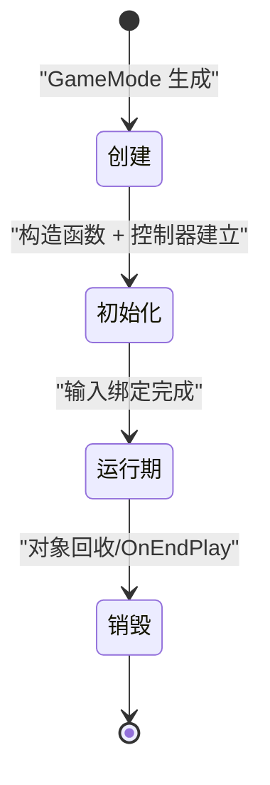
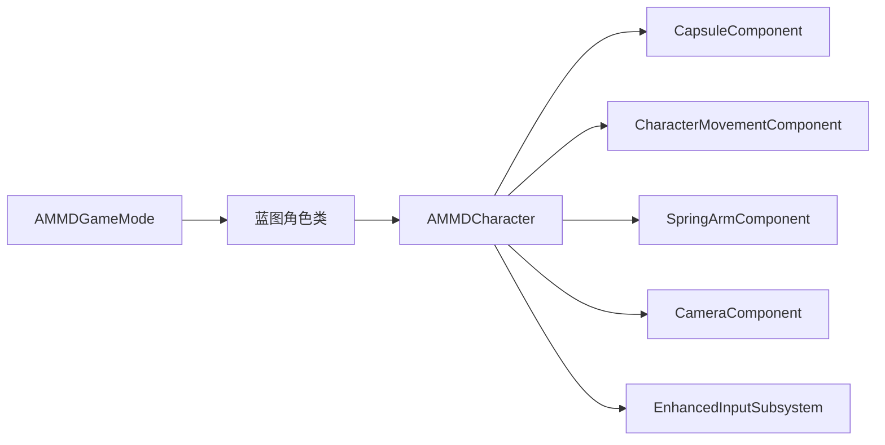

# 角色实例化过程

<cite>
**本文引用的文件**   
- [MMDCharacter.h](file://MMD/Source/MMD/MMDCharacter.h)
- [MMDCharacter.cpp](file://MMD/Source/MMD/MMDCharacter.cpp)
- [MMDGameMode.h](file://MMD/Source/MMD/MMDGameMode.h)
- [MMDGameMode.cpp](file://MMD/Source/MMD/MMDGameMode.cpp)
- [MMDFactory.h](file://MMD/Source/MMD/MMDFactory.h)
- [MMDFactory.cpp](file://MMD/Source/MMD/MMDFactory.cpp)
- [MMDAsset.h](file://MMD/Source/MMD/MMDAsset.h)
- [MMDAsset.cpp](file://MMD/Source/MMD/MMDAsset.cpp)
- [MMDFunctionLibrary.h](file://MMD/Source/MMD/MMDFunctionLibrary.h)
- [MMDFunctionLibrary.cpp](file://MMD/Source/MMD/MMDFunctionLibrary.cpp)
</cite>

## 目录
1. [简介](#简介)
2. [项目结构](#项目结构)
3. [核心组件](#核心组件)
4. [架构总览](#架构总览)
5. [详细组件分析](#详细组件分析)
6. [依赖关系分析](#依赖关系分析)
7. [性能考虑](#性能考虑)
8. [故障排查指南](#故障排查指南)
9. [结论](#结论)
10. [附录](#附录)

## 简介
本文件聚焦于 MMDUETools 中“角色实例化过程”的完整说明，围绕 AMMDCharacter 基类的初始化与组件配置、角色属性设置（网格体绑定、动画蓝图分配、输入映射）、生命周期管理（创建、初始化、销毁）、与场景系统的集成（位置、缩放、层级），以及程序化角色创建的流程与自定义角色类型的扩展方法展开。文档以源码为依据，提供可视化图示与可操作的参考路径，帮助读者快速理解并扩展该框架。

## 项目结构
本项目采用基于插件/模块的组织方式，核心代码位于 Source/MMD 目录：
- 角色与游戏模式：AMMDCharacter、AMMDGameMode
- 工厂与资产：UMMDFactory、UMMDAsset
- 编辑器工具库：UMMDFunctionLibrary

图表来源
- [MMDCharacter.h:18-71](file://MMD/Source/MMD/MMDCharacter.h#L18-L71)
- [MMDGameMode.h:9-16](file://MMD/Source/MMD/MMDGameMode.h#L9-L16)
- [MMDFactory.h:12-22](file://MMD/Source/MMD/MMDFactory.h#L12-L22)
- [MMDAsset.h:12-17](file://MMD/Source/MMD/MMDAsset.h#L12-L17)
- [MMDFunctionLibrary.h:12-18](file://MMD/Source/MMD/MMDFunctionLibrary.h#L12-L18)

章节来源
- [MMDCharacter.h:18-71](file://MMD/Source/MMD/MMDCharacter.h#L18-L71)
- [MMDGameMode.h:9-16](file://MMD/Source/MMD/MMDGameMode.h#L9-L16)
- [MMDFactory.h:12-22](file://MMD/Source/MMD/MMDFactory.h#L12-L22)
- [MMDAsset.h:12-17](file://MMD/Source/MMD/MMDAsset.h#L12-L17)
- [MMDFunctionLibrary.h:12-18](file://MMD/Source/MMD/MMDFunctionLibrary.h#L12-L18)

## 核心组件
- AMMDCharacter：继承自 ACharacter，负责碰撞胶囊、移动、相机系统（弹簧臂+跟随相机）与增强输入绑定。
- AMMDGameMode：设置默认 Pawn 为蓝图角色，驱动玩家角色的生成。
- UMMDFactory：用于导入 PMX 等资源的工厂接口占位。
- UMMDAsset：MMD 资产类型占位。
- UMMDFunctionLibrary：编辑器工具库占位，便于后续扩展批量创建或编辑流程。

章节来源
- [MMDCharacter.h:18-71](file://MMD/Source/MMD/MMDCharacter.h#L18-L71)
- [MMDCharacter.cpp:19-55](file://MMD/Source/MMD/MMDCharacter.cpp#L19-L55)
- [MMDGameMode.h:9-16](file://MMD/Source/MMD/MMDGameMode.h#L9-L16)
- [MMDGameMode.cpp:7-15](file://MMD/Source/MMD/MMDGameMode.cpp#L7-L15)
- [MMDFactory.h:12-22](file://MMD/Source/MMD/MMDFactory.h#L12-L22)
- [MMDAsset.h:12-17](file://MMD/Source/MMD/MMDAsset.h#L12-L17)
- [MMDFunctionLibrary.h:12-18](file://MMD/Source/MMD/MMDFunctionLibrary.h#L12-L18)

## 架构总览
下图展示了从游戏模式到角色实例化的关键调用链与子系统交互。

图表来源
- [MMDGameMode.cpp:7-15](file://MMD/Source/MMD/MMDGameMode.cpp#L7-L15)
- [MMDCharacter.cpp:19-55](file://MMD/Source/MMD/MMDCharacter.cpp#L19-L55)
- [MMDCharacter.cpp:60-93](file://MMD/Source/MMD/MMDCharacter.cpp#L60-L93)

## 详细组件分析

### AMMDCharacter 角色基类
- 职责
  - 初始化碰撞胶囊尺寸与旋转行为
  - 配置 CharacterMovementComponent（朝向、速率、跳跃、速度、刹车等）
  - 创建并挂载相机弹簧臂与跟随相机
  - 在控制器变化时注册增强输入映射上下文
  - 将 Jump/Move/Look 动作绑定到处理函数
- 关键成员
  - CameraBoom、FollowCamera：相机子系统
  - DefaultMappingContext、JumpAction、MoveAction、LookAction：输入映射与动作
- 生命周期钩子
  - 构造函数：组件创建与基础配置
  - NotifyControllerChanged：注入输入映射上下文
  - SetupPlayerInputComponent：绑定增强输入动作
  - Move/Look：输入处理逻辑

图表来源
- [MMDCharacter.h:18-71](file://MMD/Source/MMD/MMDCharacter.h#L18-L71)
- [MMDCharacter.cpp:19-55](file://MMD/Source/MMD/MMDCharacter.cpp#L19-L55)
- [MMDCharacter.cpp:60-93](file://MMD/Source/MMD/MMDCharacter.cpp#L60-L93)

章节来源
- [MMDCharacter.h:18-71](file://MMD/Source/MMD/MMDCharacter.h#L18-L71)
- [MMDCharacter.cpp:19-55](file://MMD/Source/MMD/MMDCharacter.cpp#L19-L55)
- [MMDCharacter.cpp:60-93](file://MMD/Source/MMD/MMDCharacter.cpp#L60-L93)

### 自动创建流程（GameMode 驱动）
- 游戏模式在构造时通过 FClassFinder 加载蓝图角色类，并将其设为 DefaultPawnClass
- 当关卡启动或玩家加入时，GameMode 会按 DefaultPawnClass 生成角色实例
- 生成的角色进入构造函数阶段，完成组件与移动配置
- 控制器建立后，角色注入输入映射上下文并绑定动作

图表来源
- [MMDGameMode.cpp:7-15](file://MMD/Source/MMD/MMDGameMode.cpp#L7-L15)
- [MMDCharacter.cpp:19-55](file://MMD/Source/MMD/MMDCharacter.cpp#L19-L55)
- [MMDCharacter.cpp:60-93](file://MMD/Source/MMD/MMDCharacter.cpp#L60-L93)

章节来源
- [MMDGameMode.cpp:7-15](file://MMD/Source/MMD/MMDGameMode.cpp#L7-L15)
- [MMDCharacter.cpp:19-55](file://MMD/Source/MMD/MMDCharacter.cpp#L19-L55)
- [MMDCharacter.cpp:60-93](file://MMD/Source/MMD/MMDCharacter.cpp#L60-L93)

### 角色属性设置（网格体、动画蓝图、输入映射）
- 网格体与动画蓝图
  - 注释指出骨骼网格体与动画蓝图的引用应在派生蓝图资产中设置，避免在 C++ 中硬编码内容路径
  - 建议在蓝图层面对 Mesh 组件进行 SkeletalMesh 与 AnimBlueprint 的赋值
- 输入映射
  - 在 NotifyControllerChanged 中向增强输入子系统添加 DefaultMappingContext
  - 在 SetupPlayerInputComponent 中将 Jump/Move/Look 动作绑定到对应回调

图表来源
- [MMDCharacter.cpp:53-55](file://MMD/Source/MMD/MMDCharacter.cpp#L53-L55)
- [MMDCharacter.cpp:60-93](file://MMD/Source/MMD/MMDCharacter.cpp#L60-L93)

章节来源
- [MMDCharacter.cpp:53-55](file://MMD/Source/MMD/MMDCharacter.cpp#L53-L55)
- [MMDCharacter.cpp:60-93](file://MMD/Source/MMD/MMDCharacter.cpp#L60-L93)

### 角色生命周期管理
- 创建
  - GameMode 根据 DefaultPawnClass 生成角色实例
- 初始化
  - 构造函数内完成碰撞、移动、相机子系统配置
  - 控制器建立后注入输入映射上下文并绑定动作
- 运行期
  - Move/Look 响应输入事件，更新角色姿态与视角
- 销毁
  - 遵循引擎对象生命周期；如需清理外部资源，可在析构或 OnEndPlay 中释放

[此图为概念性状态图，无需图表来源]

### 与场景系统集成（位置、缩放、层级）
- 位置与旋转
  - 由 GameMode 的 SpawnDefaultPawnAtTransform 传入 Transform 决定初始位置与朝向
- 缩放适配
  - 若需对模型进行统一缩放，建议在蓝图层面对根组件或网格体进行缩放设置，或在派生角色中提供公开接口在运行时调整 RootComponent 或 Mesh 的相对缩放
- 层级关系
  - 相机子系统通过 SetupAttachment 挂载到 RootComponent 与 CameraBoom，形成清晰的父子层级

章节来源
- [MMDGameMode.cpp:7-15](file://MMD/Source/MMD/MMDGameMode.cpp#L7-L15)
- [MMDCharacter.cpp:42-51](file://MMD/Source/MMD/MMDCharacter.cpp#L42-L51)

### 程序化角色创建流程（示例步骤）
以下为在 C++ 中程序化创建角色的典型步骤（以路径指引代替具体代码片段）：
- 步骤一：获取或指定角色类
  - 参考路径：[MMDGameMode.cpp:7-15](file://MMD/Source/MMD/MMDGameMode.cpp#L7-L15)
- 步骤二：使用 GetWorld()->SpawnActor<AMMDCharacter>(...) 或 AGameModeBase::SpawnDefaultPawnAtTransform(...) 生成实例
  - 参考路径：[MMDGameMode.cpp:7-15](file://MMD/Source/MMD/MMDGameMode.cpp#L7-L15)
- 步骤三：在返回的 AMMDCharacter 指针上设置位置、旋转、缩放
  - 参考路径：[MMDCharacter.cpp:42-51](file://MMD/Source/MMD/MMDCharacter.cpp#L42-L51)
- 步骤四：确保控制器已建立，以便触发输入映射上下文注入与动作绑定
  - 参考路径：[MMDCharacter.cpp:60-93](file://MMD/Source/MMD/MMDCharacter.cpp#L60-L93)
- 步骤五：在蓝图层设置网格体与动画蓝图（如未通过 C++ 动态设置）
  - 参考路径：[MMDCharacter.cpp:53-55](file://MMD/Source/MMD/MMDCharacter.cpp#L53-L55)

章节来源
- [MMDGameMode.cpp:7-15](file://MMD/Source/MMD/MMDGameMode.cpp#L7-L15)
- [MMDCharacter.cpp:42-55](file://MMD/Source/MMD/MMDCharacter.cpp#L42-L55)
- [MMDCharacter.cpp:60-93](file://MMD/Source/MMD/MMDCharacter.cpp#L60-L93)

### 自定义角色类型的扩展方法
- 继承 AMMDCharacter 创建新角色类，重写以下钩子：
  - 构造函数：新增或替换组件（例如替换相机、添加特效组件）
  - NotifyControllerChanged：注入自定义输入映射上下文
  - SetupPlayerInputComponent：绑定更多动作或覆盖现有绑定
  - Move/Look：实现自定义移动/视角逻辑
- 在蓝图层：
  - 新建蓝图继承自 AMMDCharacter，设置网格体与动画蓝图
  - 在 GameMode 中将 DefaultPawnClass 指向新的蓝图类
- 在工厂/资产层：
  - 扩展 UMMDFactory 的 FactoryCreateFile 以支持 PMX 等资源导入
  - 在 UMMDFunctionLibrary 中添加批量创建/配置的编辑器工具

章节来源
- [MMDCharacter.h:18-71](file://MMD/Source/MMD/MMDCharacter.h#L18-L71)
- [MMDCharacter.cpp:19-55](file://MMD/Source/MMD/MMDCharacter.cpp#L19-L55)
- [MMDCharacter.cpp:60-93](file://MMD/Source/MMD/MMDCharacter.cpp#L60-L93)
- [MMDGameMode.cpp:7-15](file://MMD/Source/MMD/MMDGameMode.cpp#L7-L15)
- [MMDFactory.h:12-22](file://MMD/Source/MMD/MMDFactory.h#L12-L22)
- [MMDFunctionLibrary.h:12-18](file://MMD/Source/MMD/MMDFunctionLibrary.h#L12-L18)

## 依赖关系分析
- 组件耦合
  - AMMDCharacter 强依赖 Camera/Capsule/Movement 组件与增强输入子系统
  - AMMDGameMode 依赖蓝图角色类（通过路径查找）
- 外部依赖
  - 增强输入子系统（UEnhancedInputLocalPlayerSubsystem、UEnhancedInputComponent）
  - 相机与弹簧臂组件（UCameraComponent、USpringArmComponent）
  - 碰撞与移动（UCapsuleComponent、UCharacterMovementComponent）

图表来源
- [MMDGameMode.cpp:7-15](file://MMD/Source/MMD/MMDGameMode.cpp#L7-L15)
- [MMDCharacter.cpp:19-55](file://MMD/Source/MMD/MMDCharacter.cpp#L19-L55)
- [MMDCharacter.cpp:60-93](file://MMD/Source/MMD/MMDCharacter.cpp#L60-L93)

章节来源
- [MMDGameMode.cpp:7-15](file://MMD/Source/MMD/MMDGameMode.cpp#L7-L15)
- [MMDCharacter.cpp:19-55](file://MMD/Source/MMD/MMDCharacter.cpp#L19-L55)
- [MMDCharacter.cpp:60-93](file://MMD/Source/MMD/MMDCharacter.cpp#L60-L93)

## 性能考虑
- 组件创建与挂载在构造函数中一次性完成，避免运行时频繁创建
- 移动与相机参数建议通过蓝图调优，减少编译成本
- 输入绑定仅在控制器建立时执行一次，避免每帧重复绑定
- 若需要大量角色实例，建议使用对象池或异步加载策略，降低主线程压力

[本节为通用指导，无需章节来源]

## 故障排查指南
- 增强输入未生效
  - 检查是否成功注入 DefaultMappingContext
  - 确认 SetupPlayerInputComponent 中动作绑定是否执行
  - 参考路径：[MMDCharacter.cpp:60-93](file://MMD/Source/MMD/MMDCharacter.cpp#L60-L93)
- 相机异常
  - 检查 SpringArm 与 Camera 的挂载顺序与 Socket 名称
  - 参考路径：[MMDCharacter.cpp:42-51](file://MMD/Source/MMD/MMDCharacter.cpp#L42-L51)
- 网格体/动画未显示
  - 确认蓝图层是否正确设置 SkeletalMesh 与 AnimBlueprint
  - 参考路径：[MMDCharacter.cpp:53-55](file://MMD/Source/MMD/MMDCharacter.cpp#L53-L55)
- 默认角色类未生效
  - 检查 GameMode 中 DefaultPawnClass 的路径与蓝图是否存在
  - 参考路径：[MMDGameMode.cpp:7-15](file://MMD/Source/MMD/MMDGameMode.cpp#L7-L15)

章节来源
- [MMDCharacter.cpp:42-55](file://MMD/Source/MMD/MMDCharacter.cpp#L42-L55)
- [MMDCharacter.cpp:60-93](file://MMD/Source/MMD/MMDCharacter.cpp#L60-L93)
- [MMDGameMode.cpp:7-15](file://MMD/Source/MMD/MMDGameMode.cpp#L7-L15)

## 结论
AMMDCharacter 提供了完整的角色初始化与输入处理骨架，配合 AMMDGameMode 的默认 Pawn 机制，实现了从游戏模式到角色实例化的自动化流程。通过蓝图层设置网格体与动画蓝图，结合增强输入子系统，可以快速搭建第三人称角色体验。对于更复杂的 MMD 资源导入与批量创建，可扩展 UMMDFactory 与 UMMDFunctionLibrary，以满足生产需求。

[本节为总结，无需章节来源]

## 附录
- 相关占位组件
  - UMMDFactory：PMX 资源导入工厂接口（当前返回空）
  - UMMDAsset：MMD 资产类型占位
  - UMMDFunctionLibrary：编辑器工具库占位，可用于扩展批量创建与编辑流程

章节来源
- [MMDFactory.h:12-22](file://MMD/Source/MMD/MMDFactory.h#L12-L22)
- [MMDFactory.cpp:6-14](file://MMD/Source/MMD/MMDFactory.cpp#L6-L14)
- [MMDAsset.h:12-17](file://MMD/Source/MMD/MMDAsset.h#L12-L17)
- [MMDFunctionLibrary.h:12-18](file://MMD/Source/MMD/MMDFunctionLibrary.h#L12-L18)