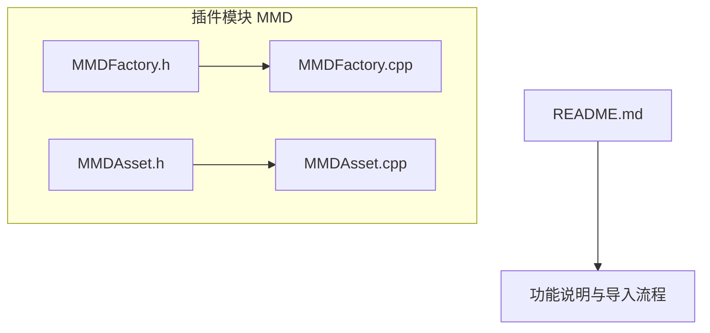
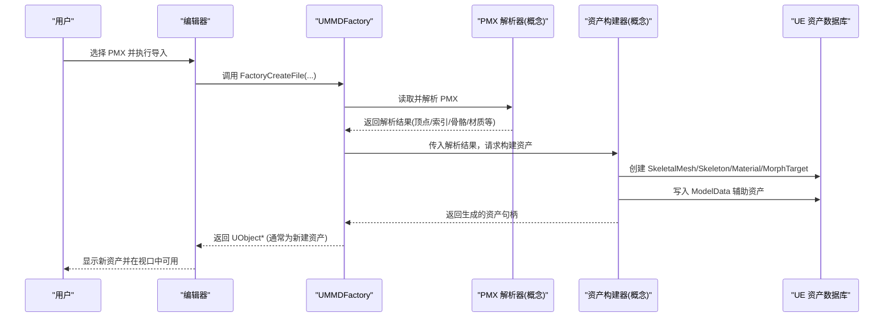
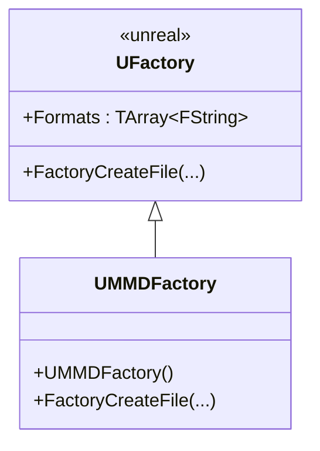
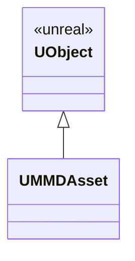
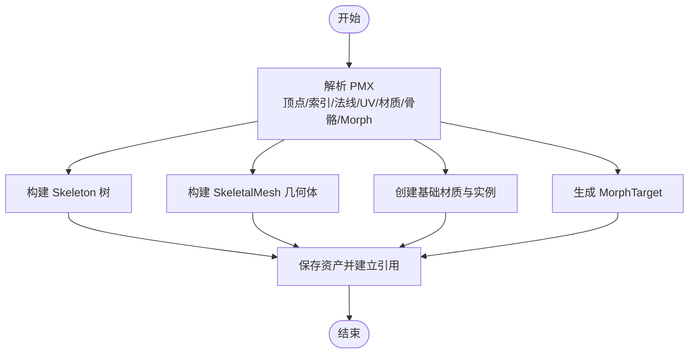
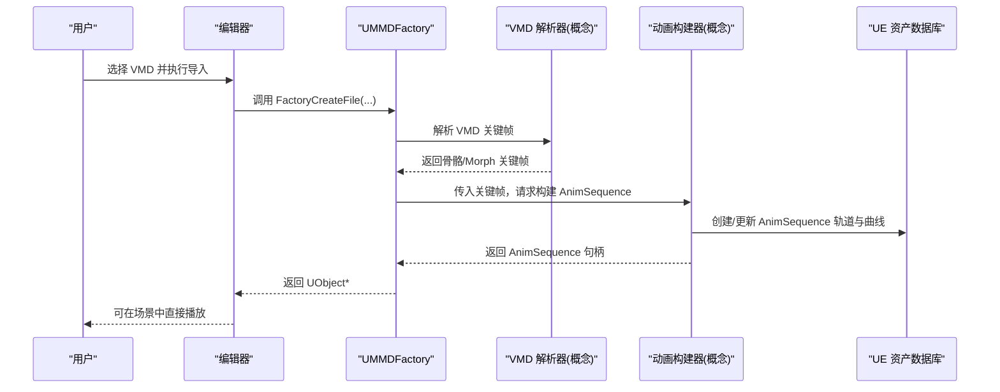
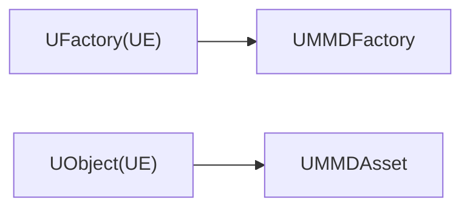

# 资产生成工作流

<cite>
**本文引用的文件**   
- [README.md](file://README.md)
- [MMDFactory.h](file://MMD/Source/MMD/MMDFactory.h)
- [MMDFactory.cpp](file://MMD/Source/MMD/MMDFactory.cpp)
- [MMDAsset.h](file://MMD/Source/MMD/MMDAsset.h)
- [MMDAsset.cpp](file://MMD/Source/MMD/MMDAsset.cpp)
</cite>

## 目录
1. [简介](#简介)
2. [项目结构](#项目结构)
3. [核心组件](#核心组件)
4. [架构总览](#架构总览)
5. [详细组件分析](#详细组件分析)
6. [依赖关系分析](#依赖关系分析)
7. [性能与内存管理](#性能与内存管理)
8. [故障排查指南](#故障排查指南)
9. [结论](#结论)
10. [附录：API 使用示例](#附录api-使用示例)

## 简介
本文件面向“从解析后的 PMX 数据到 UE 原生资产”的完整转换流程，聚焦 SkeletalMesh、Skeleton、Material 等核心资产的生成逻辑，解释 UMMDAsset 数据结构的设计与作用（属性映射与序列化机制），并说明资产依赖关系管理与引用更新过程。同时提供 API 控制各阶段的使用示例、性能优化策略与内存管理最佳实践。

当前插件在文档中声明的基础流程为：
- PMX 模型 -> UE SkeletalMesh / Skeleton / MorphTarget / Actor
- VMD 动作 -> UE AnimSequence 骨骼动画 + 表情曲线
- AnimSequence 播放 -> 骨骼动作 + 眨眼 + 嘴型 + 表情

## 项目结构
仓库包含一个 UE5 插件模块 MMD，其源码位于 MMD/Source/MMD 下，主要入口与工厂类如下：
- 工厂类：UMMDFactory（注册 pmx 格式，提供 FactoryCreateFile 钩子）
- 辅助资产占位：UMMDAsset（UObject 派生，用于承载 MMD 相关元数据或中间态）

图表来源
- [MMDFactory.h:1-23](file://MMD/Source/MMD/MMDFactory.h#L1-L23)
- [MMDFactory.cpp:1-15](file://MMD/Source/MMD/MMDFactory.cpp#L1-L15)
- [MMDAsset.h:1-18](file://MMD/Source/MMD/MMDAsset.h#L1-L18)
- [MMDAsset.cpp:1-6](file://MMD/Source/MMD/MMDAsset.cpp#L1-L6)
- [README.md:1-130](file://README.md#L1-L130)

章节来源
- [MMDFactory.h:1-23](file://MMD/Source/MMD/MMDFactory.h#L1-L23)
- [MMDFactory.cpp:1-15](file://MMD/Source/MMD/MMDFactory.cpp#L1-L15)
- [MMDAsset.h:1-18](file://MMD/Source/MMD/MMDAsset.h#L1-L18)
- [MMDAsset.cpp:1-6](file://MMD/Source/MMD/MMDAsset.cpp#L1-L6)
- [README.md:1-130](file://README.md#L1-L130)

## 核心组件
- UMMDFactory
  - 作用：注册 .pmx 文件格式，作为编辑器/工具链触发导入的工厂入口。
  - 关键点：构造函数中向 Formats 列表添加 pmx；重写 FactoryCreateFile 以接管创建流程。
- UMMDAsset
  - 作用：作为 UObject 派生的占位资产类型，可用于承载 MMD 模型的元数据、中间状态或后续扩展的属性映射。
  - 现状：当前头/源文件中未定义具体字段与方法，属于预留扩展点。

章节来源
- [MMDFactory.h:12-22](file://MMD/Source/MMD/MMDFactory.h#L12-L22)
- [MMDFactory.cpp:6-14](file://MMD/Source/MMD/MMDFactory.cpp#L6-L14)
- [MMDAsset.h:12-17](file://MMD/Source/MMD/MMDAsset.h#L12-L17)
- [MMDAsset.cpp:1-6](file://MMD/Source/MMD/MMDAsset.cpp#L1-L6)

## 架构总览
从用户操作到资产落盘的端到端流程（概念级）：
- 用户在编辑器中选择 PMX 文件，触发工厂创建流程。
- 工厂读取 PMX，解析顶点、索引、法线、UV、材质、骨骼等。
- 生成 SkeletalMesh、Skeleton、基础材质与实例、MorphTarget。
- 保存 ModelData 辅助资产，建立引用关系。
- 可选：导入 VMD 生成 AnimSequence（骨骼轨道 + 表情曲线）。

图表来源
- [MMDFactory.h:19-22](file://MMD/Source/MMD/MMDFactory.h#L19-L22)
- [MMDFactory.cpp:11-14](file://MMD/Source/MMD/MMDFactory.cpp#L11-L14)
- [README.md:91-110](file://README.md#L91-L110)

## 详细组件分析

### 工厂组件：UMMDFactory
- 职责
  - 注册 pmx 文件扩展名，使编辑器识别该类型。
  - 实现 FactoryCreateFile 以承接导入任务。
- 关键行为
  - 构造时向 Formats 追加 pmx 描述。
  - FactoryCreateFile 目前返回空指针，表示尚未实现实际创建逻辑。
- 设计建议
  - 在 FactoryCreateFile 中完成：参数校验、进度反馈、错误上报、资源创建与保存。
  - 将解析与构建解耦，通过独立解析器与构建器协作。

图表来源
- [MMDFactory.h:12-22](file://MMD/Source/MMD/MMDFactory.h#L12-L22)
- [MMDFactory.cpp:6-14](file://MMD/Source/MMD/MMDFactory.cpp#L6-L14)

章节来源
- [MMDFactory.h:12-22](file://MMD/Source/MMD/MMDFactory.h#L12-L22)
- [MMDFactory.cpp:6-14](file://MMD/Source/MMD/MMDFactory.cpp#L6-L14)

### 辅助资产：UMMDAsset
- 角色定位
  - 作为 UObject 派生的占位类型，可承载 MMD 模型元数据、中间态或后续扩展的属性映射。
- 当前状态
  - 头/源文件中无额外成员或方法，属于预留扩展点。
- 扩展方向
  - 增加属性字段以表达 PMX/VMD 的关键信息（如骨骼树、材质清单、Morph 表等）。
  - 实现序列化接口以便持久化与跨会话复用。

图表来源
- [MMDAsset.h:12-17](file://MMD/Source/MMD/MMDAsset.h#L12-L17)
- [MMDAsset.cpp:1-6](file://MMD/Source/MMD/MMDAsset.cpp#L1-L6)

章节来源
- [MMDAsset.h:12-17](file://MMD/Source/MMD/MMDAsset.h#L12-L17)
- [MMDAsset.cpp:1-6](file://MMD/Source/MMD/MMDAsset.cpp#L1-L6)

### 资产生成流水线（SkeletalMesh / Skeleton / Material / MorphTarget）
- 输入：PMX 解析结果（顶点、索引、法线、UV、材质、骨骼、Morph 等）
- 处理步骤（概念）
  - 构建 Skeleton：根据 PMX 骨骼层级生成骨架树。
  - 构建 SkeletalMesh：填充顶点缓冲、索引缓冲、UV、法线、LOD 等。
  - 生成基础材质与实例：按 PMX 材质信息创建材质图节点与实例。
  - 生成 MorphTarget：将 vertex morph 转换为 UE MorphTarget。
  - 保存 ModelData：记录辅助信息，便于后续绑定与重定向。
- 输出：SkeletalMesh、Skeleton、Material(s)、MorphTarget(s)、ModelData 资产

图表来源
- [README.md:91-110](file://README.md#L91-L110)

章节来源
- [README.md:91-110](file://README.md#L91-L110)

### 动画与表情管线（VMD -> AnimSequence）
- 输入：VMD 骨骼关键帧与 Morph 关键帧
- 处理步骤（概念）
  - 解析 VMD 关键帧数据。
  - 将骨骼轨迹写入 AnimSequence 轨道。
  - 将表情轨迹写入 Morph curves。
  - 进行坐标系转换与 IK/追加骨骼烘焙。
- 输出：AnimSequence（含骨骼与表情曲线）

图表来源
- [MMDFactory.h:19-22](file://MMD/Source/MMD/MMDFactory.h#L19-L22)
- [MMDFactory.cpp:11-14](file://MMD/Source/MMD/MMDFactory.cpp#L11-L14)
- [README.md:105-110](file://README.md#L105-L110)

章节来源
- [MMDFactory.h:19-22](file://MMD/Source/MMD/MMDFactory.h#L19-L22)
- [MMDFactory.cpp:11-14](file://MMD/Source/MMD/MMDFactory.cpp#L11-L14)
- [README.md:105-110](file://README.md#L105-L110)

## 依赖关系分析
- 内部依赖
  - UMMDFactory 依赖 Unreal 的 UFactory 基类，负责注册 pmx 格式与创建流程。
  - UMMDAsset 继承自 UObject，作为可扩展的占位资产类型。
- 外部依赖（概念）
  - PMX/VMD 解析库（未在源码中暴露）。
  - UE 资产子系统（SkeletalMesh、Skeleton、Material、AnimSequence 等）。
- 耦合与内聚
  - 当前工厂仅做格式注册，逻辑为空，耦合度低但功能未落地。
  - UMMDAsset 作为占位，内聚度高、扩展空间大。

图表来源
- [MMDFactory.h:12-22](file://MMD/Source/MMD/MMDFactory.h#L12-L22)
- [MMDAsset.h:12-17](file://MMD/Source/MMD/MMDAsset.h#L12-L17)

章节来源
- [MMDFactory.h:12-22](file://MMD/Source/MMD/MMDFactory.h#L12-L22)
- [MMDAsset.h:12-17](file://MMD/Source/MMD/MMDAsset.h#L12-L17)

## 性能与内存管理
- 批量构建与事务提交
  - 建议在单个事务中批量创建/更新资产，减少编辑器刷新开销。
- 分块与异步
  - 对大型 PMX 采用分块解析与增量构建，避免主线程阻塞。
- 资源去重与共享
  - 材质与纹理按需复用，避免重复创建相同资源。
- 内存回收
  - 解析完成后及时释放临时缓冲区；对中间态对象使用 RAII 或明确生命周期管理。
- LOD 与压缩
  - 生成 Mesh 时启用合理的 LOD 与网格压缩设置，降低运行时内存占用。

[本节为通用指导，不直接分析具体文件]

## 故障排查指南
- 常见问题
  - 导入无响应：检查 FactoryCreateFile 是否已实现并正确返回 UObject*。
  - 资产缺失引用：确认资产创建后是否正确保存到磁盘并建立引用。
  - 表情扭曲：核对 PMX 顶点到 UE 渲染顶点的映射修正逻辑。
- 诊断要点
  - 日志与反馈：在工厂回调中接入 FFeedbackContext 输出进度与错误。
  - 最小复现：隔离 PMX/VMD 文件，逐步验证解析与构建链路。

章节来源
- [MMDFactory.cpp:11-14](file://MMD/Source/MMD/MMDFactory.cpp#L11-L14)
- [README.md:98-103](file://README.md#L98-L103)

## 结论
当前代码库提供了工厂与占位资产的基础骨架，具备扩展为完整 PMX/VMD 导入流水线的条件。下一步应优先实现 FactoryCreateFile 中的解析与构建逻辑，完善 UMMDAsset 的属性映射与序列化，确保资产依赖关系的正确建立与引用更新，并通过性能与内存管理策略保障大规模导入体验。

[本节为总结性内容，不直接分析具体文件]

## 附录：API 使用示例
以下示例展示如何通过现有工厂接口控制资产生成各阶段（基于当前接口签名）：

- 初始化工厂（由引擎自动完成）
  - 工厂在构造时将 pmx 加入支持格式列表。
  - 参考路径：[MMDFactory.cpp:6-9](file://MMD/Source/MMD/MMDFactory.cpp#L6-L9)

- 触发导入（编辑器侧）
  - 调用工厂创建函数，传入目标类、父对象、名称、标志、文件路径、参数、反馈上下文与取消标志。
  - 参考路径：[MMDFactory.h:19-22](file://MMD/Source/MMD/MMDFactory.h#L19-L22)

- 返回值与后续处理
  - 工厂需返回创建的 UObject*（例如 SkeletalMesh 或自定义资产），供编辑器保存与显示。
  - 参考路径：[MMDFactory.cpp:11-14](file://MMD/Source/MMD/MMDFactory.cpp#L11-L14)

- 扩展 UMMDAsset 作为中间态
  - 在 UMMDAsset 中添加属性字段，承载 PMX/VMD 的映射信息与中间结果。
  - 参考路径：[MMDAsset.h:12-17](file://MMD/Source/MMD/MMDAsset.h#L12-L17)

章节来源
- [MMDFactory.cpp:6-14](file://MMD/Source/MMD/MMDFactory.cpp#L6-L14)
- [MMDFactory.h:19-22](file://MMD/Source/MMD/MMDFactory.h#L19-L22)
- [MMDAsset.h:12-17](file://MMD/Source/MMD/MMDAsset.h#L12-L17)