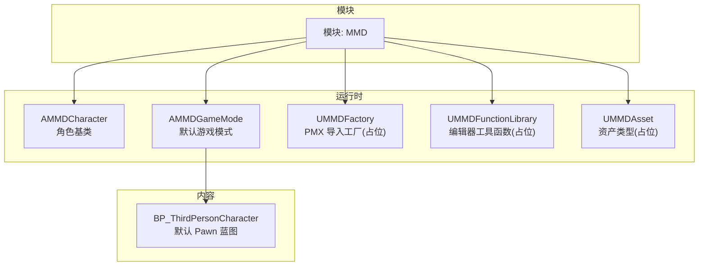
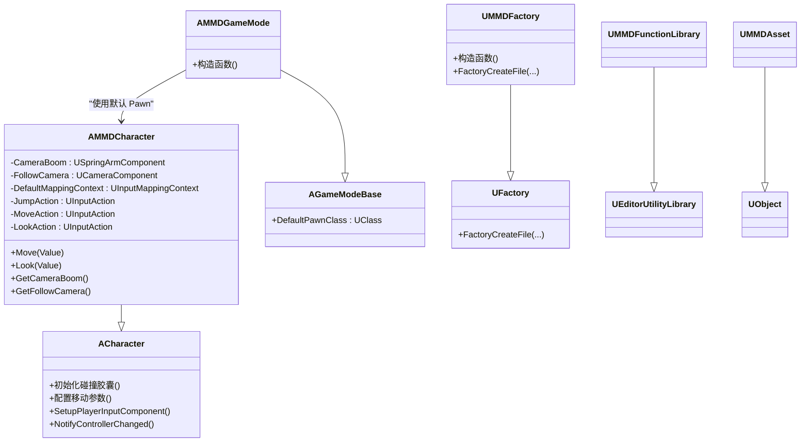
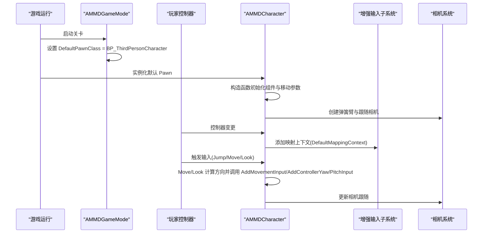
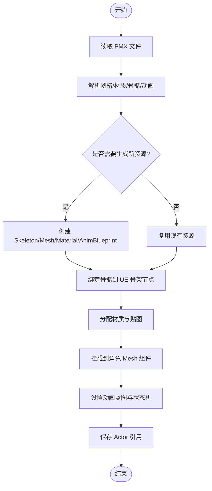
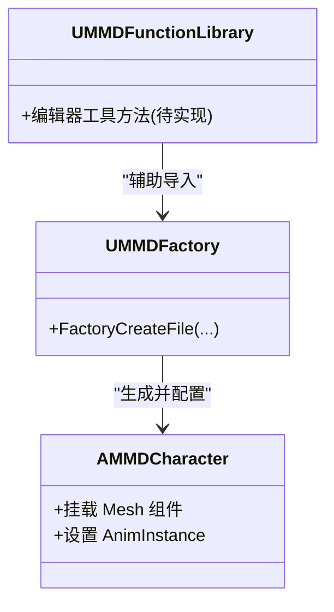
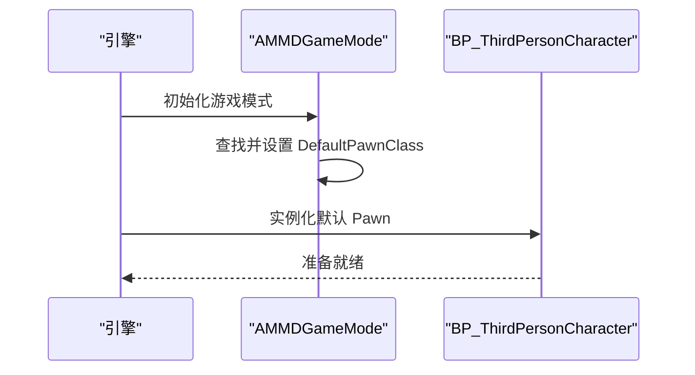
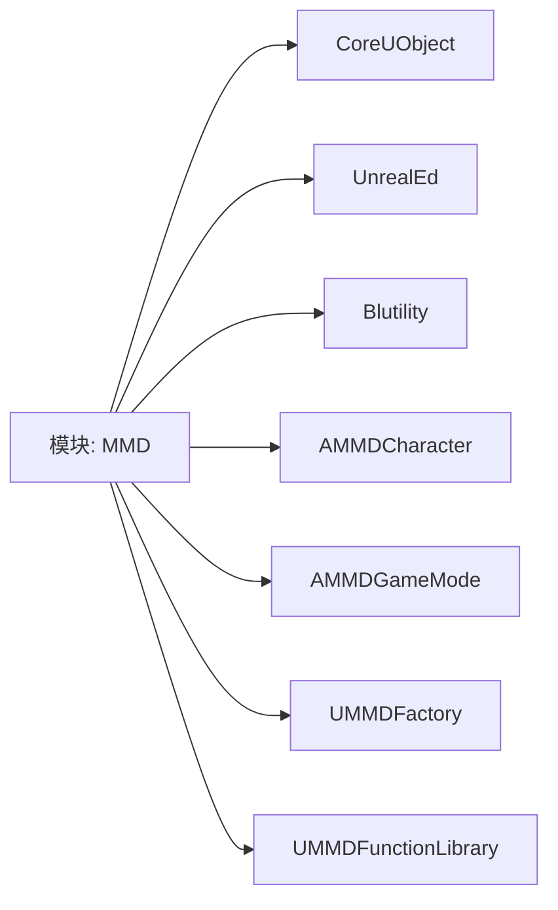

# 角色系统

<cite>
**本文引用的文件**   
- [MMDCharacter.h](file://MMD/Source/MMD/MMDCharacter.h)
- [MMDCharacter.cpp](file://MMD/Source/MMD/MMDCharacter.cpp)
- [MMDGameMode.h](file://MMD/Source/MMD/MMDGameMode.h)
- [MMDGameMode.cpp](file://MMD/Source/MMD/MMDGameMode.cpp)
- [MMDFactory.h](file://MMD/Source/MMD/MMDFactory.h)
- [MMDFactory.cpp](file://MMD/Source/MMD/MMDFactory.cpp)
- [MMDFunctionLibrary.h](file://MMD/Source/MMD/MMDFunctionLibrary.h)
- [MMDFunctionLibrary.cpp](file://MMD/Source/MMD/MMDFunctionLibrary.cpp)
- [MMDAsset.h](file://MMD/Source/MMD/MMDAsset.h)
- [MMDAsset.cpp](file://MMD/Source/MMD/MMDAsset.cpp)
- [MMD.uproject](file://MMD/MMD.uproject)
</cite>

## 目录
1. [简介](#简介)
2. [项目结构](#项目结构)
3. [核心组件](#核心组件)
4. [架构总览](#架构总览)
5. [详细组件分析](#详细组件分析)
6. [依赖关系分析](#依赖关系分析)
7. [性能考虑](#性能考虑)
8. [故障排查指南](#故障排查指南)
9. [结论](#结论)
10. [附录](#附录)

## 简介
本章节概述 MMDUETools 的角色系统。当前代码库提供了基于 UE 标准角色框架的 AMMDCharacter 基类、默认游戏模式 AMMDGameMode，以及用于编辑器导入流程的工厂与工具函数库骨架。角色系统以 ACharacter 为基础，集成增强输入、相机跟随与碰撞胶囊等常用子系统，为后续扩展 MMD 模型（PMX）加载、骨骼绑定、材质分配与动画蓝图集成预留了清晰的入口点。

## 项目结构
- 运行时模块：MMD（C++ 源码位于 Source/MMD）
- 项目配置：MMD.uproject（声明模块与插件依赖）
- 内容资源：示例角色蓝图 BP_ThirdPersonCharacter 作为默认 Pawn

图表来源
- [MMDCharacter.h:18-71](file://MMD/Source/MMD/MMDCharacter.h#L18-L71)
- [MMDGameMode.h:9-16](file://MMD/Source/MMD/MMDGameMode.h#L9-L16)
- [MMDFactory.h:12-22](file://MMD/Source/MMD/MMDFactory.h#L12-L22)
- [MMDFunctionLibrary.h:12-18](file://MMD/Source/MMD/MMDFunctionLibrary.h#L12-L18)
- [MMDAsset.h:12-17](file://MMD/Source/MMD/MMDAsset.h#L12-L17)
- [MMDGameMode.cpp:7-15](file://MMD/Source/MMD/MMDGameMode.cpp#L7-L15)

章节来源
- [MMD.uproject:1-27](file://MMD/MMD.uproject#L1-L27)

## 核心组件
- AMMDCharacter：继承自 ACharacter，提供基础移动、跳跃、视角控制与相机跟随；通过增强输入系统绑定 Move/Look/Jump 动作；内置弹簧臂与跟随相机。
- AMMDGameMode：设置默认 Pawn 为 BP_ThirdPersonCharacter，便于在关卡中直接生成可交互角色。
- UMMDFactory：声明 PMX 文件格式支持，工厂方法返回空对象，表示导入管线尚未实现。
- UMMDFunctionLibrary：编辑器工具函数库基类，当前为空，可用于扩展编辑器侧功能。
- UMMDAsset：空资产类型，可作为未来 MMD 相关资产的承载容器。

章节来源
- [MMDCharacter.h:18-71](file://MMD/Source/MMD/MMDCharacter.h#L18-L71)
- [MMDCharacter.cpp:19-55](file://MMD/Source/MMD/MMDCharacter.cpp#L19-L55)
- [MMDGameMode.h:9-16](file://MMD/Source/MMD/MMDGameMode.h#L9-L16)
- [MMDGameMode.cpp:7-15](file://MMD/Source/MMD/MMDGameMode.cpp#L7-L15)
- [MMDFactory.h:12-22](file://MMD/Source/MMD/MMDFactory.h#L12-L22)
- [MMDFactory.cpp:6-14](file://MMD/Source/MMD/MMDFactory.cpp#L6-L14)
- [MMDFunctionLibrary.h:12-18](file://MMD/Source/MMD/MMDFunctionLibrary.h#L12-L18)
- [MMDAsset.h:12-17](file://MMD/Source/MMD/MMDAsset.h#L12-L17)

## 架构总览
角色系统采用“游戏模式 + 角色基类 + 编辑器工厂/工具”的分层设计：
- 游戏模式负责默认 Pawn 选择与场景集成
- 角色基类封装输入、移动、相机与生命周期钩子
- 工厂与工具库为后续 PMX 导入与资产处理提供扩展点

图表来源
- [MMDCharacter.h:18-71](file://MMD/Source/MMD/MMDCharacter.h#L18-L71)
- [MMDGameMode.h:9-16](file://MMD/Source/MMD/MMDGameMode.h#L9-L16)
- [MMDFactory.h:12-22](file://MMD/Source/MMD/MMDFactory.h#L12-L22)
- [MMDFunctionLibrary.h:12-18](file://MMD/Source/MMD/MMDFunctionLibrary.h#L12-L18)
- [MMDAsset.h:12-17](file://MMD/Source/MMD/MMDAsset.h#L12-L17)

## 详细组件分析

### AMMDCharacter 设计与实现
- 组件结构
  - 碰撞胶囊：初始化尺寸，定义角色物理体积
  - 移动组件：启用按输入方向旋转、设定旋转速率、跳跃速度、空中控制、行走速度与制动减速度
  - 相机系统：弹簧臂与跟随相机，控制器驱动弹簧臂旋转，相机不相对手臂旋转
- 输入系统
  - 使用增强输入子系统，在控制器变化时添加映射上下文
  - 绑定 Jump/Move/Look 动作到对应回调
- 生命周期
  - 构造函数完成组件创建与默认参数配置
  - NotifyControllerChanged 注入输入映射上下文
  - SetupPlayerInputComponent 绑定输入动作
  - Move/Look 根据控制器朝向计算前向与右向向量并应用移动与视角输入

图表来源
- [MMDGameMode.cpp:7-15](file://MMD/Source/MMD/MMDGameMode.cpp#L7-L15)
- [MMDCharacter.cpp:19-55](file://MMD/Source/MMD/MMDCharacter.cpp#L19-L55)
- [MMDCharacter.cpp:60-93](file://MMD/Source/MMD/MMDCharacter.cpp#L60-L93)
- [MMDCharacter.cpp:95-129](file://MMD/Source/MMD/MMDCharacter.cpp#L95-L129)

章节来源
- [MMDCharacter.h:18-71](file://MMD/Source/MMD/MMDCharacter.h#L18-L71)
- [MMDCharacter.cpp:19-55](file://MMD/Source/MMD/MMDCharacter.cpp#L19-L55)
- [MMDCharacter.cpp:60-93](file://MMD/Source/MMD/MMDCharacter.cpp#L60-L93)
- [MMDCharacter.cpp:95-129](file://MMD/Source/MMD/MMDCharacter.cpp#L95-L129)

### 自动角色创建流程（从 PMX 到完整 MMD Actor）
- 现状说明
  - 工厂已声明支持 pmx 格式，但 FactoryCreateFile 返回空对象，表明 PMX 解析与 Actor 生成流程尚未实现
- 建议流程（概念性）
  - 编辑器侧读取 PMX 文件，解析网格、材质、骨骼与动画数据
  - 生成或复用 Skeleton、SkeletalMesh、Material、AnimBlueprint 等资源
  - 实例化 AMMDCharacter 或其派生类，挂载 Mesh 与 AnimInstance
  - 将骨骼名称映射至 UE 骨架节点，完成绑定
  - 配置材质通道与贴图，应用动画蓝图状态机
  - 保存生成的 Actor 引用供运行时使用

[此图为概念流程图，未直接映射具体源码文件]

章节来源
- [MMDFactory.h:12-22](file://MMD/Source/MMD/MMDFactory.h#L12-L22)
- [MMDFactory.cpp:6-14](file://MMD/Source/MMD/MMDFactory.cpp#L6-L14)

### 角色属性配置系统（骨骼绑定、材质分配、动画蓝图集成）
- 骨骼绑定
  - 建议在工厂或工具函数中将 PMX 骨骼名映射到 UE 骨架节点，确保动画播放正确
- 材质分配
  - 解析 PMX 材质信息，匹配或生成 Material Instance，分配到 SkeletalMesh 的各插槽
- 动画蓝图集成
  - 为角色设置 AnimBlueprint，建立状态机与混合空间，支持待机、移动、跳跃等动作

图表来源
- [MMDFactory.h:12-22](file://MMD/Source/MMD/MMDFactory.h#L12-L22)
- [MMDFunctionLibrary.h:12-18](file://MMD/Source/MMD/MMDFunctionLibrary.h#L12-L18)
- [MMDCharacter.h:18-71](file://MMD/Source/MMD/MMDCharacter.h#L18-L71)

章节来源
- [MMDFactory.h:12-22](file://MMD/Source/MMD/MMDFactory.h#L12-L22)
- [MMDFunctionLibrary.h:12-18](file://MMD/Source/MMD/MMDFunctionLibrary.h#L12-L18)
- [MMDCharacter.h:18-71](file://MMD/Source/MMD/MMDCharacter.h#L18-L71)

### MMDGameMode 的角色管理功能
- 默认 Pawn 设置：在构造函数中通过构造器助手查找并设置 BP_ThirdPersonCharacter 为默认 Pawn
- 场景集成：关卡加载后由引擎自动实例化默认 Pawn，进入角色生命周期

图表来源
- [MMDGameMode.cpp:7-15](file://MMD/Source/MMD/MMDGameMode.cpp#L7-L15)

章节来源
- [MMDGameMode.h:9-16](file://MMD/Source/MMD/MMDGameMode.h#L9-L16)
- [MMDGameMode.cpp:7-15](file://MMD/Source/MMD/MMDGameMode.cpp#L7-L15)

### 蓝图操作与自定义示例（概念性指导）
- 在蓝图中替换默认 Pawn
  - 打开关卡蓝图或世界设置，将默认 Pawn 指向自定义的 MMD 角色蓝图（继承自 AMMDCharacter）
- 调整相机与移动
  - 在角色蓝图中修改弹簧臂长度、目标偏移、相机旋转限制等
- 绑定动画蓝图
  - 在角色蓝图的 Mesh 组件上指定 AnimBlueprint，配置状态机与过渡条件
- 自定义输入
  - 在角色蓝图或输入映射上下文中新增动作，并在 C++ 或蓝图中处理回调

[本节为概念性指导，不直接分析具体源码文件]

## 依赖关系分析
- 模块依赖
  - MMD 模块依赖 Blutility、UnrealEd、CoreUObject，便于编辑器工具与资产操作
- 组件耦合
  - AMMDCharacter 强依赖 Camera/Capsule/Input 子系统，保持高内聚
  - AMMDGameMode 仅依赖 BP_ThirdPersonCharacter，解耦良好
- 外部集成点
  - 工厂与工具库为后续 PMX 导入与资产管线提供扩展点

图表来源
- [MMD.uproject:6-16](file://MMD/MMD.uproject#L6-L16)

章节来源
- [MMD.uproject:6-16](file://MMD/MMD.uproject#L6-L16)

## 性能考虑
- 移动与相机
  - 合理设置 MaxWalkSpeed、RotationRate、TargetArmLength，避免过度抖动与延迟
- 输入处理
  - 使用增强输入子系统，减少每帧轮询开销
- 资源加载
  - 工厂与工具库应在导入阶段进行批处理与缓存，避免运行时重复解析 PMX

[本节提供通用指导，不直接分析具体源码文件]

## 故障排查指南
- 增强输入未生效
  - 检查是否成功添加映射上下文（NotifyControllerChanged），确认 DefaultMappingContext 已赋值
  - 参考路径：[MMDCharacter.cpp:60-72](file://MMD/Source/MMD/MMDCharacter.cpp#L60-L72)
- 输入组件类型错误
  - 若未使用增强输入，会记录错误日志；需升级至增强输入或修改绑定逻辑
  - 参考路径：[MMDCharacter.cpp:74-93](file://MMD/Source/MMD/MMDCharacter.cpp#L74-L93)
- 默认 Pawn 未实例化
  - 检查 AMMDGameMode 构造函数是否正确设置 DefaultPawnClass
  - 参考路径：[MMDGameMode.cpp:7-15](file://MMD/Source/MMD/MMDGameMode.cpp#L7-L15)
- PMX 导入无效
  - 工厂方法返回空对象，需实现解析与资源生成逻辑
  - 参考路径：[MMDFactory.cpp:11-14](file://MMD/Source/MMD/MMDFactory.cpp#L11-L14)

章节来源
- [MMDCharacter.cpp:60-93](file://MMD/Source/MMD/MMDCharacter.cpp#L60-L93)
- [MMDGameMode.cpp:7-15](file://MMD/Source/MMD/MMDGameMode.cpp#L7-L15)
- [MMDFactory.cpp:11-14](file://MMD/Source/MMD/MMDFactory.cpp#L11-L14)

## 结论
当前角色系统以 AMMDCharacter 为核心，结合 AMMDGameMode 完成默认 Pawn 管理与场景集成，并通过工厂与工具库为后续 PMX 导入与资产处理预留扩展点。建议优先完善工厂与工具库的 PMX 解析与资源生成流程，随后在角色蓝图中完成骨骼绑定、材质分配与动画蓝图集成，以实现从 PMX 到完整 MMD Actor 的自动化生产管线。

## 附录
- 兼容性说明
  - AMMDCharacter 完全兼容 UE 标准角色系统，可直接替换默认 Pawn 或在蓝图中继承扩展
- 扩展建议
  - 在 UMMDFunctionLibrary 中增加编辑器工具方法，辅助批量导入与配置
  - 在 UMMDAsset 中定义 MMD 相关资产元数据，便于资源管理与版本控制

[本节为总结与建议，不直接分析具体源码文件]