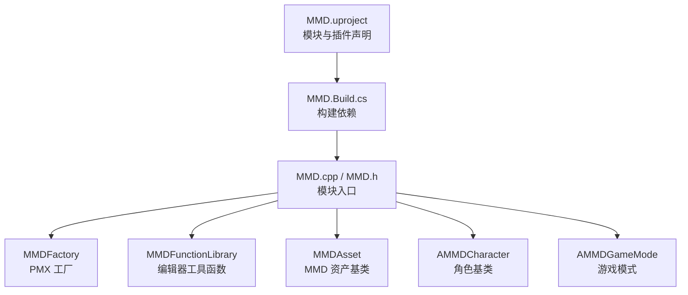
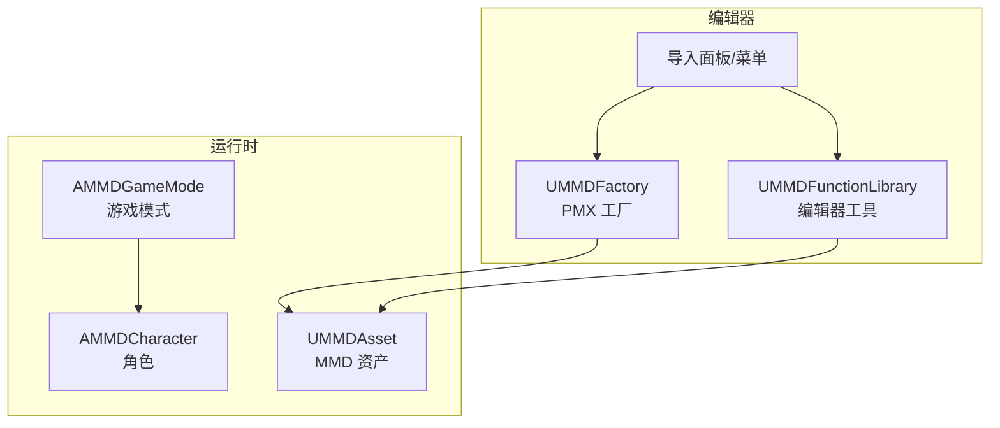
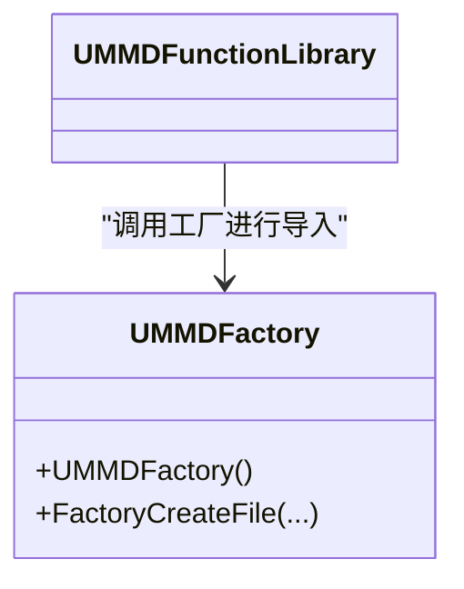
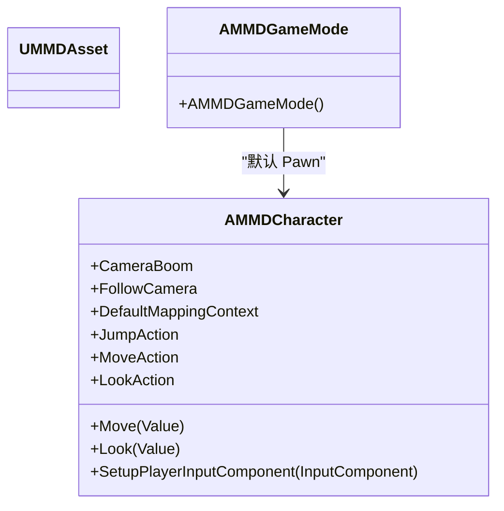
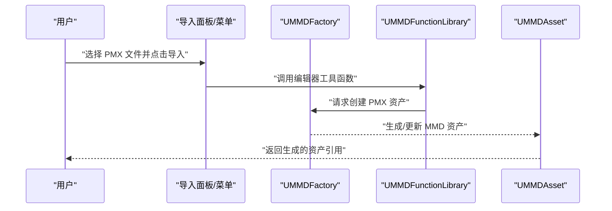
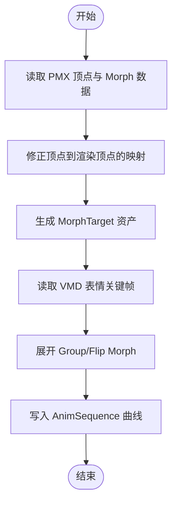
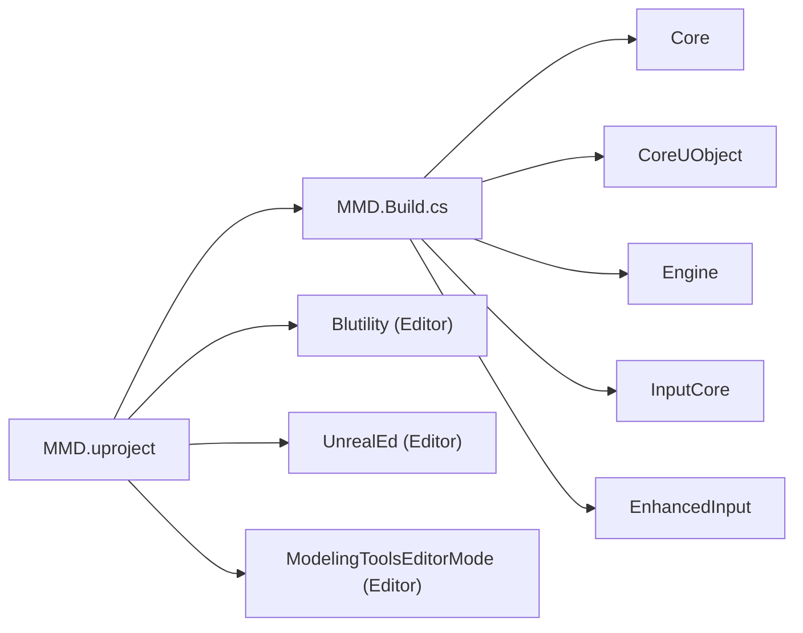

# 项目概述

<cite>
**本文引用的文件**   
- [README.md](file://README.md)
- [MMD.uproject](file://MMD/MMD.uproject)
- [MMD.Build.cs](file://MMD/Source/MMD/MMD.Build.cs)
- [MMD.cpp](file://MMD/Source/MMD/MMD.cpp)
- [MMD.h](file://MMD/Source/MMD/MMD.h)
- [MMDAsset.h](file://MMD/Source/MMD/MMDAsset.h)
- [MMDAsset.cpp](file://MMD/Source/MMD/MMDAsset.cpp)
- [MMDCharacter.h](file://MMD/Source/MMD/MMDCharacter.h)
- [MMDCharacter.cpp](file://MMD/Source/MMD/MMDCharacter.cpp)
- [MMDFactory.h](file://MMD/Source/MMD/MMDFactory.h)
- [MMDFactory.cpp](file://MMD/Source/MMD/MMDFactory.cpp)
- [MMDFunctionLibrary.h](file://MMD/Source/MMD/MMDFunctionLibrary.h)
- [MMDFunctionLibrary.cpp](file://MMD/Source/MMD/MMDFunctionLibrary.cpp)
- [MMDGameMode.h](file://MMD/Source/MMD/MMDGameMode.h)
- [MMDGameMode.cpp](file://MMD/Source/MMD/MMDGameMode.cpp)
</cite>

## 目录
1. [简介](#简介)
2. [项目结构](#项目结构)
3. [核心组件](#核心组件)
4. [架构总览](#架构总览)
5. [详细组件分析](#详细组件分析)
6. [依赖关系分析](#依赖关系分析)
7. [性能与限制](#性能与限制)
8. [故障排查指南](#故障排查指南)
9. [结论](#结论)
10. [附录：快速开始](#附录快速开始)

## 简介
本插件面向 Unreal Engine 5，提供 MikuMikuDance（MMD）生态的导入与播放能力。其核心目标是将 PMX 模型、VMD 动作与表情数据转换为 UE 原生资产与工作流产物，使开发者能够在 UE 中预览、播放并继续制作角色动画与场景内容。

- 主要特性
  - PMX 模型导入：解析顶点、索引、法线、UV、材质与骨骼，生成 SkeletalMesh、Skeleton、基础材质与 ModelData 辅助资产。
  - MorphTarget/表情：将 PMX vertex morph 导入为 MorphTarget，修正映射避免扭曲；VMD 表情写入 AnimSequence float curves，支持 Group/Flip Morph 展开。
  - VMD 动作导入：解析骨骼关键帧与 Morph 关键帧，生成包含骨骼轨道与表情曲线的 AnimSequence，完成 MMD 到 UE 坐标系转换与 IK/追加骨骼烘焙。
  - Actor/AnimBlueprint/IK：自动创建 MMD Actor、生成 AnimBlueprint，提供 Skeletal Control 节点，并生成 IK Rig 与 IK Retargeter。
  - 物理模拟：读取 PMX 刚体与 Joint 数据，基于 Bullet 初始化 MMD 风格物理模拟器（实验阶段）。

- 在 UE 生态中的定位
  - 作为编辑器扩展与运行时模块，桥接 MMD 格式与 UE 资产管线，打通“PMX → SkeletalMesh/Skeleton/MorphTarget/Actor”、“VMD → AnimSequence”的核心路径。
  - 与 MikuMikuDance 的关系：插件以 MMD 生态的 PMX/VMD 为标准输入，输出为 UE 可消费的原生资产，便于在 UE 中进行二次创作与集成。

- 技术栈与系统要求
  - 引擎版本：Unreal Engine 5.5
  - 语言与工具：C++、蓝图、UE 编辑器扩展（EditorUtilityLibrary）、增强输入系统
  - 依赖模块：Core、CoreUObject、Engine、InputCore、EnhancedInput、Blutility、UnrealEd、ModelingToolsEditorMode（编辑器模式）

章节来源
- [README.md:1-130](file://README.md#L1-L130)
- [MMD.uproject:1-27](file://MMD/MMD.uproject#L1-L27)
- [MMD.Build.cs:1-15](file://MMD/Source/MMD/MMD.Build.cs#L1-L15)

## 项目结构
本项目采用典型的 UE 插件组织方式：
- 项目配置与模块定义位于 MMD.uproject 与 Source/MMD 下
- 运行时与编辑器功能通过 C++ 类暴露给蓝图与编辑器面板
- Content 目录包含示例资源与第三方素材（非插件核心逻辑）

图表来源
- [MMD.uproject:1-27](file://MMD/MMD.uproject#L1-L27)
- [MMD.Build.cs:1-15](file://MMD/Source/MMD/MMD.Build.cs#L1-L15)
- [MMD.cpp:1-7](file://MMD/Source/MMD/MMD.cpp#L1-L7)
- [MMD.h:1-6](file://MMD/Source/MMD/MMD.h#L1-L6)
- [MMDFactory.h:1-23](file://MMD/Source/MMD/MMDFactory.h#L1-L23)
- [MMDFunctionLibrary.h:1-19](file://MMD/Source/MMD/MMDFunctionLibrary.h#L1-L19)
- [MMDAsset.h:1-18](file://MMD/Source/MMD/MMDAsset.h#L1-L18)
- [MMDCharacter.h:1-73](file://MMD/Source/MMD/MMDCharacter.h#L1-L73)
- [MMDGameMode.h:1-20](file://MMD/Source/MMD/MMDGameMode.h#L1-L20)

章节来源
- [MMD.uproject:1-27](file://MMD/MMD.uproject#L1-L27)
- [MMD.Build.cs:1-15](file://MMD/Source/MMD/MMD.Build.cs#L1-L15)

## 核心组件
- 模块与入口
  - 模块实现使用默认游戏模块入口，负责加载与生命周期管理。
- 工厂与编辑器工具
  - 工厂类用于识别 PMX 文件类型，配合编辑器流程进行导入。
  - 编辑器工具库继承自 EditorUtilityLibrary，承载导入面板与批量操作接口。
- 资产与角色
  - 资产基类用于承载 MMD 相关元数据与辅助信息。
  - 角色类提供相机、移动与增强输入绑定，作为演示与集成载体。
- 游戏模式
  - 设置默认 Pawn 为蓝图角色，便于快速运行与测试。

章节来源
- [MMD.cpp:1-7](file://MMD/Source/MMD/MMD.cpp#L1-L7)
- [MMD.h:1-6](file://MMD/Source/MMD/MMD.h#L1-L6)
- [MMDFactory.h:1-23](file://MMD/Source/MMD/MMDFactory.h#L1-L23)
- [MMDFactory.cpp:1-15](file://MMD/Source/MMD/MMDFactory.cpp#L1-L15)
- [MMDFunctionLibrary.h:1-19](file://MMD/Source/MMD/MMDFunctionLibrary.h#L1-L19)
- [MMDFunctionLibrary.cpp:1-6](file://MMD/Source/MMD/MMDFunctionLibrary.cpp#L1-L6)
- [MMDAsset.h:1-18](file://MMD/Source/MMD/MMDAsset.h#L1-L18)
- [MMDAsset.cpp:1-6](file://MMD/Source/MMD/MMDAsset.cpp#L1-L6)
- [MMDCharacter.h:1-73](file://MMD/Source/MMD/MMDCharacter.h#L1-L73)
- [MMDCharacter.cpp:1-130](file://MMD/Source/MMD/MMDCharacter.cpp#L1-L130)
- [MMDGameMode.h:1-20](file://MMD/Source/MMD/MMDGameMode.h#L1-L20)
- [MMDGameMode.cpp:1-16](file://MMD/Source/MMD/MMDGameMode.cpp#L1-L16)

## 架构总览
下图展示插件在 UE 中的整体交互：编辑器侧通过工厂与工具库驱动导入流程，运行时由角色与游戏模式承载播放与交互。

图表来源
- [MMDFactory.h:1-23](file://MMD/Source/MMD/MMDFactory.h#L1-L23)
- [MMDFunctionLibrary.h:1-19](file://MMD/Source/MMD/MMDFunctionLibrary.h#L1-L19)
- [MMDAsset.h:1-18](file://MMD/Source/MMD/MMDAsset.h#L1-L18)
- [MMDGameMode.h:1-20](file://MMD/Source/MMD/MMDGameMode.h#L1-L20)
- [MMDCharacter.h:1-73](file://MMD/Source/MMD/MMDCharacter.h#L1-L73)

## 详细组件分析

### 工厂与编辑器工具（PMX 导入入口）
- UMMDFactory
  - 注册 PMX 文件格式，供编辑器识别与调用。
  - 提供 FactoryCreateFile 钩子，用于后续实现从 PMX 到 UE 资产的转换流程。
- UMMDFunctionLibrary
  - 继承编辑器工具库，承载导入面板与批量操作的 API，便于在编辑器中触发导入。

图表来源
- [MMDFactory.h:1-23](file://MMD/Source/MMD/MMDFactory.h#L1-L23)
- [MMDFactory.cpp:1-15](file://MMD/Source/MMD/MMDFactory.cpp#L1-L15)
- [MMDFunctionLibrary.h:1-19](file://MMD/Source/MMD/MMDFunctionLibrary.h#L1-L19)

章节来源
- [MMDFactory.h:1-23](file://MMD/Source/MMD/MMDFactory.h#L1-L23)
- [MMDFactory.cpp:1-15](file://MMD/Source/MMD/MMDFactory.cpp#L1-L15)
- [MMDFunctionLibrary.h:1-19](file://MMD/Source/MMD/MMDFunctionLibrary.h#L1-L19)
- [MMDFunctionLibrary.cpp:1-6](file://MMD/Source/MMD/MMDFunctionLibrary.cpp#L1-L6)

### 资产与角色（运行时承载）
- UMMDAsset
  - 作为 MMD 相关资产的基类，用于保存模型数据与辅助信息。
- AMMDCharacter
  - 提供相机、移动与增强输入绑定，作为演示与集成载体。
- AMMDGameMode
  - 设置默认 Pawn 为蓝图角色，简化运行流程。

图表来源
- [MMDAsset.h:1-18](file://MMD/Source/MMD/MMDAsset.h#L1-L18)
- [MMDCharacter.h:1-73](file://MMD/Source/MMD/MMDCharacter.h#L1-L73)
- [MMDCharacter.cpp:1-130](file://MMD/Source/MMD/MMDCharacter.cpp#L1-L130)
- [MMDGameMode.h:1-20](file://MMD/Source/MMD/MMDGameMode.h#L1-L20)
- [MMDGameMode.cpp:1-16](file://MMD/Source/MMD/MMDGameMode.cpp#L1-L16)

章节来源
- [MMDAsset.h:1-18](file://MMD/Source/MMD/MMDAsset.h#L1-L18)
- [MMDAsset.cpp:1-6](file://MMD/Source/MMD/MMDAsset.cpp#L1-L6)
- [MMDCharacter.h:1-73](file://MMD/Source/MMD/MMDCharacter.h#L1-L73)
- [MMDCharacter.cpp:1-130](file://MMD/Source/MMD/MMDCharacter.cpp#L1-L130)
- [MMDGameMode.h:1-20](file://MMD/Source/MMD/MMDGameMode.h#L1-L20)
- [MMDGameMode.cpp:1-16](file://MMD/Source/MMD/MMDGameMode.cpp#L1-L16)

### 导入工作流（PMX → 资产）

图表来源
- [MMDFactory.h:1-23](file://MMD/Source/MMD/MMDFactory.h#L1-L23)
- [MMDFunctionLibrary.h:1-19](file://MMD/Source/MMD/MMDFunctionLibrary.h#L1-L19)
- [MMDAsset.h:1-18](file://MMD/Source/MMD/MMDAsset.h#L1-L18)

章节来源
- [MMDFactory.h:1-23](file://MMD/Source/MMD/MMDFactory.h#L1-L23)
- [MMDFunctionLibrary.h:1-19](file://MMD/Source/MMD/MMDFunctionLibrary.h#L1-L19)
- [MMDAsset.h:1-18](file://MMD/Source/MMD/MMDAsset.h#L1-L18)

### 复杂逻辑（Morph 处理流程）

图表来源
- [README.md:98-104](file://README.md#L98-L104)

章节来源
- [README.md:98-104](file://README.md#L98-L104)

## 依赖关系分析
- 模块依赖
  - 运行时依赖：Core、CoreUObject、Engine、InputCore、EnhancedInput
  - 编辑器依赖：Blutility、UnrealEd、ModelingToolsEditorMode（编辑器模式）
- 外部依赖
  - 物理模拟：Bullet（实验阶段）

图表来源
- [MMD.uproject:1-27](file://MMD/MMD.uproject#L1-L27)
- [MMD.Build.cs:1-15](file://MMD/Source/MMD/MMD.Build.cs#L1-L15)

章节来源
- [MMD.uproject:1-27](file://MMD/MMD.uproject#L1-L27)
- [MMD.Build.cs:1-15](file://MMD/Source/MMD/MMD.Build.cs#L1-L15)

## 性能与限制
- 性能考量
  - 大型 PMX 模型的顶点与材质数量会影响导入时间与内存占用，建议在导入前对源模型进行合理优化。
  - 大量 MorphTarget 与曲线会增加动画回放开销，建议按需启用或合并曲线。
- 已知限制
  - Material Morph 尚未完整驱动 UE 材质参数。
  - Bone Morph / UV Morph 未作为完整动画通道实现。
  - 不同模型的骨骼命名、IK 结构与特殊 Morph 组合可能需要适配。

章节来源
- [README.md:125-130](file://README.md#L125-L130)

## 故障排查指南
- 常见问题
  - 无法识别 PMX 文件：确认工厂已注册 PMX 格式且编辑器已启用插件。
  - 导入后无角色或动画：检查是否成功生成 SkeletalMesh、Skeleton 与 AnimSequence，并确保角色正确挂载。
  - 表情异常或嘴型不匹配：确认 MorphTarget 映射是否正确，以及 Group/Flip Morph 是否被展开。
- 调试建议
  - 使用编辑器日志查看导入过程错误信息。
  - 逐步验证：先导入 PMX 生成资产，再导入 VMD 生成动画，最后播放测试。

章节来源
- [MMDFactory.cpp:1-15](file://MMD/Source/MMD/MMDFactory.cpp#L1-L15)
- [README.md:89-130](file://README.md#L89-L130)

## 结论
本插件为 UE 提供了完整的 MMD 导入与播放能力，覆盖 PMX 模型与 VMD 动画两大核心数据源，并通过工厂与编辑器工具无缝接入 UE 资产管线。对于初学者，它降低了从 MMD 到 UE 的学习门槛；对于有经验的开发者，它提供了可扩展的 C++ 接口与清晰的架构边界，便于进一步定制与优化。

## 附录：快速开始
- 安装与启用
  - 将插件目录放入项目的 Plugins 文件夹，并在 UE 插件面板中启用。
- 打开导入面板
  - 在编辑器中打开 Ue5MMDTools 导入界面。
- 导入 PMX 模型
  - 点击“导入模型”，选择 .pmx 文件，生成 SkeletalMesh、Skeleton、MorphTarget、材质与 MMD Actor。
- 导入 VMD 动画
  - 选中已导入的角色或 SkeletalMesh，点击“导入 VMD 动画”，生成包含骨骼轨道与表情曲线的 AnimSequence。
- 播放与验证
  - 在场景中播放 AnimSequence，验证身体动作、root/center 位移、眨眼、嘴型与表情变化。

章节来源
- [README.md:21-88](file://README.md#L21-L88)